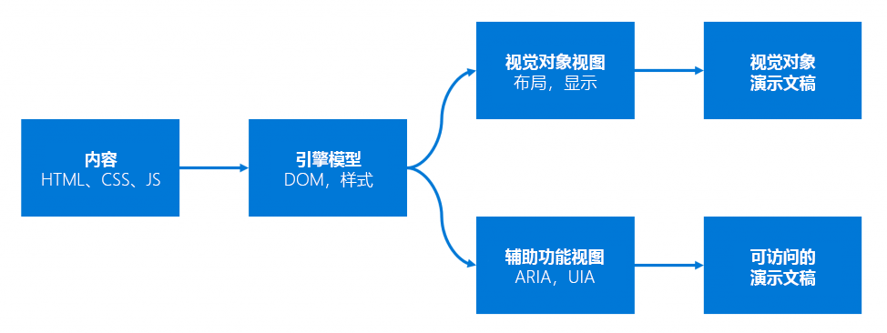

# Microsoft Edge 中的辅助功能

开发网页、Web 应用和启用 Web 的产品通过 Microsoft Edge 及其工具生态系统中的大量辅助功能得到可靠支持。

> "由于 Web 消除了许多用户在物理世界面临的通信和交互障碍，因此残障对 Web 的影响发生了根本改变。" - [Web 设计和应用程序的 W3C 标准：辅助功能](https://w3.org/standards/webdesign/accessibility)

世界 [健康组织](https://who.int/topics/disabilities) 将残障定义为"人员正文的功能与它们所生活环境的功能之间的交互不匹配"。  残障的范围从情境式残障（例如，在手机上保持一只眼睛的受限移动性或明亮眼睛）到其他与物理、听觉、视觉或年龄相关的障碍。

设计网站和其他包含技术可打造每个人都享受的体验。  非独占设计和 Web 辅助功能使每个人都能够使用 Web。

本辅助功能部分的文章提供了一些最佳做法、代码示例和更多资源，可便于你了解有关在 Microsoft Edge 中设计、构建和测试可访问网站Microsoft Edge。

<!-- ====================================================================== -->
## Microsoft Edge 开发工具

Microsoft Edge DevTools 内置在 Microsoft Edge 浏览器中，并包括许多辅助功能测试功能，用于测试网页的各个方面，包括：

*  图像替换文字和屏幕阅读器支持。
*  键盘支持。
*  文本对比度。
*  视觉缺陷的可用性。
*  浏览器较窄时的可用性。

请参阅：

* [辅助功能测试功能](../devtools-guide-chromium/accessibility/reference.md) - 要测试的辅助功能方面列表和相应的 DevTools 功能。

* [使用 DevTools](../devtools-guide-chromium/accessibility/accessibility-testing-in-devtools.md) 的辅助功能测试概述 - 使用 DevTools 功能测试辅助功能演示页面的演练。

<!-- ====================================================================== -->
## Microsoft UI 自动化 API

在Microsoft Edge中，我们引入了 [UI 自动化 API](/windows/win32/winauto/entry-uiauto-win32) (UIA API) 。  对 UI 自动化的这一更改是浏览器辅助功能的主要投资。  UI 自动化 API 为在应用或更高版本中依赖于辅助技术的用户提供更具包容性的 web Windows 10基础。

Microsoft UI 自动化 API 是一个辅助功能框架，Windows应用程序提供有关 UI 用户界面的编程 (信息) 。  它提供对桌面上大多数 UI 元素的编程访问。  它使辅助技术产品（如屏幕阅读器）能够向最终用户提供有关 UI 的信息，以及通过标准输入外的其他方式操作 UI。  UI 自动化还允许自动测试脚本与 UI 交互。

[Microsoft Windows UI 自动化博客](/archive/blogs/winuiautomation/)有关于 Windows 自动化 API 的文章。

企业中的辅助功能系统Microsoft Edge支持现代 Web 标准，包括 ARIA、HTML5 和 CSS3。  简化的浏览器管道的下图将网页内容放入可访问的表示层：

Microsoft Edge团队持续与 W3C 和其他浏览器供应商合作，以确保新的 Web 平台功能具有足够的内置辅助功能。

有关哪些新 HTML 功能可供用户访问Microsoft Edge，请参阅 [HTML5Accessibility](https://html5accessibility.com)。

<!-- ====================================================================== -->
## 另请参阅

Microsoft Edge：

* [设计易于访问的网站](design.md)
* [有关构建可访问网站的资源](build/index.md)
* [辅助功能测试的资源](test.md)

W3C 文章：

* [W3C Web 辅助功能计划 (的一) ](https://w3.org/wai)
   * [Web 辅助功能入门](https://w3.org/wai/gettingstarted/Overview)
   * [针对包含进行设计](https://w3.org/wai/fundamentals/accessibility-intro)
   * [教程和演示文稿](https://w3.org/wai/teach-advocate)
