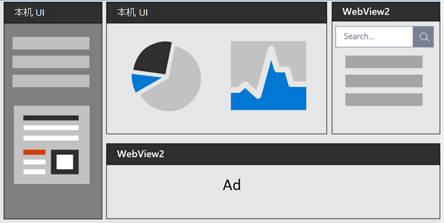
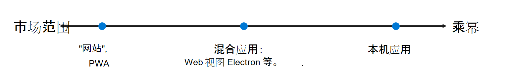

# 使用 Microsoft Edge 开发网页版

使用 Microsoft Edge、Microsoft Edge扩展、渐进式 Web 应用、WebDriver 自动化、WebView2 等Microsoft Edge开发 Web。

<!-- ====================================================================== -->
## Microsoft Edge 开发工具
<!-- ====================================================================== -->
<!-- keep sync'd:
* [Overview of DevTools](devtools-guide-chromium/overview.md) - intro section
* [Microsoft Edge DevTools](../develop-web-microsoft-edge.md#microsoft-edge-devtools) in _Develop for the web with Microsoft Edge_
-->

浏览器Microsoft Edge内置 Web 开发工具，称为"Microsoft Edge工具"。  DevTools 是一组 Web 开发工具，显示在浏览器中呈现的网页旁边。  DevTools 提供了一种检查和调试网页和 Web 应用的强大方法。  你甚至可以编辑源文件和创建网站项目，所有这些都在 DevTools 环境中完成。

使用 DevTools 可以执行以下操作：

*  使用具有可视界面的 实时工具检查、调整和更改网页中元素的样式。  检查浏览器存储内容以构建网页的位置，包括 `.html`、 `.css`、 `.js``.png` 和 文件格式。

*  模拟网页在不同设备上的行为方式，并模拟移动环境，并使用不同的网络条件。  检查网络流量并查看问题的位置。

*  使用断点调试和实时控制台 调试JavaScript。  查找 Web 应用的内存问题和呈现问题。

*  在产品中查找辅助功能、性能、兼容性和安全问题，并使用 DevTools 修复发现的辅助功能问题。

*  使用开发环境将 DevTools 中的更改与文件系统和 Web 同步。

<!-- /keep sync'd -->

请参阅 [DevTools 概述](devtools-guide-chromium/overview.md)。

<!-- ====================================================================== -->
## Microsoft Edge 扩展
   
创建浏览器Microsoft Edge，以添加或修改浏览器的功能。  扩展改进了浏览器体验，以提供对目标受众非常重要的专门功能。

如果你的想法或产品基于特定 Web 浏览器或特定网页功能的改进，则可以创建 Microsoft Edge 扩展。 配套体验的示例包括广告拦截器和密码管理器。

一Microsoft Edge扩展的结构类似于常规 Web 应用，通常包括：

*  包含基本平台信息的应用程序清单 JSON 文件。
*  定义浏览器扩展行为的 JavaScript 文件。
*  定义用户界面的 HTML 和 CSS 文件。

请参阅[扩展Microsoft Edge概述](extensions-chromium/index.md)。

<!-- ====================================================================== -->
## 渐进式 Web 应用

渐进式 Web 应用使用开放 Web 技术提供跨平台互操作性。  它们在支持平台上与本机应用类似，与其他浏览器上的常规网站一样。

渐进式 Web 应用结合了 Web 和已编译应用的最佳功能，为用户提供了针对其设备自定义的类似应用的体验。  渐进式 Web 应用是一个网站，它逐渐得到增强，可以像在支持平台上安装的本机应用一样运行，同时像其他浏览器上的常规网站一样运行。

渐进 Web 应用具有的跨平台开发成本要低于已编译的应用，这些应用需要针对每个平台的特定基本代码，例如适用于 Android、iOS 和每个桌面操作系统的单独代码库。

请参阅 [Overview of Progressive Web Apps (PWA) ](progressive-web-apps-chromium/index.md)。

<!-- ====================================================================== -->
## WebView2

WebView2 控件由 Microsoft Edge，支持将 Web 技术 (HTML、CSS 和 JavaScript) 本机应用程序中。  将 Web 平台的 ubiquity 与本机平台的全部功能相结合。

下图显示了从最大覆盖范围到最大功率的应用范围：

<!-- png copy used in main article is named "web-native.png" -->

位于范围中间的混合应用使开发人员能够体验两种优势：Web 平台的通用性和强大性，以及本机平台的强大功能和全部功能。

请参阅 [WebView2 Microsoft Edge简介](webview2/index.md)。

<!-- ====================================================================== -->
## 测试和自动化

以下是自动执行应用程序测试Microsoft Edge：

*  **DevTools 协议** 用于检测、检查、调试和配置文件浏览器。
*  使用 **源试用版试用** 实验性 API。
*  **Playwright** 通过单个 API 提供跨浏览器自动化。
*  **通过 DevTools** 协议Microsoft Edge的 Api 控件。
*  **WebDriver** 模拟用户与 Microsoft Edge。
*  **webhint** lint 检查代码的错误和最佳做法。

请参阅 [Test and automation in Microsoft Edge](test-and-automation/test-and-automation.md)。

<!-- ====================================================================== -->
## Web 平台

为 Web 平台开发网站和产品的注意事项包括：

*  测试即将进行的更改，这些更改可能会影响网站与Microsoft Edge。
*  将用户从Microsoft Edge移动到Internet Explorer。
*  在 Microsoft Edge 中配置跟踪Microsoft Edge。
*  检测Microsoft Edge网站中的内容。
*  自定义"密码显示"按钮。
*  使用Windows 11客户端提示检测User-Agent。

请参阅 [Web 平台](web-platform/web-platform.md)。

<!-- ====================================================================== -->
## Microsoft Edge IDE 集成

Microsoft 工具的各种功能提供使用 Microsoft Edge、Visual Studio Code 和 Visual Studio 进行开发集成，以开发使用和使用 Microsoft Edge 中完全集成的产品、网页和 Web 应用。

请参阅[Microsoft Edge IDE 集成](visual-studio-code/ide-integration.md)。

<!-- ====================================================================== -->
## Microsoft Edge 中的辅助功能

开发网页、Web 应用和启用 Web 的产品通过 Microsoft Edge 及其工具生态系统中的大量辅助功能得到可靠支持。

请参阅 [Microsoft Edge 中的辅助功能](accessibility/index.md)。

<!-- leaf node (article; omit per PR review) -->
<!-- ====================================================================== -->
<!-- ## Privacy whitepaper

The Microsoft Edge _browser privacy promise_ provides you with protection, transparency, control, and respect.  Microsoft Edge has many features and services associated with privacy.  This whitepaper explains how your data is used, how to control the different features, and how to manage your collected data.

See [Microsoft Edge Privacy Whitepaper](privacy-whitepaper/index.md).
-->

<!-- leaf node (article; omit per PR review) -->
<!-- ====================================================================== -->
<!-- ## The Web We Want initiative

The Web We Want initiative is a cross-browser, open initiative focused on identifying missing features and functionalities in the web platform for potential development as web standards or browser features.  Let browser vendors and standards groups know what you think is missing from the web platform.

If you build for the web, you inevitably run into problems.  Perhaps there's no way to achieve an aspect of your design with CSS, or it may require an incredible amount of experimenting with CSS.  Maybe there's a device feature you want to tap into using JavaScript, or there's a needed Developer Tools feature that can make your job easier.

See [The Web We Want initiative](web-we-want/index.md).
-->

<!-- ============================================================================================================================================ -->
<!-- ============================================================================================================================================ -->
## 如何使用本文档

这些是有关使用文档 UI 的 docs.microsoft.com。

<!-- ====================================================================== -->
## 在文档内缩放图像

查看屏幕截图或图表的详细信息：

1. 右键单击该图像，然后选择" **打开新选项卡中的图像"**。

1. 关闭图像选项卡以返回到文章。

<!-- ====================================================================== -->
## 在"按标题筛选"文本框中查找关键词和术语

"按标题 **筛选"文本框支持** ：
*  在目录上导航 (TOC) 。
*  键词的索引术语查找。
*  全文搜索文档。

在左 **上方的"** 按标题筛选"框中，输入要查找的术语或关键词：

如果找不到所需文章，请在以下所有文档中选择"**_搜索Microsoft Edge_搜索**：

全文搜索页面最初搜索所有_Microsoft Edge文档。_ 或者，单击"**查看 Microsoft Docs 上的所有结果"** 链接进行更广泛的搜索：

<!-- ====================================================================== -->
## 在开发人员文档提供反馈Microsoft Edge报告问题

提供反馈或输入问题：

* [联系 Microsoft Edge 开发工具团队](devtools-guide-chromium/contact.md)
* [联系Microsoft Edge扩展支持](extensions-chromium/publish/contact-extensions-team.md)
* [联系 WebView2 团队](webview2/contact.md)

若要提交和查看文档特定页面的反馈，请在页面底部单击" **此页面"** 按钮。
