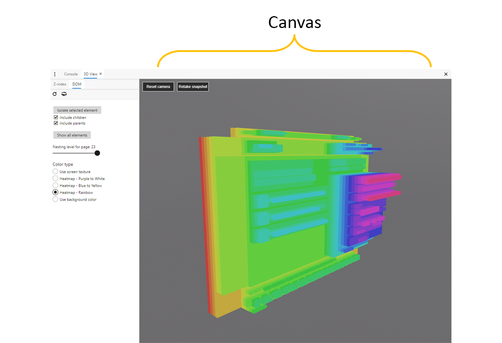
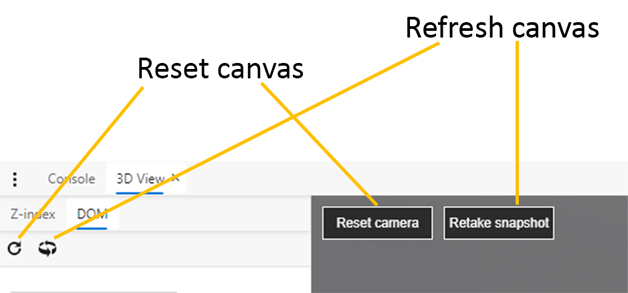

# 3D 视图3D View

通过浏览[文档对象模型](https://developer.mozilla.org/en-US/docs/Web/API/Document_Object_Model)（DOM）或[z 索引](https://developer.mozilla.org/en-US/docs/Web/CSS/z-index)堆栈上下文，使用**3d 视图**调试 web 应用程序。Use the **3D View** to debug your web application by navigating through the [Document Object Model](https://developer.mozilla.org/en-US/docs/Web/API/Document_Object_Model) (DOM) or the [z-index](https://developer.mozilla.org/en-US/docs/Web/CSS/z-index) stacking context. 有了它，您可以：With it you can: 

- [浏览转换为 3D perspevtive 的网页Explore the web page translated into a 3D perspevtive](#3d-dom)
- [基于 z 索引堆栈上下文进行调试Debug based on z-index stacking context](#z-index)
- 清除 "DOM" 窗格或 " [z 索引" 窗格](#change-the-scope-of-your-exploration)[中的一些混乱情况](#changing-your-view)[Clear some of the clutter in the DOM pane](#changing-your-view) or the [z-index pane](#change-the-scope-of-your-exploration)
- [选择用于最佳调试 DOM 问题](#dom-color-type)或[z 索引问题](#z-index-color-type)的配色方案[Pick the color scheme to best debug your DOM problems](#dom-color-type) or [z-index problems](#z-index-color-type)

有两个可用于调试体验的窗格。There are two panes that you can use for your debugging experience.

1. **Z-索引**在 web 应用程序中使用 z 索引上下文浏览不同的元素。**Z-index** Navigate through the different elements in the web application with the z-index context in mind. 这是默认窗格。This is the default pane.
2. **3D DOM**使用所有元素轻松浏览整个 DOM。**3D DOM** Explore the DOM as a whole with all the elements at your fingertips. 若要访问此窗格，请单击 "Z 索引" 窗格旁边的 "DOM" 窗格。To access this pane, click on the "DOM" pane next to the "Z-index" pane.

## 导航画布Navigating the canvas

### 键盘快捷方式Keyboard shortcuts
- 旋转 DOM：使用向左和向右箭头键水平旋转，并使用向上和向下键垂直旋转。Rotate the DOM: use the left and right arrow keys to rotate horizontally and use the up and down arrow keys to rotate vertically.
- 导航 DOM：如果已选定某个元素，则可以使用向上键和向下键在相邻元素之间移动Navigate the DOM: if an element is selected, you can use the up and down arrow keys to move through the elements adjacent

### 鼠标控件Mouse controls
- 旋转 DOM：在画布空间周围左键单击并拖动。Rotate the DOM: left click and drag around the canvas space.
- 在 DOM 周围移动：右键单击并沿希望 DOM 移动的方向拖动。Pan around the DOM: right click and drag in the direction you want the DOM to move.
- 缩放：在触摸板上拖动两根手指或使用鼠标上的滚轮。Zoom: drag two fingers across the touchpad or use the scroll wheel on your mouse.

### 屏幕上的控件On-screen controls
- 将画布视图重置为原始视图：单击标记为 "重置摄像头" 的按钮，或单击看上去像侧向 "刷新" 按钮的图标，并在 "重置视图和重新中心摄像头" 中显示 "重置元素"Reset the canvas view to the original view: click the button labeled "Reset camera," or click on the icon that looks like a sideways refresh button and has "Reset elements in view and re-center camera"
- 刷新画布（例如，如果浏览器已更改或切换到设备仿真程序视图），请执行以下操作：单击显示 "重拍快照" 的按钮，或单击看起来像刷新图标的按钮，并将 "拍摄新快照" 作为悬停文本。Refresh the canvas (e.g. if the browser changed or you switched to a device emulator view): click on the button that says "Retake snapshot," or click on the button that looks like a refresh icon and has "Take new snapshot" as the hover text.

## Z-索引Z-index

虽然 "Z-索引" 窗格具有与 "DOM" 窗格共享的功能，但它们仍具有特定于窗格的元素。While the Z-index pane has shared features with the DOM pane, they still have elements that are unique to the pane.

### 利用堆栈上下文突出显示元素Highlight elements with stacking context

此设置允许你为画布中的元素切换 "打开" 和 "关闭" 的 z 索引标记。This setting allows you to toggle the z-index tags on and off for the elements in the canvas. 默认情况下，将选中此复选框。The checkbox will be selected by default.

### 更改您的勘探的范围Change the scope of your exploration

"**显示所有元素**" 按钮是在更改以下设置后显示所有 DOM 元素的最快方式。The **Show all elements** button is the quickest way to display all the DOM's elements after changing the settings below.

**仅显示具有堆栈上下文的元素**删除不带堆栈上下文的元素，并拼合 DOM 以便更轻松地进行导航。**Show only elements with stacking context** removes elements without stacking context and flattens the DOM for easier navigation.

**隔离选定的元素**筛选器实质上是一个中的三个按钮。The **Isolate selected element** filter is essentially three buttons in one. 此按钮下面有两个复选框：一个是 "显示所有父级" 和 "仅保留具有新堆栈上下文的父级"。There are two checkboxes below this button: one is "Show all parents" and "Keep only parents with new stacking context." 

默认情况下，将选中 "显示所有父项" 复选框。The "Show all parents" checkbox will be checked by default. 如果在 "画布" 窗格中选择一个元素，然后单击 "**隔离选定元素**"，则画布将仅显示该元素及其父元素。If you select an element in the canvas pane and click on **Isolate selected element**, the canvas will only display the element and its parents.

如果选择 "仅保留新的堆栈上下文的父项"，然后单击 "**隔离选定元素**"，则画布将仅显示具有新堆栈上下文的元素和父元素。If you select the "Keep only parents with new stacking context," and click on **Isolate selected element**, the canvas will only display the element and the parents that have a new stacking context.

如果取消选中两个复选框，然后单击 "**隔离选定元素**"，则画布将仅显示您在第一个位置中选择的元素。If you deselect both of the checkboxes and click on **Isolate selected element**, the canvas will only display the element you chose in the first place.

在 "控件" 面板的最下方，**隐藏具有与父开关相同的绘制顺序的元素**。At the very bottom of the controls panel, there is the **Hide elements with the same paint order as their parent** toggle. 选中并取消选中复选框将根据您的选择重新加载元素。Selecting and deselecting the checkbox will reload the elements based on your selection. 如果选中，共享绘制顺序的元素将拼合到父项。If selected, elements that share paint order will be flattened to the parent.

这些选项旨在清理在你的画布中创建更复杂的网页的一些混乱程度。These options are meant to clear up some of the clutter that more complex web pages create in your canvas.

### Z-索引颜色类型Z-index color type

以下是你的画布中的 DOM 可以使用的不同可视化效果。These are the different visualizations you can use for the DOM in your canvas. 无论您是将其用于有趣的还是为了帮助您更好地可视化 DOM，我们都有三种不同的 colorways 和 "背景色" 设置。Whether you use it for fun or because they help you visualize the DOM better, we have three different colorways as well as a "background color" setting. 单选按钮允许你切换选项，并选择最适合你的项目的颜色类型（或最喜欢的颜色类型）。The radio buttons allow you to toggle through the options and pick the color type most appropriate for your project (or that you like the most).

## 3D DOM3D DOM

如果你想要使用更多常规调试视图，而不是 z 索引体验，则 3D DOM 将为 DOM 提供整体外观。If you want to take more of a general debugging view, rather than the z-index experience, the 3D DOM gives an overall look of the DOM. 由于删除了 z 索引上下文，因此 DOM 更紧密地堆叠。Since the z-index context is removed, the DOM is stacked more closely and cleanly. 此窗格具有类似的功能，但有一些细微差别。This pane has similar functionality, but there are a few nuances.

### 更改视图Changing your view

在**3D DOM**窗格中，**隔离选定的元素**筛选器具有 "包含子级" 和 "包含父项"。In the **3D DOM** pane, the **Isolate selected element** filter has "Include children" and "Include parents." 默认情况下，两个复选框均被选中，这意味着在画布中选择元素后单击 "**隔离选定的元素**" 按钮将显示所选元素、元素的父元素和元素的子元素。By default both checkboxes are selected, which means that clicking on the **Isolate selected element** button after selecting an element in the canvas would display the element chosen, the element's parents, and the element's children. 取消选择 "包含儿童" 复选框，然后再次单击 "**隔离选定元素**" 按钮将显示所选元素和元素的父元素。Deselecting the "Include children" checkbox and clicking the **Isolate selected element** button again would display the selected element and the element's parents. 如果选中 "包括儿童" 复选框，并取消选择 "包括父项" 复选框，然后单击 "包括父项" 复选框，则画布将显示该元素及其**子元素。**If you select the "Include children" checkbox and deselect the "Include parents" checkbox before clicking on **Isolate selected element**, the canvas will then display the element and its children. 如果取消选中两个复选框，然后单击 "**隔离选定元素**"，则画布将仅显示您之前选择的元素。If you deselect both checkboxes and click on **Isolate selected element**, the canvas will only display the element you previously selected.

你将注意到 "控件窗格" 中标题为 "**嵌套级别**" 的滑块，旁边有一个数字。You'll notice a slider in the control pane titled **Nesting level** with a number next to it. 该数字表示文档中的图层数。The number indicates the number of layers in the document. 将滑块向左拖动将导致最外层的图层 peel 消失，直到将嵌套级别1保留为1，仅显示 DOM 中最远的元素。Dragging the slider to the left will cause the outermost layers to peel away until you are left with a nesting level of 1, displaying only the furthest back element in the DOM. 这允许你在尝试更仔细地查看较低级别中的内容时删除一些混乱效果。This allows you to remove some of the clutter if you are trying to get a closer look at what is going on in the lower levels.

### DOM 颜色类型DOM color type

你将注意除*紫色到白色*、*蓝色到黄色*、*彩虹*以及*使用背景色*选项之外，还有*使用屏幕纹理*。You'll notice that, in addition to the *Purple to White*, *Blue to Yellow*, *Rainbow*, and *Use background color* options, there is *Use screen texture*. 屏幕纹理通过将网页中的内容直接显示在元素上来将上下文添加到调试体验。The screen texture adds context to your debugging experience by displaying the content from the web page directly onto the elements. 这仍是一个正在进行的工作，因为某些网站在3D 视图中呈现其屏幕纹理时较难。This is still a work in progress, as some websites have a harder time rendering their screen texture in the 3D View. 

## 后续步骤Next steps

我们正在处理 UI，并根据用户（如用户）向3D 视图添加更多功能。We are working on the UI and adding more functionality to the 3D View based on asks from users like you. 请向我们发送您的反馈，以便我们可以继续为您改进 Microsoft Edge DevTools！Please send us your feedback so we can continue improving the Microsoft Edge DevTools for you! 只需单击 DevTools 中的反馈图标或按 `Alt`  +  `Shift`  +  `I` Windows （ `Option`  +  `Shift`  +  `I` 在 Mac 上），然后输入 DevTools 的任何反馈或功能请求。Simply click the feedback icon in the DevTools or press `Alt` + `Shift` + `I` on Windows (`Option` + `Shift` + `I` on Mac) and enter any feedback or feature requests you have for the DevTools.