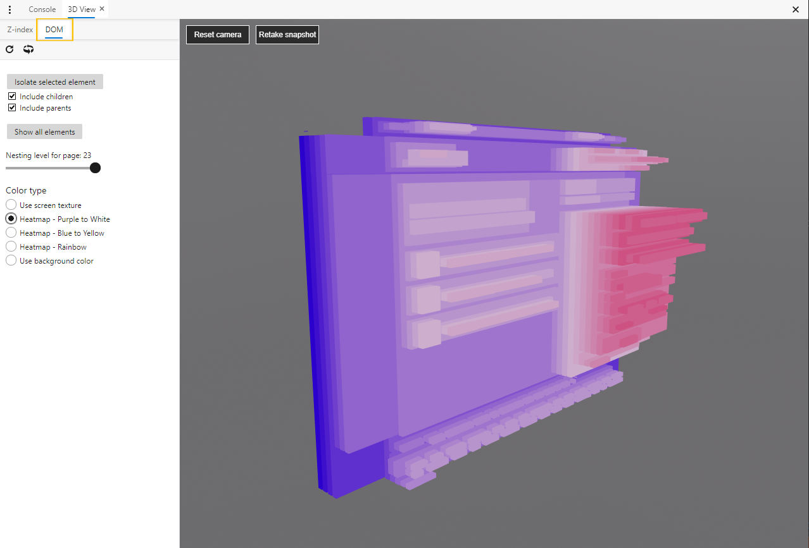

# 3D 视图

通过浏览[文档对象模型](https://developer.mozilla.org/en-US/docs/Web/API/Document_Object_Model)（DOM）或[z 索引](https://developer.mozilla.org/en-US/docs/Web/CSS/z-index)堆栈上下文，使用**3d 视图**调试 web 应用程序。 有了它，您可以： 

- [浏览转换为 3D perspevtive 的网页](#3d-dom)
- [基于 z 索引堆栈上下文进行调试](#z-index)
- 清除 "DOM" 窗格或 " [z 索引" 窗格](#change-the-scope-of-your-exploration)[中的一些混乱情况](#changing-your-view)
- [选择用于最佳调试 DOM 问题](#dom-color-type)或[z 索引问题](#z-index-color-type)的配色方案

有两个可用于调试体验的窗格。

1. **Z-索引**在 web 应用程序中使用 z 索引上下文浏览不同的元素。 这是默认窗格。
2. **3D DOM**使用所有元素轻松浏览整个 DOM。 若要访问此窗格，请单击 "Z 索引" 窗格旁边的 "DOM" 窗格。

## 导航画布

### 键盘快捷方式
- 旋转 DOM：使用向左和向右箭头键水平旋转，并使用向上和向下键垂直旋转。
- 导航 DOM：如果已选定某个元素，则可以使用向上键和向下键在相邻元素之间移动

### 鼠标控件
- 旋转 DOM：在画布空间周围左键单击并拖动。
- 在 DOM 周围移动：右键单击并沿希望 DOM 移动的方向拖动。
- 缩放：在触摸板上拖动两根手指或使用鼠标上的滚轮。

### 屏幕上的控件
- 将画布视图重置为原始视图：单击标记为 "重置摄像头" 的按钮，或单击看上去像侧向 "刷新" 按钮的图标，并在 "重置视图和重新中心摄像头" 中显示 "重置元素"
- 刷新画布（例如，如果浏览器已更改或切换到设备仿真程序视图），请执行以下操作：单击显示 "重拍快照" 的按钮，或单击看起来像刷新图标的按钮，并将 "拍摄新快照" 作为悬停文本。

## Z-索引

虽然 "Z-索引" 窗格具有与 "DOM" 窗格共享的功能，但它们仍具有特定于窗格的元素。

### 利用堆栈上下文突出显示元素

此设置允许你为画布中的元素切换 "打开" 和 "关闭" 的 z 索引标记。 默认情况下，将选中此复选框。

### 更改您的勘探的范围

"**显示所有元素**" 按钮是在更改以下设置后显示所有 DOM 元素的最快方式。

**仅显示具有堆栈上下文的元素**删除不带堆栈上下文的元素，并拼合 DOM 以便更轻松地进行导航。

**隔离选定的元素**筛选器实质上是一个中的三个按钮。 此按钮下面有两个复选框：一个是 "显示所有父级" 和 "仅保留具有新堆栈上下文的父级"。 

默认情况下，将选中 "显示所有父项" 复选框。 如果在 "画布" 窗格中选择一个元素，然后单击 "**隔离选定元素**"，则画布将仅显示该元素及其父元素。

如果选择 "仅保留新的堆栈上下文的父项"，然后单击 "**隔离选定元素**"，则画布将仅显示具有新堆栈上下文的元素和父元素。

如果取消选中两个复选框，然后单击 "**隔离选定元素**"，则画布将仅显示您在第一个位置中选择的元素。

在 "控件" 面板的最下方，**隐藏具有与父开关相同的绘制顺序的元素**。 选中并取消选中复选框将根据您的选择重新加载元素。 如果选中，共享绘制顺序的元素将拼合到父项。

这些选项旨在清理在你的画布中创建更复杂的网页的一些混乱程度。

### Z-索引颜色类型

以下是你的画布中的 DOM 可以使用的不同可视化效果。 无论您是将其用于有趣的还是为了帮助您更好地可视化 DOM，我们都有三种不同的 colorways 和 "背景色" 设置。 单选按钮允许你切换选项，并选择最适合你的项目的颜色类型（或最喜欢的颜色类型）。

## 3D DOM

如果你想要使用更多常规调试视图，而不是 z 索引体验，则 3D DOM 将为 DOM 提供整体外观。 由于删除了 z 索引上下文，因此 DOM 更紧密地堆叠。 此窗格具有类似的功能，但有一些细微差别。

### 更改视图

在**3D DOM**窗格中，**隔离选定的元素**筛选器具有 "包含子级" 和 "包含父项"。 默认情况下，两个复选框均被选中，这意味着在画布中选择元素后单击 "**隔离选定的元素**" 按钮将显示所选元素、元素的父元素和元素的子元素。 取消选择 "包含儿童" 复选框，然后再次单击 "**隔离选定元素**" 按钮将显示所选元素和元素的父元素。 如果选中 "包括儿童" 复选框，并取消选择 "包括父项" 复选框，然后单击 "包括父项" 复选框，则画布将显示该元素及其**子元素。** 如果取消选中两个复选框，然后单击 "**隔离选定元素**"，则画布将仅显示您之前选择的元素。

你将注意到 "控件窗格" 中标题为 "**嵌套级别**" 的滑块，旁边有一个数字。 该数字表示文档中的图层数。 将滑块向左拖动将导致最外层的图层 peel 消失，直到将嵌套级别1保留为1，仅显示 DOM 中最远的元素。 这允许你在尝试更仔细地查看较低级别中的内容时删除一些混乱效果。

### DOM 颜色类型

你将注意除*紫色到白色*、*蓝色到黄色*、*彩虹*以及*使用背景色*选项之外，还有*使用屏幕纹理*。 屏幕纹理通过将网页中的内容直接显示在元素上来将上下文添加到调试体验。 这仍是一个正在进行的工作，因为某些网站在3D 视图中呈现其屏幕纹理时较难。 

## 后续步骤

我们正在处理 UI，并根据用户（如用户）向3D 视图添加更多功能。 请向我们发送您的反馈，以便我们可以继续为您改进 Microsoft Edge DevTools！ 只需单击 DevTools 中的反馈图标或按 `Alt`  +  `Shift`  +  `I` Windows （ `Option`  +  `Shift`  +  `I` 在 Mac 上），然后输入 DevTools 的任何反馈或功能请求。