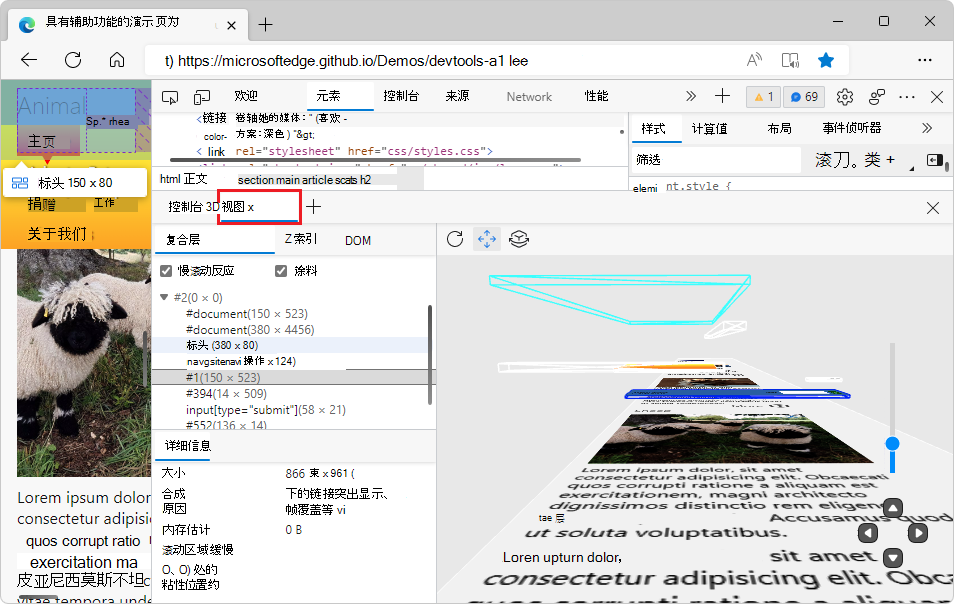
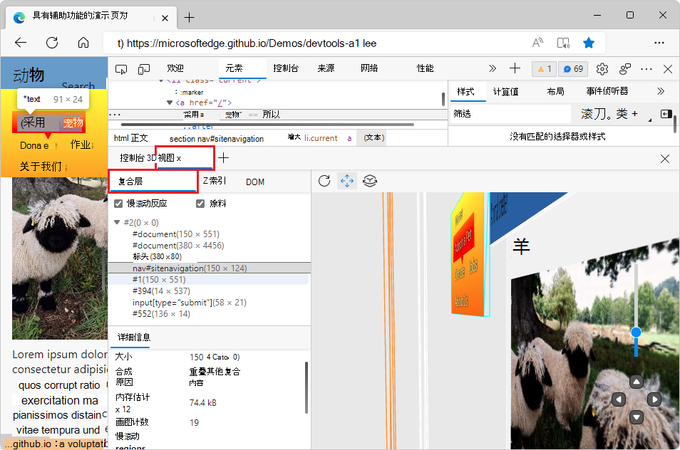
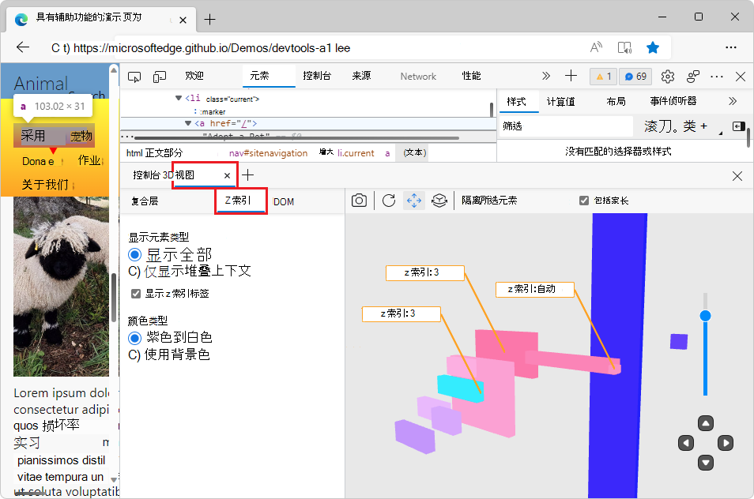
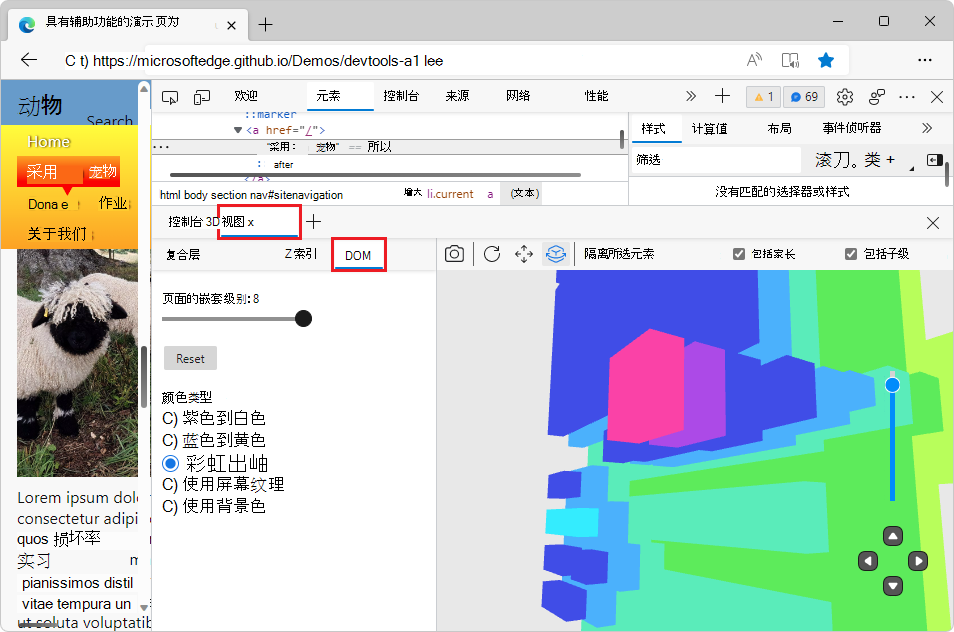

# 使用 3D 视图工具导航网页层、z 索引和 DOM

使用 **3D 视图** 工具通过在 3D 空间中旋转页面来调试 Web 应用，以获取以层形式表示的网页透视。  3D 可视化可帮助你从 z 索引层的角度了解网页的 DOM 层次结构。

在左侧， **3D 视图** 工具有 3 个选项卡：

*  **“复合层**”选项卡显示网页的真实呈现，包括图像，以便在 3D 空间中移动页面时获得全面的体验。
*  **Z 索引**选项卡。 浏览网页的元素，重点介绍 z 索引层上下文。  使用此选项卡或视图基于 z 索引堆叠上下文调试网页。
*  **“DOM**”选项卡。 浏览 DOM 作为一个整体，所有元素都可轻松访问。  浏览网页的所有元素，并将其转换为 3D 透视。

在右侧，3D 画布表示根据所选选项卡和选项的网页。

<!-- ====================================================================== -->
## 缩放、平移和旋转 3D 画布

### 放大或缩小页面

若要在 3D 画布上放大或缩小网页，请使用鼠标滚轮，或使用右下角的滑块。

<!-- instance 1 of this section, keep synd'c -->
### 平移视图 (按钮) 

若要向左、向右、向上或向下移动页面，请单击“ **平移视图** ”图标 () 按钮，然后用鼠标将 3D 画布上的页面拖动到所需的方向。

<!-- no right-click
To pan around the DOM, right-click and drag in the direction you want the DOM to move.
-->

<!-- instance 1 of this section, keep synd'c -->
###  (按钮) 旋转视图

若要使用鼠标旋转页面，请单击“ **旋转视图** ”图标 () 按钮，然后用鼠标以所需的角度拖动 3D 画布上的页面。

若要使用键盘旋转页面，请在 3D 画布中单击以将焦点放在页面上，以便显示黑色边框，然后按箭头键。
*  若要水平旋转页面，请按下 `left arrow` 和 `right arrow` 键。
*  若要垂直旋转页面，请按下 `up arrow` 和 `down arrow` 键。

无论在工具栏中是否选择了 **“平移视图** ”或 **“旋转视图** ”按钮，键都会旋转页面。

有关详细信息，请参阅此页中的以下其他部分：
*  [3D 画布上方的工具栏](#toolbar-above-the-3d-canvas)
*  [右下角的移动控件](#movement-controls-in-lower-right)

<!-- ====================================================================== -->
## “复合层”选项卡

在复合层视图中，3D 画布显示呈现的网页，包括颜色和图像。

在右侧的 3D 画布上，选择网页的元素。  在 **“复合层** ”选项卡中，层树自动展开，层树下的 **“详细信息** ”选项卡显示有关所选层的信息。

<!-- == checkboxes == -->

###  (复选框) 缓慢滚动矩形

<!-- need desc -->

### 绘制 (复选框) 

将网页中的内容 (颜色或图像文件) 到元素上。

<!-- ===== -->
### DOM 扩展器树

展开此树以显示有关所选 DOM 元素的 DOM 树信息。

<!-- ===== -->
### 详细信息窗格

#### 大小

所选 DOM 元素的宽度和高度，以及元素左上角相对于页面视区左上角的位置。  例如，“1034 x 28055 (0，0) ”。

#### 组合原因

如果完成任何组合，则为所选 DOM 元素进行层组合的原因。  例如：“辅助层，以容纳可滚动的内容。

#### 内存估计

所选 DOM 元素及其子元素使用的内存。  例如：“116 MB”。

<!-- #### Paint count -->

<!-- need desc -->

<!-- #### Slow scroll regions -->

<!-- need desc -->

<!-- #### Sticky position constraint -->

<!-- need desc -->

<!-- ====================================================================== -->
## Z 索引选项卡

**Z 索引**选项卡包含一些与 **DOM** 选项卡相同的功能，但在 3D 画布上添加 z 索引标签。

有关背景信息，请参阅 [MDN > CSS 参考> z 索引](https://developer.mozilla.org/docs/Web/CSS/z-index)。

### 显示元素类型 (部分) 

**Z 索**引选项卡中的 **“显示元素”类型**部分控制页面的哪些元素显示在 3D 画布中。

*  **“显示所有**单选按钮”显示页面的所有元素。  此视图是更改其他 3D 显示设置后显示所有页面元素的最快方法。

*  “ **仅显示堆叠上下文”** 单选按钮仅显示与 z 索引堆叠相关的页面元素。  此视图删除不参与堆叠上下文的元素，并平展 DOM 以在 3D 画布中生成更轻松的导航。

**显示 z 索引标签**复选框显示或隐藏 3D 画布中的 z 索引标签。  默认情况下，选中此复选框。

### 颜色类型 (节) 

在 **Z 索引** 选项卡中，你可以从以下配色方案中进行选择，以在 3D 画布中可视化 DOM：

*  **紫色到白色** 单选按钮 - 3D 画布显示从紫色到白色的元素。

*  **使用背景色** 单选按钮 - 3D 画布显示使用为每个元素定义的背景色呈现的元素。

使用这些单选按钮可以切换选项并选取颜色类型。  颜色类型最适用于你的项目，或最喜欢的颜色类型。  z 索引标签在 3D 画布上添加视觉信息，因此根据用户的反馈， **Z 索** 引选项卡中的颜色选项比 **在 DOM** 选项卡中少。

<!-- ====================================================================== -->
## “DOM”选项卡

**DOM** 选项卡提供常规调试视图，而不是专注于 z 索引。  与 **Z 索引** 选项卡相比，DOM 堆叠得更紧密、更干净，因为 3D 画布上没有 z 索引上下文标签。

### 页 (滑块) 的嵌套级别

滑块旁边的数字指示文档的层数。  将滑块拖到左侧会导致最外层剥落，直到将嵌套级别设置为 `1`，该级别仅显示 DOM 中最远的后退元素。  若要删除某些待筛选邮件，请拖动滑块。  它可以帮助你仔细查看较低级别中发生的情况。

#### 重置按钮

将页面滑块 **的嵌套级别** 重置为页面的默认值。

### 颜色类型 (节) 

在 **“DOM** ”选项卡中，可以选择以下配色方案，在 3D 画布中可视化 DOM：

*  **紫色到白色** 单选按钮 - 3D 画布显示从紫色到白色的元素。

*  **蓝色到黄色** 的单选按钮 - 3D 画布显示从蓝色到黄色的元素。

*  **彩虹** 单选按钮 - 3D 画布显示紫色、蓝色、绿色、黄色、橙色和红色等元素。

*  **使用屏幕纹理** 单选按钮 - 将网页中的内容 (颜色或图像文件) 到元素上。

*  **使用背景色** 单选按钮 - 3D 画布显示使用为每个元素定义的背景色呈现的元素。

<!-- ====================================================================== -->
## 3D 画布上方的工具栏

### )  (按钮重新拍摄快照

单击“**重拍快照**”图标](index-images/retake-snapshot-icon.png) (。

选择 **“复合层** ”选项卡时，将省略此按钮，因为重设视区大小时会自动重新拍摄快照。

### “重置视图 (”按钮) 

单击“ **重置视图** ”图标 () 重置页面的平移和旋转。

<!-- instance 2 of this section, keep synd'c -->
### 平移视图 (按钮) 

若要向左、向右、向上或向下移动页面，请单击“ **平移视图** ”图标 () 按钮，然后用鼠标将 3D 画布上的页面拖动到所需的方向。

<!-- no right-click
To pan around the DOM, right-click and drag in the direction you want the DOM to move.
-->

<!-- instance 2 of this section, keep synd'c -->
###  (按钮) 旋转视图

若要使用鼠标旋转页面，请单击“ **旋转视图** ”图标 () 按钮，然后用鼠标以所需的角度拖动 3D 画布上的页面。

若要使用键盘旋转页面，请在 3D 画布中单击以将焦点放在页面上，以便显示黑色边框，然后按箭头键。
*  若要水平旋转页面，请按下 `left arrow` 和 `right arrow` 键。
*  若要垂直旋转页面，请按下 `up arrow` 和 `down arrow` 键。

无论在工具栏中是否选择了 **“平移视图** ”或 **“旋转视图** ”按钮，键都会旋转页面。

### 隔离所选元素 (按钮和节) 

你可以专注于仅显示 DOM 的一部分，而不是在 3D 画布中显示页面的所有 DOM 元素。

在 3D 画布中选择网页的元素，然后单击“ **隔离所选元素** ”按钮。  3D 画布显示所选元素和元素的父级或子元素，而不显示其余页面元素。

使用此按钮可显示在 3D 画布上选择的元素，同时减少复杂网页在 3D 画布中可创建的杂乱无章。

#### 包含家长 (复选框) 

**“包括父**级”复选框控制选定页面元素的父元素是否显示在 3D 画布中。  默认情况下，已打开 **“包括父** 级”复选框。  选中此复选框后，若要在 3D 画布上显示元素及其任何父元素，请在 3D 画布或 **Elements** 工具中选择一个元素，然后单击 **“隔离所选元素** ”按钮。

选中 **Z 索引** 或 **DOM** 选项卡时会显示此复选框。

#### 包含子级 (复选框) 

“ **包括子** 级”复选框仅在选中 **“DOM** ”选项卡时显示。

<!-- select select -->
若要仅显示所选的 DOM 元素，以及元素的父级和子元素：
*  选中 **“包括父** 级”和 **“包括子** 级”复选框，然后单击“ **隔离所选元素** ”按钮。  这是默认设置。

<!-- select clear -->
若要仅显示所选的 DOM 元素以及元素的父元素，但不显示元素的子元素：
*  选中 **“包括父** 级”复选框，清除 **“包括子** 级”复选框，然后单击“ **隔离所选元素** ”按钮。

<!-- clear select -->
若要仅显示所选的 DOM 元素以及元素的子元素，但不显示元素的父元素：
*  清除 **“包括父** 级”复选框，选中 **“包括子** 级”复选框，然后单击“ **隔离所选元素** ”按钮。

<!-- clear clear -->
若要仅显示所选的 DOM 元素，而不显示其父元素或子元素：
*  清除 **“包括父** 级”和“ **包括子** 级”复选框，然后单击“ **隔离所选元素** ”按钮。

<!-- ====================================================================== -->
## 右下角的移动控件

无论选择哪个选项卡，3D 画布右下角的控件的工作方式都相同。

*  缩放滑块 - 这放大或缩小页面，与鼠标滚轮相同，或在触摸板上拖动两根手指。

*  向上按钮 - 相对于页面的坐标系统向上移动页面。

*  向下按钮 - 相对于页面的坐标系统向下移动页面。

*  左键 - 相对于页面的坐标系统向右移动页面。

*  右键 - 相对于页面的坐标系统向左移动页面。

<!-- ====================================================================== -->
## 另请参阅

* [> DOM (DOM 对象模型> MDN > Web API) ](https://developer.mozilla.org/docs/Web/API/Document_Object_Model)
* [MDN > CSS 参考> z 索引](https://developer.mozilla.org/docs/Web/CSS/z-index)
