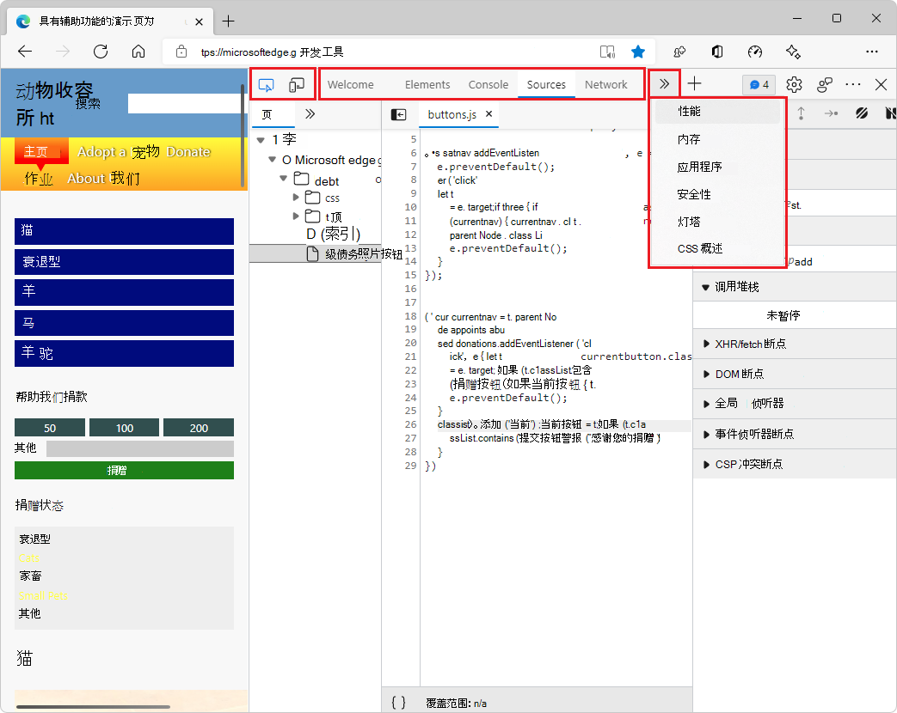

# 关于工具列表

DevTools 提供 35 种工具：
*  2 个工具栏图标：**检查工具**（）和**设备仿真**（）。
*  3 个永久工具栏选项卡：“**元素**”、“**控制台**”、“**源**”工具。
*  可选工具的 30 个可选工具栏选项卡。

默认工具， 包括工具栏图标、工具栏选项卡和**更多选项卡**（）菜单中的工具：

默认情况下未打开的可选工具，位于**更多工具**（）菜单中：

以下功能是访问工具的其他方法：
*  **抽屉**是用于保存工具选项卡的附加工具栏和区域。
*  **命令菜单**是一种直接使用工具功能的方法。
*  **设置**页面可以打开工具的其他功能。

<!-- ====================================================================== -->
## 所有工具概述

Microsoft Edge DevTools 包括以下工具。

| 工具 | 用途 | 文章 |
| --- | --- | --- |
| **3D 视图**工具 | 浏览翻译为 3D 透视的网页。  通过浏览 DOM 或 z 索引堆叠上下文来调试网页。 | [使用 3D 视图工具导航网页层、z 索引和 DOM](3d-view/index.md) |
| **动画**工具 | 使用**动画**工具中的**动画检查器**检查和修改 CSS 动画效果。 | [检查和修改 CSS 动画效果](inspect-styles/animations.md) |
| **应用程序**工具 | 使用**应用程序**工具管理 Web 应用页面的存储，包括清单、服务辅助角色、本地存储、Cookie、缓存存储和后台服务。 | [用于管理存储的应用程序工具](storage/application-tool.md) |
| **更改**工具 | 跟踪对 DevTools 中的 CSS 或 JavaScript 所做的任何更改。  显示在使用 DevTools 修改从服务器发送的网页文件后对实际源文件所做的更改。 | [使用更改工具跟踪对文件的更改](changes/changes-tool.md) |
| **控制台**工具 | DevTools 中智能、丰富的命令行。  一个很好的帮手工具，可与其他工具一起使用。  提供了一种编写功能脚本、检查当前网页以及使用 JavaScript 操作当前网页的强大方法。 | [控制台概述](console/index.md) |
| **覆盖**工具 | 帮助查找未使用的 JavaScript 和 CSS 代码，以加快页面加载并保存移动用户手机网络数据。 | [使用覆盖工具查找未使用的 JavaScript 和 CSS 代码](coverage/index.md) |
| **CSS 概述**工具 | 帮助你更好地了解页面的 CSS 并确定潜在的改进。 | [CSS 概述工具](css/css-overview-tool.md) |
| **分离的元素**工具 | 为了提高页面的性能，此工具会查找浏览器无法垃圾回收的分离元素，并标识仍在引用分离元素的 JavaScript 对象。  通过将 JavaScript 更改为释放元素，可以减少页面上分离的元素数，从而提高页面性能和响应能力。 | [使用分离的元素工具调试 DOM 内存泄漏](memory-problems/dom-leaks.md) |
| **开发人员资源** | 显示网页的资源 URL。 | [开发人员资源工具](developer-resources/developer-resources.md) |
| **设备仿真** | 使用**设备仿真**工具（有时称为“_设备模式_”）来大致了解页面在移动设备上的外观和响应方式。 | [模拟移动设备（设备仿真）](device-mode/index.md) |
| **元素**工具 | 检查、编辑、调试 HTML 和 CSS。  可以在浏览器中实时显示更改时在工具中进行编辑。  使用 DOM 树调试 HTML，并检查和处理网页的 CSS。 | [使用 Elements 工具检查、编辑和调试 HTML 和 CSS](elements-tool/elements-tool.md) |
| **检查**工具 | 使用**检查**工具查看呈现的网页中的项的相关信息。  当**检查**工具处于活动状态时，可将鼠标_悬浮_在网页中的项上，DevTools 会在网页上添加信息覆盖信息和网格突出显示。 | [使用检查工具分析页面](css/inspect.md) |
| **问题** 工具 | **问题**工具会自动分析当前网页，按类型报告问题，并提供关于解释和解决问题的文档。 | [使用问题工具查找和修复问题](issues/index.md) |
| **JavaScript 探查器**工具 | 此工具已被替换为**性能**工具和**内存**工具。 | [JavaScript 探查器工具](javascript-profiler/javascript-profiler-tool.md) |
| **Lighthouse** 工具 | 使用 Lighthouse 工具识别和修复影响网站性能、辅助功能和用户体验的常见问题。 | [Lighthouse 工具](lighthouse/lighthouse-tool.md) |
| **媒体**工具 | 使用此工具可以查看信息，并按浏览器选项卡调试媒体播放器。 | [查看和调试媒体播放器信息](media-panel/index.md) |
| **内存**工具 | 查找影响页面性能的内存问题，包括内存泄漏、内存膨胀和垃圾回收频繁。 | [修复内存问题](memory-problems/index.md) |
| **内存检查器**工具 | 使用内存检查器检查 JavaScript ArrayBuffer。 | [使用内存检查器工具检查 JavaScript ArrayBuffer](memory-inspector/memory-inspector-tool.md) |
| **网络**工具 | 使用 **网络** 工具确保正在按预期下载或上传资源。  检查单个资源的属性，例如 HTTP 标头、内容或大小。 | [检查网络活动](network/index.md) |
| **网络条件**工具 | 使用**网络条件**工具禁用浏览器缓存、设置网络限制、设置用户代理字符串，以及设置 Content-Encoding（如 deflate、gzip、br）。 | [网络条件工具](network-conditions/network-conditions-tool.md) |
| **网络控制台**工具 | 使用**网络控制台**工具对网络请求（网络调用）进行更改，以了解失败的原因。  更改和重播任何网络请求，并进行详细的网络 API 调用。  | [网络控制台工具](network-console/network-console-tool.md) |
| **网络请求阻止**工具 | 使用**网络请求阻止**工具测试对指定 URL 模式的阻止网络请求，并查看网页的行为方式。 | [网络请求阻止工具](network-request-blocking/network-request-blocking-tool.md) |
| **性能**工具 | 分析运行时性能，即页面在运行（而不是加载）时的性能。 | [分析运行时性能入门](evaluate-performance/index.md) |
| **性能监视器**工具 | 提供网页运行时性能的实时视图，以确定使网站运行缓慢的性能问题的来源。  查找问题是来自高内存或 CPU 使用率、过于频繁的布局和样式计算，还是太多 DOM 节点和事件侦听器。 | [使用性能监视器工具度量页面的运行时性能](performance-monitor/performance-monitor-tool.md) |
| **快速源**工具 | 在使用**源**工具以外的工具时使用**快速源**工具显示或编辑源文件。 | [使用快速源工具显示或编辑源文件](quick-source/quick-source-tool.md) |
| **呈现**工具 | 使用**呈现**工具，查看具有不同显示选项或视觉缺陷的网页外观。 | [呈现工具，查看具有不同显示选项或视觉缺陷的网页外观](rendering-tools/rendering-tool.md) |
| **搜索**工具 | 使用**搜索**工具查找网页的特定源文件，包括 HTML、CSS、JavaScript 和映像文件。 | [使用搜索工具查找页面的源文件](search/search-tool.md) |
| **安全**工具 | 检查页面的安全性。 | [使用安全工具了解安全问题](security/index.md) |
| **传感器**工具 | 模拟不同的设备方向。 | [使用传感器工具模拟设备方向](device-mode/orientation.md) |
| **源映射监视器**工具 | 使用**源映射监视器**工具监视源映射。 | [源地图监视器工具](source-maps-monitor/source-maps-monitor-tool.md) |
| **源**工具 | 使用**源**工具查看、修改、调试前端 JavaScript 代码，并检查和编辑构成当前网页的 HTML 和 CSS 文件。 | [源工具概述](sources/index.md) |
| **WebAudio** 工具 | 使用 **WebAudio** 工具监视 WebAudio 流量。  **WebAudio** 工具使用 WebAudio API。 | [WebAudio 工具](webaudio/webaudio-tool.md) |
| **WebAuthn** 工具 | 使用 **WebAuthn** 工具创建基于软件的虚拟验证器并与之交互。 | [模拟身份验证器并调试 WebAuthn](webauthn/index.md) |
| **欢迎**工具 | 首次打开 DevTools 时，将打开**欢迎**工具。  它会显示开发人员文档、最新功能、发行说明的链接，以及联系 Microsoft Edge DevTools 团队的选项。 | [欢迎工具](welcome/welcome-tool.md) |

<!-- when no longer experimental, move into table:
| **CSP Violations** tool | Displays any Content Security Policy (CSP) violations that are detected on the inspected webpage. | [CSP Violations tool](csp-violations/csp-violations-tool.md) |
https://docs.microsoft.com/microsoft-edge/devtools-guide-chromium/experimental-features/#show-csp-violations-view
-->

<!-- ====================================================================== -->
## “更多工具”菜单

主工具栏和抽屉工具栏上的**更多工具**（**+**）菜单是动态的：它会省略在工具栏上打开的任何选项卡工具。

**自定义和控制 DevTools**（）中的**更多工具**菜单是静态的：它始终列出所有可选工具。  如果所选工具是面板工具，则会在主工具栏中打开; 如果是抽屉工具，则会在抽屉中打开。  可以右键单击工具的选项卡，将其移动到另一个工具栏。

<!-- ====================================================================== -->
## 面板工具与抽屉工具

在“**命令菜单**”中：

* _面板工具_是默认情况下在主工具栏中打开的工具。

* _抽屉工具_是默认情况下在 DevTools 底部的抽屉工具栏中打开的工具。  按 `Esc` 显示或隐藏抽屉。

**命令菜单**会首先列出面板工具，然后列出抽屉工具：

若要将工具移动到其他工具栏，请右键单击工具的选项卡，然后选择“**移动到底部**”或“**移动到顶部**”。

若要打开**命令菜单**，请按 `Ctrl`+`Shift`+`P` (Windows、Linux) 或 `Command`+`Shift`+`P` (macOS)。  或者，单击**自定义和控制 DevTools**（）按钮，然后选择“**运行命令**”。

<!-- ====================================================================== -->
## 正在关闭工具选项卡

若要关闭工具栏上的工具选项卡，请执行以下操作：

*  单击选项卡上的 **x**。

   **元素**、**控制台**、**源**工具选项卡无法关闭。

若要同时关闭所有可选选项卡：

*  右键单击工具栏上的可选选项卡（带有 **x** 按钮的选项卡），然后选择“**全部关闭**”。

   只有**元素**，**控制台**、**源**保留在主工具栏上。  （**抽屉**工具栏不受影响。）

   如果关闭**抽屉**上的所有选项卡，则只有**控制台**选项卡保留在**抽屉**工具栏中。  （主工具栏不受影响。）

<!-- ====================================================================== -->
## 还原默认工具选项卡

若要还原主工具栏上的所有默认选项卡：

1. 在 DevTools 中，选择“**设置**”（）>“**首选项**”。

1. 单击“**还原默认值并刷新**”按钮。

   主工具栏会再次具有所有默认选项卡。  而**抽屉**只有**控制台**选项卡。

<!-- ====================================================================== -->
## 另请参阅
 
* [DevTools 概述](overview.md) - 与本文类似，但覆盖范围更广，对 DevTools 进行了广泛的介绍。
* 在_体验功能_中[使用焦点模式简化 DevTools](experimental-features/focus-mode.md)。  在**焦点模式**中，**活动栏**是主工具栏的更紧凑的替代项，**快速视图**列表是抽屉工具栏上选项卡的替代项。
