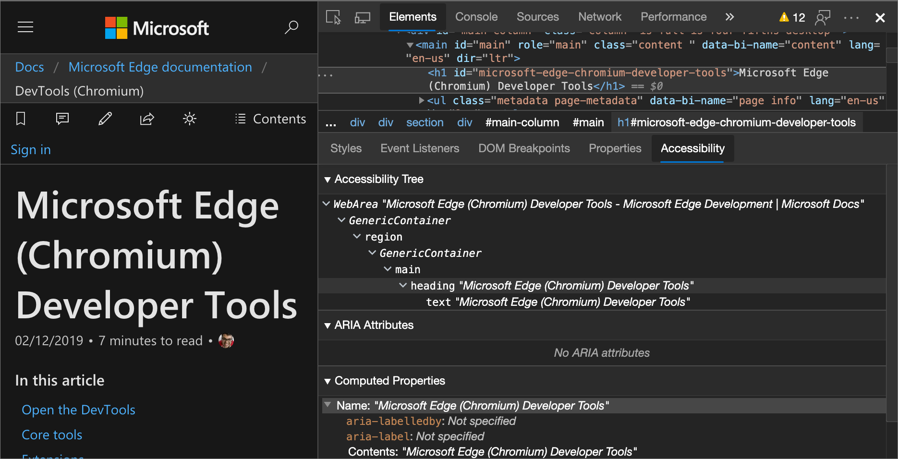
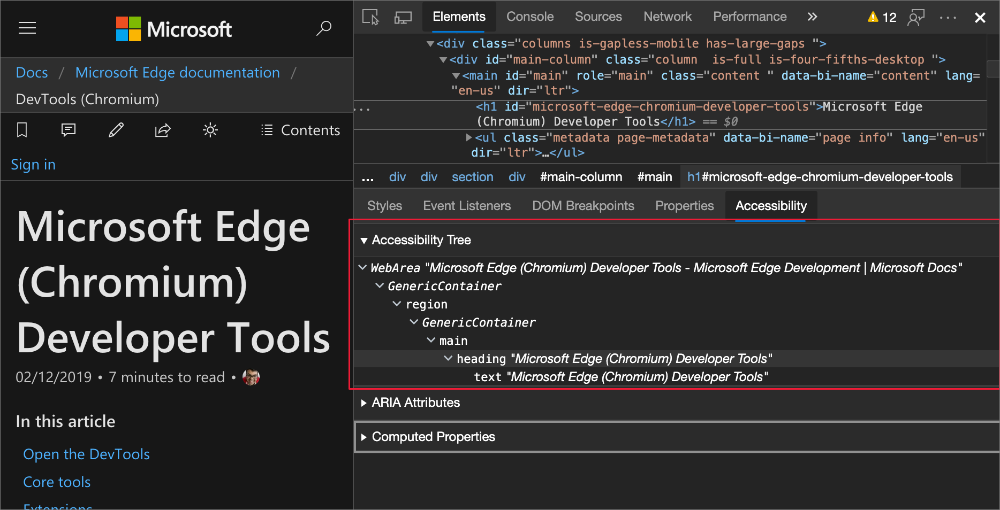
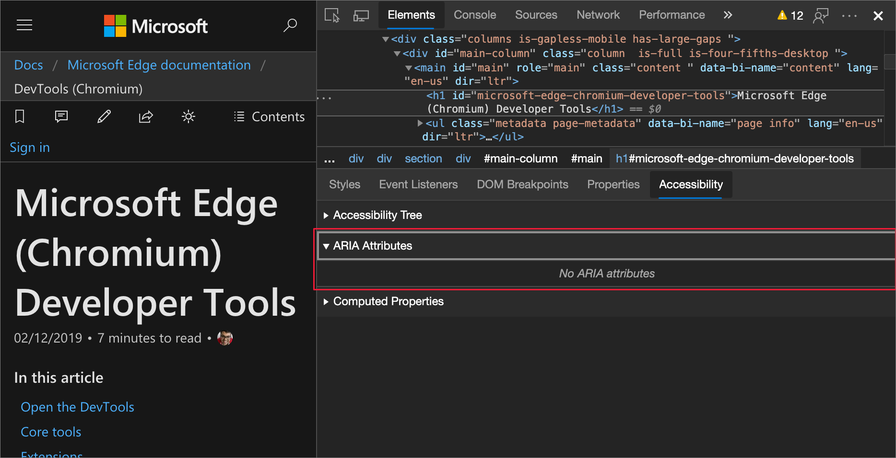
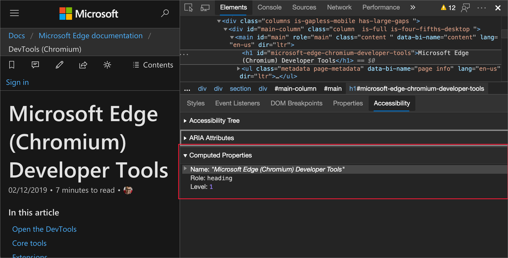

<!-- this article was created on 05/11/2021 by moving a section out from the "Accessibility reference" article (reference.md) -->
<!-- Copyright Kayce Basques

   Licensed under the Apache License, Version 2.0 (the "License");
   you may not use this file except in compliance with the License.
   You may obtain a copy of the License at

       https://www.apache.org/licenses/LICENSE-2.0

   Unless required by applicable law or agreed to in writing, software
   distributed under the License is distributed on an "AS IS" BASIS,
   WITHOUT WARRANTIES OR CONDITIONS OF ANY KIND, either express or implied.
   See the License for the specific language governing permissions and
   limitations under the License.  -->
# 使用"辅助功能"选项卡测试辅助功能

“ **辅助功能** ”选项卡是查看 DOM 节点的辅助功能树、ARIA 属性和计算辅助功能属性的位置。

若要打开 **“辅助功能”** 选项卡：

1. 在呈现的网页中，右键单击某个元素，然后选择 **“检查**”。

   DevTools 随即打开，其中选择了 **元素**工具。  DOM 树随即打开，显示右键单击的元素。

1. 在 **DOM 树**中，单击要检查的元素。  可以使用箭头键在 DOM 树中移动。

1. 单击“**样式**”选项卡右侧的 **“辅助功能**”选项卡。 可能需要先单击“**更多”选项卡** () “**样式**”选项卡右侧的按钮。

<!-- ====================================================================== -->
## 查看辅助功能树中元素的位置

[辅助功能树](https://developer.mozilla.org/docs/Glossary/AOM)是 DOM 树的子集。  辅助功能树仅包含 DOM 树中的元素，这些元素与通过辅助技术（如屏幕阅读器）显示页面内容相关且非常有用。

从辅助 **功能** 选项卡检查辅助功能树中元素的位置。

<!-- ====================================================================== -->
## 查看元素的 ARIA 属性

ARIA 属性可确保辅助技术（如屏幕阅读器）具有它们所需的所有信息，以便正确表示页面的内容。

在 **“辅助功能** ”选项卡中查看元素的 ARIA 属性。

<!-- ====================================================================== -->
## 查看元素的计算出的属性

部分辅助功能属性由浏览器动态计算。  这些属性显示在 **“辅助功能**”选项卡的“**计算属性**”部分中。

在“ **辅助功能** ”选项卡中查看元素的计算辅助功能属性。

> [!NOTE]
> 对于计算的 CSS 属性，请使用 [“计算”](../css/reference.md#view-only-the-css-that-is-actually-applied-to-an-element) 选项卡。

<!-- ====================================================================== -->
> [!NOTE]
> 此页面的某些部分是根据 [Google 创建和共享的](https://developers.google.com/terms/site-policies)作品所做的修改，并根据[ Creative Commons Attribution 4.0 International License ](https://creativecommons.org/licenses/by/4.0)中描述的条款使用。
> 原始页面位于[此处](https://developers.google.com/web/tools/chrome-devtools/accessibility/reference)，由 [Kayce Basques](https://developers.google.com/web/resources/contributors/kaycebasques)\（Chrome DevTools 和 Lighthouse 的技术作家）撰写。

本作品根据[ Creative Commons Attribution 4.0 International License ](https://creativecommons.org/licenses/by/4.0)获得许可。
