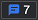

# <a name="overview-of-accessibility-testing-using-devtools"></a>使用 DevTools 的辅助功能测试概述

本文介绍可在 DevTools 中用于测试辅助功能问题的一些功能。  我们将使用 DevTools 的不同功能检测演示页面中的辅助功能问题，并讨论如何解决这些问题。

1. 打开 [新窗口或选项卡](https://microsoftedge.github.io/Demos/devtools-a11y-testing/) 中的辅助功能测试演示页面。

   :::image type="content" source="../media/a11y-testing-basics-demopage.msft.png" alt-text="本文中使用的演示页面具有一些辅助功能问题。" lightbox="../media/a11y-testing-basics-demopage.msft.png":::

1. 右键单击演示网页中的任意位置，然后选择"检查 **"**。  将在网页旁边打开 DevTools。


<!-- ====================================================================== -->
## <a name="automated-testing-by-using-the-issues-tool"></a>使用问题工具自动测试

在浏览器中打开演示页面并打开 DevTools 时，请注意，问题计数器中会自动检测到 **一些问题**。  单击"**问题" (**  "问题"计数器。) 打开"问题"工具以查看问题和**** 详细信息。

:::image type="content" source="../media/a11y-testing-issues-tracker.msft.png" alt-text="&quot;问题&quot;计数器显示当前网页中有多少问题，并打开&quot;问题&quot;工具。" lightbox="../media/a11y-testing-issues-tracker.msft.png":::

对于本文，我们将重点介绍问题**工具**的**辅助功能部分。**

:::image type="content" source="../media/a11y-testing-accessibility-issues.msft.png" alt-text="&quot;问题&quot;工具中显示的辅助功能警告。" lightbox="../media/a11y-testing-accessibility-issues.msft.png":::

有关详细演练步骤，请参阅查看 [问题工具的辅助功能部分](test-issues-tool.md#view-the-accessibility-section-of-the-issues-tool)。


### <a name="automatically-checking-that-input-fields-have-labels"></a>自动检查输入字段是否包含标签

显示的第一个警告是 `Form elements must have labels: Element has no title attribute. Element has no placeholder attribute`。  展开此部分，然后单击"在元素中**** 打开"链接时，将打开 **"** 元素"工具，同时在 DOM 树中突出显示元素。  " **样式** "选项卡显示应用于 元素的 CSS。

有关详细演练步骤，请参阅 [验证输入字段是否具有标签](test-issues-tool.md#verify-that-input-fields-have-labels)。

:::image type="content" source="../media/a11y-testing-inspect-problematic-element.msft.png" alt-text="元素工具，在单击问题工具中的链接后显示有问题的 HTML。" lightbox="../media/a11y-testing-inspect-problematic-element.msft.png":::

在这种情况下，HTML 具有不起作用 `label` 的元素。

```html
<label>Search</label>
<input type="search">
<input type="submit" value="go">
```

此处元素 `label` 的使用有误，因为 `label` 元素和 元素之间没有 `input` 连接。  单击搜索标签时，有效的 HTML 标签将焦点放在搜索输入 **文本框** 上。

可以通过将 元素嵌套`input` `id` `label` `for`在 元素中，或添加指向 元素属性的属性来解决此问题。`input`  若要查看正确的连接，请单击"资金 **"表单** 上的"其他"标签。

还可以单击问题工具中的说明 **性** 链接获取此信息。

:::image type="content" source="../media/a11y-testing-more-information-links.msft.png" alt-text="问题工具中指向有关问题的更深入信息的链接。" lightbox="../media/a11y-testing-more-information-links.msft.png":::


### <a name="automatically-checking-that-images-have-alt-text"></a>自动检查图像是否包含替换文字

另一个自动检测到的问题是，页面中的许多图像没有任何替代文本。  如果展开警告 `Images must have alternate text: Element has no title attribute` ，将获取具有此问题的四个图像实例。

:::image type="content" source="../media/a11y-testing-images-without-alt.msft.png" alt-text="问题工具，报告缺少可选文本的图像。" lightbox="../media/a11y-testing-images-without-alt.msft.png":::

有关详细演练步骤，请参阅 [验证图像是否包含替换文字](test-issues-tool.md#verify-that-images-have-alt-text)。


### <a name="automatically-checking-that-text-colors-have-enough-contrast"></a>自动检查文本颜色是否具有足够的对比度

" **问题** "工具还报告页面上的两个元素没有足够的对比度。

:::image type="content" source="../media/a11y-testing-contrast-issues.msft.png" alt-text="比较问题工具中报告的问题。" lightbox="../media/a11y-testing-contrast-issues.msft.png":::

**问题工具**提供警告的详细说明。  向下钻取时，将获取具有此问题的元素的列表。  在 **"问题** "工具中，单击指向某个元素的链接将突出显示呈现的页面上的该元素。

:::image type="content" source="../media/a11y-testing-element-with-contrast-issues.msft.png" alt-text="单击指向该页面的链接后突出显示的页面中的元素。" lightbox="../media/a11y-testing-element-with-contrast-issues.msft.png":::

有关详细演练步骤，请参阅验证 [文本颜色是否具有足够的对比度](test-issues-tool.md#verify-that-text-colors-have-enough-contrast)。


### <a name="verify-that-the-webpage-layout-is-usable-when-narrow"></a>验证网页布局在缩小时是否可用

<!-- corresponding how-to article: narrow.md -->

辅助功能的一个重要部分是确保 Web 产品在较窄的视口上良好工作。 许多用户需要缩放页面才能使用它，这意味着没有太多空间。  当空间不足时，多列布局应转换为单列布局，内容按可理解的顺序放置。 这意味着将最重要的内容放置在页面顶部，将其他内容放置在页面的更下一层。

通过缩小浏览器窗口范围，使用箭头键滚动页面，可以看到演示页面的顶部导航栏具有一些辅助功能问题。  顶部导航栏与 **"** 搜索"窗体重叠，如上图所示，需要修复该问题。

可以通过调整浏览器窗口的大小来模拟较窄的视区，但测试设计响应性更好的方法就是使用 **设备仿真** 工具。  以下是设备仿真 **工具的一** 些功能，可帮助你查找任何网站的辅助功能问题：

*  无需调整浏览器窗口的大小，即可调整页面大小并测试 [CSS 媒体](../device-mode/index.md#show-media-queries) 查询是否触发布局更改。

*  检查是否使用鼠标的依赖项。 默认情况下， **设备仿真** 假定为触摸设备。 这意味着产品依赖于悬停交互的任何功能将不起作用。

*  通过模拟不同的设备、缩放级别和像素比率执行视觉测试。

*  测试产品在不可靠连接或用户脱机时的行为方式。  在低速连接上向用户显示最重要的交互也是辅助功能注意事项。

若要了解有关设备仿真 **工具** 的信息，请参阅模拟移动设备 [ (设备仿真) ](../device-mode/index.md)。


### <a name="wavy-underlines-in-the-dom-tree-indicate-automatically-detected-issues"></a>DOM 树中的波浪下划线指示自动检测到的问题

"元素"工具中的 DOM **树通过** 添加波浪下划线自动在 HTML 中直接标记问题。  If you any `Shift`+`click` element that has a wavy underline， the **Issues** tool opens.

:::image type="content" source="../media/a11y-testing-wavy-underlines.msft.png" alt-text="在 DOM 树中以波浪下划线显示的元素有问题。  Shift+单击 元素，直接进入问题。" lightbox="../media/a11y-testing-wavy-underlines.msft.png":::

问题工具发现的 **这些问题是一** 些可以避免的相对明显的辅助功能问题。  使用 **问题** 工具及其指导性说明修复问题，可引导你实现可访问的产品。


<!-- ====================================================================== -->
## <a name="limits-of-automated-testing"></a>自动测试的限制

问题[工具](../issues/index.md)、辅助功能[Insights](https://accessibilityinsights.io)和[灯](https://developers.google.com/web/tools/lighthouse/)楼是自动生成网页的辅助功能报告的工具。  从此类工具获取自动报告只是辅助功能测试之旅的开始。

辅助功能与人员交互有关，即在不同的技术环境中使用产品时具有不同的需求的人。  此测试无法完全自动化，但需要用户对产品进行验证。  在最佳方案中，你可以访问具有不同辅助功能需求的测试人员和使用各种环境的测试人员。  但是，通过使用键盘进行导航并检查页面的不同部分，你已可以自己执行很多操作。

在演示页面上，还有一些自动测试无法检测到的其他问题，包括：

*  与页面交互后出现的问题。
*  与显示更改相关的问题，例如使窗口变窄。

其中一个问题就是"捐赠"表单。  使用鼠标时，可以单击不同的选项来赚钱。  但是，当您尝试使用键盘访问该资金表单时，不会执行任何操作。 若要解决此问题，您需要使用 **Inspect** 工具。

:::image type="content" source="../media/a11y-testing-basics-donation-form-issue.msft.png" alt-text="演示页面上的&quot;捐赠&quot;表单将突出显示。" lightbox="../media/a11y-testing-basics-donation-form-issue.msft.png":::


<!-- ====================================================================== -->
## <a name="using-the-inspect-tool-to-detect-accessibility-issues"></a>使用检查工具检测辅助功能问题

使用 **"检查** "工具通过将鼠标悬停在网页的某些部分来检测辅助功能问题。  **检查 (**。) 工具位于 DevTools 的左上角。  通过单击"检查工具"按钮 **打开"检查"** 工具。

:::image type="content" source="../media/a11y-testing-basics-inspector.msft.png" alt-text="通过单击&quot;检查工具&quot;按钮打开&quot;检查&quot;工具。" lightbox="../media/a11y-testing-basics-inspector.msft.png":::

单击" **检查"** 工具按钮后，可以将指针移动到呈现页面上的任何元素上。  Inspect 工具将元素的布局显示为多色弹性框覆盖，将元素详细信息作为类似于工具提示的信息覆盖显示。

:::image type="content" source="../media/inspect-tool-flexbox-overlay.msft.png" alt-text="使用 Inspect 工具时，多色弹性框覆盖和信息覆盖。" lightbox="../media/inspect-tool-flexbox-overlay.msft.png":::

检查工具的辅助功能**部分包括****对比度线**（如果适用）。

:::image type="content" source="../media/a11y-testing-basics-inspector-overlay.msft.png" alt-text="检查工具的辅助功能部分包括对比度线（如果适用）。" lightbox="../media/a11y-testing-basics-inspector-overlay.msft.png":::

有关详细演练步骤，请参阅使用颜色 [突出显示标识嵌套区域](test-inspect-tool.md#identify-nested-regions-using-color-highlighting)。<!-- = test-inspect-tool.md##identify-nested-regions-using-color-highlighting -->  有关 Inspect 工具的主要文章是 [使用 Inspect 工具分析 HTML 页面](../css/inspect.md)。

检查工具的信息覆盖的**** 上半部分显示以下信息：

* 布局类型;如果元素是使用弹性框或网格定位的，则会看到相应的 ().
* 元素的名称，如 **a**、 **h1** 或 **div**。
* 元素的尺寸（以像素为单位）。
* 颜色，作为颜色样本 (一个小的彩色方形) 和格式化的值 (如 `#336699`) 。
* 字体信息 (大小和字体系列) 。
* 边距和填充（以像素为单位）。

检查 **覆盖** 的辅助功能 **部分** 如下一节所述。


### <a name="checking-individual-elements-for-text-contrast-screen-reader-text-and-keyboard-support"></a>检查各个元素的文本对比度、屏幕阅读器文本和键盘支持

Inspect **覆盖** 的"辅助功能 **"** 部分包含以下行：

*  **对比度** 定义低视力用户能否理解元素。
    *  [WCAG](https://www.w3.org/TR/WCAG21/) 准则定义的对比率指示文本和背景颜色之间的对比度是否足够。[](https://www.w3.org/TR/WCAG21/#dfn-contrast-ratio)  绿色选中标记图标表示没有足够的对比度，橙色感叹号图标表示对比度不足。

*  **名称和****角色**指示哪些信息辅助技术（如屏幕阅读器）将报告有关元素的信息。
    *  **Name** 是元素的文本`a`内容。  对于 元素 `<a href="/">About Us</a>`，Inspect 工具中显示的 **Name** 为"关于我们"。
    *  **元素**的角色。  **Role** 通常是元素名称，如 `article``img` 、 、 `link`或 `heading`。  和 `div` `span` 元素表示为 `generic`。

*  **键盘可聚焦** 指示用户是否可以使用除鼠标外的其他输入设备访问元素。
    *  绿色选中标记图标指示元素是键盘可聚焦的。
    *  带对角线的灰色圆圈表示元素不可通过键盘聚焦。

有关详细演练步骤，请参阅检查各个元素的文本 [对比度、屏幕阅读器文本和键盘支持](test-inspect-tool.md#check-individual-elements-for-text-contrast-screen-reader-text-and-keyboard-support)。


### <a name="using-the-inspect-tool-to-hover-over-the-webpage-to-highlight-the-dom-and-css"></a>使用 Inspect 工具将鼠标悬停在网页上方以突出显示 DOM 和 CSS

使用 **Inspect 工具** 时，单击呈现页面上的元素将打开 **Elements** 工具。  DOM 树显示元素的 HTML， **Styles** 显示应用于元素的 CSS 属性。

:::image type="content" source="../media/a11y-testing-basics-inspector-selected-element.msft.png" alt-text="有关&quot;元素&quot;工具中显示的已单击元素的详细信息。" lightbox="../media/a11y-testing-basics-inspector-selected-element.msft.png":::

使用 **Inspect 工具** 时，将鼠标悬停在打开 **Elements** 的呈现页面的不同部分时，你会注意到 DOM 树会自动刷新。

有关详细演练步骤，请参阅使用 Inspect 工具将鼠标悬停在网页上方 [以突出显示 DOM 和 CSS](test-inspect-tool.md#use-the-inspect-tool-to-hover-over-the-webpage-to-highlight-the-dom-and-css)。  有关 Inspect 工具的主要文章是 [使用 Inspect 工具分析 HTML 页面](../css/inspect.md)。


<!-- ====================================================================== -->
## <a name="verify-keyboard-support-by-using-the-tab-and-enter-keys"></a>使用 Tab 键和 Enter 键验证键盘支持

并非所有用户都使用指针或触摸设备，并且某些用户可能有低视力。 若要适应这些方案，请确保 IS 与键盘一起工作。

通过使用 或 从元素跳`Tab``Shift+Tab`到元素，可以使用键盘来导航页面。  如果按下 `Tab` 演示页面，则获得焦点的第一件事 **是页面页** 眉中的搜索窗体。  即使 `Enter` 使用"问题"工具之前发现的标签问题，通过按"甚至"还可以提交表单，这样 **操作仍然** 有效。

有关详细演练步骤，请参阅使用 Tab [键和 Enter 键检查键盘支持](test-tab-enter-keys.md)。

当按下 `Tab` 而不是 `Enter`时，下一个获得焦点的元素是页面内容部分的第一个 **"** 更多"链接，如大纲所指示。

:::image type="content" source="../media/a11y-testing-keyboard-focus-on-element.msft.png" alt-text="使用 Tab 键导航页面。  焦点显示在页面中的&quot;更多&quot;链接上。" lightbox="../media/a11y-testing-keyboard-focus-on-element.msft.png":::

在通过最后一个 **"更多** "链接后，页面将向上滚动，并且不清楚哪个元素具有焦点。

如果你查看屏幕左下角或使用屏幕阅读器，你可以判断边栏导航菜单中的蓝色 **"猫** "链接具有焦点，因为浏览器显示 URL `#cats`。

:::image type="content" source="../media/a11y-testing-lack-of-focus-style.msft.png" alt-text="缺少焦点样式使无法知道你当前在页面中的什么位置。  唯一的提示是在窗口左下角显示链接目标。" lightbox="../media/a11y-testing-lack-of-focus-style.msft.png":::

再次 `Tab` 按，将你带至"发送"表单的输入文本框。  但是，你无法到达输入文本框上方 **的 50**、 **100** 或 **200** 个按钮。  此外，当焦点位于该输入文本框上时， `Enter` 按不会提交表单。

:::image type="content" source="../media/a11y-testing-form-field-with-outline.msft.png" alt-text="在捐赠窗体中，唯一一个可通过键盘访问的元素是输入文本字段。" lightbox="../media/a11y-testing-form-field-with-outline.msft.png":::

再次 `Tab` 按会将焦点放在顶部导航 `Enter` 栏上，您可以在其中按转到页面的不同部分或网站的不同页面。  你知道自己位于哪个元素上，因为有焦点轮廓。  若要单击顶部导航栏中的链接，请使用 `Tab` 或 `Shift+Tab` 将焦点放在链接上，然后按 `Enter`。

:::image type="content" source="../media/a11y-testing-menu-with-outline.msft.png" alt-text="顶部导航栏具有突出显示和焦点轮廓，因此是键盘可访问的。" lightbox="../media/a11y-testing-menu-with-outline.msft.png":::

我们发现了一些要修复的问题：

* 使用键盘在 `Tab` 页面上四处移动时，边栏导航菜单不会向用户显示焦点位置。
* 在使用键盘时，在"捐赠"表单上，**50、100、** 和 **200** 个按钮和表单提交功能不起作用。
* 键盘 Tab 键顺序不正确。 键`Tab`在边栏导航菜单前**** 浏览页面上的所有"更多"链接。  此 `Tab` 顺序没有帮助，因为边栏导航旨在将你导航到该页面的不同部分。

让我们使用 DevTools 分析这些问题。


<!-- ====================================================================== -->
## <a name="analyze-keyboard-accessibility-issues-using-devtools"></a>使用 DevTools 分析键盘辅助功能问题


### <a name="analyzing-the-lack-of-indication-of-keyboard-focus-in-the-sidebar-menu"></a>分析边栏菜单中缺少键盘焦点的指示

若要了解为什么边栏导航未按预期优化以用于键盘，请首先使用 **Inspect** 工具突出显示边栏导航菜单中的链接，然后在 DOM `a` 树中向下钻取到 元素。

:::image type="content" source="../media/a11y-testing-menu-link.msft.png" alt-text="检查边栏导航菜单中的链接的源代码和应用样式。" lightbox="../media/a11y-testing-menu-link.msft.png":::

在 **"样式** "选项卡中，可以看到应用于链接的 CSS `styles.css`，如果单击指向 的链接，文件将在"源"工具 **中** 打开。

:::image type="content" source="../media/a11y-testing-menu-link-styles.msft.png" alt-text="应用于链接的样式，如&quot;源&quot;工具中所示。" lightbox="../media/a11y-testing-menu-link-styles.msft.png":::

在以上示例中，`hover``focus`当您使用鼠标时，页面样式包含菜单项上的状态，但键盘用户的 CSS 中没有任何状态。

此外，此示例中的链接使用 `outline: none`。 此样式用于删除浏览器在具有焦点和使用键盘时自动添加到元素中的轮廓。  若要避免此问题，请勿使用 `outline: none`。

有关详细演练步骤，请参阅分析边栏菜单中缺少 [键盘焦点的指示](test-analyze-no-focus-indicator.md)。


### <a name="analyzing-the-lack-of-keyboard-support-in-the-donation-form"></a>分析在资金表单中缺少键盘支持

"向金子" `div` 表单上的按钮是使用 元素实现的，而自动测试工具无法将元素识别为表单上的控件。

若要调查这一点，可以使用 **"检查** "工具将鼠标悬停在"捐赠"表单的按钮上。  结果是它们都不是键盘可访问的，如信息覆盖的 **键盘** 可聚焦行上的灰色圈所指示。  如信息**** `generic` 覆盖的****"名称"和"角色"行所示，"捐赠"表单的按钮也没有任何名称，其角色为 (`div` `span` 表示或元素) ，这意味着它们不能通过辅助技术访问。

:::image type="content" source="../media/a11y-testing-donation-button-info.msft.png" alt-text="检查窗体的按钮时发现它们不能通过键盘访问。" lightbox="../media/a11y-testing-donation-button-info.msft.png":::

有关详细演练步骤，请参阅 [分析表单中缺少键盘支持](test-analyze-no-keyboard-support.md)。

如果单击 **"开发工具**"按钮，****"检查"工具将您导航到 **"元素**"工具，然后显示表单的 HTML。

```HTML
<div class="donationrow">
    <div class="donationbutton">50</div>
    <div class="donationbutton">100</div>
    <div class="donationbutton">200</div>
</div>
<div class="donationrow">
    <label for="freedonation">Other</label>
    <input id="freedonation" class="smallinput">
</div>
<div class="donationrow">
    <div class="submitbutton">Donate</div>
</div>
```

和 元素`label``input`的使用是有效的`input`，这导致标签能够正常使用，并且文本框可通过键盘访问。  表单的其余部分使用 `div` 元素，这些元素易于设置样式，但没有任何语义含义。

接下来，我们分析表单的 JavaScript 功能。 在 **"元素**"中，单击" **事件** 侦听器"选项卡以分析表单的 JavaScript。

:::image type="content" source="../media/a11y-testing-event-handlers-on-button.msft.png" alt-text="&quot;事件侦听器&quot;选项卡，包含指向表单的 JavaScript 的链接。" lightbox="../media/a11y-testing-event-handlers-on-button.msft.png":::

在 **"事件侦听器**"选项卡`buttons.js:18`上，单击链接以打开"**** 源"工具，然后检查负责表单功能的 JavaScript。

:::image type="content" source="../media/a11y-testing-form-handling-javascript.msft.png" alt-text="负责&quot;接收&quot;表单功能的 JavaScript，显示在&quot;源&quot;工具中。" lightbox="../media/a11y-testing-form-handling-javascript.msft.png":::

建议 `click` 将事件与按钮一同使用， `click` 因为事件同时用于鼠标指针和键盘。  但是，由于元素`div`不可通过键盘访问，并且 **"完成**`div`"按钮作为元素实现，因此此 JavaScript 仅在使用鼠标时运行。

`div`使用 作为按钮是一个典型示例，其中需要额外 JavaScript `button` 才能创建元素提供的功能。 因此，这会导致无法访问体验。


### <a name="checking-the-accessibility-tree-for-keyboard-and-screen-reader-support"></a>检查辅助功能树是否支持键盘和屏幕阅读器

使用 **Inspect** 工具单独检查页面上的每个元素非常耗时。  相反，使用 **"辅助功能"** 选项卡导航页面的 **"辅助功能树"**。  辅助功能树指示页面向辅助技术（如屏幕阅读器）提供哪些信息。

:::image type="content" source="../media/a11y-testing-accessibility-tree.msft.png" alt-text="辅助功能树中的&quot;捐赠&quot;表单按钮。" lightbox="../media/a11y-testing-accessibility-tree.msft.png":::

树中 `generic`没有名称或角色为 的任何元素都是问题，因为该元素对键盘用户或使用辅助技术的用户不可用。

有关详细演练步骤，请参阅检查 [辅助功能树，获取键盘和屏幕阅读器支持](test-accessibility-tree.md)。


### <a name="analyzing-the-order-of-keyboard-access-to-sections-of-the-page"></a>分析键盘访问页面部分的顺序

另一个问题就是页面上的 Tab 键顺序不明确。  键盘用户只有在按 Tab 键浏览整个页面的所有"更多"链接后 **才能到达边** 栏导航菜单。  本示例中，边栏导航菜单旨在作为该页面不同分区的快捷方式。  此 Tab 键顺序会导致用户体验不佳。

混乱顺序的原因是 `Tab` 它由文档的源顺序确定。  也可通过使用 `tabindex` 元素上的 属性来修改 Tab 键顺序，该元素使该元素退出默认源顺序。

在文档的源代码中，边栏导航菜单显示在页面主要内容之后。  边栏导航菜单显示在页面主要内容的上方，仅仅是因为边栏导航菜单已使用 CSS 定位。

文档的源顺序对于辅助技术非常重要，并且可能不同于元素在呈现页面上的显示顺序。  使用 CSS，您可以直观地对页面元素进行重新排序，但这并不意味着屏幕阅读器等辅助技术将按与 CSS 相同的顺序表示页面元素。

可以使用"辅助功能"选项卡中的"源 **顺序** 查看器"测试 **页面元素** 的顺序。 一直向下滚动，然后选中" **显示源订单"** 复选框。  现在，当您在 **"**`header`元素"工具中导航 DOM 树（如单击 元素）时，数值覆盖显示在呈现的页面的表示源顺序的各个部分。

:::image type="content" source="../media/a11y-testing-source-order-viewer.msft.png" alt-text="打开源订单查看器将显示源代码中元素的顺序作为页面上的数字覆盖。" lightbox="../media/a11y-testing-source-order-viewer.msft.png":::

有关详细演练步骤，请参阅使用源订单 [查看器测试键盘支持](test-tab-key-source-order-viewer.md)。


<!-- ====================================================================== -->
## <a name="testing-contrast-of-text-colors-in-various-states"></a>测试不同状态的文本颜色的对比度

检查 **工具** 一次报告一个状态辅助功能问题。  首先，我们将介绍使用 Inspect 工具仅查看页面元素的静态状态的限制。  然后，我们将介绍如何检查页面元素的其他状态，方法是单击"样式"选项卡上的"切换元素 (\ **：hov) 切换 ** **元素状态"** 。

### <a name="checking-text-color-contrast-in-the-default-state"></a>检查默认状态下的文本颜色对比度

除了问题工具中的自动颜色对比度测试之外，您还可以**** 使用 **Inspect** 工具检查各个页面元素是否具有足够的对比度。  如果对比度信息可用，" **检查** "覆盖层将显示对比率和复选框项。

绿色选中标记图标表示没有足够的对比度，橙色警告图标表示对比度不足。  例如，边栏导航菜单中的链接具有足够的对比度，如绿色选中标记图标所示：

:::image type="content" source="../media/a11y-testing-enough-contrast.msft.png" alt-text="边栏导航菜单中的链接具有足够的对比度，如 Inspect 覆盖中所示。" lightbox="../media/a11y-testing-enough-contrast.msft.png":::

"检查"覆盖层中的警告标记了对比度 **不足** 的元素。  例如，"接收状态 **"** 部分中的绿色"**** 动物"列表项没有足够的对比度，如"检查"覆盖**层所示**。  覆盖层显示橙色圆的感叹号：

:::image type="content" source="../media/a11y-testing-not-enough-contrast.msft.png" alt-text="&quot;检查&quot;覆盖层中的警告标记了对比度不足的元素。" lightbox="../media/a11y-testing-not-enough-contrast.msft.png":::

这样 **使用 Inspect** 工具并不能完全测试元素。 页面上的元素可能具有不同的状态，所有这些状态都需要进行测试。 例如，如果将鼠标悬停在边栏导航菜单上，请注意更改链接颜色动画。

:::image type="content" source="../media/a11y-testing-hover.msft.png" alt-text="当鼠标指针悬停在菜单项上时，显示不同颜色的菜单项。" lightbox="../media/a11y-testing-hover.msft.png":::

### <a name="verify-accessibility-of-all-states-of-elements-such-as-the-contrast-on-hover"></a>验证元素的所有状态（如悬停时对比度）的辅助功能

使用 DevTools 时，你需要模拟元素的所有状态，因为 **Inspect** 工具不会同时显示所有状态的信息。 本示例中，使用 **Inspect** `hover` 工具时，你无法到达边栏导航菜单上的 **"** `hover` `hover` 猫"链接的状态来分析状态中的对比率，因为样式中的状态不会触发。  相反，你需要使用"样式"选项卡中的状态模拟来模拟 **"猫**"**菜单项的状态。**

有关详细演练步骤，请参阅验证元素 [所有状态是否可访问](test-inspect-states.md)。

打开检查 **工具** ，然后在呈现的页面中，单击边栏导航菜单中的蓝色 **"猫** "链接。  将 **打开"** 元素"工具，同时 `a` 在 DOM 树中选中元素。  如果需要，在 DOM 树中，导航到 CSS 中具有 `hover` 状态的元素。  在这种情况下，元素 `a` 具有状态 `hover` 。

:::image type="content" source="../media/a11y-testing-inspecting-link-to-hover.msft.png" alt-text="检查元素工具中具有悬停状态的元素。" lightbox="../media/a11y-testing-inspecting-link-to-hover.msft.png":::

在" **样式"** 选项卡上，单击"\ **：hov (切换元素状态) ** 按钮。  然后使用 **Force 元素状态** 复选框选择要模拟的状态。

:::image type="content" source="../media/a11y-testing-state-simulation.msft.png" alt-text="显示所有选项的状态模拟功能。" lightbox="../media/a11y-testing-state-simulation.msft.png":::

选中 **\：hover** 复选框。  现在 DOM 元素旁边将出现一个黄色点，指示 DOM 元素具有模拟状态。  此外，边栏导航菜单中的 **"猫** "链接现在在页面中突出显示，就像鼠标指针悬停在它上方一样。

:::image type="content" source="../media/a11y-testing-hover-simulated.msft.png" alt-text="模拟悬停状态的开发工具。" lightbox="../media/a11y-testing-hover-simulated.msft.png":::

应用模拟状态后，可以再次使用 **Inspect** 工具在用户将鼠标悬停在元素上时检查元素的对比度。  在这种情况下，对比度不够高。

:::image type="content" source="../media/a11y-testing-hover-contrast-testing.msft.png" alt-text="在模拟悬停状态中测试元素的对比度。" lightbox="../media/a11y-testing-hover-contrast-testing.msft.png":::

状态模拟也是检查你是否认为不同的用户需求的一个好方法。  对于边栏导航菜单，你可以检测 `:focus` 状态是否具有对比度问题。


<!-- ====================================================================== -->
## <a name="use-the-rendering-tool-to-test-accessibility-for-visual-impairment"></a>使用呈现工具测试辅助功能视觉障碍

### <a name="check-contrast-issues-with-dark-theme-and-light-themes"></a>检查深色主题和浅色主题的对比度问题

有关颜色辅助功能的另一个注意事项是，可能需要测试不同的主题，以检查对比度问题。  大多数操作系统具有深色模式和浅色模式。  网页可以使用 CSS 媒体查询对这些不同的设置做出反应。

此演示页面具有浅色和深色主题。  通过使用呈现工具中的深色或浅色配色方案模拟，无需更改操作系统 [即可](./preferred-color-scheme-simulation.md) 测试这两 **个主题** 。  到目前为止，本文查看使用深色主题设置的操作系统的演示页面。  如果我们改为模拟光线方案，然后刷新页面，问题工具将显示六**** 个颜色对比度问题，而不是两个。

有关详细演练步骤，请参阅检查深色主题和浅色主题的 [对比度问题](test-dark-mode.md)。

在呈现工具中切换到浅 **色** 主题时，将报告以下问题：

*  由于浅色主题更改，检测到新的对比度问题：

   :::image type="content" source="../media/a11y-testing-new-contrast-issues-in-light-mode.msft.png" alt-text="由于浅色主题更改而检测到新的对比度问题。" lightbox="../media/a11y-testing-new-contrast-issues-in-light-mode.msft.png":::

*  由于 **对比度** 问题，页面的"接收状态"部分在浅色模式下无法读取：

   :::image type="content" source="../media/a11y-testing-donation-state-light-contrast.msft.png" alt-text="在浅色模式下标记为对比度问题的接收状态项目。" lightbox="../media/a11y-testing-donation-state-light-contrast.msft.png":::


### <a name="verify-that-the-webpage-is-usable-by-people-with-color-blindness"></a>验证网页是否对色盲者可用

不同的接收状态使用红色 (绿色、黄色) 颜色作为区分资金状态的唯一方式。  但是，你无法预期所有用户都体验这些颜色。  如果你使用 DevTools 的视觉缺陷模拟功能，则通过模拟不同视觉的人如何理解你的设计，你会发现这不够好。[](./emulate-vision-deficiencies.md)  有关详细演练步骤，请参阅验证页面是否适用于色 [盲人士](test-color-blindness.md)。

:::image type="content" source="../media/a11y-testing-simulating-protanopia.msft.png" alt-text="将页面显示为具有亚特色 (色盲) 可以看到它。" lightbox="../media/a11y-testing-simulating-protanopia.msft.png":::


### <a name="verify-that-the-webpage-is-usable-with-blurred-vision"></a>验证网页是否具有模糊视觉

呈现工具的另一 **个** 有趣功能是，你可以模拟模糊的视觉。  如果我们从"模拟**** 视觉缺陷"下拉列表中选择"**** 模糊视觉"选项，可以看到上菜单中文本上的投影使阅读菜单项变得困难。
有关详细演练步骤，请参阅验证页面是否可用 [模糊视觉](test-blurred-vision.md)。

:::image type="content" source="../media/a11y-testing-simulating-blur.msft.png" alt-text="模拟模糊的页面可能会发现辅助功能问题。" lightbox="../media/a11y-testing-simulating-blur.msft.png":::


### <a name="verify-that-the-page-is-usable-with-ui-animation-turned-off-reduced-motion"></a>验证页面是否可用，并关闭 UI 动画， (运动效果) 

这些天操作系统提供的另一个设置是关闭动画的方法。  动画可以帮助产品的可用性，但它们也会导致许多问题，包括混淆和混乱。 这就是产品不应向在操作系统中关闭动画的用户显示动画的原因。  通过使用 CSS 媒体查询，您可以检查用户是否希望查看动画，并相应地将其关闭。  而且，与深色和浅色模式很类似，有一种使用 [DevTools 模拟运动减少的方法](./reduced-motion-simulation.md)。

在此处的演示页中，当单击边栏导航菜单的不同部分时，关闭动画将停止页面的平滑滚动。  这可以通过在媒体查询中将平滑滚动设置包装在 CSS 中实现：

:::image type="content" source="../media/a11y-testing-simulating-reduced-motion.msft.png" alt-text="模拟减少的动作和 CSS，以确保仅在用户需要时发生平滑滚动。" lightbox="../media/a11y-testing-simulating-reduced-motion.msft.png":::

```css
@media (prefers-reduced-motion: no-preference) {
  html {
    scroll-behavior: smooth;
  }
}
```

此 CSS 媒体查询有条件地运行"平滑滚动"动画。  但是顶部导航栏、边栏导航菜单和更多链接的动画仍然**** 运行，即使用户不想看到动画。 这些其他动画需要有条件地运行，例如通过添加其他媒体查询。

有关详细的演练步骤，请参阅验证页面是否可用，并关闭 [UI 动画](test-reduced-ui-motion.md)。


<!-- ====================================================================== -->
## <a name="what-to-do-next"></a>下一步该怎么办？

我们介绍了许多可用于确保捕获产品中的辅助功能问题的工具。  这些工具的范围从自动检查和手动详细检查到不同状态和环境的模拟。  辅助功能测试 [功能中总结了这些工具](reference.md)。  自动化工具无法找到产品的所有问题，因为许多辅助功能障碍仅在交互式使用期间出现。

这些工具均无法将正确的一轮产品测试替换为使用辅助技术并遵循检查所有所需测试的计划。 您还可以使用辅助功能[应用](https://accessibilityinsights.io/docs/en/web/getstarted/assessment/)评估[Insights。](https://accessibilityinsights.io)  您可能需要执行其他检查，例如：

* 放大时进行测试。
* 使用屏幕阅读器进行测试。
* 使用语音识别进行测试。
* 在高对比度模式下进行测试。

了解改进 Web 产品的方法的另一种方式是使用 [webhint 扩展Visual Studio Code](https://aka.ms/webhint4code)。  此扩展标记源代码中易检测到的辅助功能问题，并提供了如何修复这些问题的见解。

:::image type="content" source="../media/a11y-testing-webhint-in-vs-code.msft.png" alt-text="Webhint in Visual Studio Code， showing an accessibility issue by underlining the HTML element and showing an explanation of the problem." lightbox="../media/a11y-testing-webhint-in-vs-code.msft.png":::
