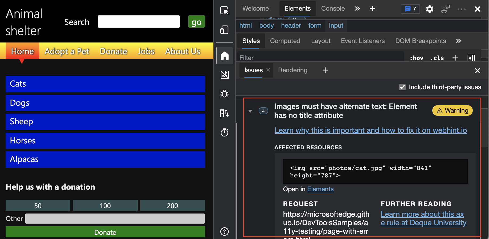
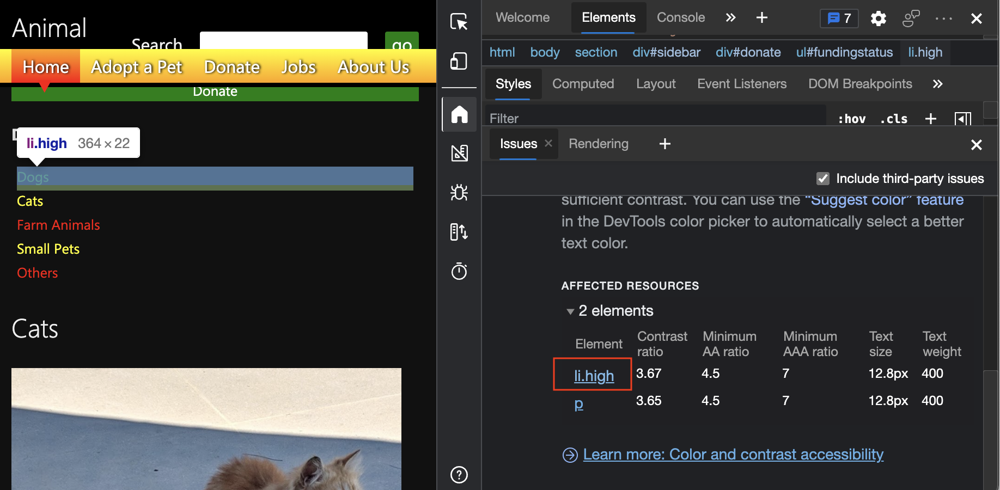
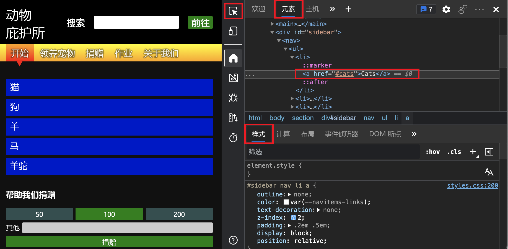
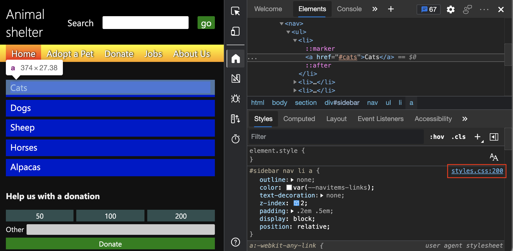
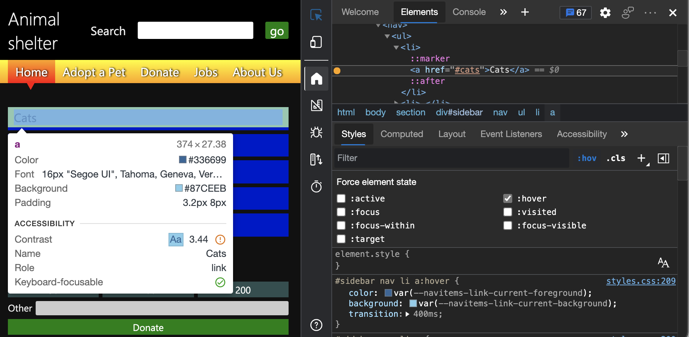

# <a name="overview-of-accessibility-testing-using-devtools"></a>使用 DevTools 的辅助功能测试概述

本文介绍可以在 DevTools 中用于测试辅助功能问题的一些功能。  我们将使用 DevTools 的不同功能来检测演示页中的辅助功能问题，并讨论如何解决这些问题。

1. 在新窗口或选项卡中打开 [辅助功能测试演示页](https://microsoftedge.github.io/Demos/devtools-a11y-testing/) ：

   

1. 右键单击演示网页中的任意位置，然后选择 **“检查**”。  DevTools 将在网页旁边打开。


<!-- ====================================================================== -->
## <a name="automated-testing-by-using-the-issues-tool"></a>使用“问题”工具进行自动测试

在浏览器中打开演示页并打开 DevTools 时，请注意，问题 **计数器**中会自动检测到某些问题。  单击 **“问题”计数器** () 打开 **“问题** ”工具以查看问题和详细信息：


在本文中，我们将重点介绍 **“问题**”工具的**辅助功能**部分：


有关详细的演练步骤， [请参阅“问题”工具的“辅助功能”部分](test-issues-tool.md#view-the-accessibility-section-of-the-issues-tool)。


### <a name="automatically-checking-that-input-fields-have-labels"></a>自动检查输入字段是否具有标签

显示的第一个警告是 `Form elements must have labels: Element has no title attribute. Element has no placeholder attribute`。  展开此部分，然后单击 **“在元素中打开”** 链接时，“ **元素”** 工具随即打开，该元素在 DOM 树中突出显示。  “ **样式”** 选项卡显示应用于元素的 CSS。

有关详细的演练步骤，请参阅 [验证输入字段是否具有标签](test-issues-tool.md#verify-that-input-fields-have-labels)：


在这种情况下，HTML 具有 `label` 不起作用的元素。

```html
<label>Search</label>
<input type="search">
<input type="submit" value="go">
```

此处`label`的元素使用错误，因为元素与`input`元素之间`label`没有连接。  单击 **搜索** 标签时，有效的 HTML 标签会将焦点放在搜索输入文本框上。

可以通过嵌套`input`元素中的`label`元素或添加指向`for`元素属性的`input`属性来`id`解决此问题。  若要查看正确的连接，请单击捐赠窗体上 **的其他** 标签。

还可以单击 **“问题** ”工具中的解释性链接来获取此信息：


### <a name="automatically-checking-that-images-have-alt-text"></a>自动检查图像是否具有替换文字

另一个自动检测到的问题是页面中的许多图像没有任何替代文本。  如果展开 `Images must have alternate text: Element has no title attribute` 警告，则会收到四个存在该问题的图像实例：



有关详细的演练步骤，请参阅 [验证图像是否具有替换文字](test-issues-tool.md#verify-that-images-have-alt-text)。


### <a name="automatically-checking-that-text-colors-have-enough-contrast"></a>自动检查文本颜色是否有足够的对比度

当页面上的两个元素没有足够的对比度时，“ **问题** ”工具还会报告：


**“问题**”工具提供警告的详细说明。  向下钻取时，将获取有此问题的元素的列表。  在 **“问题”** 工具中，单击指向元素的链接将突出显示呈现页面上的该元素：



有关详细的演练步骤，请参阅 [验证文本颜色是否有足够的对比度](test-issues-tool.md#verify-that-text-colors-have-enough-contrast)。


### <a name="verify-that-the-webpage-layout-is-usable-when-narrow"></a>验证网页布局在缩小时是否可用

<!-- corresponding how-to article: narrow.md -->

辅助功能的一个重要部分是确保网站在狭窄的视区上运行良好。 许多用户需要缩放页面才能使用它，这意味着已经没有太大的空间了。  如果空间不足，多列布局应变成单列布局，内容按可理解的顺序放置。 这意味着将最重要的内容放在页面顶部，并将其他内容放在页面下方。

通过缩小浏览器窗口并使用箭头键滚动页面，可以看到演示页的顶部导航栏存在一些辅助功能问题。  顶部导航栏与 **搜索** 窗体重叠，如上图所示，需要修复该问题。


#### <a name="device-emulation-tool-to-test-narrow-viewports"></a>用于测试窄视区的设备仿真工具

可以通过调整浏览器窗口的大小来模拟窄视区，但测试设计响应能力的更好方法是使用 **设备仿真** 工具。  下面是 **设备仿真** 工具的一些功能，可帮助你查找任何网站的辅助功能问题：

*  无需调整浏览器窗口的大小，请调整页面大小并测试 [CSS 媒体查询](../device-mode/index.md#show-media-queries) 是否触发布局更改。

*  检查使用鼠标的依赖项。 默认情况下， **设备仿真** 假定触摸设备。 这意味着依赖于悬停交互的产品的任何功能都不起作用。

*  通过模拟不同的设备、缩放级别和像素比率进行视觉测试。

*  测试产品在不可靠的连接或用户脱机时的行为方式。  在连接缓慢时显示与用户最重要的交互也是辅助功能的注意事项。

若要详细了解 **设备仿真** 工具，请 [参阅模拟移动设备 (设备仿真) ](../device-mode/index.md)。


### <a name="wavy-underlines-in-the-dom-tree-indicate-automatically-detected-issues"></a>DOM 树中的波浪下划线指示自动检测到的问题

**Elements** 工具中的 DOM 树通过添加波浪下划线自动直接标记 HTML 中的问题。  如果任何具有波浪下划线的元素，将打开 **“问题”** 工具：`Shift`+`click`


**问题**工具发现的这些问题是一些相对明显的辅助功能问题，可以避免。  使用 **“问题** ”工具及其引导式解释来修复它们，可让你在走向可访问产品的道路上前进。


<!-- ====================================================================== -->
## <a name="limits-of-automated-testing"></a>自动测试的限制

[问题工具](../issues/index.md)、[辅助功能Insights](https://accessibilityinsights.io)和 [Lighthouse](https://developer.chrome.com/docs/lighthouse/overview/) 是自动为网页生成辅助功能报告的工具。  从此类工具获取自动报表只是辅助功能测试旅程的开始。

辅助功能是关于人际交互的， 不同需求的人在各种技术环境中使用你的产品。  此测试不能完全自动化，但需要由导航产品的人进行验证。  在最佳方案中，可以访问具有不同辅助功能需求的测试人员和使用各种环境的测试人员。  但是，通过使用键盘导航和检查页面的不同部分，你已可以自行执行很多操作。

在演示页上，还有一些自动测试无法检测到的其他问题，包括：

*  与页面交互后出现的问题。
*  与显示中的更改相关的问题，例如使窗口变窄。

其中一个问题是捐赠表。  使用鼠标时，可以单击不同的选项来捐款。  但是，当你尝试使用键盘访问捐赠表单时，不会发生任何情况。 若要解决此问题，需要使用 **“检查** ”工具：


<!-- ====================================================================== -->
## <a name="using-the-inspect-tool-to-detect-accessibility-issues"></a>使用“检查”工具检测辅助功能问题

使用 **“检查** ”工具通过将鼠标悬停在网页的各个部分来检测辅助功能问题。  **检查** () 工具位于 DevTools 的左上角。  单击“检查”工具按钮打开“ **检查** ”工具：


单击“ **检查** ”工具按钮后，可以将指针移到呈现的页面上的任何元素上。  “检查”工具将元素的布局显示为多色弹性框覆盖，并将元素详细信息显示为类似于工具提示的信息覆盖：


检查工具的 **辅助功能** 部分包括 **对比度** 行（如果适用）：


有关详细的演练步骤，请参阅 [使用颜色突出显示标识嵌套区域](test-inspect-tool.md#identify-nested-regions-using-color-highlighting)。<!-- = test-inspect-tool.md##identify-nested-regions-using-color-highlighting -->  有关“检查”工具的主要文章是 [使用“检查”工具分析 HTML 页面](../css/inspect.md)。

**检查**工具信息覆盖的上半部分显示以下信息：

* 布局类型;如果使用弹性框或网格定位元素，则会看到适当的图标 ().
* 元素的名称，例如 **a**、 **h1** 或 **div**。
* 元素的维度（以像素为单位）。
* 颜色，作为颜色监视器 (一个小的彩色方形) 和格式化值 (如 `#336699`) 。
* 字体信息 (大小和字体系列) 。
* 边距和填充，以像素为单位。

以下部分介绍了 **“检查**”覆盖的**辅助功能**部分。


### <a name="checking-individual-elements-for-text-contrast-screen-reader-text-and-keyboard-support"></a>检查单个元素以获取文本对比度、屏幕阅读器文本和键盘支持

**检查**覆盖的**辅助功能**部分包含以下行：

*  **对比** 度定义具有低视力的人是否可以理解元素。
    *  [WCAG 准则](https://www.w3.org/TR/WCAG21/)定义的[对比度](https://www.w3.org/TR/WCAG21/#dfn-contrast-ratio)表示文本和背景颜色之间是否有足够的对比度。  绿色复选标记图标指示有足够的对比度，橙色感叹号图标指示没有足够的对比度。

*  **名称** 和 **角色** 指示辅助技术（如屏幕阅读器）将报告有关该元素的信息。
    *  **名称**是元素的`a`文本内容。  对于元素 `<a href="/">About Us</a>`，检查工具中显示的 **名称** 是“关于我们”。
    *  元素 **的角色** 。  **角色**通常是元素名称，例如`article`， `img` `link``heading`或 。  这些 `div` 元素和 `span` 元素表示为 `generic`。

*  **键盘可聚焦** 指示用户是否可以使用鼠标以外的输入设备访问该元素。
    *  绿色复选标记图标指示元素可对键盘聚焦。
    *  带有对角线的灰色圆表示元素不可键盘聚焦。

有关详细的演练步骤，请参阅 [检查文本对比度、屏幕阅读器文本和键盘支持的各个元素](test-inspect-tool.md#check-individual-elements-for-text-contrast-screen-reader-text-and-keyboard-support)。


### <a name="using-the-inspect-tool-to-hover-over-the-webpage-to-highlight-the-dom-and-css"></a>使用“检查”工具将鼠标悬停在网页上以突出显示 DOM 和 CSS

使用 **“检查** ”工具时，单击呈现的页面上的元素将打开 **“元素”** 工具。  DOM 树显示元素的 HTML， **样式** 显示应用于元素的 CSS 属性：



使用 **“检查** ”工具时，当将鼠标悬停在呈现页面的不同部分并打开 **“元素** ”时，你会注意到 DOM 树会自动刷新。

有关详细的演练步骤，请参阅 [使用“检查”工具将鼠标悬停在网页上，以突出显示 DOM 和 CSS](test-inspect-tool.md#use-the-inspect-tool-to-hover-over-the-webpage-to-highlight-the-dom-and-css)。  有关“检查”工具的主要文章是 [使用“检查”工具分析 HTML 页面](../css/inspect.md)。


<!-- ====================================================================== -->
## <a name="verify-keyboard-support-by-using-the-tab-and-enter-keys"></a>使用 Tab 和 Enter 键验证键盘支持

并非所有人都使用指针或触摸设备，有些人的视力可能很低。 若要满足这些方案的需求，请确保 UI 使用键盘。

可以使用键盘测试如何通过使用 `Tab` 或 `Shift+Tab` 从元素跳转到元素来导航页面。  如果按 `Tab` 在演示页上，接收焦点的第一件事就是页面标题中的 **“搜索** ”窗体。  即使使用“**问题**”工具，即使前面发现了标签问题，按`Enter`甚至可以提交表单，这样就可以正常工作。

有关详细的演练步骤，请参阅 [使用 Tab 和 Enter 键检查键盘支持](test-tab-enter-keys.md)。

按下 `Tab` 时 `Enter`，获得焦点的下一个元素是页面内容部分中的第一个 **更多** 链接，如大纲所示：


经过最后一个 **“更多** ”链接后，页面将向上滚动，目前还不清楚哪个元素具有焦点。

如果查看屏幕左下角，或者使用屏幕阅读器，则可以判断侧栏导航菜单中的蓝色 **猫** 链接具有焦点，因为浏览器显示 URL `#cats`：


再次按 `Tab` 下将转到捐赠表单的输入文本框。  但是，无法访问输入文本框上方的 **50**、 **100** 或 **200** 个按钮。  此外，当焦点位于该输入文本框上时，按 `Enter` 不提交窗体：


再次按 `Tab` 下将焦点放在顶部导航栏上，可在其中按 `Enter` 下以转到页面的不同部分或网站的不同页面。  你知道你使用的是哪个元素，因为有一个焦点轮廓。  若要单击顶部导航栏中的链接，请使用 `Tab` 或 `Shift+Tab` 将焦点放在链接上，然后按 `Enter`下：


我们在此处发现了一些需要解决的问题：

* 使用键盘在页面上四处移动时，边栏导航菜单不显示焦点所在 `Tab` 用户。
* 在捐赠窗体上，使用键盘时，**50、 **100、** 和 200** 个按钮和窗体提交功能不起作用。
* 键盘选项卡顺序不正确。 该 `Tab` 密钥在边栏导航菜单前浏览页面上的所有 **“更多** ”链接。  此 `Tab` 顺序没有帮助，因为边栏导航旨在将你带到该页面的不同部分。

让我们使用 DevTools 分析这些问题。


<!-- ====================================================================== -->
## <a name="analyze-keyboard-accessibility-issues-using-devtools"></a>使用 DevTools 分析键盘辅助功能问题


### <a name="analyzing-the-lack-of-indication-of-keyboard-focus-in-the-sidebar-menu"></a>分析侧栏菜单中缺少键盘焦点指示

若要找出侧栏导航未按预期优化以用于键盘的原因，请首先使用 **“检查** ”工具突出显示边栏导航菜单中的链接，然后在 DOM 树中向下钻取到 `a` 元素：



在“ **样式”** 选项卡中，可以看到应用于链接的 CSS，如果单击链接， `styles.css`文件将在 **“源** ”工具中打开：


在上面的示例中，使用鼠标时，页面的样式在菜单项上包含一个 `hover` 状态，但键盘用户的 CSS 中没有 `focus` 状态。

此外，在此示例中，链接使用 `outline: none`。 此样式用于删除浏览器在具有焦点和使用键盘时自动添加到元素的大纲。  若要避免此问题，请勿使用 `outline: none`。

有关详细的演练步骤，请参阅 [边栏菜单中缺少键盘焦点指示的分析](test-analyze-no-focus-indicator.md)。


### <a name="analyzing-the-lack-of-keyboard-support-in-the-donation-form"></a>分析捐赠窗体中缺少键盘支持

捐赠窗体上的按钮是使用 `div` 元素实现的，自动测试工具不会将该元素识别为窗体上的控件。

若要对此进行调查，可以使用 **“检查** ”工具将鼠标悬停在捐赠表单的按钮上。  结果是，它们中没有一个是可键盘访问的，如信息覆盖的 **键盘可聚焦** 行上的灰色环所示。  如信息覆盖的 **“名称**和**角色**”行中所示，捐赠窗体的按钮也没有名称，并且具有 (表示`div`或`span`元素) 的角色`generic`，这意味着辅助技术无法访问它们：


有关详细的演练步骤，请参阅 [分析窗体中缺少键盘支持](test-analyze-no-keyboard-support.md)。

如果单击 **“捐赠** ”按钮，“ **检查** ”工具将转到 **“元素** ”工具并显示窗体的 HTML。

```HTML
<div class="donationrow">
    <div class="donationbutton">50</div>
    <div class="donationbutton">100</div>
    <div class="donationbutton">200</div>
</div>
<div class="donationrow">
    <label for="freedonation">Other</label>
    <input id="freedonation" class="smallinput">
</div>
<div class="donationrow">
    <div class="submitbutton">Donate</div>
</div>
```

这些元素和`input`元素的`label`使用是有效的，这会导致标签按预期工作，并且`input`文本框可以使用键盘。  窗体的其余部分使用 `div` 元素，这些元素易于设置样式，但没有语义含义。

接下来，让我们分析窗体的 JavaScript 功能。 在 **“元素**”中，单击 **“事件侦听器”** 选项卡以分析窗体的 JavaScript：


在 **“事件侦听器”** 选项卡上 `buttons.js:18` ，单击链接以打开 **“源** ”工具，然后检查负责窗体功能的 JavaScript：


建议将事件与按钮配合使用 `click` ，因为 `click` 事件同时适用于鼠标指针和键盘。  但是，由于 `div` 元素无法通过键盘访问，并且 **“捐赠** ”按钮作为 `div` 元素实现，因此此 JavaScript 仅在使用鼠标时运行。

`div`使用“按钮”是一个经典示例，其中需要额外的 JavaScript 来创建元素提供的功能`button`。 因此，这会导致无法访问的体验。


### <a name="checking-the-accessibility-tree-for-keyboard-and-screen-reader-support"></a>检查辅助功能树是否支持键盘和屏幕阅读器

使用 **“检查** ”工具单独检查页面上的每个元素非常耗时。  请改用 **“辅助功能”** 选项卡导航页面的 **辅助功能树**。  辅助功能树指示页面为辅助技术（如屏幕阅读器）提供的信息：


树中没有名称或角色 `generic`的任何元素都是一个问题，因为该元素对键盘用户或使用辅助技术的用户不可用。

有关详细的演练步骤，请 [参阅“检查辅助功能树”以获取键盘和屏幕阅读器支持](test-accessibility-tree.md)。


### <a name="analyzing-the-order-of-keyboard-access-to-sections-of-the-page"></a>分析对页面部分的键盘访问顺序

另一个问题是页面上的选项卡顺序不明确。  只有在在整个页面中选中“ **更多”** 链接后，键盘用户才到达边栏导航菜单。  在此示例中，边栏导航菜单旨在成为该页面不同部分的快捷方式。  此选项卡顺序会导致用户体验不佳。

造成混乱 `Tab` 的原因是它是由文档的源顺序决定的。  选项卡顺序也可以通过在元素上使用 `tabindex` 属性来修改，该属性将该元素从默认源顺序中取出。

在文档的源代码中，边栏导航菜单显示在页面的主要内容之后。  边栏导航菜单显示在页面的主要内容上方，只是因为边栏导航菜单已使用 CSS 进行定位。

文档的源顺序对于辅助技术非常重要，并且可能不同于在呈现的页面上显示元素的顺序。  使用 CSS，可以以视觉方式对页面元素进行重新排序，但这并不意味着辅助技术（如屏幕阅读器）将以与 CSS 相同的顺序表示页面元素。

可以在**辅助功能**选项卡中使用 **“源订单查看器**”测试页面元素的顺序。 一直向下滚动，然后选中 **“显示源订单**”复选框。  现在，在 **Elements** 工具中导航 DOM 树（例如单击 `header` 元素）时，数字覆盖将显示在表示源顺序的呈现页面的各节上：


有关详细的演练步骤，请参阅 [使用源订单查看器的测试键盘支持](test-tab-key-source-order-viewer.md)。


<!-- ====================================================================== -->
## <a name="testing-contrast-of-text-colors-in-various-states"></a>测试不同状态下文本颜色的对比度

“ **检查** ”工具一次报告一个状态的辅助功能问题。  首先，我们将介绍使用“检查”工具仅查看页面元素的静态状态的限制。  然后，我们将通过单击“样**式**”选项卡上的 **\：hov (“切换元素状态”) **，以显示标记为 **Force 元素状态**的复选框部分，来说明如何检查页面元素的其他状态。

### <a name="checking-text-color-contrast-in-the-default-state"></a>检查默认状态下的文本颜色对比度

除了 **问题** 工具中的自动颜色对比度测试外，还可以使用 **“检查** ”工具检查各个页面元素是否有足够的对比度。  如果有对比度信息可用， **则检查** 覆盖显示对比度和复选框项。

绿色复选标记图标指示有足够的对比度，橙色警报图标指示的对比度不够。  例如，边栏导航菜单中的链接具有足够的对比度，如绿色复选标记图标所示：


在 **“检查** ”覆盖层中，警告将标记一个没有足够的对比度元素。  例如，“**捐赠状态**”部分中的绿色**狗**列表项没有足够的对比度，如 **“检查**”覆盖层中所示。  覆盖层显示一个橙色圆圈感叹号：


以这种方式使用 **“检查** ”工具不会完全测试元素。 页面上的元素可能具有不同的状态，所有这些状态都需要测试。 例如，如果将鼠标悬停在侧栏导航菜单上，请注意更改链接颜色的动画：


### <a name="verify-accessibility-of-all-states-of-elements-such-as-the-contrast-on-hover"></a>验证元素的所有状态（例如悬停时的对比度）的可访问性

使用 DevTools 时，需要模拟元素的所有状态，因为 **“检查** ”工具不会同时显示所有状态的信息。

在此示例中，使用 **“检查** ”工具时，无法访问 `hover` 侧栏导航菜单上的 **“猫** ”链接的状态，以分析处于某个状态的 `hover` 对比度比率，因为 `hover` 不会触发样式中的状态。  相反，需要使用“**样式**”选项卡中的状态模拟来模拟 **“猫**”菜单项的状态。

有关详细的演练步骤，请 [参阅验证所有元素状态的辅助功能](test-inspect-states.md)。

打开 **“检查** ”工具，然后在呈现的页面中，单击侧栏导航菜单中的蓝色 **猫** 链接。  **“元素**”工具随即打开，`a`其中在 DOM 树中选择了元素。  如果需要，请在 DOM 树中导航到 CSS 中具有 `hover` 状态的元素。  在这种情况下，该 `a` 元素具有以下 `hover` 状态：


On the **Styles** tab, click the **\:hov (Toggle Element State)** button.  然后使用 **Force 元素状态** 复选框来选择要模拟的状态：


选择 **\：hover** 复选框。  DOM 元素旁边现在显示一个黄色点，指示 DOM 元素具有模拟状态。  此外，侧栏导航菜单中的 **“猫** ”链接现在在页面中突出显示，就像鼠标指针悬停在它上面一样：


应用模拟状态后，当用户将鼠标悬停在元素上时，可以再次使用 **“检查** ”工具检查元素的对比度。  在这种情况下，对比度不够高：



状态模拟也是检查是否考虑了不同用户需求的好方法。  对于边栏导航菜单，可以检测状态 `:focus` 是否存在对比度问题。


<!-- ====================================================================== -->
## <a name="use-the-rendering-tool-to-test-accessibility-for-visual-impairment"></a>使用呈现工具测试可视化障碍的辅助功能

### <a name="check-contrast-issues-with-dark-theme-and-light-themes"></a>检查深色主题和浅色主题的对比度问题

在颜色辅助功能方面，另一个注意事项是，可能需要测试不同的主题来测试对比度问题。  大多数操作系统都具有深色模式和浅色模式。  网页可以使用 CSS 媒体查询对这些不同的设置做出反应。

此演示页具有浅色和深色主题。  可以通过在**渲染**工具中使用[深色或浅色方案模拟](preferred-color-scheme-simulation.md)来测试这两个主题，而无需更改操作系统。  到目前为止，本文使用深色主题设置查看了带有操作系统的演示页。  如果我们改为模拟浅色方案，然后刷新页面，“ **问题”** 工具会显示六个颜色对比度问题，而不是两个颜色对比度问题。

有关详细的演练步骤，请参阅 [检查深色主题和浅色主题的对比度问题](test-dark-mode.md)。

切换到 **呈现** 工具中的浅色主题时，将报告以下问题：

*  由于对浅色主题的更改，检测到新的对比度问题：

   

*  由于对比度问题，页面的 **“捐赠状态”** 部分在浅色模式下不可读：

   


### <a name="verify-that-the-webpage-is-usable-by-people-with-color-blindness"></a>验证网页是否可由色盲患者使用

不同的捐赠州使用颜色 (红色、绿色、黄色) 作为区分资金状态的唯一手段。  不过，不能指望所有用户都能按预期体验这些颜色。  如果使用 DevTools 的 [视觉缺陷仿真](emulate-vision-deficiencies.md) 功能，可以通过模拟具有不同视觉的人如何看待你的设计来发现这还不够好。  有关详细的演练步骤，请参阅 [验证页面是否可供色盲者使用](test-color-blindness.md)：


### <a name="verify-that-the-webpage-is-usable-with-blurred-vision"></a>验证网页是否可使用模糊视觉

**呈现**工具的另一个有趣功能是可以模拟模糊的视觉。  如果我们从 **“模拟视觉缺陷**”下拉列表中选择 **“模糊视觉**”选项，则可以看到上部菜单中文本上的下拉阴影使得阅读菜单项变得困难。
有关详细的演练步骤，请参阅 [验证页面是否可用于模糊的视觉](test-blurred-vision.md)：


### <a name="verify-that-the-page-is-usable-with-ui-animation-turned-off-reduced-motion"></a>验证页面是否可用，UI 动画已关闭 (运动) 

现在操作系统附带的另一个设置是关闭动画的一种方式。  动画可以帮助产品的可用性，但它们也会导致很多问题，从混乱到恶心。 因此，你的产品不应向在操作系统中关闭动画的用户显示动画。  通过使用 CSS 媒体查询，可以检查用户是否想要查看动画，并相应地将其关闭。  而且，就像使用深色和浅色模式一样，有一种方法 [可以使用 DevTools 模拟运动减少](reduced-motion-simulation.md)。

在此处的演示页中，单击侧栏导航菜单的不同部分时，关闭动画将停止页面的平滑滚动。  这是通过在媒体查询中包装 CSS 中的平滑滚动设置来实现的：


```css
@media (prefers-reduced-motion: no-preference) {
  html {
    scroll-behavior: smooth;
  }
}
```

此 CSS 媒体查询有条件地运行“平滑滚动”动画。  但是，即使用户不想看到动画，顶部导航栏、边栏导航菜单和 **更多** 链接的动画仍会运行。 这些其他动画需要有条件地运行，例如通过添加其他媒体查询。

有关详细的演练步骤，请参阅 [验证页面是否可用，UI 动画已关闭](test-reduced-ui-motion.md)。


<!-- ====================================================================== -->
## <a name="what-to-do-next"></a>接下来该怎么办？

我们介绍了许多可用于确保你在产品中遇到辅助功能问题的工具。  此类工具的范围从自动检查和手动详细信息检查到模拟不同的状态和环境。  辅助 [功能测试功能](reference.md)汇总了这些工具。  自动化工具找不到产品中的所有问题，因为许多辅助功能障碍仅在交互式使用期间显示。

这些工具都不能将适当的产品测试替换为使用辅助技术并遵循检查所有所需测试的计划的人员。 还可以使用[辅助功能Insights](https://accessibilityinsights.io)的[评估](https://accessibilityinsights.io/docs/en/web/getstarted/assessment/)功能。  可能需要执行其他检查，例如：

* 放大时进行测试。
* 使用屏幕阅读器进行测试。
* 使用语音识别进行测试。
* 在高对比度模式下进行测试。

了解如何改进网页的另一种方法是使用 [webhint 扩展进行Visual Studio Code](https://aka.ms/webhint4code)。  此扩展标记源代码中容易检测到的辅助功能问题，并提供有关如何解决这些问题的见解：


