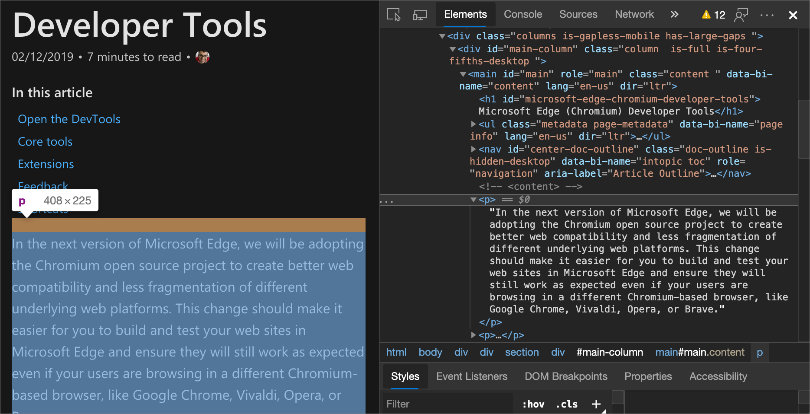
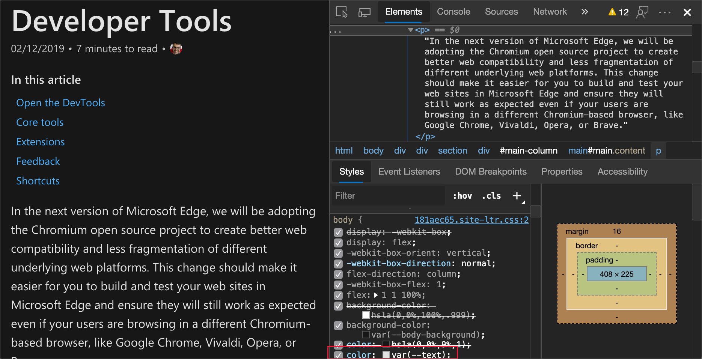
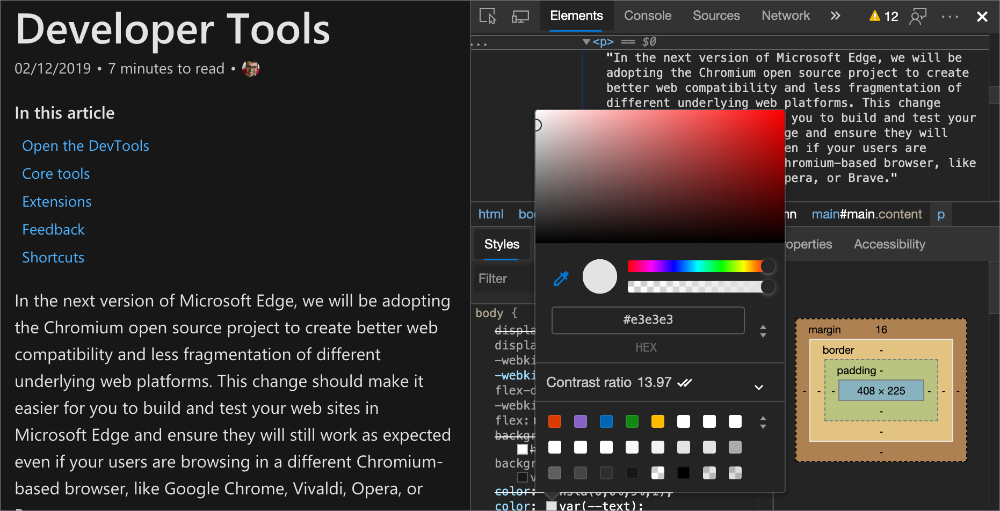
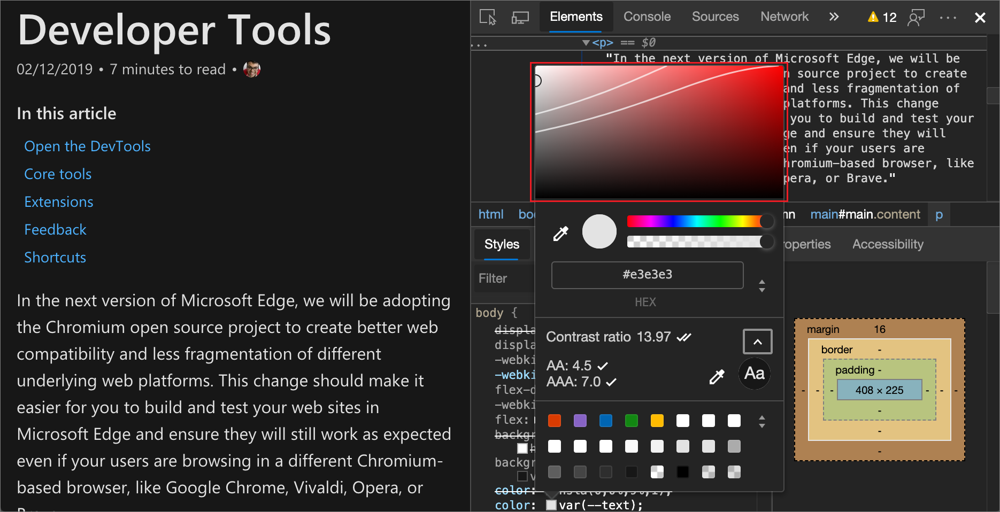

<!-- this article was created on 05/11/2021 by moving a section out from the "Accessibility reference" article (reference.md) -->
<!-- Copyright Kayce Basques

   Licensed under the Apache License, Version 2.0 (the "License");
   you may not use this file except in compliance with the License.
   You may obtain a copy of the License at

       https://www.apache.org/licenses/LICENSE-2.0

   Unless required by applicable law or agreed to in writing, software
   distributed under the License is distributed on an "AS IS" BASIS,
   WITHOUT WARRANTIES OR CONDITIONS OF ANY KIND, either express or implied.
   See the License for the specific language governing permissions and
   limitations under the License.  -->
# 使用颜色选取器测试文本颜色对比度

视力低下的人可能看不到非常明亮或非常黑暗的区域。  一切往往显示在相同的亮度水平，这使得很难区分轮廓和边缘。

对比率测量文本的前景和背景的亮度差。  如果文本的对比度较低，则视力低下的人可能会将您的网站视为空白屏幕。

在 DevTools 中，查看文本元素的对比度比率的一种方法是使用“**元素**”工具的“**样式**”选项卡中的[颜色选取器](../css/reference.md#change-colors-with-the-color-picker)。  颜色选取器可帮助验证文本是否满足建议的对比度级别。

**若要使用颜色选取器检查文本颜色对比度：**

1. 在 DevTools 中，选择 **“元素”** 工具。

1. 在 **DOM 树**中，选择要检查的文本元素。

   

1. 在“ **样式”** 选项卡上，找到应用于元素的 **颜色** 属性，然后选择颜色属性旁边的 **颜色** 方块。

   

1. 检查颜色选取器的 **对比度** 部分。  一个复选标记表示元素符合 [最低建议](https://www.w3.org/WAI/WCAG21/quickref/#contrast-minimum)。  两个复选标记表示它符合 [增强的建议](https://www.w3.org/WAI/WCAG21/quickref/#contrast-enhanced)。

   

1. 有关详细信息，请选择 **“对比度”** 部分进行扩展。  在颜色选取器顶部的视觉选取器中，将显示两行，在视觉对象选取器上运行，以及当前颜色的圆圈。  如果当前颜色符合建议，则该行的同一侧任何内容也符合建议。  如果当前颜色不符合建议，则同一侧的任何内容也不满足建议。

   

1. 若要尝试不同的颜色，请单击视觉对象选取器，或选择颜色选取器底部的颜色监视器。

<!-- ====================================================================== -->
## 另请参阅

* 使用 _CSS 功能参考_中的[颜色选择器更改颜色](../css/reference.md#change-colors-with-the-color-picker)

<!-- ====================================================================== -->
> [!NOTE]
> 此页面的某些部分是根据 [Google 创建和共享的](https://developers.google.com/terms/site-policies)作品所做的修改，并根据[ Creative Commons Attribution 4.0 International License ](https://creativecommons.org/licenses/by/4.0)中描述的条款使用。
> 原始页面位于[此处](https://developers.google.com/web/tools/chrome-devtools/accessibility/reference)，由 [Kayce Basques](https://developers.google.com/web/resources/contributors/kaycebasques)\（Chrome DevTools 和 Lighthouse 的技术作家）撰写。

本作品根据[ Creative Commons Attribution 4.0 International License ](https://creativecommons.org/licenses/by/4.0)获得许可。
