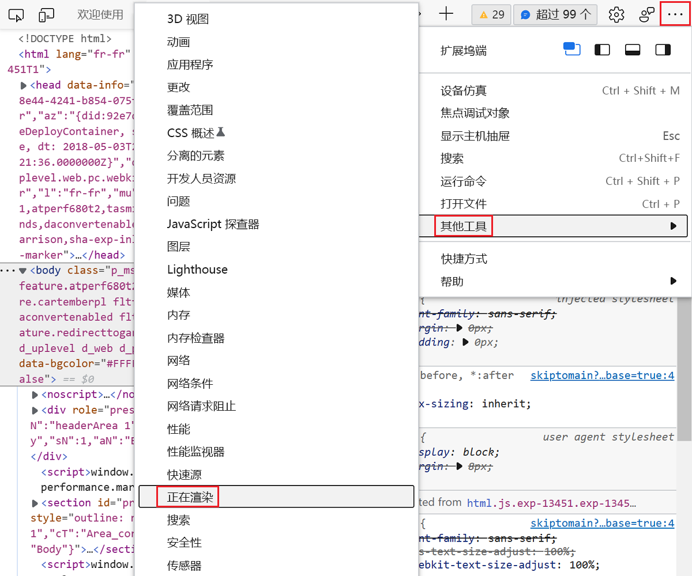
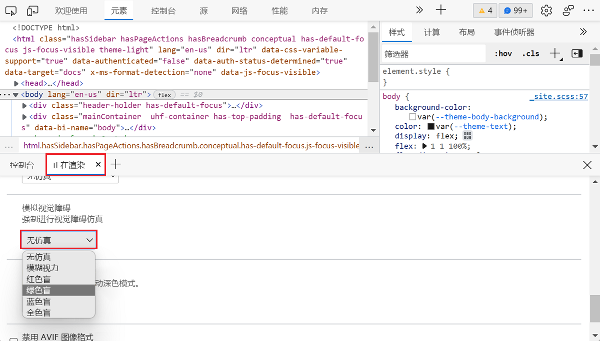
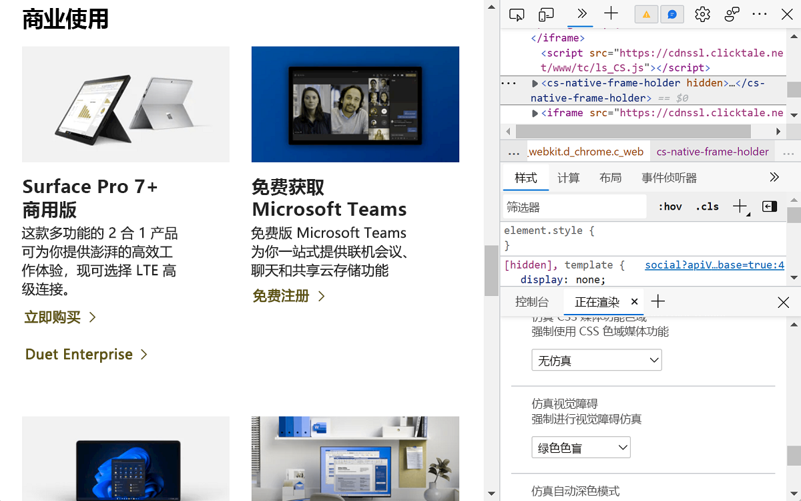
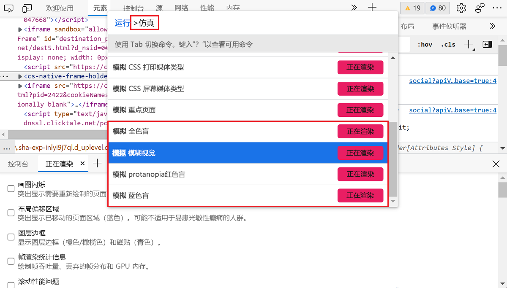

# 模仿视觉缺陷

为了更好地满足色盲用户 (色盲) 或模糊视觉Microsoft Edge[开发人员工具](../index.md)允许你模拟模糊的视觉和特定的颜色视觉缺陷。  模拟 **视觉缺陷工具** 可模拟以下类别：

| 色盲 | 详细信息 |
|:--- |:--- |
| 模糊的视觉 | 用户很难专注于细节。 |
| 红色盲 | 用户无法感知任何红色光。 |
| 绿色盲 | 用户无法感知任何绿色光。 |
| 黄蓝色盲 | 用户无法感知任何蓝色光。 |
| 全色盲 | 用户无法感知任何颜色，这会降低所有颜色为灰色底纹。 |

" **模拟视觉缺陷"** 工具模拟每个缺陷人士可能如何查看你的产品的近似值。  每个人是不同的，因此视觉缺陷的严重性因人而异。  为了更好地满足用户的需求，请避免任何可能导致问题的颜色组合。  模拟 **视觉缺陷** 工具不会提供产品的完整辅助功能评估，而是提供避免问题的一个很好的第一步。

<!-- ====================================================================== -->
## 打开呈现工具

若要模拟有视力缺陷的人看到你的网页，请打开 [呈现工具](../rendering-tools/index.md)。

1. 单击 **"自定义"，并控制** () `...` 的 DevTools 控件。

1. 转到 **"更多工具** > **""** 呈现"以在箱 **中** 打开"呈现"面板。

   > [!div class="mx-imgBorder"]
   > 

1. 向下滚动到" **模拟视觉缺陷"** 部分，单击"无 **模拟** "下拉列表并选择一个选项。

   > [!div class="mx-imgBorder"]
   > 

1. 浏览器窗口模拟当前页面上所选的视觉缺陷。

   > [!div class="mx-imgBorder"]
   > 

<!-- ====================================================================== -->
## 使用命令菜单

作为替代方法，可以使用命令 **菜单** 访问不同的模拟。

1. 按 `Ctrl`+`Shift``P`+ (Windows/Linux) 或 (`Command``Shift`++`P` macOS) 打开命令**菜单**。

1. 键入 `emulate`，选择要模拟的视觉缺陷的类型，然后按 `Enter`。

   > [!div class="mx-imgBorder"]
   > 

<!-- ====================================================================== -->
## 另请参阅

*  [验证页面是否在视觉模糊时可用](test-blurred-vision.md)
