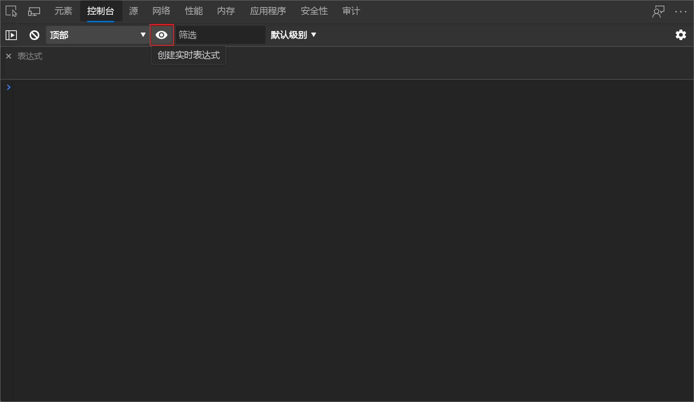

<!-- Copyright Kayce Basques

   Licensed under the Apache License, Version 2.0 (the "License");
   you may not use this file except in compliance with the License.
   You may obtain a copy of the License at

       https://www.apache.org/licenses/LICENSE-2.0

   Unless required by applicable law or agreed to in writing, software
   distributed under the License is distributed on an "AS IS" BASIS,
   WITHOUT WARRANTIES OR CONDITIONS OF ANY KIND, either express or implied.
   See the License for the specific language governing permissions and
   limitations under the License.  -->
# 跟踪哪些元素有焦点

假设您正在测试页面的键盘导航辅助功能。  通过按 `Tab` `Shift`+`Tab`和 导航呈现的网页时，网页中的焦点圈指示器有时会消失，因为具有焦点的元素已被隐藏。  解决方案是在 DevTools **控制台**中创建一个 Live Expression，然后观察该动态表达式，然后右键单击它以展开 **"元素** "工具中的 DOM 树。

这就是确定已 `Tab` 使用该键导航到页面中的哪个项的方式，即使具有焦点的元素已被隐藏且未显示在呈现的页面上。

在浏览 `Tab` 页面时，DOM 树不会自动更新为选择相应的 DOM 树节点。  但 Live Expression 输出会发生更改，至少当您从一种页面元素转到另一种页面元素时。  若要了解`Tab`键具有哪个确切元素已聚焦 (而不只是聚焦哪种类型的元素 __) ，请右键单击 Live Expression) 下面的 Live Expression (的结果，以转到 **"** 元素"工具中的 DOM 树的特定节点。

## 定义 Live Expression 以能够确定哪个 DOM 节点具有焦点

若要使用 `Tab`Live 表达式跟踪 DevTools 中控制台中的 -focused 元素：****

1. 打开 [新窗口或选项卡中的](https://microsoftedge.github.io/Demos/devtools-a11y-testing/) 辅助功能测试演示网页。

1. 右键单击网页中的任意位置，然后选择"检查 **"**。  或者，按 `F12`。  将在网页旁边打开 DevTools。

1. 在 DevTools 中，打开 **控制台**。

1. 单击 **"创建实时表达式 (**。) 。

   

1. 键入以下内容： **document.activeElement**

1. 单击 Live Expression UI **外部** 以保存 Live Expression。

1. 单击呈现的网页以将焦点 `Tab` 放在该网页上，然后按 或 `Shift`+`Tab` 在呈现的网页中四处移动焦点。

   下面显示的值 `document.activeElement` 是表达式的结果。  它不会每次在网页 `Tab` 中新 UI 项时明显更改;当您移动到新类型的页面元素时，它会明显更改。

   由于该表达式 `document.activeElement` 实时更新，因此其输出结果始终表示当前聚焦的元素，因此你现在有一种方法可以始终在 DevTools **控制台**中跟踪哪个元素具有焦点。  需要右键单击 Live Expression 输出，如下所示：

1. 在 DevTools **控制台中**，将鼠标悬停在 Live Expression `document.activeElement` (下 Live Expression) 。

   焦点元素在视口中突出显示 (，即，在呈现的网页集中) 。

1. 在 DevTools **控制台**中，右键单击 Live Expression (下 Live Expression `document.activeElement`) ，然后选择"元素"面板中的" **展示"**。 

   在" **元素** "工具中，DOM 树会自动展开并选择活动元素 (DOM 树节点) 。  _活动元素_是您通过按 和 导航到的网页项的 DOM 树表示`Tab``Shift`+`Tab`形式。

   <!-- Another right-click command on the Live Expression result is **Store outerHTML as global variable**, which is different than the command discussed below.  If you select that command, an expandable element such as `<input id="freedonation" class="smallinput">` is output in the **Console**. -->

1. 创建变量引用<!--why do we call it a "variable reference"? is that wording correct? --> 右键单击 Live Expression 结果，然后选择将 ******outerHTML 存储为全局变量**。<!--upstream doc (click "here" below) omits "outerHTML".  which is correct?-->

   在 **控制台中**，将生成新输出，例如 `<a href="#alpacas">Alpacas</a>`。

1. 右键单击新输出，然后选择 **CopyCopy****** >  元素。<!--correct; do these steps make sense?-->

<!--
how is it "outer HTML"?
what are we supposed to do w/ this "global variable"?
what are we supposed to use this "global variable" for?
why is it called a "global variable"?
what's the name of the global variable?
-->

<!-- ====================================================================== -->
## 另请参阅

*  [分析边栏菜单中键盘焦点的缺失](test-analyze-no-focus-indicator.md)

<!-- ====================================================================== -->
> [!NOTE]
> 此页面的某些部分是根据 [Google 创建和共享的](https://developers.google.com/terms/site-policies)作品所做的修改，并根据[ Creative Commons Attribution 4.0 International License ](https://creativecommons.org/licenses/by/4.0)中描述的条款使用。
> 原始页面位于[此处](https://developer.chrome.com/docs/devtools/accessibility/focus/)，由技术编写 (Chrome DevTools & Lighthouse) 创作。

本作品根据[ Creative Commons Attribution 4.0 International License ](https://creativecommons.org/licenses/by/4.0)获得许可。
