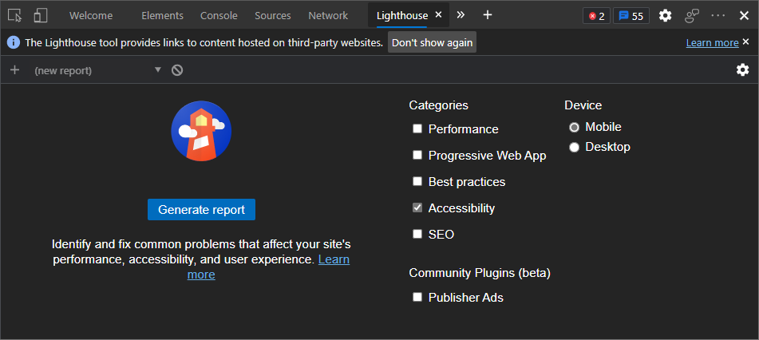
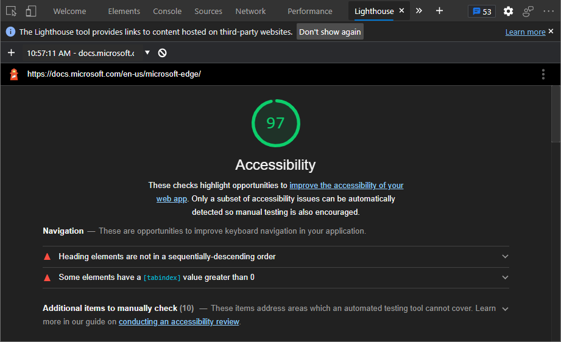
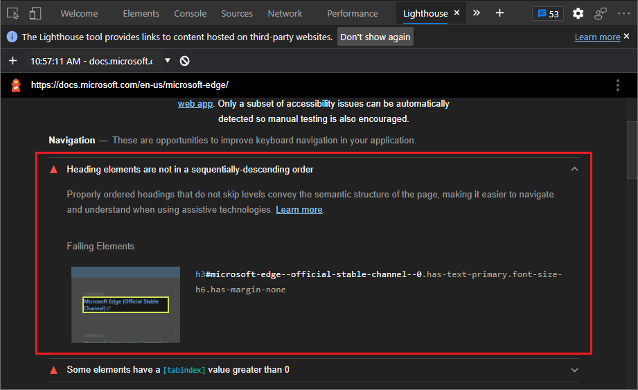

<!-- this article was created on 05/11/2021 by moving a section out from the "Accessibility reference" article (reference.md) -->
<!-- Copyright Kayce Basques

   Licensed under the Apache License, Version 2.0 (the "License");
   you may not use this file except in compliance with the License.
   You may obtain a copy of the License at

       https://www.apache.org/licenses/LICENSE-2.0

   Unless required by applicable law or agreed to in writing, software
   distributed under the License is distributed on an "AS IS" BASIS,
   WITHOUT WARRANTIES OR CONDITIONS OF ANY KIND, either express or implied.
   See the License for the specific language governing permissions and
   limitations under the License.  -->
# 使用 Lighthouse 测试辅助功能

可以使用 DevTools 中的 Lighthouse 来审核页面的辅助功能并生成报表。 可以使用 Lighthouse 工具来确定：

*  是否为屏幕阅读器正确标记页面。

*  页面上的文本元素是否使用颜色选取器具有足够的对比度。 [使用颜色选取器查看测试文本颜色对比度](color-picker.md)。

**Lighthouse** 工具提供指向第三方网站上托管的内容的链接。  Microsoft 不负责也不控制这些网站的内容，并且可能会收集任何数据。

若要使用 Lighthouse 工具审核页面，请执行以下操作：

1. 转到要审核的 URL。

1. 在 DevTools 中，选择 **Lighthouse** 工具。  显示配置选项：

   

1. 对于 **设备**，如果要模拟移动设备，请选择 **“移动** ”。  此选项将更改用户代理字符串并调整视口的大小。  此选项可能会影响审核结果。

1. 在“ **类别** ”部分中，选择 **“辅助功能**”。

1. 单击 **“生成报表**”。 10 到 30 秒后，DevTools 会显示一个报表。  该报表提供有关如何改进页面辅助功能的提示：

   

1. 在报表中选择一个项目以了解有关它的详细信息。

   

1. 单击 **“了解更多** ”链接以查看问题的文档：

   

1. 若要返回到配置选项，请在 DevTools 中单击 **“执行审核** (`+`) 。

<!-- ====================================================================== -->
> [!NOTE]
> 此页面的某些部分是根据 [Google 创建和共享的](https://developers.google.com/terms/site-policies)作品所做的修改，并根据[ Creative Commons Attribution 4.0 International License ](https://creativecommons.org/licenses/by/4.0)中描述的条款使用。
> 原始页面位于[此处](https://developer.chrome.com/docs/devtools/accessibility/reference/)，由 [Kayce Basques](https://developers.google.com/web/resources/contributors/kaycebasques)\（Chrome DevTools 和 Lighthouse 的技术作家）撰写。

本作品根据[ Creative Commons Attribution 4.0 International License ](https://creativecommons.org/licenses/by/4.0)获得许可。
