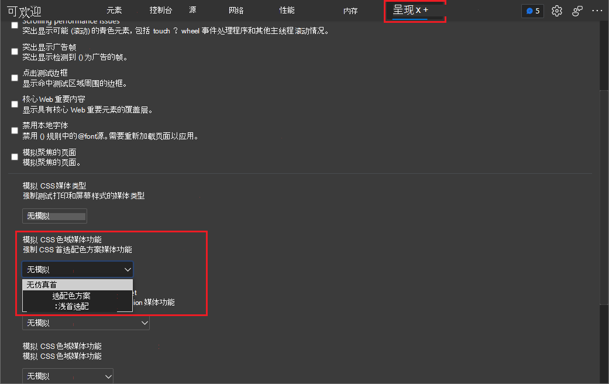
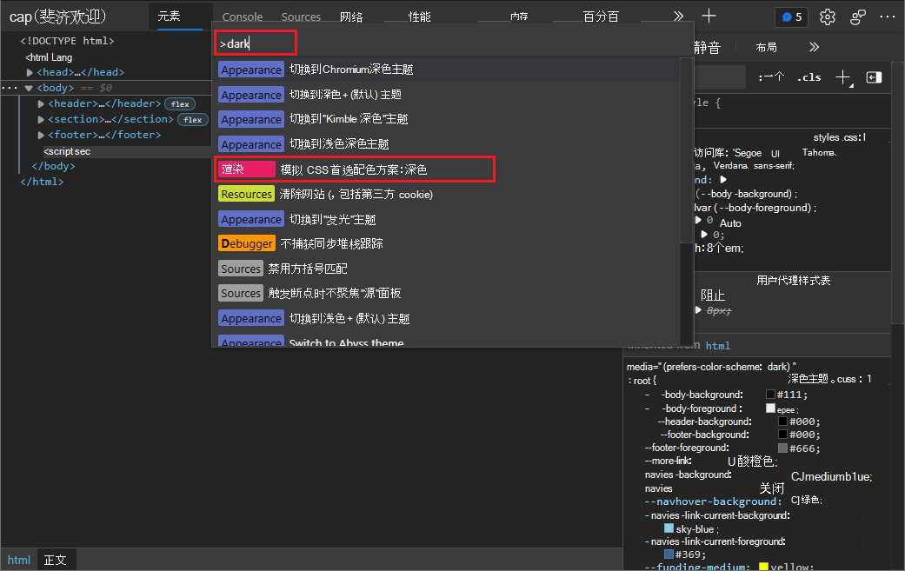

# 在呈现的页面中模拟深色或浅色方案

使用 **呈现** 工具通过不同的显示选项或视觉缺陷查看网页的外观。

许多操作系统都有一种方法以较暗或更浅的颜色显示任何应用程序。  在深色操作系统中具有浅色方案的网页产品可能难以阅读，并且对于一些用户可能是一个辅助功能问题。

若要测试当用户选择深色或浅色模式时网页的呈现方式，而不是更改你自己的计算机深色模式或浅色模式设置，可以在 Microsoft Edge DevTools 中选择模拟 **CSS 首选**配色方案：深色或浅色。****  可以从呈现工具或命令菜单**** 执行此操作，如下所述****。

或者，也可以使网页根据计算机上自己的首选设置自动选择深色或浅色模式，选择"无 **模拟**"（默认设置）。

若要指定用于浅色和深色方案 CSS，请使用首选配色 [方案](https://developer.mozilla.org/docs/Web/CSS/@media/prefers-color-scheme) CSS 媒体查询来检测用户是否希望以深色或浅色配色方案显示产品，然后自动选择您自己的自定义浅色或深色模式 CSS。  示例 CSS 代码显示在检查深色主题和浅色 [主题的对比度问题中](test-dark-mode.md)。

本文介绍更改开发中网页的外观。  若要改为更改 DevTools 的显示方式，请参阅 [向 DevTools 应用颜色主题](../customize/theme.md)。

<!-- ====================================================================== -->
## 使用呈现工具模拟深色或浅色模式

1. 在 DevTools 中，打开 **呈现** 工具。  为此，请单击主工具栏或****" (") "更多工具"图标，然后选择"呈现 **"**。

   或者，如果呈现工具已打开，但已被隐藏，请单击工具栏上的"更多 **选项卡 #** A0>>) 图标"，然后选择"呈现 **"**。

1. 在模拟 **CSS 媒体功能 prefers-color-scheme** 下拉列表中，选择 **prefers-color-scheme： dark** or **prefers-color-scheme： light**。

   

1. 刷新页面以显示呈现的结果。

   现在，您可以修改 CSS，并像查看任何其他网页一样查看呈现的结果。  请参阅 [开始查看和更改 CSS](../css/index.md)。

1. 若要还原该设置，请在"**** 呈现"工具中的"**模拟 CSS 媒体功能首选-** 配色方案"下拉列表中，选择"无**模拟"**。  刷新页面时，将应用你自己的用于浅色或深色模式首选项的操作系统或浏览器设置。

<!-- ====================================================================== -->
## 使用命令菜单模拟深色或浅色模式

1. **** 当 DevTools 具有`Ctrl``P``Shift`++焦点时，通过选择 (Windows/Linux`P` `Command`+`Shift`+) 或 (macOS) 打开命令) 。

1. 键入**深色**、**浅**色或**** 模拟，选择呈现 **：模拟 CSS 首选配色方案：** 深色或呈现：模拟 **CSS 首选**配色方案：浅色，然后按 **Enter**。

   

   选择" **呈现"** 命令而不是 **"外观"** 命令。  " **呈现** "命令会影响开发中呈现的网页。  **Appearance 命令**会改为影响窗口的 DevTools 部分。

1. 刷新页面以显示呈现的结果。

   现在，您可以修改 CSS，并像查看任何其他网页一样查看呈现的结果。  请参阅 [开始查看和更改 CSS](../css/index.md)。

1. 若要还原该设置，请在"命令菜单"中键入 **"模拟**"或"方案"，然后选择"呈现 **：不模拟 CSS prefers-color-scheme"**。****  刷新页面时，将应用你自己的用于浅色或深色模式首选项的操作系统或浏览器设置。

<!-- ====================================================================== -->
## 另请参阅

* [使用性能功能参考中的呈现工具](../evaluate-performance/reference.md#analyze-rendering-performance-with-the-rendering-tool)_分析呈现性能_

呈现工具还用于以下内容：

* [检查深色主题和浅主题的对比度问题](test-dark-mode.md)
* [验证页面是否对色盲者可用](test-color-blindness.md)
* [验证页面是否在视觉模糊时可用](test-blurred-vision.md)
* [验证页面是否在关闭 UI 动画时可用](test-reduced-ui-motion.md)
* [模仿视觉缺陷](emulate-vision-deficiencies.md)
* [模拟运动减少](reduced-motion-simulation.md)
