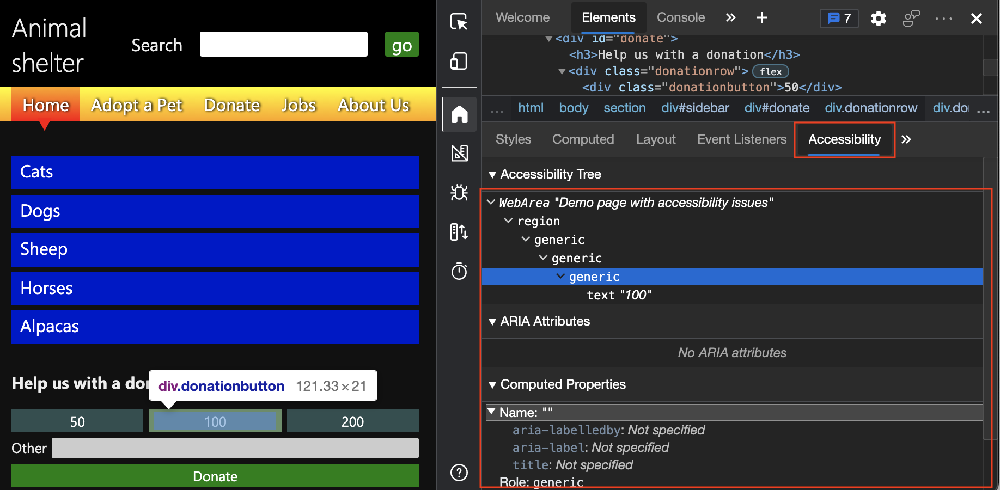

# 检查辅助功能树是否支持键盘和屏幕阅读器

<!-- Accessibility tab: Accessibility Tree -->

多个 DevTools 功能检查键盘和屏幕阅读器支持。  使用 **Inspect** 工具单独检查每个页面元素的辅助功能可能会相当耗时。  检查网页的另一种方式是使用 **辅助功能树**。  辅助功能 **树** 指示页面向辅助技术（如屏幕阅读器）提供哪些信息。

辅助功能 **树** 是 DOM 树的子集，其中包含 DOM 树中的元素，这些元素对于在屏幕阅读器中显示页面内容非常有用。  辅助功能**树位于**"元素"工具**** 的"辅助功能"选项卡**** ("样式"选项卡) 。****

若要使用辅助功能树进行浏览，请进行以下操作：

1. 打开 [新选项卡中的辅助功能测试](https://microsoftedge.github.io/Demos/devtools-a11y-testing/) 演示网页。 然后按 `F12` 打开 DevTools。

1. 选择 **"**  检查 (检查"图标。) 位于 DevTools 左上角的"检查"按钮，使按钮以蓝色 (突出显示) 。

1. 在呈现的网页的"捐赠 **"部分** ，将鼠标悬停在 **"100"** 按钮上。  将显示 **"检查** "工具覆盖。

1. 在呈现的网页中，选择 **"100"** 按钮。  在 DevTools 中， **将显示"元素** "工具。  DOM 树显示 `div` **100 按钮的元素** 。  " **样式** "窗格显示元素的 CSS 设置。

1. 在" **样式"选项卡** 的右侧，选择 **"辅助功能"** 选项卡。 将显示 **元素的** 辅助功能树，并展开。

   

树中 `generic` 没有名称或具有 (`div` 角色的任何元素（如元素) ）都是一个问题，因为该元素对键盘用户或使用辅助技术的用户不可用。

<!-- ====================================================================== -->
## 另请参阅

*  [查看元素在辅助功能树中的位置](accessibility-tab.md#view-the-position-of-an-element-in-the-accessibility-tree)
*  [使用 DevTools 的辅助功能测试概述](accessibility-testing-in-devtools.md)
