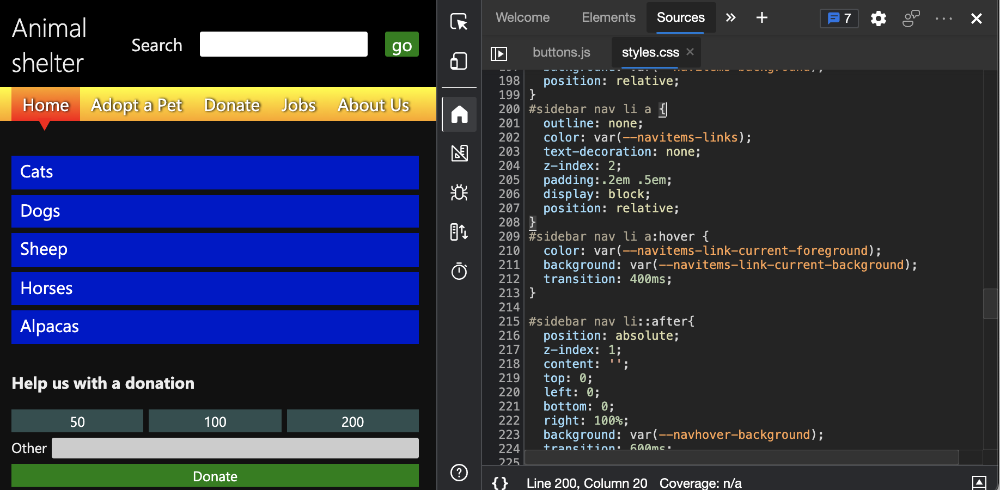

# 分析边栏菜单中键盘焦点的缺失

<!-- Inspect tool, and CSS rules: pseudo-classes for states -->

在辅助功能测试演示页中，使用键盘时，带有蓝色链接的边栏导航菜单不会直观地指示哪个链接具有焦点。  为了找出侧栏菜单对键盘用户造成混淆的原因，我们将查找用于状态和`focus`状态的 CSS 伪类规则`hover`，以及链接大纲的 CSS 属性。

此分析发现，页面侧栏导航菜单的链接中缺少键盘焦点指示，这是因为：
*  链接 `a` 的 CSS 属性设置为 `outline: none`.
*  这些 `a` 链接缺少状态的 CSS 伪类规则 `:focus` 。

若要导航到 CSS，我们将使用 **“检查** ”工具突出显示页面边栏导航菜单上的蓝色链接，然后查看定义该链接的元素的 DOM 树和 CSS `a` 。

1. 在新窗口或选项卡中打开 [辅助功能测试演示网页](https://microsoftedge.github.io/Demos/devtools-a11y-testing/) 。

1. 右键单击网页中的任意位置，然后选择 **“检查**”。  或者按 `F12`。  DevTools 将在网页旁边打开。

1. 单击“ **检查** () DevTools 左上角的按钮，使按钮突出显示 (蓝色) 。

1. 将鼠标悬停在页面边栏导航菜单中的蓝色 **猫** 链接上。  将显示“检查”覆盖，显示 `a` 该元素是可键盘聚焦的。  但覆盖不会显示链接具有焦点时没有视觉指示。

   接下来，我们将检查此链接的 CSS 样式。

1. 单击边栏导航菜单中的 **“猫”** 链接。  “ **检查** ”工具关闭， **元素** 工具随即打开，突出显示 `a` DOM 树中的节点。

1. 在 DevTools 中，选择 **“样式”** 选项卡。 将显示 CSS 规则 `#sidebar nav li a` ，以及指向行号的 `styles.css`链接。

   

1. `styles.css`单击链接。  CSS 文件在 **“源** ”工具中打开。

   

   页面的样式具有状态的 CSS 伪类规则，该规则`hover`指示使用鼠标时所使用的菜单项： `#sidebar nav li a:hover`  但是，对于状态，没有 CSS 伪类规则 `focus` 来直观地指示你在使用键盘时使用的菜单项，例如 `#sidebar nav li a:focus`。

   此外，请注意，链接具有 CSS 属性设置 `outline: none`。  这是一种常见做法，用于删除使用键盘将浏览器自动添加到元素的大纲。  不使用 `focus` 样式会导致用户混淆。

<!-- ====================================================================== -->
## 另请参阅

*  [跟踪哪些元素有焦点](focus.md)
*  [使用 DevTools 的辅助功能测试概述](accessibility-testing-in-devtools.md)
