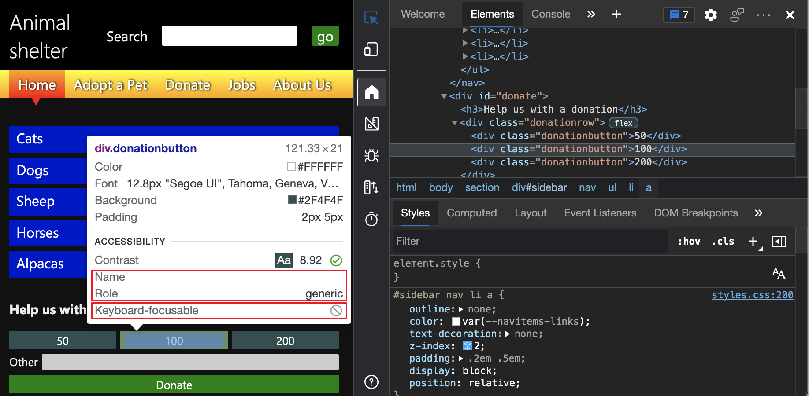
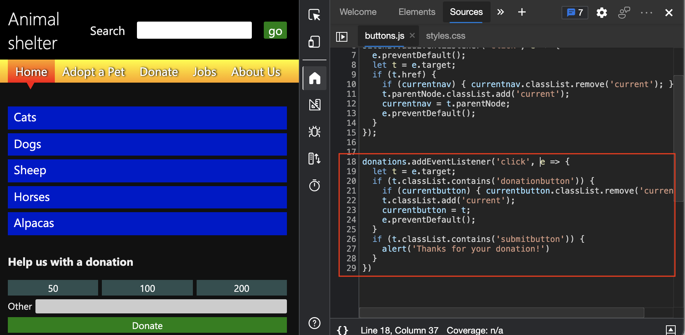

# <a name="analyze-keyboard-support-on-forms"></a>分析窗体上的键盘支持

本文使用“ **检查** 工具”和 **“事件侦听器”** 选项卡来分析演示页上缺少键盘支持，该演示页上包含使用该 `div` 元素的按钮。

在 **“捐赠** ”窗体上，金额按钮和 **“捐赠** ”按钮不适用于键盘。  调试捐赠表单需要了解为什么缺少焦点样式不会标记为自动测试工具（如 **“问题”** 工具）的问题。  在此示例中，按钮是使用 `div` 元素实现的，这些工具不会将这些元素识别为窗体上的控件。

若要使用“检查工具”和“事件侦听器”选项卡来分析演示页上缺少键盘支持：

<!-- 1. Inspect tool: Accessibility section: keyboard-focusable row -->

1. 在新窗口或选项卡中打开 [辅助功能测试演示网页](https://microsoftedge.github.io/Demos/devtools-a11y-testing/) 。

1. 右键单击网页中的任意位置，然后选择 **“检查**”。  或者按 `F12`。  DevTools 将在网页旁边打开。

1. 单击“ **检查** () DevTools 左上角的按钮，使按钮突出显示 (蓝色) 。

1. 将鼠标悬停在 **50**、 **100** 和 **200 个** 捐赠按钮上。  “检查”工具以覆盖形式显示在网页上。  检查覆盖的 **可键盘焦点** 行显示，没有一个捐赠金额按钮是键盘可访问的，如带有对角线的灰色圆圈所示。  这些按钮没有名称，其作用 `generic` 在于它们是 `div` 元素，这意味着辅助技术无法访问这些按钮。

   

1. 当 **“检查**”工具处于活动状态时，在网页上，选择“**捐赠**”按钮上方**的其他**输入文本框。  **“元素**”工具随即打开，其中显示了网页的 DOM 树。  已选择该元素 `<input id="freedonation" class="smallinput">` 。

   ```html
   <div class="donationrow">
       <div class="donationbutton">50</div>
       <div class="donationbutton">100</div>
       <div class="donationbutton">200</div>
   </div>
   <div class="donationrow">
       <label for="freedonation">Other</label>
       <input id="freedonation" class="smallinput">
   </div>
   <div class="donationrow">
       <div class="submitbutton">Donate</div>
   </div>
   ```

   `label`使用**其他**文本框中的元素`input`是有效的，这意味着**其他**标签与输入文本框正确链接。  文本 `input` 框也可通过键盘访问。  窗体的其余标记是 `div` 元素，这些元素易于设置样式，但没有语义含义。

   <!-- 2. Elements tool: Event Listeners tab -->

   表单的功能是使用 JavaScript 创建的，你可以通过检查 **“事件侦听器”** 选项卡来测试此功能，如下所示。

1. 在 DOM 树中仍选择该元素`<input id="freedonation" class="smallinput">`后，选择“**样式**”选项卡右侧**的事件侦听器**选项卡，然后展开`click`事件侦听器。

   

1. `buttons.js:18`选择链接。  “ **源** ”工具随即打开，其中显示了已应用的 JavaScript。

   

   下面是应用的 JavaScript 的代码列表：

    ```javascript
    donations.addEventListener('click', e => {
      let t = e.target;
      if (t.classList.contains('donationbutton')) {
        if (currentbutton) { currentbutton.classList.remove('current'); }
        t.classList.add('current');
        currentbutton = t;
        e.preventDefault();
      }
      if (t.classList.contains('submitbutton')) {
        alert('Thanks for your donation!')
      }
    })
    ```
    
   `click`使用事件读取按钮是不错的做法，因为`click`事件会在鼠标指针和键盘交互上触发。  但是，由于 `div` 某个元素无法通过键盘访问，并且此 **“捐赠** ”按钮作为 `div` 元素实现 (`<div class="submitbutton">Donate</div>`) ，因此除非使用鼠标或其他事件源 `click` （例如某些键盘上可用的特殊按钮），否则此 JavaScript 功能永远不会运行。

这是一个经典示例，其中添加了 JavaScript 以创建元素以本机方式提供的功能 `button` 。  使用元素模拟按钮 `div` 的功能最终会产生无法访问的体验。


<!-- ====================================================================== -->
## <a name="see-also"></a>另请参阅

*  [使用 DevTools 的辅助功能测试概述](accessibility-testing-in-devtools.md)
