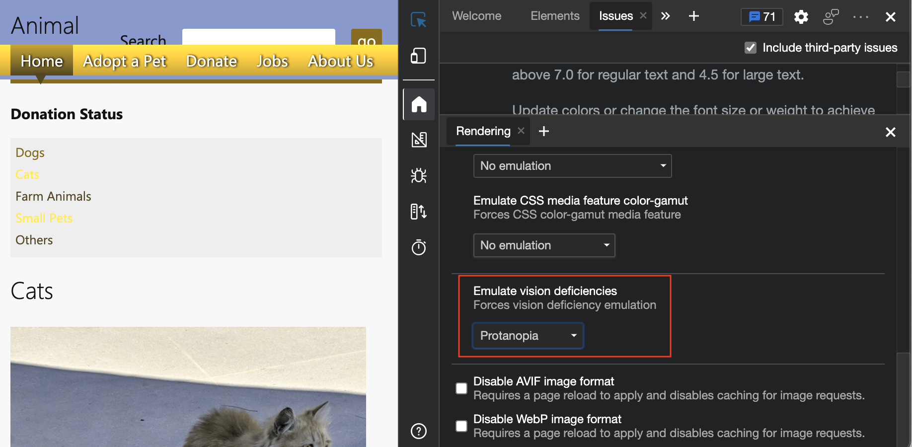

# 验证页面是否对色盲者可用

<!-- Rendering tool: Emulate vision deficiencies: Protanopia -->

若要检查某个网页是否可由色盲患者使用，请在 **呈现** 工具中使用 **模拟视觉缺陷** 下拉列表。

在辅助功能测试演示网页上，不同的捐赠状态使用颜色作为唯一的差异方式：
*  绿色意味着已收到大量捐款。
*  黄色表示已收到中等数量的捐款。
*  红色意味着收到的捐款量很低。

但是，不能期望所有用户都能按预期体验这些颜色。  通过使用**呈现**工具的**模拟视觉缺陷**功能，可以通过模拟具有不同视觉的人如何看待你的设计来发现此设计不够好。

若要检查有色盲的人是否可以使用网页：

1. 在新窗口或选项卡中打开 [辅助功能测试演示网页](https://microsoftedge.github.io/Demos/devtools-a11y-testing/) 。

1. 右键单击网页中的任意位置，然后选择 **“检查**”。  或者按 `F12`。  DevTools 将在网页旁边打开。

1. 按 **Esc** 打开 DevTools 底部的抽屉。  **+** 单击抽屉顶部的图标以查看工具列表，然后选择 **“呈现**”。

1. 在 **模拟视觉缺陷** 下拉列表中，选择 **Protanopia**。  _Protanopia_ 对红灯的敏感度降低，因此很难区分绿色、红色和黄色。

   

1. 在 **呈现** 工具的“ **模拟视觉缺陷”** 下，选择 **“无仿真** ”以删除模拟。

<!-- ====================================================================== -->
## 另请参阅

*  [模拟视力缺陷](emulate-vision-deficiencies.md) - 定义 **模拟视觉缺陷** 下拉列表中的项，包括 Protanopia、Deuteranopia、Tritanopia 和 Achromatopsia。
*  [使用 DevTools 的辅助功能测试概述](accessibility-testing-in-devtools.md)
