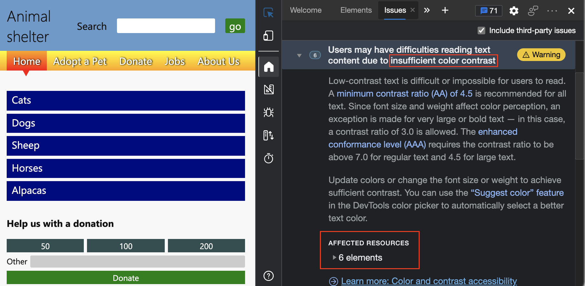

# <a name="check-for-contrast-issues-with-dark-theme-and-light-theme"></a>检查深色主题和浅主题的对比度问题

<!-- Rendering tool: Emulate CSS media feature prefers-color-scheme -->

测试颜色辅助功能时，可能需要测试不同的显示颜色主题，以解决对比度问题。

大多数操作系统都带有深色模式和浅色模式。  网页可以使用 CSS 媒体查询对此操作系统设置做出反应。  可以使用`prefers-color-scheme`**呈现**工具中的 CSS 选项测试这些主题并测试 CSS 媒体查询，而无需更改操作系统设置。

例如，辅助功能测试演示页包含浅色主题和深色主题。  演示页从操作系统继承深色或浅色主题设置。  如果我们使用 DevTools 模拟设置为浅色方案的操作系统，然后刷新演示网页，“ **问题”** 工具将显示六个颜色对比度问题，而不是两个。   (可能会看到不同的数字。) 

若要模拟用户选择的首选颜色主题，请执行以下操作：

1. 在新窗口或选项卡中打开 [辅助功能测试演示网页](https://microsoftedge.github.io/Demos/devtools-a11y-testing/) 。

1. 右键单击网页中的任意位置，然后选择 **“检查**”。  或者按 `F12`。  DevTools 将在网页旁边打开。

1. 按 **Esc** 打开 DevTools 底部的抽屉。  **+** 单击抽屉顶部的图标以查看工具列表，然后选择 **“呈现**”。  将显示呈现工具。

1. 在 **模拟 CSS 媒体功能首选配色方案** 下拉列表中，选择 **首选配色方案：浅色**。  使用 >a0>重新呈现 `light-theme.css`网页。

   

1. 选择 **“问题** ”工具，然后展开 **“辅助功能”** 部分。  根据各种因素，你可能会收到 `Insufficient color contrast` 警告。 请注意， **受影响的资源** 中有 6 个元素的颜色对比度不足。

   

    在我们的演示页上，页面的 **“捐赠状态** ”部分在浅色模式下不可读，需要更改：

   

1. 在 DevTools 中，选择 **“元素”** 工具，然后按`Ctrl`+`F`Windows/Linux 或`Command`+`F`macOS。  将显示 **“查找** ”文本框，以便在 HTML DOM 树中进行搜索。

   

1. 输入 `scheme`。  找到以下 CSS 媒体查询，现在可以更新相应的 CSS 文件。

    ```html
    <link rel="stylesheet" href="css/light-theme.css" media="(prefers-color-scheme: light), (prefers-color-scheme: no-preference)">
    <link rel="stylesheet" href="css/dark-theme.css" media="(prefers-color-scheme: dark)">
    ```


<!-- ====================================================================== -->
## <a name="see-also"></a>另请参阅

*  [在呈现的页面中模拟深色或浅色方案](preferred-color-scheme-simulation.md)
*  [使用 DevTools 的辅助功能测试概述](accessibility-testing-in-devtools.md)
