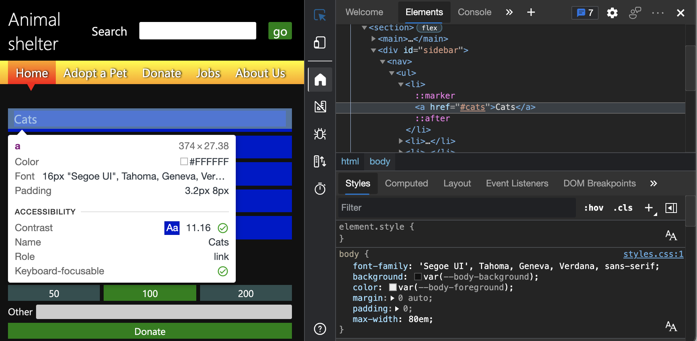
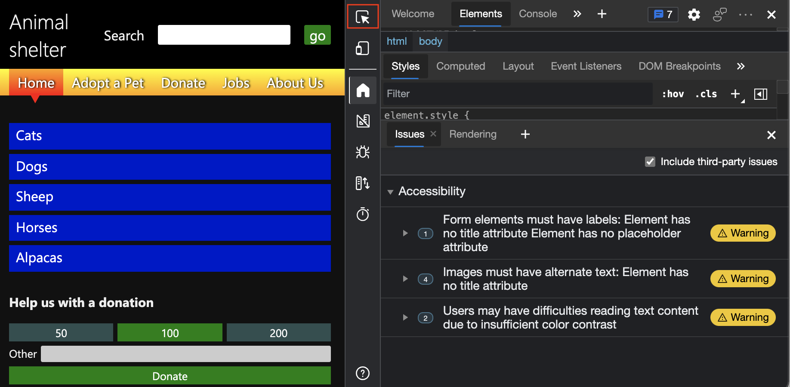
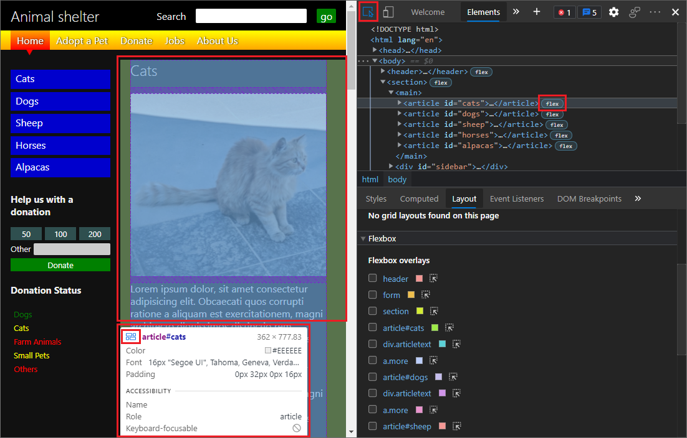

# 使用"检查"工具将鼠标悬停在网页上以检测辅助功能问题

当将鼠标悬停在呈现的网页上时，“ **检查** ”工具会显示有关各个元素的信息，包括辅助功能信息。
相比之下，“ **问题”** 工具会自动报告整个网页的问题。

“ **检查** ”工具按钮 () 位于 DevTools 的左上角。  单击“ **检查** ”工具按钮时，按钮将变为蓝色，指示 **“检查** ”工具处于活动状态。

当 **“检查** ”工具处于活动状态时，悬停在呈现的网页上的任何元素上会显示 **“检查** ”覆盖层。 此覆盖显示有关该元素的常规信息和辅助功能信息。  **“检查**”覆盖的 **“辅助功能**”部分显示有关文本颜色对比度、屏幕阅读器文本和键盘支持的信息。

有关“检查”工具的主要文章是 [使用“检查”工具分析 HTML 页面](../css/inspect.md)。

<!-- ====================================================================== -->
## 检查文本对比度、屏幕阅读器文本和键盘支持的各个元素

<!-- Inspect tool: Accessibility section of overlay -->

1. 在新窗口或选项卡中打开 [辅助功能测试演示网页](https://microsoftedge.github.io/Demos/devtools-a11y-testing/) 。

1. 右键单击网页中的任意位置，然后选择 **“检查**”。  或者按 `F12`。  DevTools 将在网页旁边打开。

1. 单击“ **检查** ( 在 DevTools 的左上角) 按钮，使图标突出显示 (蓝色) 。

   

1. 将鼠标悬停在呈现的演示网页中的任何元素上。  “ **检查** ”工具显示呈现的网页中元素下方的信息覆盖。

   

**检查**覆盖的底部有一个**辅助功能**部分，其中包含以下信息：

*  **对比** 度定义具有低视力的人是否可以理解元素。  [WCAG 准则](https://www.w3.org/TR/WCAG21/)定义的[对比度](https://www.w3.org/TR/WCAG21/#dfn-contrast-ratio)表示 (绿色复选标记图标) 是否有足够的对比度 (橙色感叹号图标) 。

*  **名称** 和 **角色** 是辅助技术（如屏幕阅读器）将报告该元素的内容。
    *  **名称**是元素的`a`文本内容。  对于元素 `<a href="/">About Us</a>`，检查工具中显示的 **名称** 是“关于我们”。
    *  元素 **的角色** 。  这通常是元素名称，例如`article`， `img` 或 `link``heading`。  `span`和`div`元素被称为`generic`。

*  **键盘可聚焦** 指示用户是否可以访问该元素，而不考虑输入设备。
    *  绿色复选标记图标指示元素可对键盘聚焦。
    *  带有对角线的灰色圆表示元素不可键盘聚焦。

<!-- ====================================================================== -->
## 检查覆盖中的其他信息

<!-- general info about the Inspect tool, not particularly focused on accessibility -->

**“检查**覆盖”的顶部（位于**辅助功能**部分上方）列出了元素的以下详细信息。

*  布局类型。 如果使用弹性框或网格定位元素，则图标 (显示) 。
*  元素的名称，例如 `h1`， `h2`或 `div`。
*  元素的维度（以像素为单位）。
*  颜色作为色板 (或小型彩色方形) 和字符串 (，如 `#336699`) 。
*  字体信息，如大小和字体系列。
*  以像素为单位的边距和填充。

<!-- ====================================================================== -->
## 使用颜色突出显示标识嵌套区域

<!-- general info about the Inspect tool, not particularly focused on accessibility -->

除了信息覆盖， **检查** 工具还提供区域着色，类似于在 **Elements** 工具的 DOM 树中悬停。

1. 在新窗口或选项卡中打开 [辅助功能测试演示网页](https://microsoftedge.github.io/Demos/devtools-a11y-testing/) 。

1. 右键单击网页中的任意位置，然后选择 **“检查**”。  或者按 `F12`。  DevTools 将在网页旁边打开。

1. 单击“ **检查** ”按钮 () 在 DevTools 的左上角，使按钮突出显示 (蓝色) 。

1. 将鼠标悬停在呈现的演示网页的不同部分上。

   现在，网页中的每个元素都以多色覆盖显示。 此多色覆盖层可以显示元素内部的嵌套区域。

1. 例如，将鼠标悬停在 **猫**的左边缘。

   **检查工具**突出显示具有不同颜色的 **“猫**”部分的几个矩形部分，其中显示了来自网页上的 CSS 弹性框定义的布局：

   

如果要配置网格覆盖或弹性框覆盖，请在 **“元素** ”工具中选择“ **布局** ”选项卡。 请参阅 [检查 CSS 网格](..\css\grid.md)。

<!-- ====================================================================== -->
## 使用“检查”工具将鼠标悬停在网页上以突出显示 DOM 和 CSS

<!-- general info about the Inspect tool, not particularly focused on accessibility -->

1. 在新窗口或选项卡中打开 [辅助功能测试演示网页](https://microsoftedge.github.io/Demos/devtools-a11y-testing/) 。

1. 右键单击网页中的任意位置，然后选择 **“检查**”。  或者按 `F12`。  DevTools 将在网页旁边打开。

1. 在 DevTools 中，单击“ **检查** ”工具 () 左上角，使按钮突出显示 (蓝色) 。

1. 选择 **“元素”** 工具。

1. 当 **“检查** ”工具处于活动状态时，将鼠标悬停在呈现的网页的不同部分上。  在 **Elements** 工具中，HTML DOM 树会自动展开以显示有关你悬停在上面的元素的信息。  悬停不会导致“ **样式** ”窗格更新。

1. 在呈现的网页中，单击任何元素。

   **Elements** 工具会自动打开并显示 DOM 树中元素的 HTML。  **“元素**”工具还会在“**样式**”窗格中显示元素上应用的 CSS。  单击呈现的网页上的元素会关闭“ **检查** ”工具。

   

单击呈现的网页中的元素后，可以使用“样**式**”选项卡) 附近的 **“辅助功能**”选项卡 (查看**辅助功能树**并使用 **“源订单查看器**”。

<!-- ====================================================================== -->
## 另请参阅

*  [使用“检查”工具分析 HTML 页面](../css/inspect.md)
*  [检查节点](../dom/index.md#inspect-a-node)
*  [使用检查工具检查默认状态下的文本颜色对比度](test-inspect-text-contrast.md)
*  [使用 DevTools 的辅助功能测试概述](accessibility-testing-in-devtools.md)
