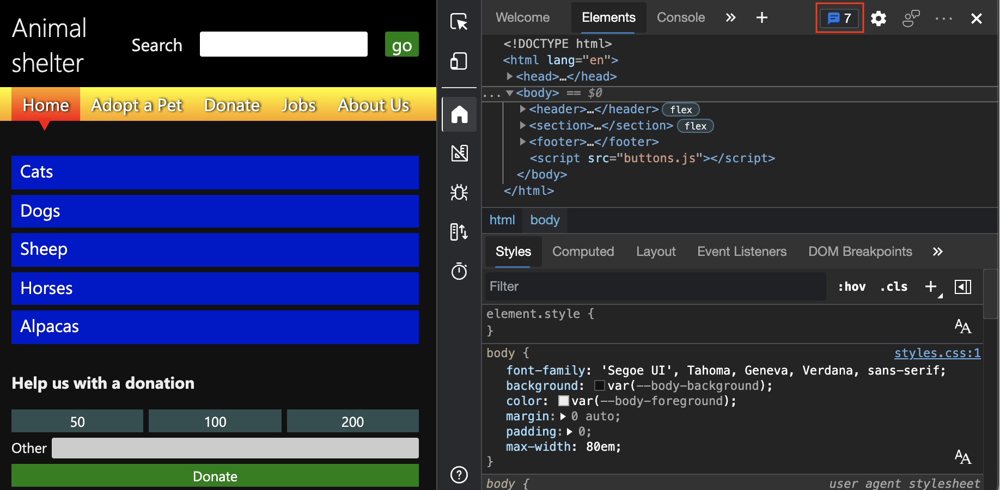
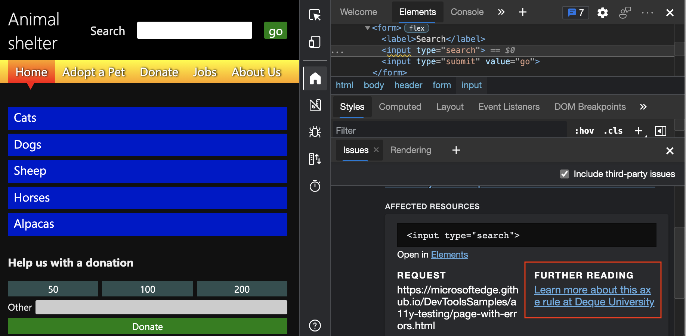

# <a name="automatically-test-a-webpage-for-accessibility-issues"></a>自动测试网页中的辅助功能问题

“ **问题** ”工具包括一个 **辅助功能** 部分，用于自动报告诸如图像上缺少备用文本、窗体字段上缺少标签以及文本颜色对比度不足等问题。  **问题**工具位于 DevTools 底部的**抽屉**内。  本文使用辅助功能测试演示网页逐步使用 **“问题”** 工具的 **“辅助功能**”部分。

可以通过多种方式打开 **“问题”** 工具，例如：

*  单击 **“问题”计数器** () DevTools 右上角。

*  在 **“元素”** 工具的 DOM 树中，单击元素上的波浪下划线时按 `Shift` 下。

*  在 **命令菜单**中，键入 **问题**，选择 **“显示问题**”，然后按下 `Enter`。


<!-- ====================================================================== -->
## <a name="view-the-accessibility-section-of-the-issues-tool"></a>查看“问题”工具的辅助功能部分

1. 在新窗口或选项卡中打开 [辅助功能测试演示网页](https://microsoftedge.github.io/Demos/devtools-a11y-testing/) 。

1. 右键单击网页中的任意位置，然后选择 **“检查**”。  或者按 `F12`。  DevTools 将在网页旁边打开。

   右上角的“ **问题”计数器** () 显示。  **问题计数器**是语音气泡图标，以及自动检测到的问题数。

   

1. 刷新页面，因为某些问题是根据网络请求报告的。  请注意问题 **计数器**中的更新计数。

1. 单击 **“问题”计数器**。  **问题**工具将在 DevTools 底部的**抽屉**中打开。

   

1. 在 **“问题** ”选项卡上，展开 **“辅助功能”** 部分。


<!-- ====================================================================== -->
## <a name="verify-that-input-fields-have-labels"></a>验证输入字段是否具有标签

若要检查输入字段是否已连接到它们的标签，请使用 **“问题** ”工具，该工具会自动检查整个网页并在 **辅助功能** 部分中报告此问题。

1. 在新窗口或选项卡中打开 [辅助功能测试演示网页](https://microsoftedge.github.io/Demos/devtools-a11y-testing/) 。

1. 右键单击网页中的任意位置，然后选择 **“检查**”。  或者按 `F12`。  DevTools 将在网页旁边打开。

1. 在右上角，单击“ **问题”计数器** () 。  **问题**工具将在 DevTools 底部的**抽屉**中打开。

1. 在 **“问题** ”选项卡上，展开 **“辅助功能”** 部分。

1. 展开**警告**`Form elements must have labels: Element has no title attribute Element has no placeholder attribute`。

1. 单击 **“在元素中打开”** 链接。

   
    
   **“元素**”工具随即打开，该元素在 DOM 树中突出显示。  “ **样式** ”窗格显示元素的已应用 CSS 规则。
  
   现在显示以下代码：

   ```html
   <label>Search</label>
   <input type="search">
   <input type="submit" value="go">
   ```

   在上面的代码中`label`，由于元素与特定`input`元素之间`label`没有连接，所以该元素的使用不正确。  若要将 `label` 元素连接到特定 `input` 元素，请使用以下任一选项：

   *  `input`嵌套元素中的`label`元素。

   *  在元素中 `label` ，添加与 `for` 元素属性匹配 `id` 的 `input` 属性。

还有一种测试元素之间缺少连接的另一种方法：

1. 在 **“元素”** 工具中，选择 `<label>Search</label>` DOM 树中的元素。

   在网页上，请注意焦点仅显示在 **搜索** 标签上，而不是输入文本框上。  正确的实现将重点放在输入文本框和**搜索**标签上`search`。

1. 作为正确连接的示例，选择捐赠表单上 **的其他** 标签。

   焦点指示器框正确显示在 **“其他** ”标签旁边的输入文本框上，因为有匹配 `for` 值和 `id` 属性值。

1. 在 **“问题”工具**中，单击 **“进一步阅读** ”以了解有关问题的详细信息。  若要在新选项卡中打开链接，请在单击链接时按`Ctrl` (Windows、Linux) 或`Command` (macOS) 。

   


<!-- ====================================================================== -->
## <a name="verify-that-images-have-alt-text"></a>验证图像是否具有替换文字

基本辅助功能测试需要确保为图像提供替代文本 (也称为 _替换文本_) 。

若要自动检查是否为图像提供替换文字，请使用“ **问题** ”工具，其中包含 **辅助功能** 部分。  **问题**工具位于 DevTools 底部的**抽屉**中。

1. 在新窗口或选项卡中打开 [辅助功能测试演示网页](https://microsoftedge.github.io/Demos/devtools-a11y-testing/) 。

1. 右键单击网页中的任意位置，然后选择 **“检查**”。  或者按 `F12`。  DevTools 将在网页旁边打开。

1. 在 DevTools 的右上角，单击 **“问题”** 计数器。  “ **问题** ”工具随即打开。

1. 在 **“问题** ”选项卡上，展开警告 `Images must have alternate text: Element has no title attribute`。  有四个缺少替换文字的图像实例：

   

查看 [图像必须具有备用文本](https://dequeuniversity.com/rules/axe/4.1/image-alt)。


<!-- ====================================================================== -->
## <a name="verify-that-text-colors-have-enough-contrast"></a>验证文本颜色是否有足够的对比度

若要自动检查文本颜色是否有足够的对比度，请使用具有**辅助功能**部分**的“问题**”工具。  **问题**工具位于 DevTools 底部的**抽屉**中。

1. 在新窗口或选项卡中打开 [辅助功能测试演示网页](https://microsoftedge.github.io/Demos/devtools-a11y-testing/) 。

1. 右键单击网页中的任意位置，然后选择 **“检查**”。  或者按 `F12`。  DevTools 将在网页旁边打开。

1. 在 DevTools 的右上角，单击 **“问题”** 计数器。  “ **问题** ”工具随即打开。

   可能会有警告指出演示网页上的两个元素没有足够的对比度。

   

1. 根据设置，“ **问题”** 选项卡可能有一条警告，例如 **，由于颜色对比度不足，用户可能难以读取文本内容**。   可以展开该警告，然后展开 **受影响的资源**。  将显示一个元素列表，其中包含的元素列表没有足够的对比度。

1. 单击该 `li.high` 元素。  在呈现的网页中，突出显示了 **“捐赠**”部分中的 **“狗**”链接，其中显示了一个小信息覆盖。  这是将鼠标悬停在 **Elements** 工具的 DOM 树中的元素上时出现的相同覆盖。

   


### <a name="wavy-underlines-in-the-dom-tree-indicate-automatically-detected-issues"></a>DOM 树中的波浪下划线指示自动检测到的问题

**Elements** 工具中的 DOM 树直接标记 HTML 中具有波浪下划线的问题。  问题 **工具会** 报告这些问题。  单击带波浪下划线的任何元素时， `Shift` 将打开 **“问题”工具** 。

1. 在**元素**工具的 DOM 树中，单击具有波浪线的元素`<input type="search">`时按`Shift`下`input`。  显示 **“问题”工具** ，并显示该元素的问题。

   


<!-- ====================================================================== -->
## <a name="see-also"></a>另请参阅

*  [使用问题工具查找和修复问题](../issues/index.md)
*  [使用 DevTools 的辅助功能测试概述](accessibility-testing-in-devtools.md)
