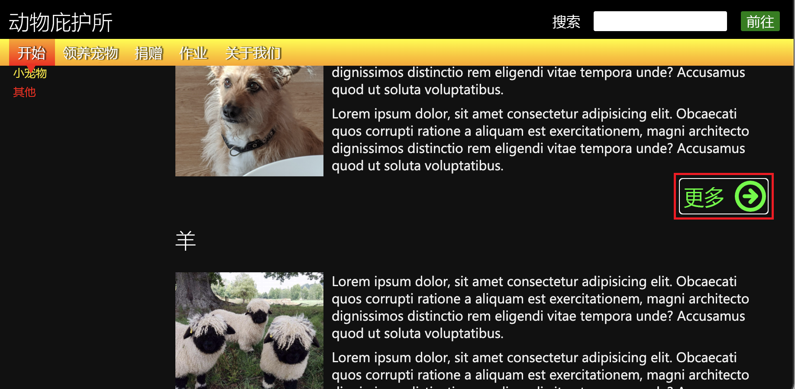
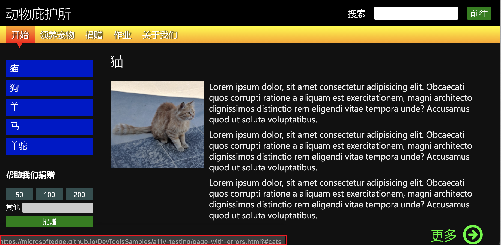
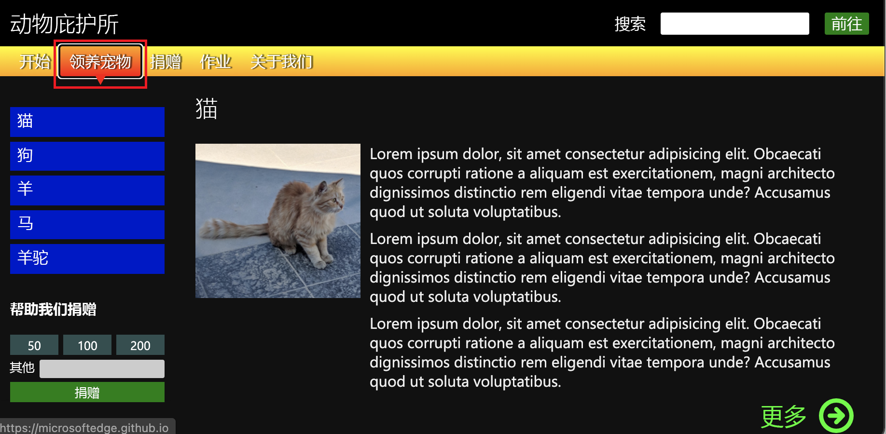

# 使用 Tab 和 Enter 键检查键盘支持

并非所有用户都有指针或触摸设备，并非所有用户都能看到我们创建的 Web 项目。  因此，用户界面至少适用于键盘非常重要。  确保可以使用密 `Tab` 钥将焦点移动到网页上的每个窗体控件，并确保可以使用该 `Enter` 密钥提交表单。

可以通过多种方式测试键盘用户网页的可用性：
*  通过使用键盘，特别是`Tab``Tab``Shift`+键盘和`Enter`键。  本文介绍了此方法。
*  使用“ **检查** ”工具检查单个元素的键盘支持。  “检查”工具的信息覆盖包括一个 **辅助功能** 部分，其中包含 **可使用键盘的** 行。
*  检查 **“问题** ”报告的 **辅助功能** 部分，了解键盘支持问题。

若要使用键盘而不是鼠标检查演示页中的辅助功能问题：

1. 在新窗口或选项卡中打开 [辅助功能测试演示网页](https://microsoftedge.github.io/Demos/devtools-a11y-testing/) 。

1. 右键单击网页中的任意位置，然后选择 **“检查**”。  或者按 `F12`。  DevTools 将在网页旁边打开。

1. 使用键盘导航演示文档，使用 `Tab` 和 `Shift`+`Tab` 键从元素跳转到元素。  在演示网页上 `Tab` ，键首先将焦点移动到部分中的 `header` 搜索窗体。

1. 按 `Tab` 下以将焦点放在按钮上，然后按 `Enter` 下以单击焦点按钮。  例如，在演示页中，按 `Tab` 下以将焦点放在 **搜索** 字段上，然后按 `Enter` 下以提交搜索。  此方法生成的结果与选择 **go** 按钮的结果相同。  选择 `Enter` “发送 **搜索** ”窗体可正常工作。

1. 再次按 `Tab` 。  你关注的下一个元素是网页部分中`content`的第一个**更多**链接，如大纲所示。

   

1. 再按 `Tab` 几次，直到传递最后一个 **更多** 链接。  页面向上滚动，您似乎位于页面的元素上，但无法判断它是什么元素。

1. 请注意左下角的 URL。  如果 (查看屏幕左下角，或者使用屏幕阅读器) ，则会意识到你位于带有蓝色链接的边栏导航菜单上，因为浏览器显示 **猫** 链接指向 () `#cats` 的 URL。

   

1. 再次按 `Tab` 下，转到捐赠表单中的入口字段。  但是，无法通过选择 `Tab`文本框来访问文本框上方的按钮。 不能使用键盘将焦点放在 **50、100** 或 **200** 个按钮上，然后选择它们。 ****  此外，选择 `Enter` 不会提交捐赠表单。

   

1. 再次选择 `Tab` 将焦点放在页面顶部导航栏上，其中包含 **“开始**”、“ **收养宠物**”、“ **捐赠**”、“ **作业**”和“ **关于我们**”的菜单按钮。  按 `Tab` 下或 `Shift`+`Tab` 将焦点放在菜单按钮上，如焦点轮廓所示。  然后按 `Enter` 下以访问网页的该部分。

   

根据上述演练，我们发现了以下需要解决的问题。

*  使用键盘时，边栏导航菜单的蓝色链接不会直观地指示哪个链接具有焦点。  请参阅 [分析侧栏菜单中缺少键盘焦点指示](test-analyze-no-focus-indicator.md)。

*  在捐赠窗体中，金额按钮和 **“捐赠** ”按钮不适用于键盘。  请参阅[分析窗体中缺少键盘支持。](test-analyze-no-keyboard-support.md)

*  通过页面各部分访问键盘的顺序不正确。  在到达边栏导航菜单之前，请浏览文档中的所有 **“更多** ”链接。  当密钥将焦点放在边栏导航菜单上时 `Tab` ，你已遍历所有页面内容。 边栏导航菜单旨在提供对页面内容的轻松访问。

   有关如何解决此问题的详细信息，请参阅 [使用源订单查看器的测试键盘支持](test-tab-key-source-order-viewer.md)。

<!-- ====================================================================== -->
## 另请参阅

*  [使用 DevTools 的辅助功能测试概述](accessibility-testing-in-devtools.md)
