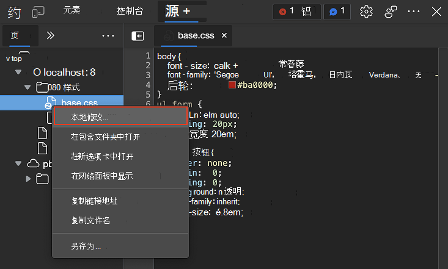
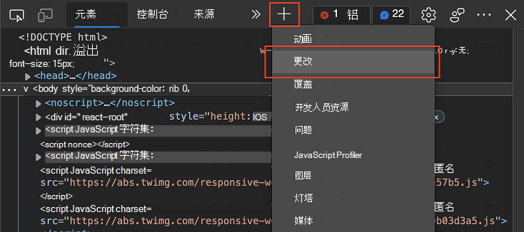
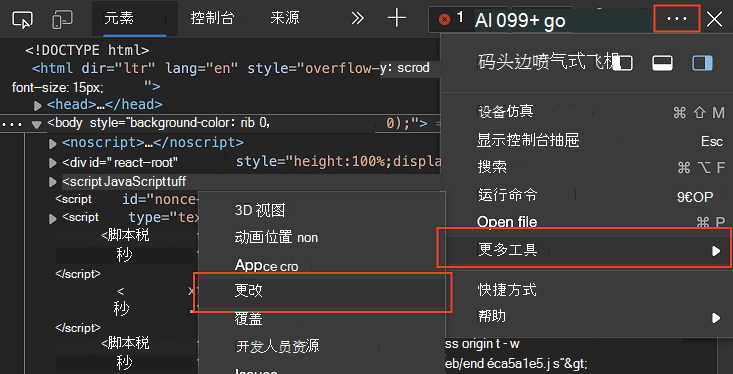

# 使用更改工具跟踪对文件的更改

**“更改”工具**跟踪你在 DevTools 中对 CSS 或 JavaScript 所做的任何更改。  它显示成功使用 DevTools 修改从服务器发送的网页文件后对实际源文件所做的更改。

使用 **“更改** ”工具快速显示所有更改，以便将这些更改重新应用到集成开发环境中的编辑器 (中的实际源文件;IDE) 。

在 DevTools 中，使用以下任一方法打开 **“更改** ”工具。  **更改工具**是**抽屉**工具;默认情况下，它将在**抽屉**中打开。

<!-- ====================================================================== -->
## 通过右键单击已更改的文件打开“更改”工具

在 [“源](../sources/index.md) ”工具中，右键单击任何显示已更改的文件，然后选择 **“本地修改**”：

<!-- ====================================================================== -->
## 单击“更多工具”图标打开“更改”工具

在主工具栏或 **抽屉** 工具栏上，单击“ **更多工具** ” () `+` 图标，然后选择 **“更改**”：

**更改**工具显示在主工具栏或**抽屉**中，具体取决于使用的工具栏。

<!-- ====================================================================== -->
## 单击“自定义 DevTools”图标打开“更改”工具

单击 **“自定义并控制 DevTools** ” (`...`) ，指向 **“更多”工具**，然后选择 **“更改**”：

<!-- ====================================================================== -->
## 使用命令菜单打开“更改”工具

在 Windows/Linux 或 `Command``P`++`Shift`Mac 上按下+`P`+`Ctrl``Shift`命令[菜单](../command-menu/index.md)，然后键入**更改**。  突出显示了 **“显示更改**”命令;按 。`Enter`

<!-- ====================================================================== -->
## 解释添加的行、删除的行以及行中的差异

侧窗格中列出了每个已修改的文件。  选择文件将修改显示为 `diff` 视图。  对于上下文，不会看到整个文件，但只会看到已更改的行，以及更改的行上方和下方的几行。

文件的差异视图显示文件的不同部分有两个修改。  一个更改是删除和插入，一个更改是已删除的行。

| 更改类型 | 指标 |
|---|--|
| 删除的行 | 从代码中删除的每一行前面都有一个 `-` 颜色为红色。 |
| 添加的行 | 每条新线前面都有一个 `+` ，颜色为绿色。 |
| 已更改的行 | 相邻的一对线，带有一 `-` 条线，然后是一 `+` 条线。 |

更改表示为在行号的两列中插入或删除单行代码。  左列表示旧文件中的行号，右列表示新文件中的行号。

<!-- ====================================================================== -->
## 在“源”工具中打开已更改的文件

单击 **“更改** ”工具中的修改行会打开 [“源](../sources/index.md) ”工具中的文件，并滚动到修改后的行。

<!-- ====================================================================== -->
## 撤消所有更改

若要撤消所有更改，请单击 `Revert all changes to the current file` 按钮，显示为圆形箭头。

<!-- ====================================================================== -->
## 水平滚动条目

对已缩小的文件进行更改后，“ **更改”工具** 允许你水平滚动以显示所有已缩小的代码。  若要水平滚动，请单击水平滚动条或按箭头键。

