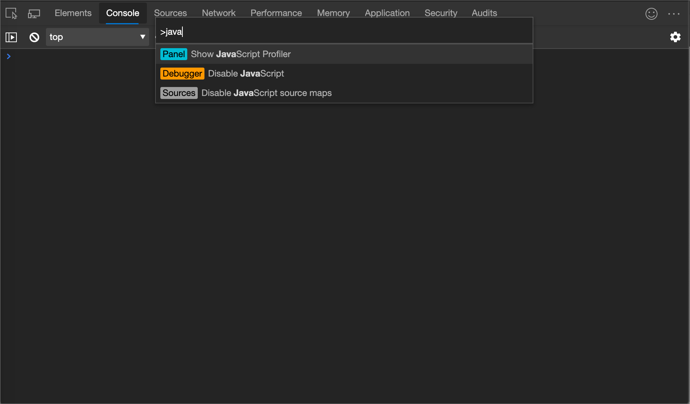
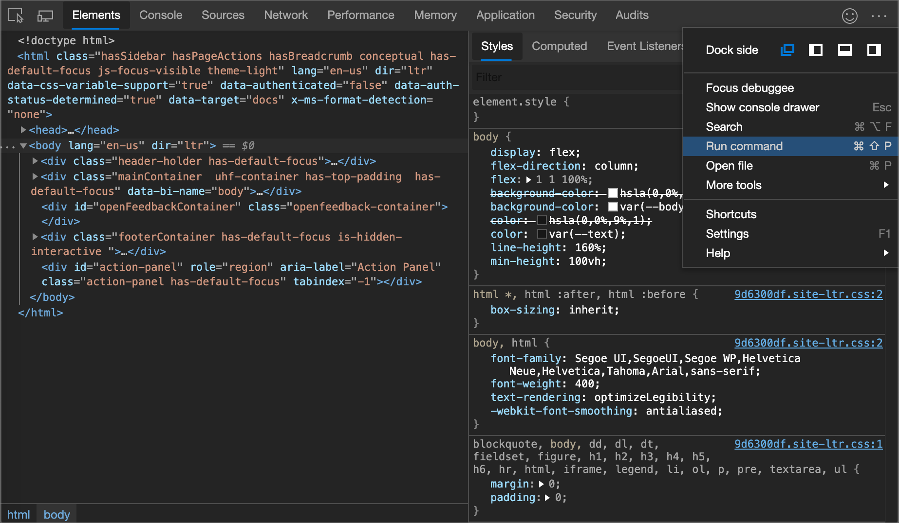
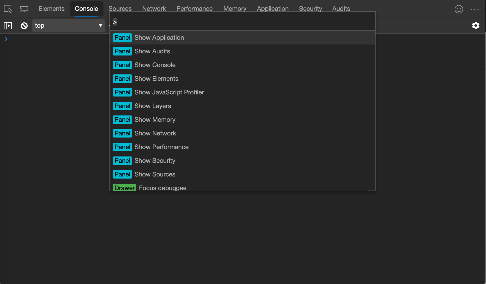
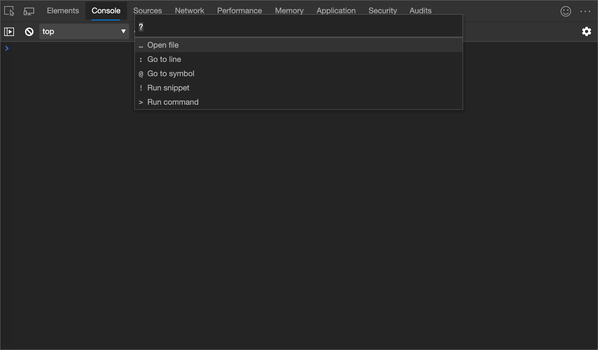

<!-- Copyright Kayce Basques

   Licensed under the Apache License, Version 2.0 (the "License");
   you may not use this file except in compliance with the License.
   You may obtain a copy of the License at

       https://www.apache.org/licenses/LICENSE-2.0

   Unless required by applicable law or agreed to in writing, software
   distributed under the License is distributed on an "AS IS" BASIS,
   WITHOUT WARRANTIES OR CONDITIONS OF ANY KIND, either express or implied.
   See the License for the specific language governing permissions and
   limitations under the License.  -->
# 在“命令”菜单中运行命令

命令菜单提供了一种快速的方式，Microsoft Edge开发人员工具 UI 和完成常见任务。  命令菜单类似于命令[面板中的Visual Studio Code](https://code.visualstudio.com/docs/getstarted/userinterface#_command-palette)：

<!-- ====================================================================== -->
## 打开命令菜单

打开命令菜单：

*  单击" **自定义和控制 DevTools**  。) 菜单按钮，然后选择" **运行命令"**：

   

   或者，按 `Ctrl`++`Shift``P` (Windows、Linux) 或 (`P` `Command`+`Shift`+macOS) 。

<!-- ====================================================================== -->
## 显示其他可用操作

"命令菜单"最初打开时，其 `>` 文本框中会预置一个字符：

若要显示"命令菜单"中提供 `>` 的其他操作，请删除该字符，然后键入 **？**：

<!-- ====================================================================== -->
## 另请参阅

* [键盘快捷方式](../shortcuts/index.md)
* [使用辅助技术导航开发工具](../accessibility/navigation.md)
* [自定义键盘快捷方式](../customize/shortcuts.md)

<!-- ====================================================================== -->
> [!NOTE]
> 此页面的某些部分是根据 [Google 创建和共享的](https://developers.google.com/terms/site-policies)作品所做的修改，并根据[ Creative Commons Attribution 4.0 International License ](https://creativecommons.org/licenses/by/4.0)中描述的条款使用。
> 原始页面位于[此处](https://developers.google.com/web/tools/chrome-devtools/command-menu/index)，由技术编写 (Chrome DevTools & Lighthouse) 创作。

本作品根据[ Creative Commons Attribution 4.0 International License ](https://creativecommons.org/licenses/by/4.0)获得许可。
