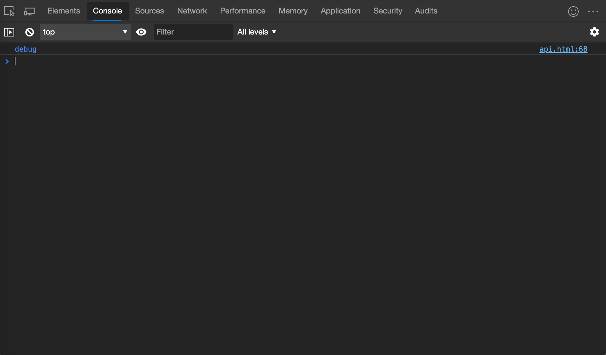
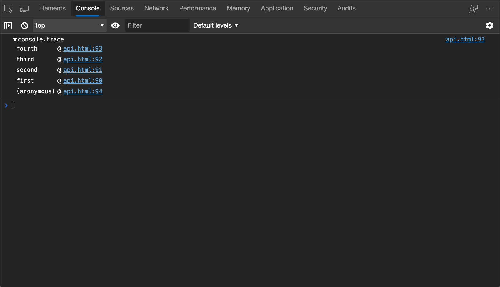

<!-- Copyright Kayce Basques

   Licensed under the Apache License, Version 2.0 (the "License");
   you may not use this file except in compliance with the License.
   You may obtain a copy of the License at

       https://www.apache.org/licenses/LICENSE-2.0

   Unless required by applicable law or agreed to in writing, software
   distributed under the License is distributed on an "AS IS" BASIS,
   WITHOUT WARRANTIES OR CONDITIONS OF ANY KIND, either express or implied.
   See the License for the specific language governing permissions and
   limitations under the License.  -->
# <a name="console-object-api-reference"></a>控制台对象 API 参考
<!-- orig:
# Console API reference
-->

使用对象 `console` 的方法从 JavaScript 将消息写入 **控制台** 。

还可以在 **控制台**中输入这些方法。  例如，在 **控制台**中，输入 `console` 采用变量的方法：

1. 在 **“源** ”工具的调试器中，在 JavaScript 代码中设置断点。

1. 在调试器中，逐步执行代码。

1. 在有效上下文中，使所需变量在范围内时，请在**控制台**工具中输入对象的方法`console`。  结果显示在 **控制台**中。

<br/><br/>

---

<!-- ====================================================================== -->
## <a name="assert"></a>断言

计算结果为时`expression`，将[错误](#error)写入`false`**控制台**。

```javascript
console.assert(expression, object)
```

[日志级别](reference.md#persist-messages-across-page-loads)： `Error`

### <a name="example"></a>示例

```javascript
const x = 5;
const y = 3;
const reason = 'x is expected to be less than y';
console.assert(x < y, {x, y, reason});
```

#### <a name="output"></a>输出


<br/><br/>

---

<!-- ====================================================================== -->
## <a name="clear"></a>清楚

清除 **控制台**。

如果已启用 [保留日志](reference.md#filter-by-log-level) ，则 [清除](#clear) 方法将关闭。

```javascript
console.clear()
```

### <a name="see-also"></a>另请参阅

* [清除控制台](reference.md#clear-the-console)

<br/><br/>

---

<!-- ====================================================================== -->
## <a name="count"></a>计数

写入 [计数方法在同](#count) 一行中调用的次数，并使用相同的 `label`次数。  使用 [countReset](#countreset) 方法重置计数。

```javascript
console.count([label])
```

[日志级别](reference.md#persist-messages-across-page-loads)： `Info`

### <a name="example"></a>示例

```javascript
console.count();
console.count('coffee');
console.count();
console.count();
```

#### <a name="output"></a>输出


<br/><br/>

---

<!-- ====================================================================== -->
## <a name="countreset"></a>countReset

重置计数。

```javascript
console.countReset([label])
```

### <a name="example"></a>示例

```javascript
console.countReset();
console.countReset('coffee');
```

<br/><br/>

---

<!-- ====================================================================== -->
## <a name="debug"></a>调试

与 [日志](#log) 方法相同，但不同的日志级别除外。

```javascript
console.debug(object [, object, ...])
```

[日志级别](reference.md#persist-messages-across-page-loads)： `Verbose`

### <a name="example"></a>示例

```javascript
console.debug('debug');
```

#### <a name="output"></a>输出



<br/><br/>

---

<!-- ====================================================================== -->
## <a name="dir"></a>dir

打印指定对象的 JSON 表示形式。

```javascript
console.dir(object)
```

[日志级别](reference.md#persist-messages-across-page-loads)： `Info`

### <a name="example"></a>示例

```javascript
console.dir(document.head);
```

#### <a name="output"></a>输出


<br/><br/>

---

<!-- ====================================================================== -->
## <a name="dirxml"></a>dirxml

打印后代 `node`的 XML 表示形式。

```javascript
console.dirxml(node)
```

[日志级别](reference.md#persist-messages-across-page-loads)： `Info`

### <a name="example"></a>示例

```javascript
console.dirxml(document);
```

#### <a name="output"></a>输出


<br/><br/>

---

<!-- ====================================================================== -->
## <a name="error"></a>错误

打印 `object` 到 **控制台**，将其格式化为错误，并包含堆栈跟踪。

```javascript
console.error(object [, object, ...])
```

[日志级别](reference.md#persist-messages-across-page-loads)： `Error`

### <a name="example"></a>示例

```javascript
console.error("I'm sorry, Dave.  I'm afraid I can't do that.");
```

#### <a name="output"></a>输出


<br/><br/>

---

<!-- ====================================================================== -->
## <a name="group"></a>组

直观地将消息分组到一起，直到使用 [groupEnd](#groupend) 方法。  使用 [groupCollapsed](#groupcollapsed) 方法在组最初登录到 **控制台**时将其折叠。

```javascript
console.group(label)
```

### <a name="example"></a>示例

```javascript
const label = 'Adolescent Irradiated Espionage Tortoises';
console.group(label);
console.info('Leo');
console.info('Mike');
console.info('Don');
console.info('Raph');
console.groupEnd(label);
```

#### <a name="output"></a>输出


<br/><br/>

---

<!-- ====================================================================== -->
## <a name="groupcollapsed"></a>groupCollapsed

与 [日志](#log) 方法相同，但组在登录到 **控制台**时最初折叠除外。

```javascript
console.groupCollapsed(label)
```

<br/><br/>

---

<!-- ====================================================================== -->
## <a name="groupend"></a>groupEnd

停止以视觉方式对消息进行分组。  请参阅 [组](#group) 方法。

```javascript
console.groupEnd(label)
```

<br/><br/>

---

<!-- ====================================================================== -->
## <a name="info"></a>信息

与 [日志](#log) 方法相同。

```javascript
console.info(object [, object, ...])
```

[日志级别](reference.md#persist-messages-across-page-loads)： `Info`

### <a name="example"></a>示例

```javascript
console.info('info');
```

#### <a name="output"></a>输出


<br/><br/>

---

<!-- ====================================================================== -->
## <a name="log"></a>日志

将消息打印到 **控制台**。

```javascript
console.log(object [, object, ...])
```

[日志级别](reference.md#persist-messages-across-page-loads)： `Info`

### <a name="example"></a>示例

```javascript
console.log('log');
```

#### <a name="output"></a>输出


<br/><br/>

---

<!-- ====================================================================== -->
## <a name="table"></a>表

将对象数组记录为表。

```javascript
console.table(array)
```

[日志级别](reference.md#persist-messages-across-page-loads)： `Info`

### <a name="example"></a>示例

```javascript
console.table([
      {
         first: 'René',
         last: 'Magritte',
      },
      {
         first: 'Chaim',
         last: 'Soutine',
         birthday: '18930113',
      },
      {
         first: 'Henri',
         last: 'Matisse',
      }
]);
```

#### <a name="output"></a>输出


<br/><br/>

---

<!-- ====================================================================== -->
## <a name="time"></a>time

启动新的计时器。  使用 [timeEnd](#timeend) 方法停止计时器并将已用时间打印到 **控制台**。

```javascript
console.time([label])
```

### <a name="example"></a>示例

```javascript
console.time();
for (var i = 0; i < 100000; i++) {
      let square = i ** 2;
}
console.timeEnd();
```

#### <a name="output"></a>输出


<br/><br/>

---

<!-- ====================================================================== -->
## <a name="timeend"></a>timeEnd

停止计时器。  有关详细信息，请参阅 [时间](#time) 方法。

```javascript
console.timeEnd([label])
```

[日志级别](reference.md#persist-messages-across-page-loads)： `Info`

<br/><br/>

---

<!-- ====================================================================== -->
## <a name="trace"></a>跟踪

将堆栈跟踪打印到 **控制台**。

```javascript
console.trace()
```

[日志级别](reference.md#persist-messages-across-page-loads)： `Info`

### <a name="example"></a>示例

```javascript
const first = () => { second(); };
const second = () => { third(); };
const third = () => { fourth(); };
const fourth = () => { console.trace(); };
first();
```

#### <a name="output"></a>输出



<br/><br/>

---

<!-- ====================================================================== -->
## <a name="warn"></a>警告

将警告输出到 **控制台**。

```javascript
console.warn(object [, object, ...])
```

[日志级别](reference.md#persist-messages-across-page-loads)： `Warning`

### <a name="example"></a>示例

```javascript
console.warn('warn');
```

#### <a name="output"></a>输出


<br/><br/>

---

<!-- ====================================================================== -->
## <a name="see-also"></a>另请参阅

<!-- if an article's title is adequately descriptive, and the article is in the same TOC bucket as the present article, don't much need a link here: -->
* [MDN Web 文档> `console` 对象引用](https://developer.mozilla.org/docs/Web/API/Console) - 具有方法的摘要概述，每个方法有一页，并提供其他语法详细信息。
* [在控制台工具中记录消息](console-log.md) - 交互式介绍。
* [控制台工具实用工具函数和选择器](utilities.md) - 仅**限控制台**的实用工具方法，例如`debug()`和 `monitorEvents()`。


<!-- ====================================================================== -->
> [!NOTE]
> 此页面的某些部分是根据 [Google 创建和共享的](https://developers.google.com/terms/site-policies)作品所做的修改，并根据[ Creative Commons Attribution 4.0 International License ](https://creativecommons.org/licenses/by/4.0)中描述的条款使用。
> 原始页面 [在此](https://developer.chrome.com/docs/devtools/console/api/) 处找到，由 [Kayce Basques](https://developers.google.com/web/resources/contributors/kaycebasques) (Technical Writer、Chrome DevTools & Lighthouse) 创作。

[](https://creativecommons.org/licenses/by/4.0)
本作品根据[ Creative Commons Attribution 4.0 International License ](https://creativecommons.org/licenses/by/4.0)获得许可。
