# <a name="fix-javascript-errors-that-are-reported-in-the-console"></a>修复控制台中报告的 JavaScript 错误

本文将引导你完成六个演示页，演示如何解决控制台中报告的 JavaScript 错误。


<!-- ====================================================================== -->
## <a name="fix-javascript-errors"></a>修复 JavaScript 错误

首次使用 **控制台** 的体验可能是脚本中的错误。


### <a name="demo-page-javascript-error-reported-in-the-console-tool"></a>演示页：控制台工具中报告的 JavaScript 错误

1. 在新窗口或选项卡 [中打开控制台工具中报告的演示网页 JavaScript 错误](https://microsoftedge.github.io/Demos/devtools-console/error.html) 。

1. 右键单击网页中的任意位置，然后选择 **“检查**”。  或者按 `F12`。  DevTools 将在网页旁边打开。

   在 DevTools 的右上角，“ **打开控制台查看错误** ”按钮显示有关网页的错误。

1. 单击 **“打开控制台”，查看** 右上角的错误按钮。  在 DevTools 中， **控制台** 提供有关错误的详细信息：

   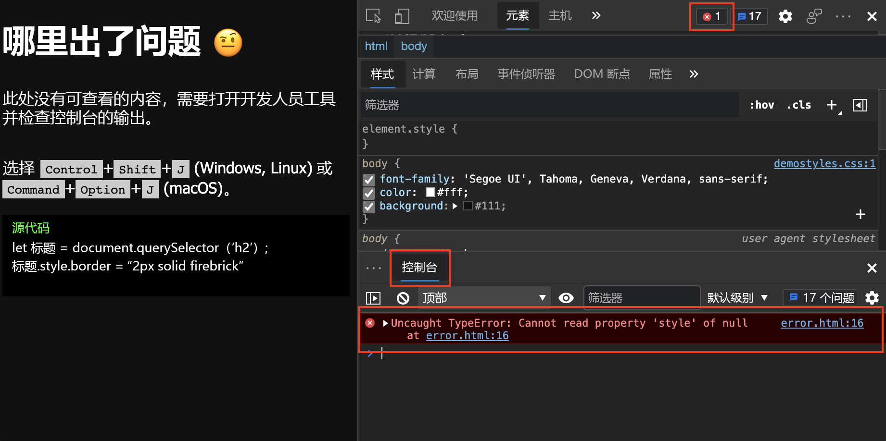

   **控制台**中的许多错误消息在 Web 按钮**上都有搜索此消息**，显示为放大镜。  Microsoft Edge版本 94 中引入了此功能。   (有关详细信息，请 [参阅在 Web 上搜索控制台错误消息 string](index.md#search-the-web-for-a-console-error-message-string).) 

   此错误消息中的信息表明该错误位于文件的第 16 `error.html` 行。

1. `error.html:16`单击**控制台**中错误消息右侧的链接。  **“源**”工具随错误打开并突出显示代码行：

   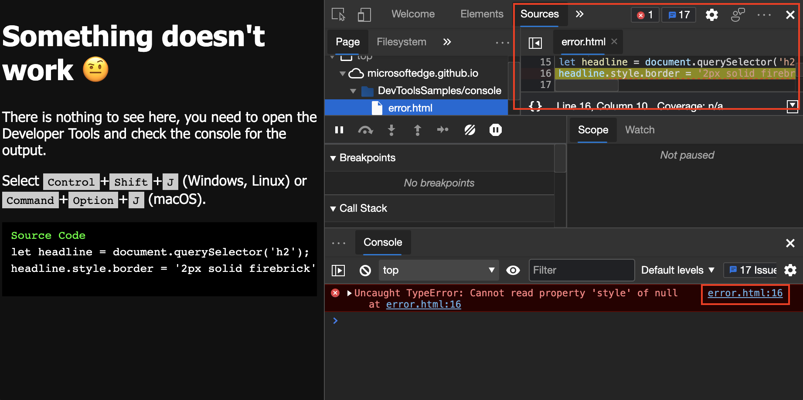

   该脚本尝试获取文档中的第一 `h2` 个元素，并在文档周围绘制红色边框。  但是不存在任何 `h2` 元素，因此脚本会失败。


<!-- ====================================================================== -->
## <a name="find-and-debug-network-issues"></a>查找和调试网络问题

**控制台**还报告网络错误。


### <a name="demo-page-network-error-reported-in-console"></a>演示页：控制台中报告的网络错误

1. 在新窗口或选项卡 [中打开控制台中报告](https://microsoftedge.github.io/Demos/devtools-console/network-error.html) 的演示网页网络错误。

1. 右键单击网页中的任意位置，然后选择 **“检查**”。  或者按 `F12`。  DevTools 将在网页旁边打开。

   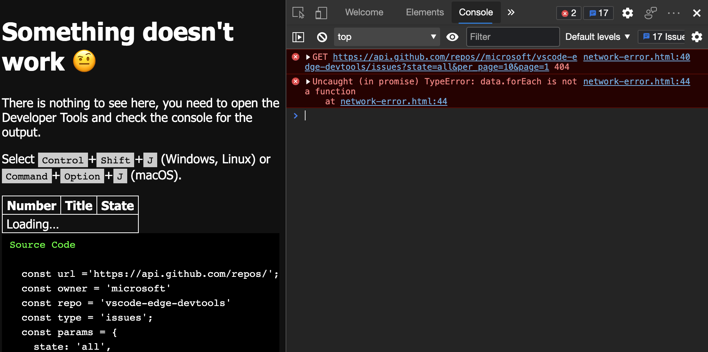

   表显示 `loading`，但网页上没有任何更改，因为永远不会检索数据。  在 **控制台**中，发生了以下两个错误：

   *  以 HTTP 方法开 `GET` 头，后跟 URI 的网络错误。

   *  错误 `Uncaught (in promise) TypeError: data.forEach is not a function` 。

1. 单击指向发生错误的网页和代码行的链接，打开“源”工具。  也就是说，单击`network-error.html:40`**控制台**中的链接：

   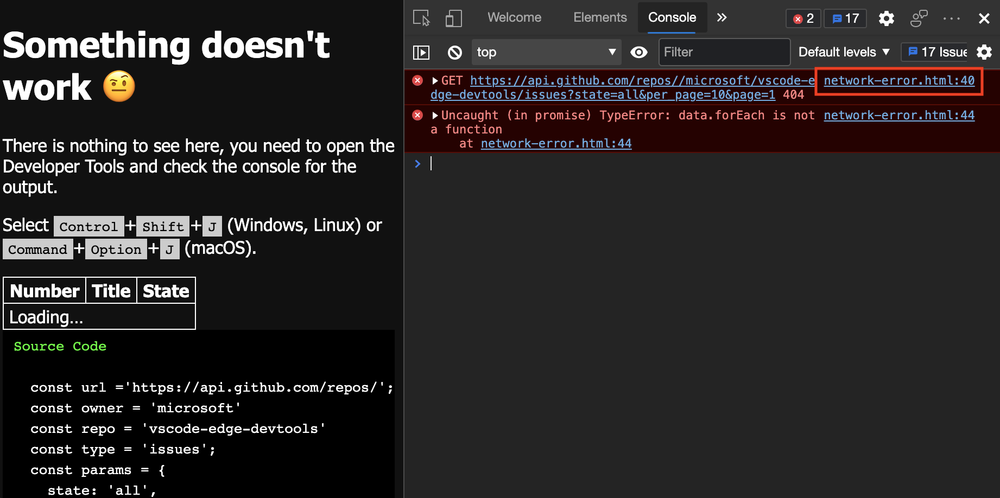

   “ **源** ”工具随即打开。  问题代码行突出显示，后跟 (`error`) `x` 按钮。

1. 单击 **) ** `x` 按钮 (错误。  将显示该消息 `Failed to load resource: the server responded with a status of 404 ()` 。

   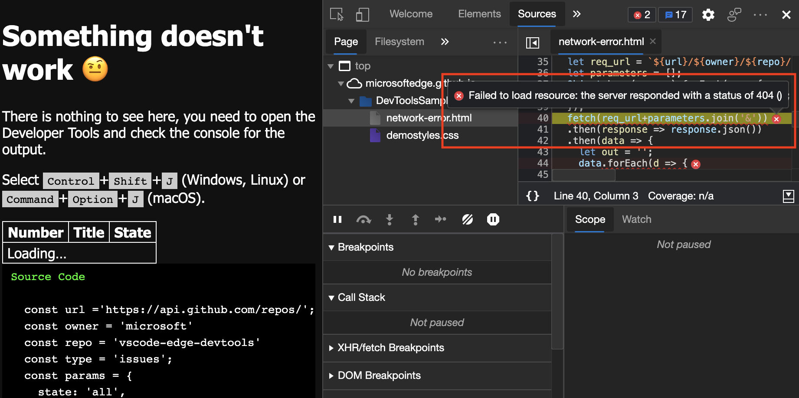

   此错误通知你找不到请求的 URL。

1. 打开 **网络** 工具，如下所示：打开 **控制台**，然后单击与错误关联的 URI。

   主机在未加载资源后显示错误的 HTTP 状态代码：

   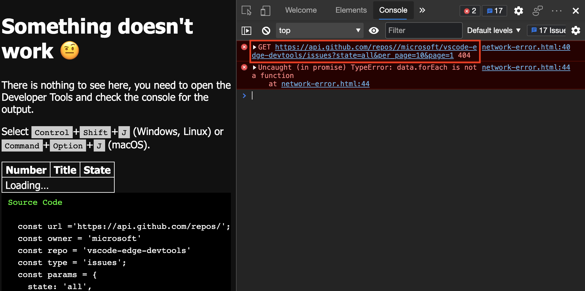

   **网络**工具显示有关失败请求的详细信息：

   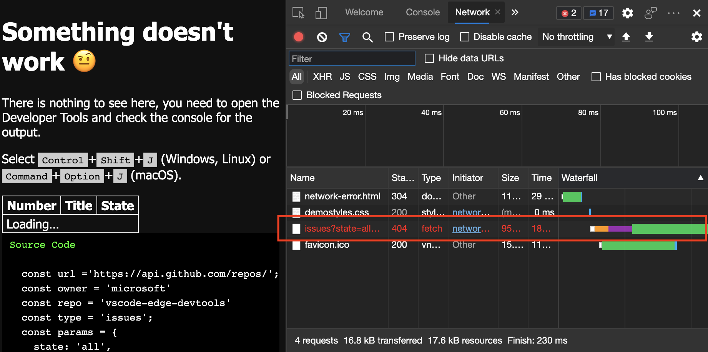

1. 检查 **网络** 工具中的标头以获取更多见解：

   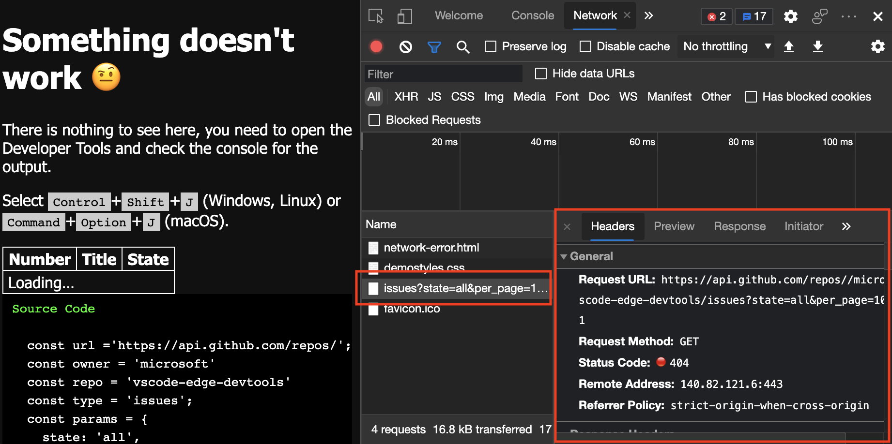

   问题出在哪里？  两个斜杠字符 (`//`) 在单词 `repos`后在请求的 URI 中发生。

1. 打开 **“源** ”工具并检查第 26 行。  尾部斜杠字符 (`/`) 在基 URI 的末尾发生。  **“源**”工具显示包含错误的代码行：

   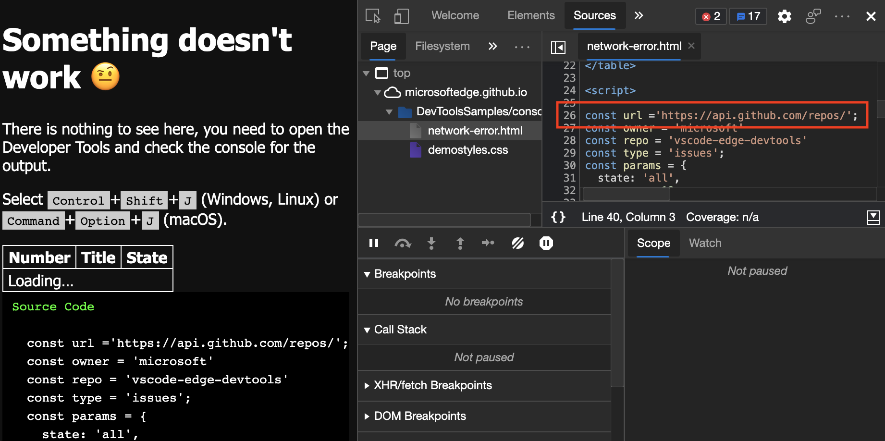


### <a name="viewing-the-resulting-page-when-there-are-no-errors-in-the-console"></a>在控制台中没有错误时查看生成的页面

接下来，我们将在 **控制台**中没有错误时查看生成的页面。


#### <a name="demo-page-fixed-network-error-reported-in-console"></a>演示页：修复了控制台中报告的网络错误

1. 在新窗口或选项卡中打开演示网页 [修复控制台中报告的网络错误](https://microsoftedge.github.io/Demos/devtools-console/network-error-fixed.html) 。

   无任何错误的示例从GitHub加载信息并显示该示例：

   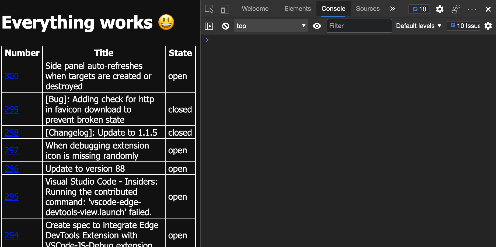


#### <a name="demo-page-network-error-reporting-in-console-and-ui"></a>演示页：控制台和 UI 中的网络错误报告

使用防御性编码技术来避免以前的用户体验。  确保代码捕获错误并在 **控制台**中显示每个错误，如下所示：

1. 在新窗口或选项卡 [中打开控制台和 UI 中的演示网页网络错误报告](https://microsoftedge.github.io/Demos/devtools-console/network-error-reported.html) 。

1. 右键单击网页中的任意位置，然后选择 **“检查**”。  或者按 `F12`。  DevTools 将在网页旁边打开。

   示例网页演示了以下做法：

   *  向用户提供 UI 以指示出现问题。

   *  在 **控制台**中，提供有关代码中的 **网络** 错误的有用信息。

   该示例捕获并报告错误：

   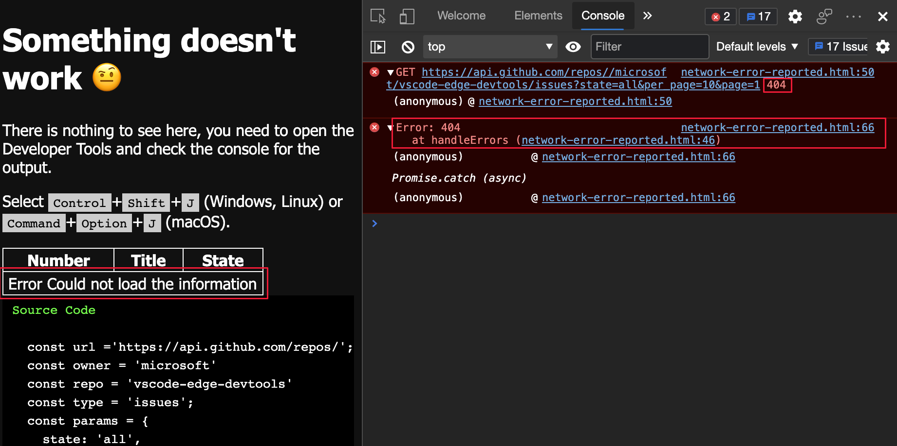

   演示中的以下代码捕获并报告使用该 `handleErrors` 方法的错误，特别是 `throw Error` 行：

   ```javascript
   const handleErrors = (response) => {
      if (!response.ok) {
         let message = 'Could not load the information'
         document.querySelector('tbody').innerHTML = `
         <tr><td colspan=3>Error ${message}</td></tr>
         `;
         throw Error(response.status + ' ' + response.statusText);
      }
      return response;
   };
   ```
   

<!-- ====================================================================== -->
## <a name="create-errors-and-traces-in-the-console"></a>在控制台中创建错误和跟踪

除了上一 `throw Error` 部分中的示例外，还可以在 **控制台**中创建不同的错误和跟踪问题。


### <a name="demo-page-creating-error-reports-and-assertions-in-console"></a>演示页：在控制台中创建错误报告和断言

若要在控制台中显示两条已创建的错误消息，请执行 **以下操作**：

1. 在新窗口或选项卡中打开演示页“ [在控制台中创建错误报告和断言](https://microsoftedge.github.io/Demos/devtools-console/error-assert.html) ”。

1. 右键单击网页中的任意位置，然后选择 **“检查**”。  或者按 `F12`。  DevTools 将在网页旁边打开。

   错误消息显示在 **控制台**中：

   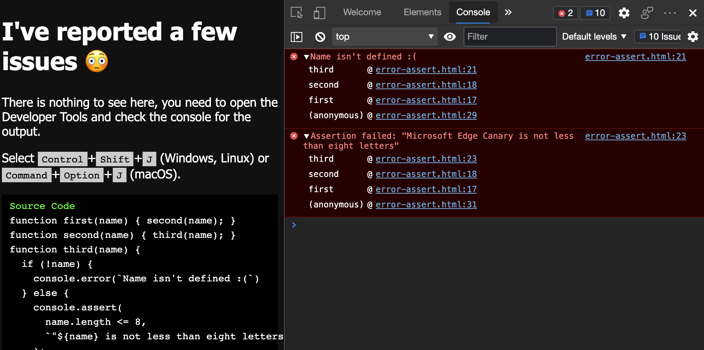

   演示页使用以下代码：

    ```javascript
    function first(name) { second(name); }
    function second(name) { third(name); }
    function third(name) {
        if (!name) {
            console.error(`Name isn't defined :(`)
        } else {
            console.assert(
                name.length <= 8,
                `"${name} is not less than eight letters"`
            );
        }
    }
    first();
    first('Console');
    first('Microsoft Edge Canary');
    ```
    
   有三个函数连续请求：

   *  `first()`
   *  `second()`
   *  `third()`

   每个函数向另一个函数发送一个 `name` 参数。  在函数中`third()``name`，检查参数是否存在，如果该参数不存在，则记录未定义该名称的错误。  如果 `name` 定义了参数，则使用该 `assert()` 方法检查参数长度是否 `name` 少于 8 个字母。

   使用以下参数请求函 `first()` 数三次：

    *  没有触发 `console.error()` 函数中方法的 `third()` 参数。

    *  作为函数参数的`first()`术语`Console`不会导致错误，因为`name`参数存在且短于 8 个字母。

    *  作为函数参数`first()`的短语`Microsoft Edge Canary`会导致`console.assert()`方法报告错误，因为该参数超过 8 个字母。

   演示使用<!--todo: confirm--> `console.assert()`用于创建条件错误报告的方法。  以下两个示例的结果相同，但其中一个示例需要额外的 `if{}` 语句：

    ```javascript
    let x = 20;
    if (x < 40) { console.error(`${x} is too small`) };
    console.assert(x >= 40, `${x} is too small`)
    ```

   代码的第二行和第三行执行相同的测试。  因为断言需要记录负结果：

   *  在本`if`例中进行`x < 40`测试。
   *  `x >= 40`测试断言。


### <a name="demo-page-creating-traces-in-console"></a>演示页：在控制台中创建跟踪

如果不确定哪个函数请求另一个函数，请使用 `console.trace()` 该方法来跟踪请求哪些函数以访问当前函数。

若要在 **控制台**中显示跟踪，请执行以下操作：

1. 在新窗口或选项卡中打开演示页“ [在控制台中创建跟踪](https://microsoftedge.github.io/Demos/devtools-console/trace.html) ”。

1. 右键单击网页中的任意位置，然后选择 **“检查**”。  或者按 `F12`。  DevTools 将在网页旁边打开。

   该页面使用以下代码：

   ```javascript
   function here() {there()}
   function there() {everywhere()}
   function everywhere() {
      console.trace();
   }
   here();
   there();
   ```
    
   结果是一个跟踪， `here()` 以显示命名 `there()` ，然后 `everywhere()`，并在第二个示例中显示它的命名 `everywhere()`。

   下面是在 **控制台**中生成的跟踪：

   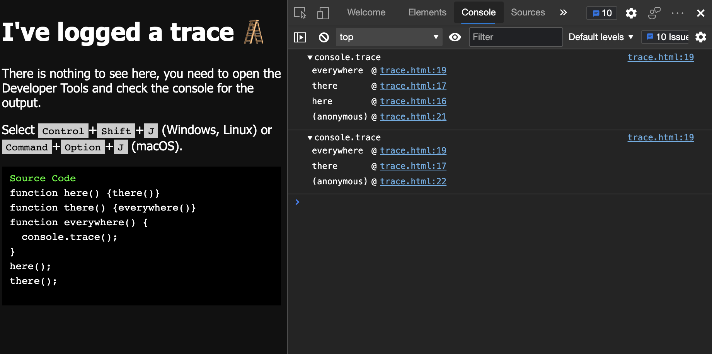


<!-- ====================================================================== -->
## <a name="see-also"></a>另请参阅

* [控制台概述](index.md) - 一般使用 **控制台** 来显示和解决错误消息。
