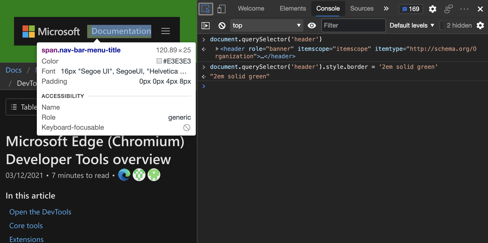
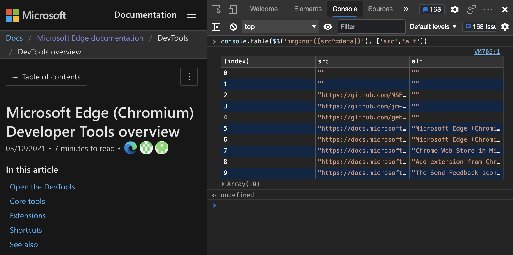
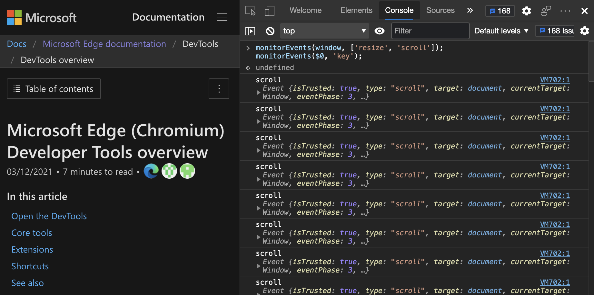
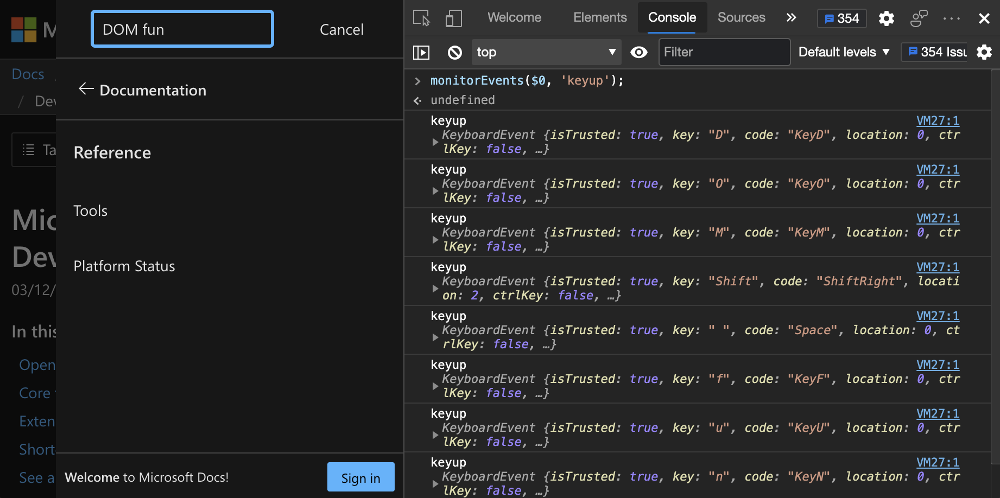

# <a name="interact-with-the-dom-using-the-console"></a>使用控制台与 DOM 交互

**控制台**工具是与浏览器中的网页交互的好方法。<!-- todo: add intro explanation -->  **控制台**类似于[检查工具](../css/inspect.md)的脚本环境版本。<!-- todo: add intro explanation -->


<!-- ====================================================================== -->
## <a name="read-from-the-dom"></a>从 DOM 读取

若要引用网页的标头，请执行以下操作：

1. 打开 DevTools **控制台**。  若要从网页执行此操作，可以按 `Ctrl`++`Shift``J` (Windows、Linux) 或`J` `Command`+`Option`+ (macOS) 。

1. 键入或粘贴以下代码到 **控制台**，然后按 `Enter`下：

   ```javascript
   document.querySelector('header')
   ```

   

1. 在 **控制台**中，将鼠标悬停在生成的 HTML `<header>` 元素上，或按下 `Shift`+`Tab`。  在呈现的网页中，DevTools 突出显示标头：

   


<!-- ====================================================================== -->
## <a name="manipulate-the-dom"></a>操作 DOM

可以从 **控制台**操作网页，如下所示。  在此示例中，使用控制台在 DOM 中设置一个值，以影响网页样式：在标头周围添加绿色边框。

1. 按`Ctrl`+`Shift`+`J`（Windows、Linux）或 `Command`+`Option`+`J` （macOS）。  控制台在 DevTools 中打开，位于当前网页旁边。

1. 将以下代码粘贴到 **控制台**中：

   ```javascript
   document.querySelector('header').style.border = '2em solid green'
   ```

   标头周围显示绿色边框：

   


### <a name="get-a-direct-reference-an-element"></a>获取元素的直接引用

根据网页的复杂性，找到合适的元素进行操作可能令人望而生畏。  但可以使用 **“检查** ”工具来帮助你。  假设要在呈现的页面标题中操作 **文档** 区域：


若要直接引用要操作的元素，请执行以下操作：

1. 在 DevTools 中，单击 **“检查** ”工具，然后在呈现的网页中将鼠标悬停在元素上：

   

1. 单击页面上的元素，DevTools 跳转到 **“元素** ”工具。

1. `...`单击 DOM 树中元素旁边的菜单：

   

1. 右键单击 DOM 树中的元素，然后选择 **“复制** > **JS 路径**”。

   

   <!-- could be useful to have code listings.  test this:
   Here's the JS path you copied:

   ```javascript
   document.querySelector("#headerAreaHolder > header > div:nth-child(1) > div.nav-bar-item.is-hidden-tablet > div > button > span")
   ```

   Here's the result after you add text content:

   ```javascript
   document.querySelector("#headerAreaHolder > header > div:nth-child(1) > div.nav-bar-item.is-hidden-tablet > div > button > span").textContent = "My Playground"
   ``` -->

1. 在 **控制台**中，粘贴复制但尚未按 `Enter` 下的 JavaScript 路径。

1. 将链接的文本更改为 `My Playground`。  为此，请添加 `.textContent = "My Playground"` 到之前粘贴的 JavaScript 路径：

   

在 **控制台**中使用所需的任何 JavaScript DOM 操作。  为了使它更方便， **控制台** 附带了一些帮助程序实用工具方法。


<!-- ====================================================================== -->
## <a name="helpful-console-utility-methods"></a>有用的控制台实用工具方法

许多方便的方法和快捷方式都可用作 [控制台实用工具](utilities.md)。  有些方法非常强大，比使用 `console.log()` 语句更有效。


### <a name="the-power-of-the--functions"></a>$ 函数的功能

控制`$`**台**中具有特殊功能，你可能还记得 jQuery 中的功能。

*  `$_` 存储最后一个命令的结果。  因此，如果键入 `2+2` 并按 `Enter`下，然后键入 `$_`， **控制台** 将显示 `4`。

*  `$0` to `$4` 是最后一个已检查元素的堆栈。  `$0` 始终是最新的。  因此，在前面的示例中，只需选择 **“检查** ”工具中的元素并键入 `$0.textContent = "My Playground"` 以获得相同的效果。

*  `$x()` 允许使用 XPATH 选择 DOM 元素。

*  `$()` 并且 `$$()` 是较短版本的 for `document.querySelector()` 和 `document.querySelectorAll()`.


### <a name="example-extracting-all-links-from-a-page-as-a-sortable-table"></a>示例：从页面中提取所有链接，作为可排序表

1. 输入以下代码，该代码检索网页中的所有链接，并将链接显示为可排序表，以复制和粘贴 (，例如，将其粘贴到 Excel) ：

   ```javascript
   console.table($$('a'),['href','text']);
   ```
   
   `$$('a')` 是简短的 `document.querySelectorAll('a')`。

   

   但是，假设你不想显示所有信息，但要将其作为数据获取，然后仅选择一些数据。

   此 `$$('a')` 快捷方式有助于实现此操作：它为每个定位点链接选择定位点链接和所有属性。  但问题是，你只想要定位点链接和相关文本，而不是定位点链接的所有属性。

   

   为了解决该问题， `$$` 快捷方式有一个有趣的额外功能：而不是返回纯 `NodeList` 像 `document.querySelectorAll()`， `$$` 快捷方式给你所有 `Array` 的方法，包括 `map()`。

1. `map()`使用对象的方法`Array`将信息减少到所需的内容：

   ```javascript
   $$('a').map(a => {
      return {url: a.href, text: a.innerText}
   })
   ```

   上面的代码返回所有链接中的一个 `Array` ，作为具有 `url` 和 `text` 属性的对象。

   

   尚未完成;多个链接是指向网页的内部链接，或包含空文本。

1. 使用该 `filter` 方法删除内部链接：

   ```javascript
   $$('a').map(a => {
      return {text: a.innerText, url: a.href}
   }).filter(a => {
      return a.text !== '' && !a.url.match('learn.microsoft.com')
   })
   ```

   

   通过在 **控制台**中通过发出语句来操作 DOM，可以在呈现的网页中更改这些元素。

1. 例如，输入以下代码，该代码在所有外部链接周围添加绿色边框：

   ```javascript
   $$('a[href^="https://"]').forEach(
      a => a.style.border = '1px solid green'
   )
   ```

   

使用 CSS 选择器的功能，而不是编写复杂的 JavaScript 来筛选结果。


### <a name="creating-a-table"></a>创建表

若要为网页上所有不是内联图像的 `src` 图像创建表和 `alt` 信息：

1. 打开“**控制台**”。

1. 将以下代码粘贴到**控制台**，然后按 `Enter`：

   ```javascript
   console.table($$('img:not([src^=data])'), ['src','alt'])
   ```

   

<!-- mystery wiggly line preventer -->


### <a name="example-getting-all-page-headings-and-anchor-urls"></a>示例：获取所有页面标题和定位 URL

准备好使用更复杂的示例了吗？  从 Markdown 标记生成的 HTML 网页（如本文所示）具有每个标题的自动 ID 值，以便直接深入链接到网页的该部分。  例如， `# New features` Markdown 源文件中的 h1 标题在 HTML 文件中变 `<h1 id="new-features">New features</h1>` 为。

列出要复制和粘贴的所有自动标题：

1. 打开“**控制台**”。

1. 复制并粘贴以下代码：

   ```javascript
   let out = '';
   $$('#main [id]').filter(
      elm => {return elm.nodeName.startsWith('H')}
   ).forEach(elm => {
      out += elm.innerText + "\n" +
            document.location.href + '#' +
            elm.id + "\n";
   });
   console.log(out);
   ```
    
   结果是包含每个标题的内容的文本，后跟指向它的完整 URL。

   


### <a name="clean-up-with-clear-and-copy"></a>清除并复制

在 **控制台**中开发时，情况可能会变得混乱。  选择要复制和粘贴的结果可能很困难。  以下两种实用工具方法可帮助你：

* `copy()` 将你提供的任何内容复制到剪贴板。  当你将其与`$_`复制最后一个结果混合时，该`copy()`方法特别有用。

* `clear()` 清除 **控制台**。


### <a name="read-and-monitor-events"></a>读取和监视事件

**控制台**的另外两种有趣的实用工具方法处理事件处理：

* `getEventListeners(node)` 列出节点的所有事件侦听器。

* `monitorEvents(node, events)` 监视和记录节点上发生的事件。


列出在网页中分配给第一个窗体的所有事件侦听器：

1. 在 DevTools 中，打开 **控制台**。

1. 在 **控制台**中键入或粘贴以下代码：

   ```javascript
   getEventListeners($('form'));
   ```

   

监视时，每次对指定元素发生更改时，都会在 **控制台** 中收到通知。  将要侦听的事件定义为第二个参数。  定义要监视的事件非常重要，否则会报告发生在元素上的任何事件。


若要在每次滚动时在 **控制台** 中获取通知，请调整窗口大小，或者当用户键入搜索窗体时：

1. 在 DevTools 中，打开 **控制台**。

1. 将以下代码粘贴到 **控制台**中：

   ```javascript
   monitorEvents(window, ['resize', 'scroll']);
   monitorEvents($0, 'keyup');
   ```

   

1. 若要记录当前所选元素上的任何键操作，请专注于标头中的搜索窗体，然后按一些键。

   

1. 若要停止日志记录，请删除设置的监视，请在 **控制台**中输入以下代码：

   ```javascript
   unmonitorEvents(window, ['resize', 'scroll']);
   unmonitorEvents($0, 'key');
   ```
   

<!-- ====================================================================== -->
## <a name="reuse-dom-manipulation-scripts"></a>重复使用 DOM 操作脚本

你可能会发现从 **控制台**操作 DOM 很有用。  你可能很快就会遇到 **控制台** 作为开发平台的限制。  好消息是，DevTools 中的 [“源](../sources/index.md) ”工具提供了一个功能齐全的开发环境。  在 **“源** ”工具中，可以：

*  将 **控制台** 的脚本存储为代码片段;请参阅 [任何网页上 JavaScript 的运行代码片段](../javascript/snippets.md)。

*  使用键盘快捷方式或编辑器在网页中运行脚本。


<!-- ====================================================================== -->
## <a name="see-also"></a>另请参阅

* [在控制台工具中记录消息](console-log.md)
* [在控制台中运行 JavaScript](console-javascript.md)
