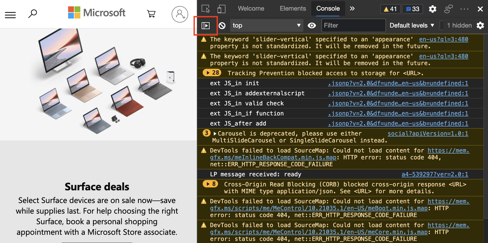
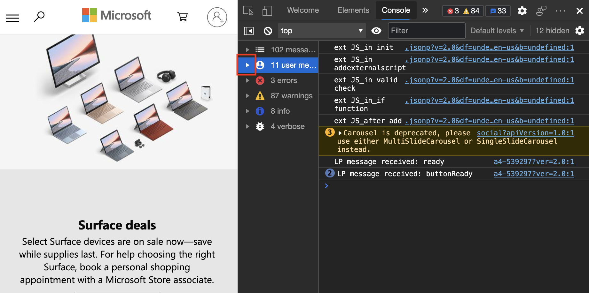

# 筛选控制台消息

使用 DevTools **控制台** 的筛选器选项来减少来自过多控制台日志消息的干扰，以便更好地查看要查找的日志消息的类型。

转到各种网页时，可能会发现 **控制台** 中充斥着各种信息。  通常，这些信息与你无关，例如有关另一个开发人员记录的页面的信息。  或者，你可能会看到有关当前站点性能的违规和警告的记录信息，你无法更改这些信息。  

可以通过各种方式筛选控制台日志消息：
*  按日志级别进行筛选。
*  按文本筛选。
*  按正则表达式进行筛选。
*  按消息源筛选。

<!-- ====================================================================== -->
## 按记录级别筛选

对象的 `console` 每个方法都附加了严重级别。  严重性级别为 `Verbose`，`Info`或 `Warning``Error`.  在 [API 文档](api.md)中显示严重级别。  例如， `console.log()` 是 `Info`-level 消息，但 `console.error()` 却是 `Error`-level 消息。

若要在 **控制台**中筛选消息，请使用 **“日志级别** ”下拉菜单。  可以切换每个级别的状态。  若要关闭每个级别，请删除每个级别旁边的复选标记。

由于未应用筛选器，下图显示数十条消息。  接下来，减少和管理消息数。

若要隐藏要减少干扰的所有警告级别消息，请单击 **“日志级别** ”下拉列表，然后清除该 `Warnings` 级别。

<!-- ====================================================================== -->
## 按文本筛选

若要查看更多详细信息，若要使用文本筛选消息，请在 **“筛选器** ”文本框中键入字符串。  例如，在框中键入 **块** 以仅显示有关阻止资源加载的浏览器的消息。

<!-- ====================================================================== -->
## 按正则表达式筛选

[正则表达式](https://developer.mozilla.org/docs/Web/JavaScript/Guide/Regular_Expressions) 是筛选消息的强大方式。  例如，键 `/^Tracking/` 入“ **筛选器** ”文本框以仅显示以术语开头 `Tracking`的消息。  如果不熟悉正则表达式， [RegExr.com](https://regexr.com) 是了解使用正则表达式的绝佳资源。

<!-- ====================================================================== -->
## 按邮件源筛选

可以使用**控制台**的 **Sidebar** 定义要显示哪些类型的消息以及每个消息的来源。

1. 单击 **“显示控制台边栏** ”按钮：

   

   **打开 Sidebar** 时，可以显示消息总数以及每个消息的来源。  选项包括`All messages`：、`User Messages`、`Errors`、`Warnings``Info`和 `Verbose`。

   

1. 选择任何选项以仅显示该类型的消息。  例如，若要显示用户消息，请单击用户消息选项以显示较少的干扰。

   

1. 若要筛选更多内容并展开消息类别，请单击邮件类别旁边的三角形图标。

   

1. 显示并列出单个源。  选择源，仅显示源源的消息：

   
