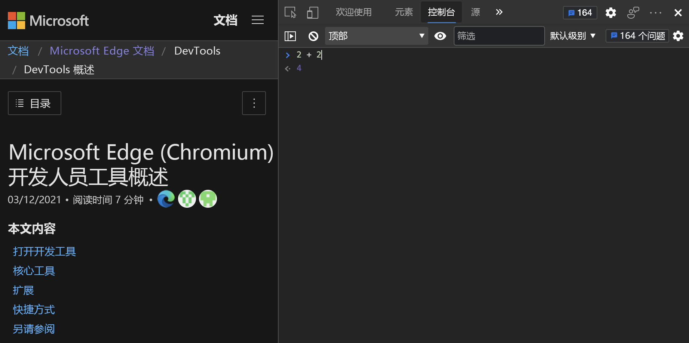
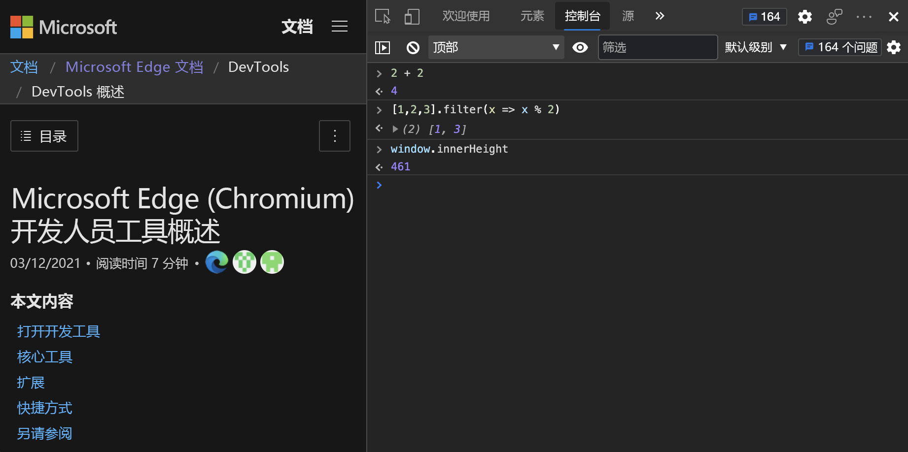

# <a name="run-javascript-in-the-console"></a>在控制台中运行 JavaScript

可以在 **控制台**中输入任何 JavaScript 表达式、语句或代码片段，并在键入时立即以交互方式运行。  这是可能的，因为 DevTools 中的 **控制台** 工具是 [REPL](https://en.wikipedia.org/wiki/Read%E2%80%93eval%E2%80%93print_loop) 环境。  _REPL_ 代表读取、评估、打印和Loop。

**控制台**：
1. 读取键入其中的 JavaScript。
1. 评估代码。
1. 输出表达式的结果。
1. 循环返回到第一步。


若要在 **控制台**中以交互方式输入 JavaScript 语句和表达式：

1. 在网页中右键单击，然后选择 **“检查**”。  DevTools 随即打开。  或者，按 `Ctrl`++`Shift``J` \ (Windows、Linux\) 或`J` `Command`+`Option`+\ (macOS\) ，直接打开 DevTools 控制台。

1. 如有必要，请在 DevTools 中单击以使其成为焦点，然后按下 `Esc` 以打开 **控制台**。

1. 在 **控制台**中单击，然后键入 `2+2`，而不按 `Enter`。

   键入时 **，控制台** 会立即在下一行中显示结果 `4` 。  此 `Eager evaluation` 功能可帮助你编写有效的 JavaScript。  无论 JavaScript 是否正确，以及是否存在有效结果， **控制台** 都会在键入时显示结果。

   

1. 按下 `Enter`时， **控制台** 将运行 JavaScript 命令 (表达式或语句) ，显示结果，然后向下移动光标以允许输入下一个 JavaScript 命令。

   


<!-- ====================================================================== -->
## <a name="autocompletion-to-write-complex-expressions"></a>自动完成以写入复杂表达式

控制 **台** 可帮助你使用自动完成编写复杂的 JavaScript。  此功能是了解以前不知道的 JavaScript 方法的好方法。

在编写多部分表达式时尝试自动完成：

1. 键入 `doc`。

1. 按箭头键在下拉菜单上突出显示 `document` 。

1. 按 `Tab` 下以选择 `document`。

1. 键入 `.bo`。

1. 按 `Tab` 下以选择 `document.body`。

1. 键入另 `.` 一个属性以获取当前网页正文中可用的可能属性和方法的大列表。

   


<!-- ====================================================================== -->
## <a name="console-history"></a>控制台历史记录

与许多其他命令行环境一样，输入的命令的历史记录可供重复使用。  按 `Up Arrow` 下以显示之前输入的命令。  

同样，自动完成会保留以前键入的命令的历史记录。  可以键入前面几个命令的字母，前面的选择将显示在文本框中。

此外， **控制台** 还提供了许多 [实用工具方法](utilities.md) ，使你的生活更轻松。  例如， `$_` 始终包含在 **控制台**中运行的最后一个表达式的结果。


<!-- ====================================================================== -->
## <a name="multiline-edits"></a>多行编辑

默认情况下， **控制台** 只提供一行来编写 JavaScript 表达式。  按下代码时 `Enter`运行代码。 一行限制可能会使你感到沮丧。  若要解决 1 行限制问题，请按而不是`Enter`按`Shift`+`Enter`。  在以下示例中，显示的值是所有行 (语句) 按顺序运行的结果：


如果在 **控制台**中启动多行语句，则代码块会自动识别并缩进。  例如，如果通过输入大括号启动块语句，则会自动缩进下一行：


<!-- ====================================================================== -->
## <a name="network-requests-using-top-level-await"></a>使用顶级 await 的网络请求 () 

除了在你自己的脚本中， **控制台** 还支持 [顶层等待](https://github.com/tc39/proposal-top-level-await) 在其中运行任意异步 JavaScript。  例如，使用 `fetch` API 而不使用异步函数包装 `await` 语句。

若要获取针对[Visual Studio Code GitHub存储库Microsoft Edge开发人员工具](https://github.com/microsoft/vscode-edge-devtools)上提交的最后 50 个问题：

1. 在 DevTools 中，打开 **控制台**。

1. 复制并粘贴以下代码片段以获取包含 10 个条目的对象：

   ```javascript
   await ( await fetch(
   'https://api.github.com/repos/microsoft/vscode-edge-devtools/issues?state=all&per_page=50&page=1'
   )).json();
   ```

   

   这 10 个条目很难识别，因为会显示大量信息。

1. （可选） `console.table()` 使用日志方法仅接收感兴趣的信息：

   

   若要重复使用从表达式返回的数据，请使用`copy()`**控制台**的实用工具方法。

   <!-- todo: test: -->

1. 粘贴以下代码。  它会发送请求并将响应中的数据复制到剪贴板：

   ```javascript
   copy(await (await fetch(
   'https://api.github.com/repos/microsoft/vscode-edge-devtools/issues?state=all&per_page=50&page=1'
   )).json())
   ```
   
**控制台**是练习 JavaScript 和执行一些快速计算的好方法。  真正强大的是你有权访问 [窗口](https://developer.mozilla.org/docs/Web/API/Window) 对象。  请参阅 [使用控制台与 DOM 交互](console-dom-interaction.md)。
