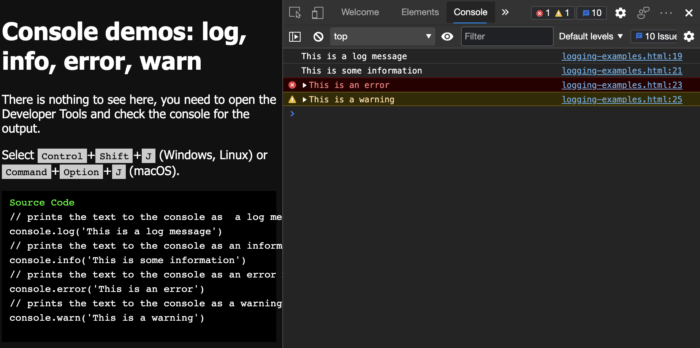
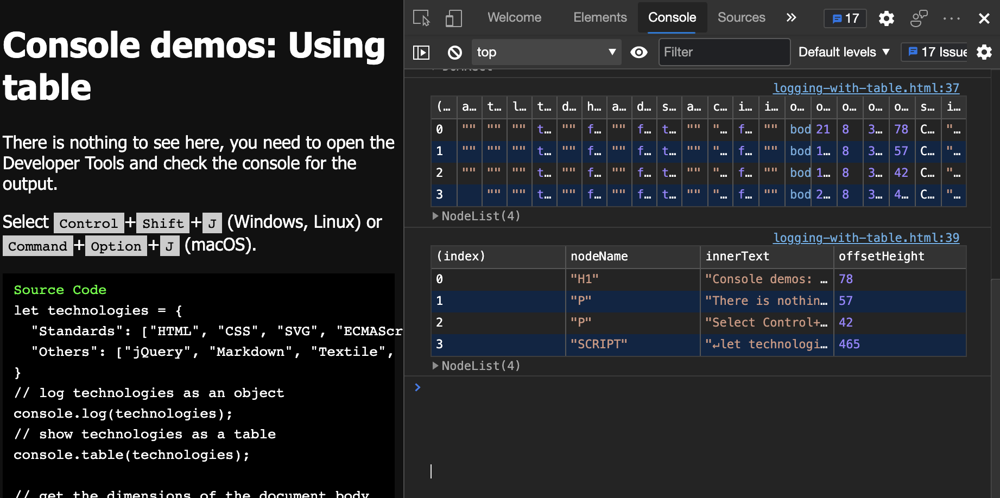

# <a name="log-messages-in-the-console-tool"></a>在控制台工具中记录消息

自从浏览器开始提供开发人员工具以来， **控制台** 是收藏夹，因为在大多数编程课程中，你将学习输出某种 `print` 或 `log` 命令，以深入了解代码中发生的情况。

在 DevTools 之前，对于 JavaScript，只能使用一个或一个 `alert()` 语 `document.write()` 句在浏览器中进行调试。  使用 DevTools 在**控制台**中记录信息时，**控制台**中提供了许多对象方法`Console`，在[控制台对象 API 参考](api.md)中列出。


## <a name="console-messages-examples-log-info-error-and-warn"></a>控制台消息示例：日志、信息、错误和警告

该 `Console` 对象具有多个级别的消息日志记录方法：

* `console.log` - 将文本作为日志消息打印到控制台。
* `console.info` - 将文本作为信息性消息打印到控制台。
* `console.error` - 将文本作为错误消息打印到控制台。
* `console.warn` - 将文本作为警告打印到控制台。


### <a name="example-code"></a>示例代码

```javascript
// prints the text to the console as  a log message
console.log('This is a log message')

// prints the text to the console as an informational message
console.info('This is some information') 

// prints the text to the console as an error message
console.error('This is an error')

// prints the text to the console as a warning
console.warn('This is a warning') 
```


### <a name="demo-webpage-console-messages-examples-log-info-error-and-warn"></a>演示网页：控制台消息示例：日志、信息、错误和警告

尝试在控制台中使用日志记录函数：

<!-- demo 1 of 6 -->

1. 在新窗口或选项卡中打开演示网页 [控制台消息示例：日志、信息、错误和警告](https://microsoftedge.github.io/Demos/devtools-console/logging-examples.html) 。

1. 按`Ctrl`+`Shift`+`J`（Windows、Linux）或 `Command`+`Option`+`J` （macOS）。  DevTools 随即打开，主工具栏中打开 **控制台** 。

   演示页已将上述日志消息发送到 **控制台**：

   

   和`log()``info()`方法似乎也做了同样的事情。  使用 `info()` 和 `log()` 处理不同的日志任务，因为这样可以 [筛选控制台消息](console-filters.md)，只显示一部分日志条目。
  
   和`error()``warn()`方法显示消息旁边的图标以及检查消息[堆栈跟踪](https://en.wikipedia.org/wiki/Stack_trace)的方法。

1. 将任何示例复制并粘贴到 **控制台**中，然后按下 `Enter`。

   输出显示在 **控制台**中，位于输入的代码下方。


<!-- ====================================================================== -->
## <a name="different-types-of-log-entries-and-variables"></a>不同类型的日志条目和变量

可以向 **控制台**发送任何有效的 JavaScript 或 DOM 引用，而不是日志文本。  **控制台**适当地显示从控制台日志消息发送到它的各种类型的 JavaScript 值。  **控制台**显示结果的筛选和格式化表示形式。


### <a name="example-code"></a>示例代码

```javascript
let x = 2;

// logs the value of x
console.log(x);

// logs the name x and value of x
console.log({x})   

// logs a DOM reference  
console.log(document.querySelector('body'));

// logs an Object
console.log({"type":"life", "meaning": 42});
let w3techs = ['HTML', 'CSS', 'SVG', 'MathML'];

// logs an Array
console.log(w3techs);
```


### <a name="demo-webpage-logging-different-variable-types"></a>演示网页：记录不同的变量类型

若要使用该 `log` 函数显示不同的变量类型，请执行以下操作：

<!-- demo 2 of 6 -->

1. 打开演示网页 [控制台消息示例：](https://microsoftedge.github.io/Demos/devtools-console/logging-types.html) 在新窗口或选项卡中记录不同类型。

1. 按`Ctrl`+`Shift`+`J`（Windows、Linux）或 `Command`+`Option`+`J` （macOS）。  DevTools 随即打开，主工具栏中打开 **控制台** 。

   每种类型的结果都以不同的方式显示。

1. 单击三角形可切换信息并更详细地分析每个结果。

   假设你收到许多只显示值的日志消息，但不知道该值的来源。  对于这种情况，我们在变量周围`x`添加了大括号`{}`，以提供更好的分组。

   在 **控制台**中记录不同类型的变量：

   

   使用扩展的额外信息在 **控制台** 中记录不同类型的变量：

   

1. 将任何示例复制并粘贴到 **控制台**中，然后按下 `Enter`。

   输出显示在 **控制台**中，位于输入的代码下方。


<!-- ====================================================================== -->
## <a name="format-and-convert-values-with-specifiers"></a>使用说明符格式化和转换值

所有日志方法的一个特殊功能是，可以在日志语句的消息中使用说明符。  说明符是日志消息的一部分，以百分比符号 (`%`) 字符开头。  使用说明符可以记录不同格式的某些值，甚至可以在格式之间进行转换。

*  `%s` 以字符串形式记录日志。
*  `%i` 或 `%d` 以整数身份记录。
*  `%f` 日志作为浮点值。
*  `%o` 日志作为可扩展的 DOM 元素。
*  `%O` 日志作为可展开的 JavaScript 对象。
*  `%c` 允许使用 CSS 设置消息样式。

### <a name="example-code"></a>示例代码

```javascript
// logs "10x console developer"
console.log('%ix %s developer', 10, 'console');

// logs PI => 3.141592653589793
console.log(Math.PI); 

// logs PI as an integer = 3
console.log('%i', Math.PI); 

// logs the document body as a DOM node
console.log('%o', document.body); 

// logs the body of the document as a JavaScript object with all properties
console.log('%O', document.body); 

// shows the message as red and big
console.log('%cImportant message follows','color:red;font-size:40px')
```


### <a name="demo-webpage-logging-with-specifiers"></a>演示网页：使用说明符进行日志记录

<!-- demo 3 -->

1. 打开演示页 [控制台消息示例：](https://microsoftedge.github.io/Demos/devtools-console/logging-with-specifiers.html) 在新选项卡或窗口中使用说明符进行日志记录。

1. 按`Ctrl`+`Shift`+`J`（Windows、Linux）或 `Command`+`Option`+`J` （macOS）。  DevTools 随即打开，主工具栏中打开 **控制台** 。

   网页已使用输出填充 **控制台** 。

   第一个示例演示了说明符的替换顺序是字符串之后的参数顺序：

   ```javascript
   console.log('%ix %s developer', 10, 'console'); // logs "10x console developer"
   ```
   
1. 单击输出结果中的扩展器三角形，展开并查看网页中上述 `log` 语句输出的数据。

1. 如有必要，请按 `F5` 下重新加载页面并重新填充 **控制台** 输出。

   说明符用于记录、格式化和转换值：

   

1. 在**控制台**中，单击三角形以展开日志结果，以查看和`%O`说明符之间的`%o`差异。

   网页正文显示为可展开的 DOM 节点，或显示为网页正文上所有 JavaScript 属性的完整列表：

   

1. 将上述示例代码列表复制并粘贴到 **控制台**中，然后按下 `Enter`。

   输出显示在 **控制台**中，位于输入的代码下方。


<!-- ====================================================================== -->
## <a name="group-log-messages"></a>对日志消息进行分组

如果记录大量信息，则可以使用 `group` 和 `groupCollapsed` 方法在 **控制台**中将日志消息显示为可展开和可折叠的组。  可以嵌套和命名组，使数据更容易理解。

### <a name="example-code"></a>示例代码

```javascript
// Example 1: Nested groups, with the inner group hidden (collapsed):
console.group("Passengers: Heart of Gold");
console.log('Zaphod');
console.log('Trillian');
console.log('Ford');
console.log('Arthur');
console.log('Marvin');
console.groupCollapsed("Hidden");
console.log('(Frankie & Benjy)');
console.groupEnd("Hidden");
console.groupEnd("Passengers: Heart of Gold");

// Example 2:
let technologies = {
  "Standards": ["HTML", "CSS", "SVG", "ECMAScript"],
  "Others": ["jQuery", "Markdown", "Textile", "Sass", "Pug"]
}
for (tech in technologies) {
  console.groupCollapsed(tech);
  technologies[tech].forEach(t => console.log(t));
  console.groupEnd(tech);
}
```


### <a name="demo-webpage-grouping-logs"></a>演示网页：对日志进行分组

在此示例中，可以选择性地生成组名称。

<!-- demo 4 -->

1. 打开演示页 [控制台消息示例：](https://microsoftedge.github.io/Demos/devtools-console/logging-with-groups.html) 在新选项卡或窗口中对日志进行分组。

1. 按`Ctrl`+`Shift`+`J`（Windows、Linux）或 `Command`+`Option`+`J` （macOS）。  DevTools 随即打开，主工具栏中打开 **控制台** 。

   网页已使用输出填充 **控制台** 。

   将大量值记录为组：

   

1. 在控制台输出中，展开和折叠每个部分：

   

1. 将上述示例代码列表复制并粘贴到 **控制台**中，然后按下 `Enter`。

   输出显示在 **控制台**中，位于输入的代码下方。


<!-- ====================================================================== -->
## <a name="display-complex-data-as-tables"></a>将复杂数据显示为表

该 `console.table()` 方法记录的复杂数据不是可折叠和可展开的对象，而是可使用不同标头排序的表。  排序表使用户更轻松地查看信息。


### <a name="example-code"></a>示例代码

```javascript
let technologies = {
  "Standards": ["HTML", "CSS", "SVG", "ECMAScript"],
  "Others": ["jQuery", "Markdown", "Textile", "Sass", "Pug"]
}
// log technologies as an object
console.log(technologies);
// show technologies as a table
console.table(technologies);

// get the dimensions of the document body
let bodyDimensions = document.body.getBoundingClientRect();
// show dimensions as an object
console.log(bodyDimensions);
// show dimensions as a table
console.table(bodyDimensions);
```

演示页中代码列表的第二部分会进一步向下显示。


### <a name="demo-webpage-using-table-formatting"></a>演示网页：使用表格式

若要将复杂数据显示为表，请执行以下操作：

<!-- demo 5 -->

1. 打开演示页 [控制台消息示例：](https://microsoftedge.github.io/Demos/devtools-console/logging-with-table.html) 在新窗口或选项卡中使用表。

1. 按`Ctrl`+`Shift`+`J`（Windows、Linux）或 `Command`+`Option`+`J` （macOS）。  DevTools 随即打开，主工具栏中打开 **控制台** 。

   网页已使用输出填充 **控制台** 。

1. 在 **控制台**中，单击展开器三角形。

1. 单击展开器三角形。  通过显示数据 `console.table` 可以更轻松地读取数据：

   

1. 将上述代码列表复制并粘贴到 **控制台**中，然后按下 `Enter`。

   输出显示在 **控制台**中，位于输入的代码下方。


输出具有 `console.table` 表格格式。  输出不仅在**控制台**中显示输出时具有表格式，而且在将表复制并粘贴到Microsoft Excel、Microsoft Word或支持表格数据的任何其他产品中时，输出的结构将保持不变。


#### <a name="specify-an-array-of-columns-for-each-property-for-readability"></a>为每个属性指定列数组，以实现可读性

如果数据具有命名参数， `console.table()` 该方法还允许为每个属性指定列的列 `Array` 以显示为第二个参数。  以下示例演示如何指定更易读的列数组：

##### <a name="example-code"></a>示例代码

此代码来自与上面相同的演示网页。

```javascript
// get all the h1, p and script elements
let contentElements = document.querySelectorAll(':is(h1,p,script)');
// show the elements as an unfiltered table
console.table(contentElements)
// show only relevant columns
console.table(contentElements,['nodeName', 'innerText', 'offsetHeight'])
```

此代码筛选方法显示的信息 `console.table()` 。

该代码提供要显示的属性数组，作为第二个参数：



1. 将上述代码列表复制并粘贴到 **控制台**中，然后按下 `Enter`。

   输出显示在 **控制台**中，位于输入的代码下方。


### <a name="log-statements-vs-breakpoint-debugging-and-live-expressions"></a>日志语句与断点调试和实时表达式

你可能会想使用 `log` 这些方法作为调试网页的主要手段，因为日志方法易于使用。  请考虑任何 `console.log()` 请求的结果。  发布的产品不应使用任何 `log` 用于调试的语句，因为它可能会向人们透露内部信息。  在 **控制台** 中创建的噪音是压倒性的。

`log`请尝试使用[断点调试](../javascript/breakpoints.md)或[实时表达式](live-expressions.md)，而不是语句。  你可能会发现工作流更有效，并且会获得更好的结果。
