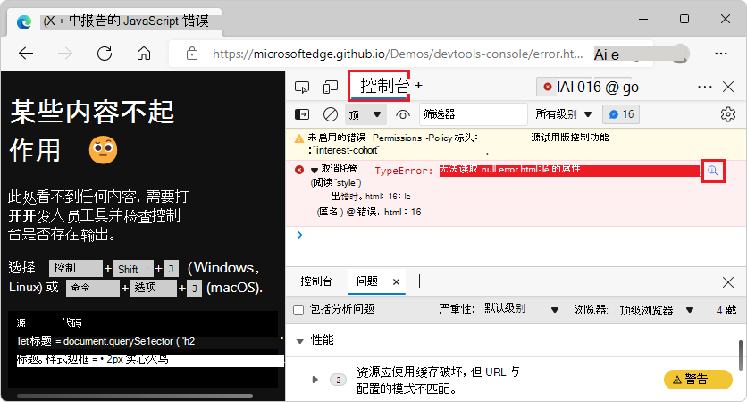
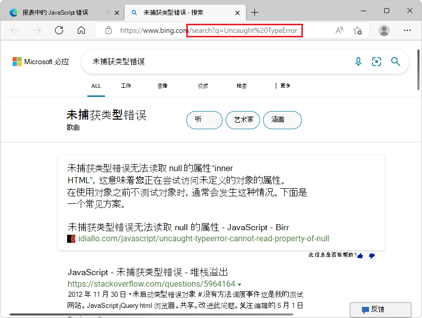

# <a name="console-overview"></a>控制台概述

**控制台**类似于 DevTools 中的智能、丰富的命令行，是与其他工具一起使用的绝佳配套工具。  控制 **台** 提供了一种强大的脚本功能、检查当前网页以及使用 JavaScript 操作当前网页的强大方法。

**控制台**工具可帮助处理多个任务，这些任务在以下文章中进行了更详细的介绍：

* **跟踪问题** ，找出当前项目中某些内容无法正常工作的原因。  请参阅 [控制台中报告的修复 JavaScript 错误](console-debug-javascript.md)。
* 在浏览器中以日志消息身份**获取有关 Web 项目的信息**。  请参阅 [筛选控制台消息](console-filters.md)。
* 用于调试的脚本中的**日志信息**。  请参阅 [控制台工具中的日志消息](console-log.md)。
* 尝试在 [REPL](https://en.wikipedia.org/wiki/Read%E2%80%93eval%E2%80%93print_loop) 环境中实时使用 **JavaScript 表达式**。  请参阅 [控制台中的运行 JavaScript](console-javascript.md)。
* 使用 JavaScript **在浏览器中与 Web 项目**交互。  请参阅 [使用控制台与 DOM 交互](console-dom-interaction.md)。

可以在 DevTools 的顶部或底部打开 **控制台** 工具;它显示在主工具栏的上半部分：


**控制台**显示在开发工具 (**抽屉**) 的下半部分，其上方打开**了 Elements** 工具：


直接打开**控制台**的最快方法是按`Ctrl`++`Shift``J` (Windows、Linux) 或`J``Command`+`Option`+ (macOS) 。


<!-- ====================================================================== -->
## <a name="error-reports-and-the-console"></a>错误报告和控制台

**控制台**是报告 JavaScript 和连接错误的默认位置。  如果发生任何错误，**问题计数器**将显示在 DevTools **中提供**错误和警告数的设置图标旁边。  单击 **“问题”计数器** 打开 **“问题** ”工具并显示问题。  有关详细信息，请参阅 [修复控制台中报告的 JavaScript 错误](console-debug-javascript.md)。

DevTools 提供有关 **控制台**中错误的详细信息：


<!-- ====================================================================== -->
## <a name="search-the-web-for-a-console-error-message-string"></a>在 Web 上搜索控制台错误消息字符串

从 DevTools 中立即在 Web 上搜索 **控制台** 错误消息。  在 **控制台**中，许多错误消息在 Web 按钮 **上都有搜索此消息** ，显示为放大镜：


<!-- to set up screenshot, went to 
https://docs.microsoft.com/microsoft-edge/devtools-guide-chromium/console/console-debug-javascript to get a good page that has an error: 
https://microsoftedge.github.io/Demos/devtools-console/error.html -->

在 Web 按钮上单击 **“搜索此消息** ”时，浏览器中将打开一个新选项卡，并显示错误消息的搜索结果：




<!-- ====================================================================== -->
## <a name="inspect-and-filter-information-on-the-current-webpage"></a>检查和筛选当前网页上的信息

在网页上打开 DevTools 时， **控制台**中可能会有大量信息。  当需要识别重要信息时，信息量会成为问题。  若要查看需要操作的重要信息，请使用 DevTools 中的 [“问题](../issues/index.md) ”工具。

问题正逐渐从 **控制台** 移动到 **“问题”** 工具。  但是， **主机**中仍然有很多信息，因此最好了解 **控制台**中的自动日志和筛选器选项。  有关详细信息，请参阅 [筛选控制台消息](console-filters.md)。

包含充满消息的 **控制台** 的 DevTools：


<!-- ====================================================================== -->
## <a name="log-information-to-display-in-the-console"></a>要在控制台中显示的日志信息

**控制台**最常用的用例是使用`console.log()`该方法或其他类似方法记录脚本中的信息。


### <a name="example-code"></a>示例代码

```javascript
// prints the text to the console as  a log message
console.log('This is a log message');

// prints the text to the console as an informational message
console.info('This is some information'); 

// prints the text to the console as an error message
console.error('This is an error');

// prints the text to the console as a warning
console.warn('This is a warning');

// prints the geometry of the document body as an object
console.log(document.body.getBoundingClientRect());

// prints the geometry of the document body as a table
console.table(document.body.getBoundingClientRect());

// shows a list of techologies as a collapsed group
let technologies = ["HTML", "CSS", "SVG", "ECMAScript"];
console.groupCollapsed('Technolgies');
technologies.forEach(tech => {console.info(tech);})
console.groupEnd('Technolgies');
```

<!-- typos in the demo page are preserved above, at `Technolgies` -->


若要记录要在控制台中显示的信息，请执行以下操作：

1. 在新窗口或选项卡中打开演示网页 [控制台消息示例：日志、信息、错误和警告](https://microsoftedge.github.io/Demos/devtools-console/logging-demo.html) 。

1. 若要打开**控制台**，请按`Ctrl`++`Shift``J` (Windows、Linux) 或`J``Command`+`Option`+ (macOS) 。

   **控制台**显示演示代码导致的生成消息：

   

1. 将上述代码粘贴到 **控制台**中，然后按下 `Enter`。


   如果收到消息： `Uncaught SyntaxError: Identifier 'technologies' has already been declared`

1. 打开新选项卡或窗口。

1. 若要打开**控制台**，请按`Ctrl`++`Shift``J` (Windows、Linux) 或`J``Command`+`Option`+ (macOS) 。

1. 将上述代码粘贴到 **控制台**中，然后按下 `Enter`。

使用 **控制台**时，有许多有用的方法可用。  有关详细信息，请参阅 [控制台工具中的日志消息](console-log.md)。


<!-- ====================================================================== -->
## <a name="try-your-javascript-live-in-the-console"></a>在控制台中实时试用 JavaScript

**控制台**不仅是记录信息的地方。  **控制台**是[一个 REPL](https://en.wikipedia.org/wiki/Read%E2%80%93eval%E2%80%93print_loop) 环境。  在 **控制台**中编写任何 JavaScript 时，代码会立即运行。  你可能会发现测试一些新的 JavaScript 功能或执行一些快速计算很有用。  此外，还可从新式编辑环境获取预期的所有功能，例如自动完成、语法突出显示和历史记录。

尝试在控制台中运行 JavaScript：

1. 打开“**控制台**”。

1. 键入 `2+2`。

在键入时 **，控制台** 会显示实时结果 `2+2` ，并显示以下行中的结果 `4` ：


此 **Eager 评估** 功能可用于调试和验证代码中是否未犯错误。

若要在 **控制台** 中运行 JavaScript 表达式并选择性地显示结果，请按下 `Enter`。  然后，可以编写要在 **控制台**中运行的下一个 JavaScript 代码。

连续运行几行 JavaScript 代码：


默认情况下，在单行上运行 JavaScript 代码。  若要运行行，请键入 JavaScript，然后按下 `Enter`。  若要解决单行限制问题，请按下而不是`Enter`按`Shift`+`Enter`。

与其他命令行体验类似，若要访问以前的 JavaScript 命令，请按 `Arrow-Up`下。  **控制台**的自动完成功能是了解不熟悉方法的好方法。

尝试自动完成：

1. 打开“**控制台**”。
1. 键入 `doc`。
1. 从下拉菜单中选择 `document` 。
1. 按 `Tab` 下以选择 `document`。
1. 键入 `.bo`。
1. 按 `Tab` 下以选择 `document.body`。
1. 键入另一个 `.` ，以显示当前网页正文中可用的属性和方法的完整列表。

有关使用 **控制台**的所有方法的详细信息，请参阅 [控制台作为 JavaScript 环境](console-javascript.md)。

**在控制台**中自动完成 JavaScript 表达式：


<!-- ====================================================================== -->
## <a name="interact-with-the-current-webpage-in-the-browser"></a>在浏览器中与当前网页交互

**控制台**有权访问浏览器的 [Window](https://developer.mozilla.org/docs/Web/API/Window) 对象。  可以通过从 DOM 读取数据并将数据分配给 DOM 元素来编写与当前网页交互的脚本。


### <a name="reading-from-the-dom-tree-in-the-console"></a>从控制台中的 DOM 树读取

若要使用 JavaScript 表达式从当前页面读取，请从 DOM 树中读取所选元素：

1. 打开“**控制台**”。

1. 将以下代码粘贴到 **控制台**中，然后按 `Enter`下：

   ```javascript
   document.querySelector('h1').innerHTML
   ```

   此表达式从 DOM 中选择第一个标题级别 1，然后选择在开始标记和结束标记之间 `<h1>` 包含的 HTML 内容。  **控制台**显示表达式的输出，即标题的文本：

   

通过在 **控制台** 中输入 JavaScript 表达式并在 **控制台**中显示输出，可以从网页的 DOM 表示形式进行读取。


### <a name="writing-to-the-dom-tree-and-webpage-from-the-console"></a>从控制台写入到 DOM 树和网页

还可以通过在**控制台**中更改 DOM (或_写入_ DOM) 来更改呈现的网页。

若要更改呈现的网页，请执行以下操作：

1. 打开“**控制台**”。

1. 将以下代码粘贴到 **控制台**中，然后按 `Enter`下：

   ```javascript
   document.querySelector('h1').innerHTML = 'Rocking the Console';
   ```

   上述 JavaScript 表达式使用 `=` 该符号将值分配给所选的 DOM 项。  在此示例中，表达式的计算值是标题的字符串。  表达式的值 (标题字符串) 显示在 **控制台** 和呈现的网页中：

   

   你已将网页的主标题更改为 **“摇动控制台**”。


### <a name="using-the--console-utility-method-to"></a>使用 $$ 控制台实用工具方法 

**控制台实用工具**方法使访问和操作当前网页变得容易。

例如，若要在当前网页中的所有链接周围添加绿色边框：

1. 打开“**控制台**”。

1. 将以下代码粘贴到 **控制台**中，然后按 `Enter`下：

   ```javascript
   $$('a').forEach(a => a.style.border='1px solid lime');
   ```

   控制 `$$(selector)` 台实用工具函数为“全部查询选择器”。  此 DOM 查询选择器函数返回与指定的 CSS 选择器匹配的所有元素的数组，例如 JavaScript 函数 `document.querySelectorAll()`。  在此示例中 `<a>` ，我们选择所有超链接元素，然后在它们周围应用绿色框：

   

有关详细信息，请参阅 [控制台工具实用工具函数和选择器](utilities.md)。


<!-- ====================================================================== -->
## <a name="see-also"></a>另请参阅

<!-- if an article's title is adequately descriptive, and the article is in the same TOC bucket as the present article, don't much need a link here: -->
* [使用控制台与 DOM 交互](console-dom-interaction.md)。
* [控制台功能参考](reference.md)
* [控制台对象 API 参考](api.md)
* [控制台工具实用功能和选择器](utilities.md)
