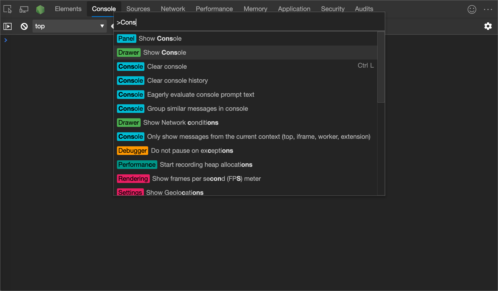
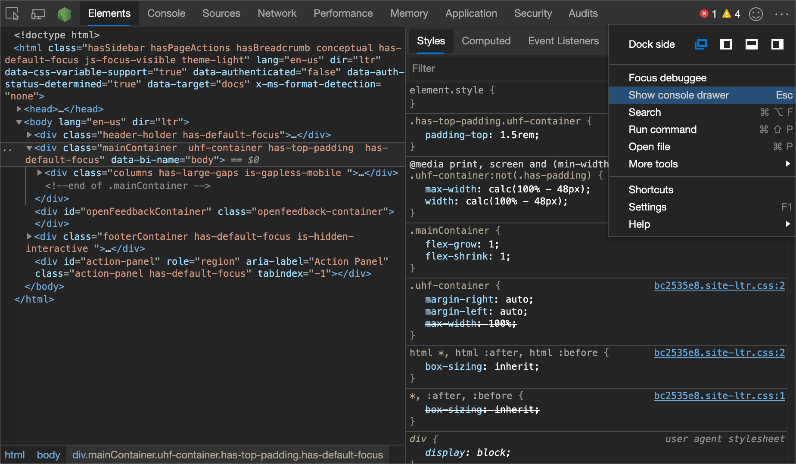
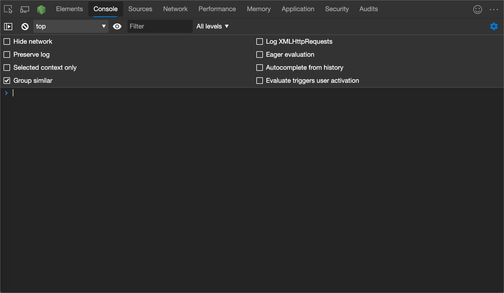
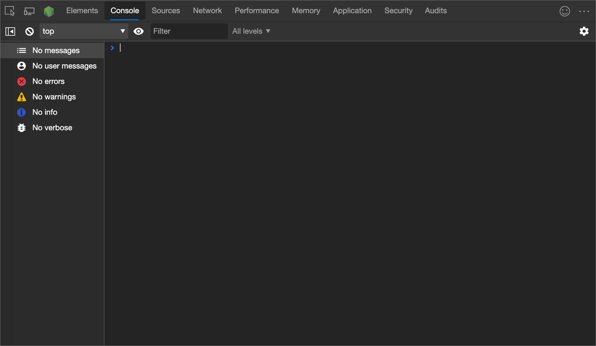
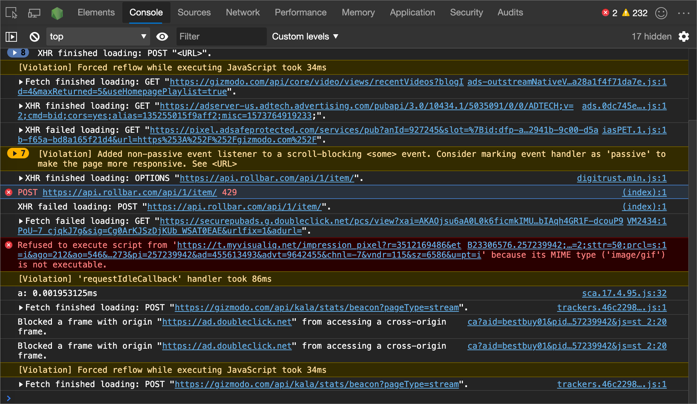
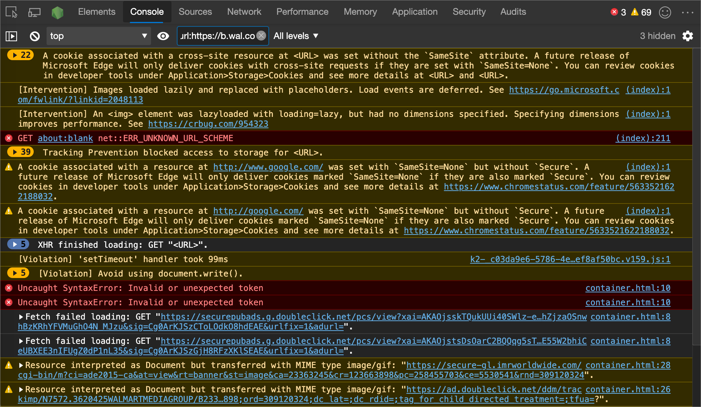
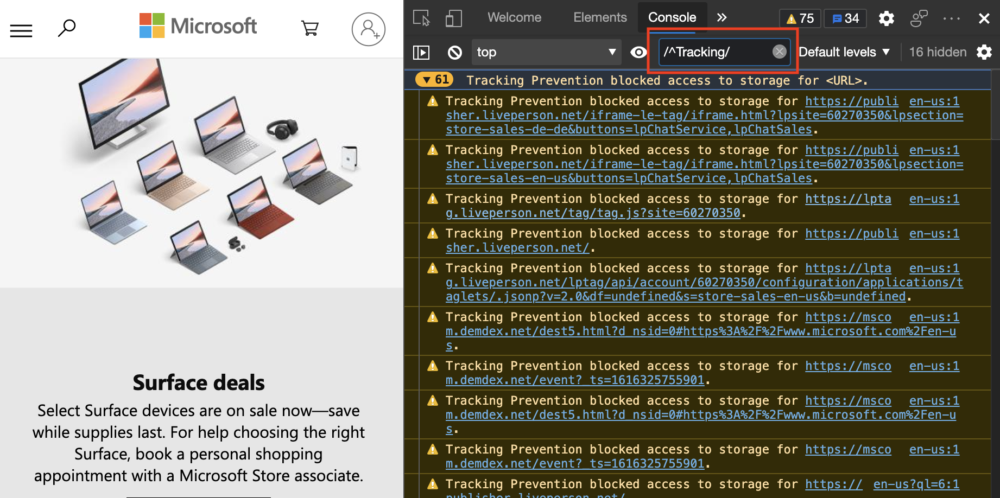
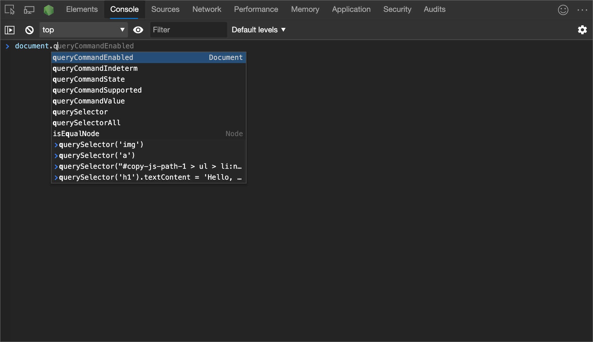

<!-- Copyright Kayce Basques

   Licensed under the Apache License, Version 2.0 (the "License");
   you may not use this file except in compliance with the License.
   You may obtain a copy of the License at

       https://www.apache.org/licenses/LICENSE-2.0

   Unless required by applicable law or agreed to in writing, software
   distributed under the License is distributed on an "AS IS" BASIS,
   WITHOUT WARRANTIES OR CONDITIONS OF ANY KIND, either express or implied.
   See the License for the specific language governing permissions and
   limitations under the License.  -->
# 控制台功能参考

本文概述了 **控制台**的功能。

**内容：**

* [打开控制台](#open-the-console)
   * [打开控制台工具](#open-the-console-tool)
   * [打开工具箱中的控制台工具](#open-the-console-tool-in-the-drawer)
   * [打开控制台设置](#open-console-settings)
   * [打开控制台边栏](#open-the-console-sidebar)
* [查看消息](#view-messages)
   * [关闭消息分组](#turn-off-message-grouping)
   * [记录 XHR 和 Fetch 请求](#log-xhr-and-fetch-requests)
   * [跨页面加载保留消息](#persist-messages-across-page-loads)
   * [隐藏网络消息](#hide-network-messages)
* [筛选邮件](#filter-messages)
   * [筛选出浏览器消息](#filter-out-browser-messages)
   * [按记录级别筛选](#filter-by-log-level)
   * [按 URL 筛选消息](#filter-messages-by-url)
   * [筛选出不同上下文的消息](#filter-out-messages-from-different-contexts)
   * [筛选出与正则表达式模式不匹配的消息](#filter-out-messages-that-dont-match-a-regular-expression-pattern)
* [运行 JavaScript](#run-javascript)
   * [从历史记录重新运行表达式](#rerun-expressions-from-history)
   * [使用实时表达式实时观看表达式的值](#watch-the-value-of-an-expression-in-real-time-with-live-expressions)
   * [关闭“急切评估”](#turn-off-eager-evaluation)
   * [关闭历史记录中的自动完成](#turn-off-autocomplete-from-history)
   * [选择 JavaScript 上下文](#select-javascript-context)
* [清除控制台](#clear-the-console)

<!-- ====================================================================== -->
## 打开控制台

可以打开 **控制台** 作为 [上窗格中的工具](#open-the-console-tool) 或 [抽屉中的工具](#open-the-console-tool-in-the-drawer)。

### 打开控制台工具

按`Ctrl`+`Shift`+`J`（Windows、Linux）或 `Command`+`Option`+`J` （macOS）。

若要从[命令菜单](../command-menu/index.md)打开**控制台**工具，请键入`Console`并运行显示**控制台**命令，该命令旁边有**面板**徽章。

### 打开工具箱中的控制台工具

按 `Esc`。  或者，单击 **“自定义”并控制 DevTools** (`...`) ，然后选择 **“显示控制台抽屉**”。

抽屉弹出到 DevTools 窗口的底部， **控制台** 工具处于打开状态。

若要从[命令菜单](../command-menu/index.md)打开**控制台**工具，请键入**控制台**，然后运行其旁边有**抽屉**徽章的 **“显示控制台**”命令。

### 打开控制台设置

单击 **“控制台设置** () 按钮。

### 打开控制台边栏

若要显示 **Sidebar**，请单击 **“显示控制台边栏** () 。  **边栏**可帮助你进行筛选。

<!-- ====================================================================== -->
## 查看消息

此部分包含更改消息在控制台中的显示方式的功能。  有关动手演练，请参 [阅“查看消息](index.md#inspect-and-filter-information-on-the-current-webpage)”。

### 关闭消息分组

若要关闭 **主机**的默认消息分组行为，请单击 **“主机设置** () 按钮，然后选择 **“组相似**”旁边的复选框。  有关示例，请参阅 [日志 XHR 和提取请求](#log-xhr-and-fetch-requests)。

### 记录 XHR 和 Fetch 请求

若要在每次发生时将所有 `XMLHttpRequest` 和 `Fetch` 请求记录到 **主机** ，请单击 **主机设置** () 按钮，然后选择 **Log XMLHttpRequests 旁边的**复选框。

上图中的顶部消息显示了**控制台**的默认分组行为。  <!--  In the following figure, the same log is displayed after you [turn off message grouping](#turn-off-message-grouping).  -->

<!--
> ##### Old Figure 9
> How the logged `XMLHttpRequest` and `Fetch` requests look after ungrouping
> 
-->

<!--todo: add example for ungrouping console items  -->

### 跨页面加载保留消息

加载新网页时，默认操作会清除 **控制台**。  若要跨页面加载保存消息，请单击 **“主机设置** () 按钮，然后选择 **“保留日志**”旁边的复选框。

### 隐藏网络消息

Microsoft Edge 的默认操作是将网络消息记录到 **控制台**。  在下图中，选定的消息表示 `429` 的 HTTP 状态代码。

隐藏网络消息：

1. 单击 **“控制台设置** () 按钮。

1. 选中 **“隐藏网络”** 旁边的复选框。

<!-- ====================================================================== -->
## 筛选邮件

可通过多种方式在 **控制台**中筛选出消息。

### 筛选出浏览器消息

若要仅显示来自网页 JavaScript 的消息， [请打开控制台边栏](#open-the-console-sidebar) ，然后单击 **#用户消息**。

### 按记录级别筛选

DevTools 为每个 `console.*` 方法分配四个严重级别之一：

*  `Error`
*  `Info`
*  `Verbose`
*  `Warning`

例如， `console.log()` 位于组中 `Info` ，但 `console.error()` 位于组中 `Error` 。  [控制台对象 API 参考](api.md)描述了每个适用方法的严重性级别。  浏览器记录到控制台的每条消息也具有严重性级别。

可以隐藏你不感兴趣的任何级别的消息。  例如，如果你只对消息感兴趣 `Error` ，则可以隐藏其他三个组。

若要筛选消息，请单击 **“日志级别**”下拉列表，然后选择`Verbose`“，`Info``Warning`或`Error`”

若要使用日志级别进行筛选， [请打开控制台边栏](#open-the-console-sidebar) ，然后选择 **“错误**”、“ **警告**”、“ **信息**”或“ **详细信息**”。

### 按 URL 筛选消息

键入 `url:` 后跟 URL，以便仅查看来自该 URL 的邮件。  键入 `url:`后，DevTools 会显示所有相关的 URL。  也可以使用域。  例如，如果 `https://example.com/a.js` 正在 `https://example.com/b.js` 记录消息， `url:https://example.com` 则可以专注于这两个脚本中的消息。

若要从 URL 中隐藏消息，请键入 `-url:`。  这是一个负 URL 筛选器。

若要显示来自单个 URL 的消息，请执行以下操作：

1. [打开控制台边栏](#open-the-console-sidebar)。

1. 展开 **#user messages** 节。

1. 选择包含要关注的消息的脚本的 URL。

### 筛选出不同上下文的消息

假设网页上有广告 (广告) 。  广告嵌入到控制`<iframe>`**台**中并生成许多消息。  由于广告在其他 [JavaScript 上下文](#select-javascript-context)中运行，因此隐藏消息的一种方法是单击 **主机设置** () 按钮，然后选择 **“仅选定上下文**”旁边的复选框。

### 筛选出与正则表达式模式不匹配的消息

键入正则表达式，例如 `/[gm][ta][mi]/` 在 **“筛选器** ”文本框中筛选出与该模式不匹配的任何消息。  DevTools 检查是在消息文本中还是在导致记录消息的脚本中找到模式。

<!-- ====================================================================== -->
## 运行 JavaScript

本部分包含与在 **控制台**中运行 JavaScript 相关的功能。  有关动手演练，请参阅 [“运行 JavaScript](console-javascript.md)”。

### 从历史记录重新运行表达式

按 `Up Arrow` 下以循环浏览之前在 **控制台**中运行的 JavaScript 表达式的历史记录。  按 `Enter` 下以再次运行该表达式。

### 使用实时表达式实时观看表达式的值

如果发现自己在 **控制台** 中反复键入相同的 JavaScript 表达式，可能会发现创建 **实时表达式**更容易。  使用 **实时表达式**，键入一次表达式，然后将其固定到 **控制台**顶部。  表达式的值近乎实时地更新。  请参阅 [使用实时表达式Real-Time中的 Watch JavaScript 表达式值](live-expressions.md)。

### 关闭“急切评估”

在**控制台**中键入 JavaScript 表达式时，**热切评估**会显示返回值的预览。  若要关闭返回值预览，请执行以下操作：

1. 单击 **“控制台设置** () 按钮。
1. 清除 **“急切评估**”旁边的复选框。

### 关闭历史记录中的自动完成

键入表达式时， **控制台** 的自动完成弹出窗口将显示之前运行的表达式。  表达式预置了 `>` 字符。  若要停止显示历史记录中的表达式，请单击 **“主机设置** () 按钮，然后清除 **“从历史记录自动完成** ”复选框旁边的复选框。

在下图中，`document.querySelector('a')` 和 `document.querySelector('img')` 是之前评估的表达式。

### 选择 JavaScript 上下文

默认情况下， **JavaScript 上下文** 下拉列表设置为 **顶部**，表示主网页的 [浏览上下文](https://developer.mozilla.org/docs/Glossary/Browsing_context)。

假设网页上嵌入了一个 `<iframe>`广告，并且要运行 JavaScript 来调整广告的 DOM。  单击 **JavaScript 上下文** 下拉列表，然后选择广告的浏览上下文：

<!-- ====================================================================== -->
## 清除控制台

若要清除控制台，请使用以下任一方法：

*  单击 **“清除控制台** () 。

*  右键单击一条消息，然后选择 **“清除控制台**”。

*  键 `clear()` 入控制台，然后按 `Enter`。

*  从网页的 JavaScript 调用 `console.clear()` 。

*  当控制台处于焦点时按 `Ctrl`+`L` 下。

<!-- ====================================================================== -->
## 另请参阅

<!-- if an article's title is adequately descriptive, and the article is in the same TOC bucket as the present article, don't much need a link here: -->
* [控制台工具中的日志消息](console-log.md) - 如何筛选控制台中的信息、警告和错误等日志消息。
* [在控制台中运行 JavaScript 入门](console-javascript.md) - 指导你完成在控制台中发出 JavaScript 语句和表达式的步骤。
* [控制台对象 API 参考](api.md) - 可在控制台中输入的函数和表达式，以将消息写入控制台，例如 `console.log()`。
* [控制台工具实用工具函数和选择器](utilities.md) - 可在 **控制台** 工具中输入的便利函数，例如`monitorEvents()`。

<!-- ====================================================================== -->
> [!NOTE]
> 此页面的某些部分是根据 [Google 创建和共享的](https://developers.google.com/terms/site-policies)作品所做的修改，并根据[ Creative Commons Attribution 4.0 International License ](https://creativecommons.org/licenses/by/4.0)中描述的条款使用。
> 原始页面位于[此处](https://developer.chrome.com/docs/devtools/console/reference/)，由 [Kayce Basques](https://developers.google.com/web/resources/contributors#kayce-basques)\（Chrome DevTools 和 Lighthouse 的技术作家）撰写。

本作品根据[ Creative Commons Attribution 4.0 International License ](https://creativecommons.org/licenses/by/4.0)获得许可。
