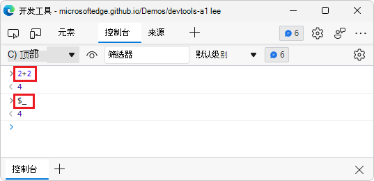
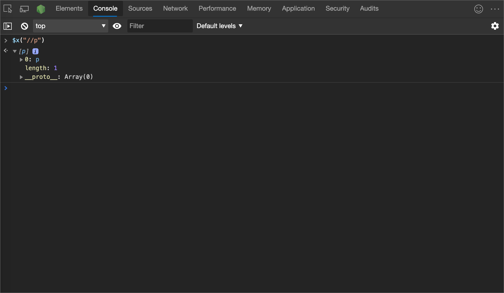
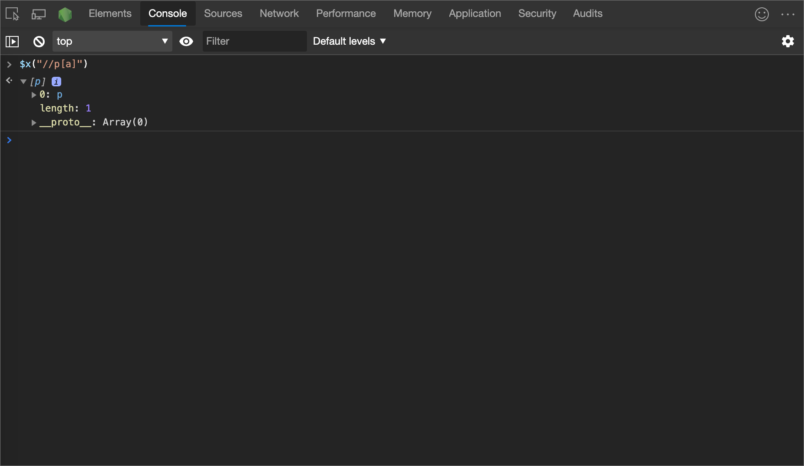
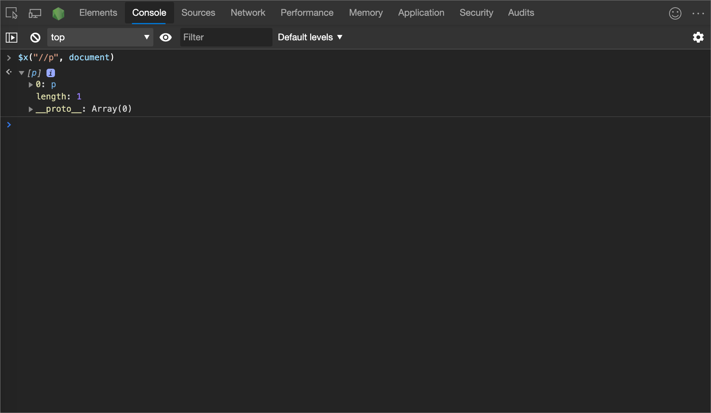
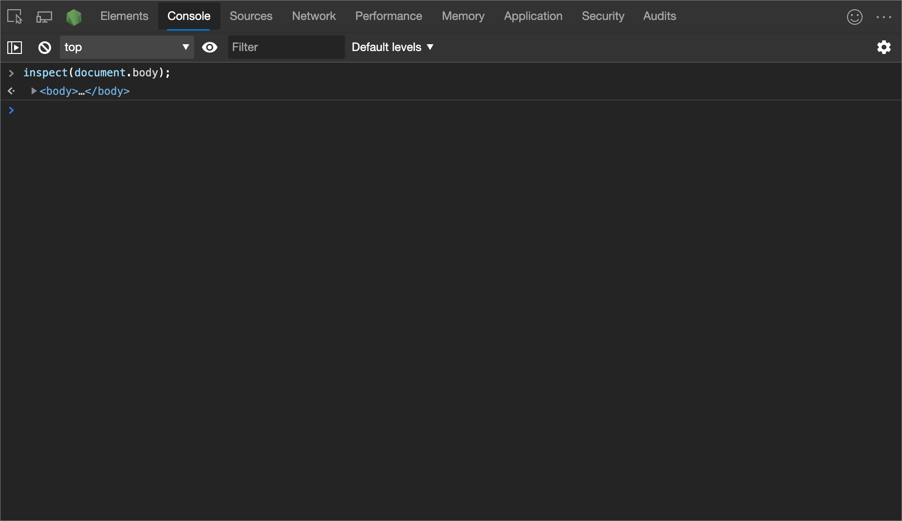
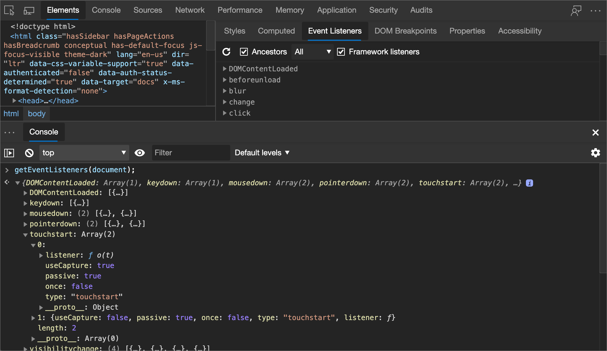
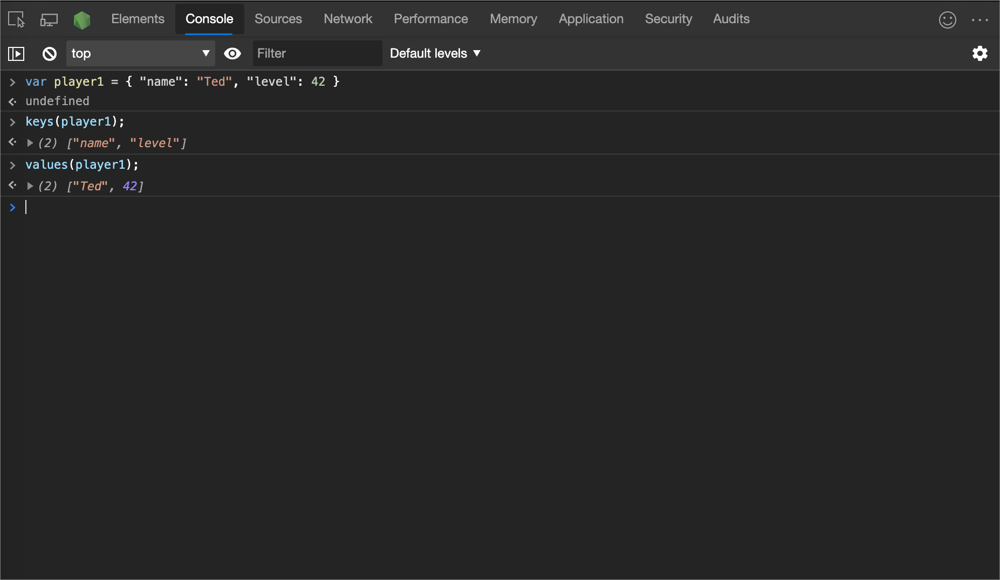
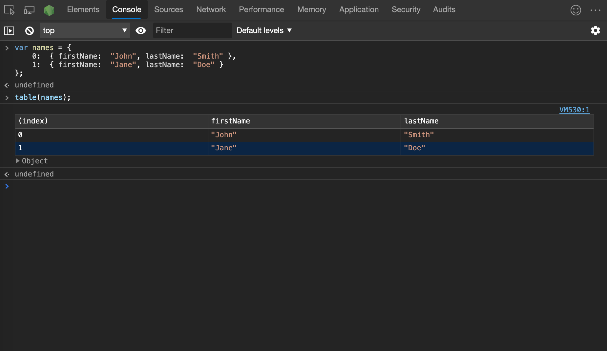

<!-- Copyright Kayce Basques

   Licensed under the Apache License, Version 2.0 (the "License");
   you may not use this file except in compliance with the License.
   You may obtain a copy of the License at

       https://www.apache.org/licenses/LICENSE-2.0

   Unless required by applicable law or agreed to in writing, software
   distributed under the License is distributed on an "AS IS" BASIS,
   WITHOUT WARRANTIES OR CONDITIONS OF ANY KIND, either express or implied.
   See the License for the specific language governing permissions and
   limitations under the License.  -->
# <a name="console-tool-utility-functions-and-selectors"></a>控制台工具实用功能和选择器
<!-- orig:
# Console Utilities API reference
-->

控制台实用工具 API 包含用于执行常见任务的一系列便利函数，例如：
*  选择并检查 DOM 元素。
*  以可读格式显示数据。
*  停止并启动探查器。
*  监视 DOM 事件。

这些命令仅通过将它们直接输入到 DevTools **控制台**来工作;无法从脚本调用这些命令。


<!-- ====================================================================== -->
## <a name="summary"></a>摘要

| 函数 | 描述 |
|---|---|
| [$_](#recently-evaluated-expression) | 返回最近评估的表达式的值。 |
| [$0 - $4](#recently-selected-element-or-javascript-object) | 返回最近选择的元素或 JavaScript 对象。 |
| [$ (选择器) ](#query-selector) | 查询选择器;返回对具有指定 CSS 选择器的第一个 DOM 元素的引用，例如 `document.querySelector()`。 |
| [$$ (选择器，[startNode]) ](#query-selector-all) | 全部查询选择器;返回与指定的 CSS 选择器匹配的元素数组，例如 `document.querySelectorAll()`。 |
| [$x (路径[startNode]) ](#xpath) | 返回与指定的 XPath 表达式匹配的 DOM 元素数组。 |
| [clear () ](#clear) | 清除其历史记录的控制台。 |
| [复制 (对象) ](#copy) | 将指定对象的字符串表示形式复制到剪贴板。 |
| [调试 (函数) ](#debug) | 调用指定函数时，调用调试器并在“源”面板上的函数内中断。 |
| [dir (对象) ](#dir) | 显示指定对象的所有属性的对象样式列表，例如 `console.dir()`。 |
| [dirxml (对象) ](#dirxml) | 打印指定对象的 XML 表示形式，如 **Elements** 工具中所示。`console.dirxml()` |
| [检查 (对象/函数) ](#inspect) | 打开并选择 **Elements** 工具中的指定 DOM 元素或 **内存** 工具中的指定 JavaScript 堆对象。 |
| [getEventListeners (对象) ](#geteventlisteners) | 返回在指定对象上注册的事件侦听器。 |
| [键 (对象) ](#keys) | 返回一个数组，其中包含属于指定对象的属性的名称。 |
| [监视 (函数) ](#monitor) | 将消息记录到控制台，该消息指示函数名称，以及作为请求的一部分传递给函数的参数。 |
| [monitorEvents (对象[， 事件]) ](#monitorevents) | 当指定对象上发生指定事件之一时，事件对象将记录到控制台。 |
| [配置文件 ([名称]) ](#profile) | 使用可选名称启动 JavaScript CPU 分析会话。 |
| [profileEnd ([name]) ](#profileend) | 完成 JavaScript CPU 分析会话，并在 **内存** 工具中显示结果。 |
| [queryObjects (构造函数) ](#queryobjects) | 返回由指定构造函数创建的对象的数组。 |
| [表 (数据[，列]) ](#table) | 为指定的数据对象记录对象数据（格式化为带有列标题的表）。 |
| [取消调试 (函数) ](#undebug) | 停止指定函数的调试，以便在请求函数时不再调用调试器。 |
| [unmonitor (函数) ](#unmonitor) | 停止监视指定的函数。 |
| [unmonitorEvents (object[， events]) ](#unmonitorevents) | 停止监视指定对象和事件的事件。 |
| [值 (对象) ](#values) | 返回一个数组，其中包含属于指定对象的所有属性的值。 |

<br/><br/>

---

<!-- ====================================================================== -->
## <a name="recently-evaluated-expression"></a>最近评估的表达式
<!-- planned new heading to troubleshoot: -->
<!-- ## $_ (Recent expression value) -->

<!-- summary to bubble up: -->
返回最近评估的表达式的值。

**语法：**

```javascript
$_
```

### <a name="example-1"></a>示例 1

1. 若要打开**控制台**工具：在 Edge 中，单击 **“设置”等**，将鼠标悬停在**更多工具**上，然后选择**开发人员工具**。  DevTools 将在当前网页旁边打开。  单击 **“控制台** ”选项卡。

1. 在 **控制台**中单击，键入表达式 `2+2`，然后按 `Enter`下：

   在下图中，计算 () `2+2` 的简单表达式。  然后计算该 `$_` 属性，其中包含相同的值：

   

   ```javascript
   2+2
   ```
   
   键入时， `2+2` 将计算 () 的简单表达式，控制台将输出该数字 `4`。  该 `$_` 属性接受该值 `4`。

1. 键入表达式 `$_`，然后按 `Enter`：

   ```javascript
   $_
   ```

   属性的 `$_` 值是以前评估的表达式的值;数字 4。

   


### <a name="example-2"></a>示例 2

1. 若要打开**控制台**工具：在 Edge 中，单击 **“设置”等**，将鼠标悬停在**更多工具**上，然后选择**开发人员工具**。  DevTools 将在当前网页旁边打开。  单击 **“控制台** ”选项卡。

1. 将以下代码粘贴到 **控制台**中，然后按 `Enter`下：

   ```javascript
   ["john", "paul", "george", "ringo"]
   ```
   
   计算的表达式是一个名称数组。

1. 在 **控制台**中键入以下代码，然后按 `Enter`下：

   ```javascript
   $_
   ```

   `$_` 表示以前评估的表达式，即名称数组。

   
1. 在 **控制台**中键入以下代码，然后按 `Enter`下：

   ```javascript
   $_.length
   ```

   计算表达式 `$_.length` 以查找数组的长度，即数字 4。  `$_` 现在采用值 4，而不是名称数组。
   
1. 在 **控制台**中键入以下代码，然后按 `Enter`下：

   ```javascript
   $_
   ```
   
   `$_` 表示以前评估的表达式，现在是数字 4。


   


<br/><br/>

---

<!-- ====================================================================== -->
## <a name="recently-selected-element-or-javascript-object"></a>最近选择的元素或 JavaScript 对象
<!-- planned new heading to troubleshoot: -->
<!-- ## $0 - $4 -->

<!-- summary to bubble up: -->
返回最近选择的元素或 JavaScript 对象。

<!-- add'l info -->
`$0` 返回最近选择的元素或 JavaScript 对象， `$1` 返回第二个最近选择的元素，等等。  这些`$0`命令`$1``$2`、命令`$3`和`$4`命令充当对**元素**工具中检查的最后五个 DOM 元素的历史引用，或**内存**工具中选择的最后五个 JavaScript 堆对象的历史引用。

### <a name="syntax"></a>语法

```javascript
$0
```

### <a name="example"></a>示例

在下图中，元素工具中选择了**一**个`img`元素。  在 **控制台** 抽屉中， `$0` 已评估并显示相同的元素：


下图显示了在同一网页中选择的不同元素。  现在 `$0` 引用新选择的元素，同时 `$1` 返回以前选定的元素：


<br/><br/>

---

<!-- ====================================================================== -->
## <a name="query-selector"></a>查询选择器
<!-- planned new heading to troubleshoot: -->
<!-- ## $(selector) -->

<!-- summary to bubble up: -->
查询选择器;返回对具有指定 CSS 选择器的第一个 DOM 元素的引用，例如 `document.querySelector()`。

<!-- add'l info -->
此函数是 [document.querySelector () ](https://developer.mozilla.org/docs/Web/API/Document/querySelector) 函数的别名。

### <a name="syntax"></a>语法

```javascript
$(selector, [startNode])
```

### <a name="example"></a>示例

在下图中， `$('img')` 返回对网页中第一 `` 个元素的引用：


右键单击返回的结果，然后 **选择“元素面板中的显示”** 以在 DOM 中找到它，或 **滚动到视图以** 在页面上显示它。

### <a name="example"></a>示例

以下示例返回对当前所选元素的引用，并显示其 `src` 属性：

```javascript
$('img').src
```

结果：


此函数还支持第二个参数， `startNode`该参数指定要从中搜索元素的元素或节点。  参数的默认值为 `document`.

### <a name="example"></a>示例

```javascript
$('img', document.querySelector('title--image')).src
```

结果：找到元素后`title--image`的第一个`img`元素，并`src`返回该元素的`img`属性：


> [!NOTE]
> 如果使用的是 jQuery 等库， `$`则会覆盖该功能，并与 `$` 该库中的实现相对应。

<br/><br/>

---

<!-- ====================================================================== -->
## <a name="query-selector-all"></a>全部查询选择器
<!-- planned new heading to troubleshoot: -->
<!-- ## \$\$(selector, \[startNode\]) -->

<!-- summary to bubble up: -->
全部查询选择器;返回与指定的 CSS 选择器匹配的元素数组，例如 `document.querySelectorAll()`。

<!-- add'l info -->
此函数等效于 [document.querySelectorAll () ](https://developer.mozilla.org/docs/Web/API/Document/querySelectorAll)。

### <a name="syntax"></a>语法

```javascript
$$(selector, [startNode])
```

### <a name="example"></a>示例

在以下示例中， `$$()` 创建当前网页中所有 `` 元素的数组，并显示每个元素的 `src` 属性值：

```javascript
var images = $$('img');
for (each in images) {
    console.log(images[each].src);
}
```

结果：


此查询选择器函数还支持第二个参数， `startNode`该参数指定要从中搜索元素的元素或节点。  参数的默认值为 `document`.

### <a name="example"></a>示例

以下已修改的上一示例版本用于 `$$()` 创建选定节点后当前网页中显示的所有 `` 元素的数组：

```javascript
var images = $$('img', document.querySelector(`title--image`));
for (each in images) {
   console.log(images[each].src);
}
```

结果如下。  `$$()` 选择网页中指定 `<div>` 元素后显示的所有图像，并显示源：


> [!NOTE]
> 在**控制台**中按`Shift`+`Enter`下以启动新行，而无需运行脚本。

<br/><br/>

---

<!-- ====================================================================== -->
## <a name="xpath"></a>Xpath
<!-- planned new heading to troubleshoot: -->
<!-- ## \$x(path, \[startNode\]) -->

<!-- summary to bubble up: -->
返回与指定的 XPath 表达式匹配的 DOM 元素数组。

<!-- add'l info: n/a -->

### <a name="syntax"></a>语法

```javascript
$x(path, [startNode])
```

### <a name="example"></a>示例

在以下示例中 `<p>` ，将返回网页上的所有元素：

```javascript
$x("//p")
```

结果：



### <a name="example"></a>示例

在以下示例中 `<p>` ，返回包含 `<a>` 元素的所有元素：

```javascript
$x("//p[a]")
```

结果：



与其他选择器命令类似， `$x(path)` 具有可选的第二个参数， `startNode`该参数指定要从中搜索元素的元素或节点：



<br/><br/>

---

<!-- ====================================================================== -->
## <a name="clear"></a>清楚
<!-- planned new heading to troubleshoot: -->
<!-- ## clear() -->

<!-- summary to bubble up: -->
清除其历史记录的控制台。

<!-- add'l info: n/a -->

### <a name="syntax"></a>语法

```javascript
clear()
```

### <a name="example"></a>示例

```javascript
clear()
```

<br/><br/>

---

<!-- ====================================================================== -->
## <a name="copy"></a>copy
<!-- ## copy(object) -->

<!-- summary to bubble up: -->
将指定对象的字符串表示形式复制到剪贴板。

<!-- add'l info: n/a -->

### <a name="syntax"></a>语法

```javascript
copy(object)
```

### <a name="example"></a>示例

```javascript
copy($0)
```

<br/><br/>

---

<!-- ====================================================================== -->
## <a name="debug"></a>调试
<!-- ## debug(function) -->

<!-- summary to bubble up: -->
调用指定函数时，调用调试器并在“源”面板上的函数内中断。

<!-- add'l info -->
在调试器暂停后，可以逐步执行代码并对其进行调试。

### <a name="syntax"></a>语法

```javascript
debug(function)
```

>[!NOTE]
> [Chromium问题 #1050237](https://crbug.com/1050237)正在跟踪函数的 `debug()` bug。  如果遇到此问题，请尝试改用 [断点](../javascript/breakpoints.md) 。

### <a name="example"></a>示例

```javascript
debug("debug");
```

结果：


用于 `undebug(function)` 停止中断函数，或使用 UI 关闭所有断点。

有关断点的详细信息，请参阅 [使用断点暂停代码](../javascript/breakpoints.md)。

<br/><br/>

---

<!-- ====================================================================== -->
## <a name="dir"></a>dir
<!-- ## dir(object) -->

<!-- summary to bubble up: -->
显示指定对象的所有属性的对象样式列表，例如 `console.dir()`。

<!-- add'l info -->
此函数是 [console.dir () 的 ](https://developer.mozilla.org/docs/Web/API/Console/dir)别名。

### <a name="syntax"></a>语法

```javascript
dir(object)
```

在**控制台**中进行评估`document.head`，以在标记之间`<head>``</head>`显示 HTML。

### <a name="example"></a>示例

在以下示例中，在**控制台**中使用`console.dir()`后会显示对象样式列表：

```javascript
document.head;
dir(document.head);
```

结果：


有关详细信息，请参阅控制台 API 中的 [console.dir () ](api.md#dir) 。

<br/><br/>

---

<!-- ====================================================================== -->
## <a name="dirxml"></a>dirxml
<!-- ## dirxml(object) -->

<!-- summary to bubble up: -->
打印指定对象的 XML 表示形式，如 **Elements** 工具中所示。`console.dirxml()`

<!-- add'l info -->
此函数等效于 [console.dirxml () ](https://developer.mozilla.org/docs/Web/API/Console/dirxml)。

### <a name="syntax"></a>语法

```javascript
dirxml(object)
```

<br/><br/>

---

<!-- ====================================================================== -->
## <a name="inspect"></a>检查
<!-- ## inspect(object/function) -->

<!-- summary to bubble up: -->
打开并选择 **Elements** 工具中的指定 DOM 元素或 **内存** 工具中的指定 JavaScript 堆对象。

<!-- add'l info -->
* 对于 DOM 元素，此函数将打开并选择 **Elements** 工具中的指定 DOM 元素。
* 对于 JavaScript 堆对象，此函数将在 **内存** 工具中打开指定的 JavaScript 堆对象。

### <a name="syntax"></a>语法

```javascript
inspect(object/function)
```

### <a name="example"></a>示例

在以下示例中，`document.body`**在 Elements** 工具中打开：

```javascript
inspect(document.body);
```

结果：



传递要检查的函数时，函数将在 **“源** ”工具中打开网页供你检查。

<br/><br/>

---

<!-- ====================================================================== -->
## <a name="geteventlisteners"></a>getEventListeners
<!-- ## getEventListeners(object) -->

<!-- summary to bubble up: -->
返回在指定对象上注册的事件侦听器。

<!-- add'l info -->
返回值是一个对象，该对象包含每个已注册事件类型的数组 (，例如 `click` 或 `keydown`) 。  每个数组的成员都是描述为每种类型注册的侦听器的对象。

### <a name="syntax"></a>语法

```javascript
getEventListeners(object)
```

### <a name="example"></a>示例

在以下示例中，列出了在对象上 `document` 注册的所有事件侦听器：

```javascript
getEventListeners(document);
```

结果：


如果在指定对象上注册了多个侦听器，则该数组包含每个侦听器的成员。  在下图中，事件的元素`click`上注册了`document`两个事件侦听器：


可以进一步扩大以下每个对象，以浏览其属性。  下面是侦听器对象的展开视图：



<br/><br/>

---

<!-- ====================================================================== -->
## <a name="keys"></a>键
<!-- ## keys(object) -->

<!-- summary to bubble up: -->
返回一个数组，其中包含属于指定对象的属性的名称。

<!-- add'l info -->
若要获取相同属性的关联值，请使用 `values()`。

### <a name="syntax"></a>语法

```javascript
keys(object)
```

### <a name="example"></a>示例

假设应用程序定义了以下对象：

```javascript
var player1 = {"name": "Ted", "level": 42}
```

在下面的代码中，结果假定 `player1` 已在全局命名空间 (中定义，以便在键入 `keys(player1)` 和 `values(player1)` 在控制台中进行简单) ：

```javascript
keys(player1)

values(player1)
```

结果：



<br/><br/>

---

<!-- ====================================================================== -->
## <a name="monitor"></a>监视器
<!-- ## monitor(function) -->

<!-- summary to bubble up: -->
将消息记录到控制台，该消息指示函数名称，以及作为请求的一部分传递给函数的参数。

<!-- add'l info: n/a -->

### <a name="syntax"></a>语法

```javascript
monitor(function)
```

### <a name="example"></a>示例

```javascript
function sum(x, y) {
    return x + y;
}
monitor(sum);
```

结果：


若要结束监视，请使用 `unmonitor(function)`。

<br/><br/>

---

<!-- ====================================================================== -->
## <a name="monitorevents"></a>monitorEvents
<!-- ## monitorEvents(object\[, events\]) -->

<!-- summary to bubble up: -->
当指定对象上发生指定事件之一时，事件对象将记录到控制台。

<!-- add'l info -->
可以指定要监视的单个事件、事件数组或映射到预定义事件集合的泛型事件类型之一。

### <a name="syntax"></a>语法

```javascript
monitorEvents(object[, events])
```

### <a name="example"></a>示例

以下代码监视窗口对象上的所有调整大小的事件：

```javascript
monitorEvents(window, "resize");
```

结果：


### <a name="example"></a>示例

以下代码定义一个数组，用于监视`resize``scroll`窗口对象上的事件：

```javascript
monitorEvents(window, ["resize", "scroll"]);
```

### <a name="specifying-an-event-type"></a>指定事件类型

还可以指定可用的事件类型之一，即映射到预定义事件集的字符串。  下表显示了可用的事件类型和关联的事件映射：

| 事件类型 | 对应的映射事件 |
|:--- |:--- |
| `mouse` | “click”、“dblclick”、“mousedown”、“mousemove”、“mouseout”、“mouseover”、“mouseup”、“mousewheel” |
| `key` | “keydown”、“keypress”、“keyup”、“textInput” |
| `touch` | “touchcancel”、“touchend”、“touchmove”、“touchstart” |
| `Ctrl` | “blur”、“change”、“focus”、“reset”、“resize”、“scroll”、“select”、“submit”、“zoom” |

### <a name="example"></a>示例

在以下代码中`key`，**元素**工具中当前选择了与输入文本字段上的事件对应`key`的事件类型：

```javascript
monitorEvents($0, "key");
```

下面是在文本字段中键入字符后的示例输出：


<br/><br/>

---

<!-- ====================================================================== -->
## <a name="profile"></a>profile
<!-- ## profile([name]) -->

<!-- summary to bubble up: -->
使用可选名称启动 JavaScript CPU 分析会话。

<!-- add'l info -->
若要完成配置文件并在 **内存** 工具中显示结果，请调用 [profileEnd () ](#profileend)。  <!-- See [Speed Up JavaScript Runtime](../rendering-tools/js-runtime.md).  -->

### <a name="syntax"></a>语法

```javascript
profile([name])
```

### <a name="example"></a>示例

若要开始分析，请调用 `profile()`：

```javascript
profile("My profile")
```

若要停止分析并在 **内存** 工具中显示结果，请调用 [profileEnd () ](#profileend)。

也可以嵌套配置文件：

```javascript
profile('A');
profile('B');
profileEnd('A');
profileEnd('B');
```

无论顺序如何，结果都是相同的。  结果显示为 **内存** 工具中的堆快照，其中包含分组配置文件：


> [!NOTE]
> 多个 CPU 配置文件可以同时运行，无需按创建顺序关闭每个配置文件。

<br/><br/>

---

<!-- ====================================================================== -->
## <a name="profileend"></a>profileEnd
<!-- ## profileEnd([name]) -->

<!-- summary to bubble up: -->
完成 JavaScript CPU 分析会话，并在 **内存** 工具中显示结果。

<!-- add'l info -->
若要调用此函数，必须运行 [配置文件 () ](#profile) 函数。  <!-- See [Speed Up JavaScript Runtime](../rendering-tools/js-runtime.md).  -->

### <a name="syntax"></a>语法

```javascript
profileEnd([name])
```

### <a name="example"></a>示例

1. 运行 [配置文件 () ](#profile) 函数以开始分析。

1. 运行该 `profileEnd()` 函数以停止分析并在 **内存** 工具中显示结果：

    ```javascript
    profileEnd("My profile")
    ```

有关详细信息，请参阅上面 [的配置文件](#profile)。

<br/><br/>

---

<!-- ====================================================================== -->
## <a name="queryobjects"></a>queryObjects
<!-- ## queryObjects(Constructor) -->

<!-- summary to bubble up: -->
返回由指定构造函数创建的对象的数组。

<!-- add'l info -->
其范围 `queryObjects()` 是 **控制台**中当前选择的运行时上下文。

### <a name="syntax"></a>语法

```javascript
queryObjects(Constructor)
```

### <a name="example"></a>示例

* `queryObjects(promise)` 返回所有实例。`Promise`

* `queryObjects(HTMLElement)` 返回所有 HTML 元素。

*  `queryObjects(functionName)` 返回使用 `new functionName()`实例化的所有对象。

<br/><br/>

---

<!-- ====================================================================== -->
## <a name="table"></a>表
<!-- ## table(data\[, columns\]) -->

<!-- summary to bubble up: -->
为指定的数据对象记录对象数据（格式化为带有列标题的表）。

<!-- add'l info: n/a -->
例如，使用此函数，可以在 **控制台**中将人员姓名列表显示为表。

### <a name="syntax"></a>语法

```javascript
table(data[, columns])
```

### <a name="example"></a>示例

以下代码使用控制台中的表显示名称列表，列标题默认为变量名称：

```javascript
var names = {
    0: {
        firstName:  "John",
        lastName:  "Smith"
    },
    1:  {
        firstName:  "Jane",
        lastName:  "Doe"
    }
};
table(names);
```

结果：



<br/><br/>

---

<!-- ====================================================================== -->
## <a name="undebug"></a>undebug
<!-- ## undebug(function) -->

<!-- summary to bubble up: -->
停止指定函数的调试，以便在请求函数时不再调用调试器。

<!-- add'l info: n/a -->

### <a name="syntax"></a>语法

```javascript
undebug(function)
```

### <a name="example"></a>示例

```javascript
undebug(getData);
```

<br/><br/>

---

<!-- ====================================================================== -->
## <a name="unmonitor"></a>unmonitor
<!-- ## unmonitor(function) -->

<!-- summary to bubble up: -->
停止监视指定的函数。

<!-- add'l info -->
此函数与 [monitor () ](#monitor)一起使用。

### <a name="syntax"></a>语法

```javascript
unmonitor(function)
```

### <a name="example"></a>示例

```javascript
unmonitor(getData);
```

<br/><br/>

---

<!-- ====================================================================== -->
## <a name="unmonitorevents"></a>unmonitorEvents
<!-- ## unmonitorEvents(object\[, events\]) -->

<!-- summary to bubble up: -->
停止监视指定对象和事件的事件。

<!-- add'l info: n/a -->

### <a name="syntax"></a>语法

```javascript
unmonitorEvents(object[, events])
```

### <a name="example"></a>示例

以下代码停止对 `window` 对象的所有事件监视：

```javascript
unmonitorEvents(window);
```

还可以有选择地停止监视对象上的特定事件。  例如，以下代码开始监视当前所选元素上的所有 `mouse` 事件，然后停止监视 `mousemove` 事件 (也许是为了减少控制台输出) 中的干扰：

```javascript
monitorEvents($0, "mouse");
unmonitorEvents($0, "mousemove");
```

<br/><br/>

---

<!-- ====================================================================== -->
## <a name="values"></a>值
<!-- ## values(object) -->

<!-- summary to bubble up: -->
返回一个数组，其中包含属于指定对象的所有属性的值。

<!-- add'l info: n/a -->

### <a name="syntax"></a>语法

```javascript
values(object)
```

### <a name="example"></a>示例

```javascript
values(object);
```

<br/><br/>

---

<!-- ====================================================================== -->
## <a name="see-also"></a>另请参阅

<!-- if an article's title is adequately descriptive, and the article is in the same TOC bucket as the present article, don't much need a link here: -->
* [控制台功能参考](reference.md)
* [控制台对象 API 参考](api.md) - `console.*` 函数，例如 `console.log()` 和 `console.error()`.


<!-- ====================================================================== -->
> [!NOTE]
> 此页面的某些部分是根据 [Google 创建和共享的](https://developers.google.com/terms/site-policies)作品所做的修改，并根据[ Creative Commons Attribution 4.0 International License ](https://creativecommons.org/licenses/by/4.0)中描述的条款使用。
> 原始页面位于[此处](https://developer.chrome.com/docs/devtools/console/utilities/)，由 [Kayce Basques](https://developers.google.com/web/resources/contributors#kayce-basques)\（Chrome DevTools 和 Lighthouse 的技术作家）撰写。

[](https://creativecommons.org/licenses/by/4.0)
本作品根据[ Creative Commons Attribution 4.0 International License ](https://creativecommons.org/licenses/by/4.0)获得许可。
