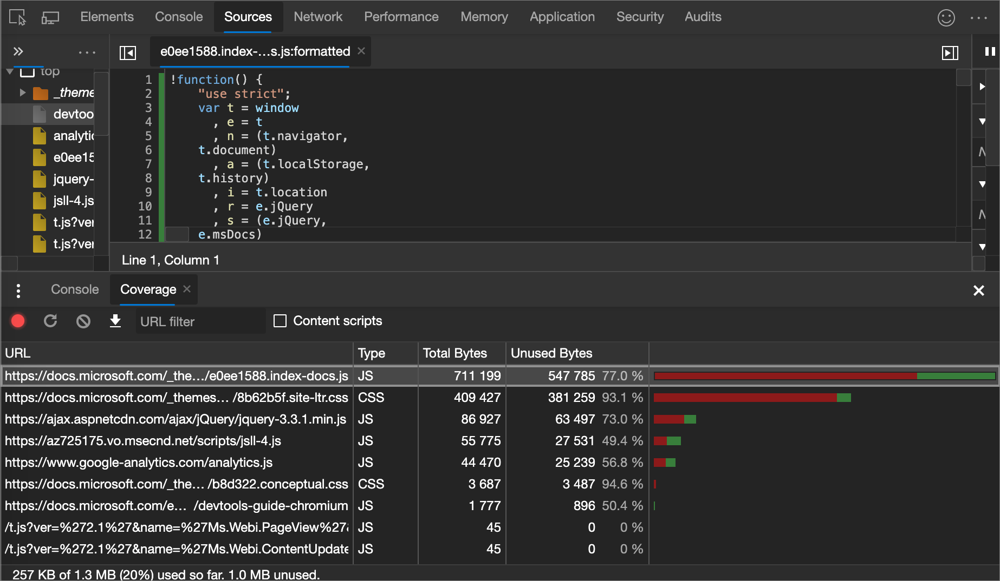
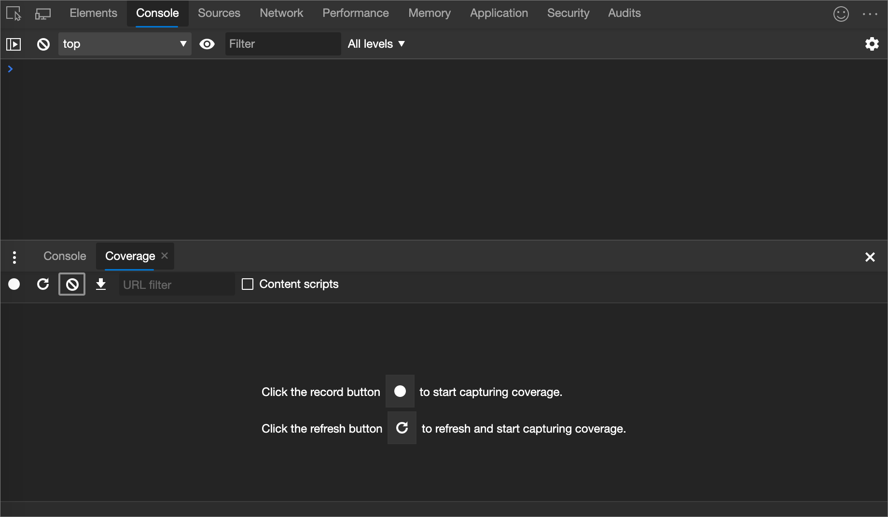
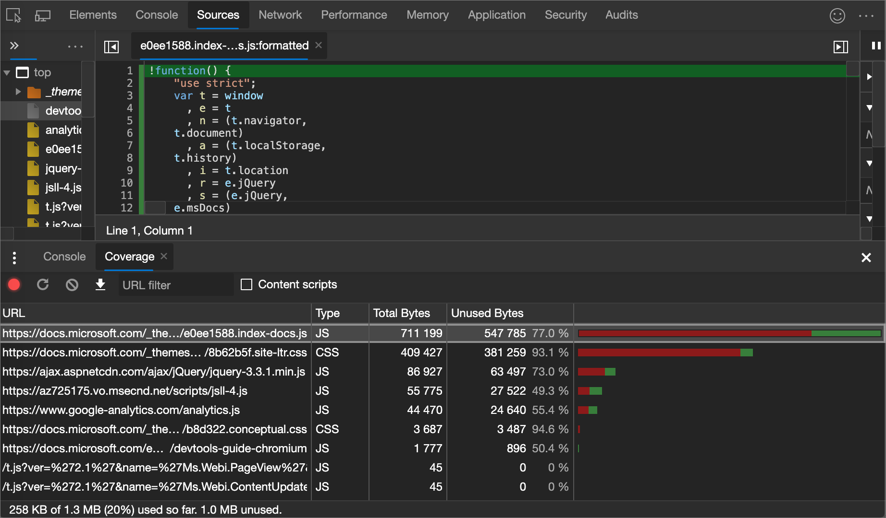

<!-- Copyright Kayce Basques

   Licensed under the Apache License, Version 2.0 (the "License");
   you may not use this file except in compliance with the License.
   You may obtain a copy of the License at

       https://www.apache.org/licenses/LICENSE-2.0

   Unless required by applicable law or agreed to in writing, software
   distributed under the License is distributed on an "AS IS" BASIS,
   WITHOUT WARRANTIES OR CONDITIONS OF ANY KIND, either express or implied.
   See the License for the specific language governing permissions and
   limitations under the License.  -->
# <a name="find-unused-javascript-and-css-code-with-the-coverage-tool"></a>使用覆盖工具查找未使用的 JavaScript 和 CSS 代码

“覆盖范围”工具可帮助查找未使用的 JavaScript 和 CSS 代码。  删除未使用的代码可以加快页面加载速度，并保存移动用户的手机网络数据。



查找未使用的代码相对容易。  但是，重构代码库，使每个页面仅随附所需的 JavaScript 和 CSS 可能很困难。  本指南不介绍如何重构代码库以避免未使用的代码，因为此重构依赖于技术堆栈。


<!-- ====================================================================== -->
## <a name="overview"></a>概述

寄送未使用的 JavaScript 或 CSS 是 web 开发中的一个常见问题。  例如，假设要在页面上使用 [Bootstrap 按钮组件](https://getbootstrap.com/docs/4.3/components/buttons) 。  若要使用按钮组件，需要在 HTML 中添加指向 Bootstrap 样式表的链接，如下所示：

```html
<head>
    ...
    <link rel="stylesheet" href="https://stackpath.bootstrapcdn.com/bootstrap/4.3.1/css/bootstrap.min.css" integrity="sha384-ggOyR0iXCbMQv3Xipma34MD+dH/1fQ784/j6cY/iJTQUOhcWr7x9JvoRxT2MZw1T" crossorigin="anonymous">
    ...
</head>
```

此样式表不只包含按钮组件的代码。  它包含_所有_Bootstrap 组件的 CSS。  但未使用任何其他 Bootstrap 组件。  因此，你的页面正在下载一堆不需要的 CSS。

此额外的 CSS 是一个问题，原因如下：

*  额外的代码会降低页面加载速度。  <!-- See [Render-Blocking CSS](/web/fundamentals/performance/critical-rendering-path/render-blocking-css). -->

*  如果用户在移动设备上访问页面，则额外的代码会使用其手机网络数据。


<!-- ====================================================================== -->
## <a name="open-the-coverage-tool"></a>打开覆盖工具

1. [打开“命令”菜单](../command-menu/index.md)。

1. "开始"菜单键入`coverage`，选择 **“显示覆盖**范围”命令，然后按下`Enter`。  **覆盖**工具在**抽屉**中打开。

   


<!-- ====================================================================== -->
## <a name="record-code-coverage"></a>记录代码覆盖范围

1. 在 **“覆盖** 范围”工具中单击以下按钮之一：

   *  单击 **"开始"菜单检测覆盖率和重载页** ("开始"菜单) <!--todo: check UI string--> 如果想要查看加载页面所需的代码。

   *  如果想要查看与页面交互后使用的代码，请单击**检测覆盖率**) 。

1. 单击 **“停止检测覆盖范围”并显示结果** () <!--todo: check UI string--> 如果要停止记录代码覆盖率。


<!-- ====================================================================== -->
## <a name="analyze-code-coverage"></a>分析代码覆盖范围

**“覆盖范围**”工具中的表显示已分析的资源，以及每个资源中使用的代码量。  单击一行可在 **“源** ”工具中打开该资源，并显示已用代码和未使用的代码的逐行细分。

代码覆盖率报告：



代码覆盖率报表中的列：

| 列 | 描述 |
| --- | --- |
| **URL** | 所分析资源的 URL。 |
| **类型** | 资源是否包含 CSS、JavaScript 或两者。 |
| **总字节数** | 资源的总大小（以字节为单位）。 |
| **未使用的字节数** | 未使用的字节数。 |
| 最后一个未命名列 | **总字节**数和**未使用的字节列的**可视化效果。  条形图的红色部分是未使用字节数。  绿色部分是已使用字节数。 |


<!-- ====================================================================== -->
> [!NOTE]
> 此页面的某些部分是根据 [Google 创建和共享的](https://developers.google.com/terms/site-policies)作品所做的修改，并根据[ Creative Commons Attribution 4.0 International License ](https://creativecommons.org/licenses/by/4.0)中描述的条款使用。
> 原始页面位于[此处](https://developers.google.com/web/tools/chrome-devtools/coverage/index)，由 [Kayce Basques](https://developers.google.com/web/resources/contributors#kayce-basques)\（Chrome DevTools 和 Lighthouse 的技术作家）撰写。

[](https://creativecommons.org/licenses/by/4.0)
本作品根据[ Creative Commons Attribution 4.0 International License ](https://creativecommons.org/licenses/by/4.0)获得许可。
