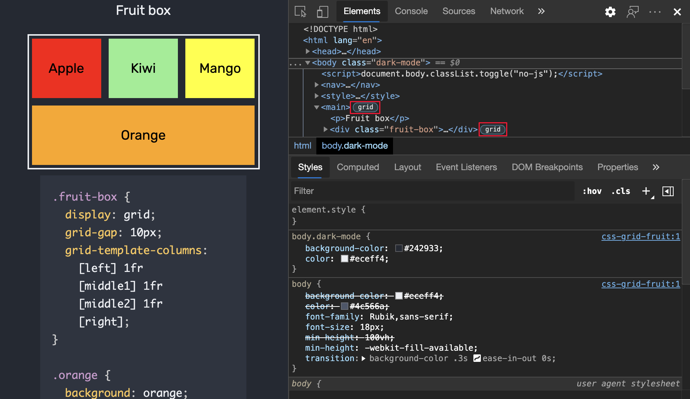
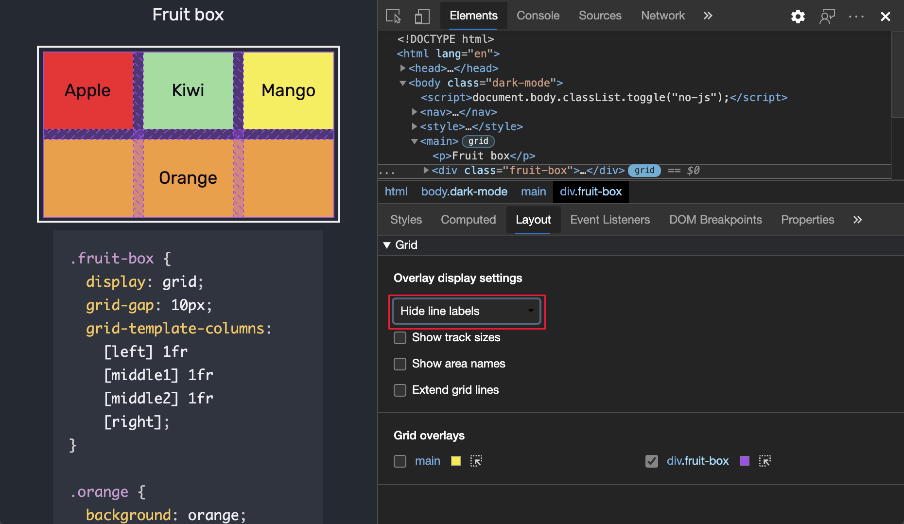
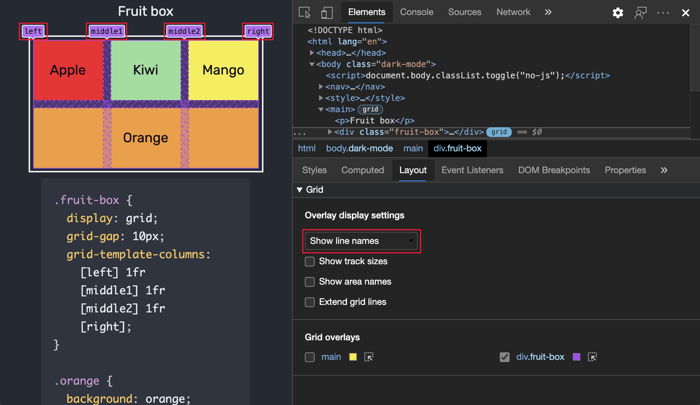
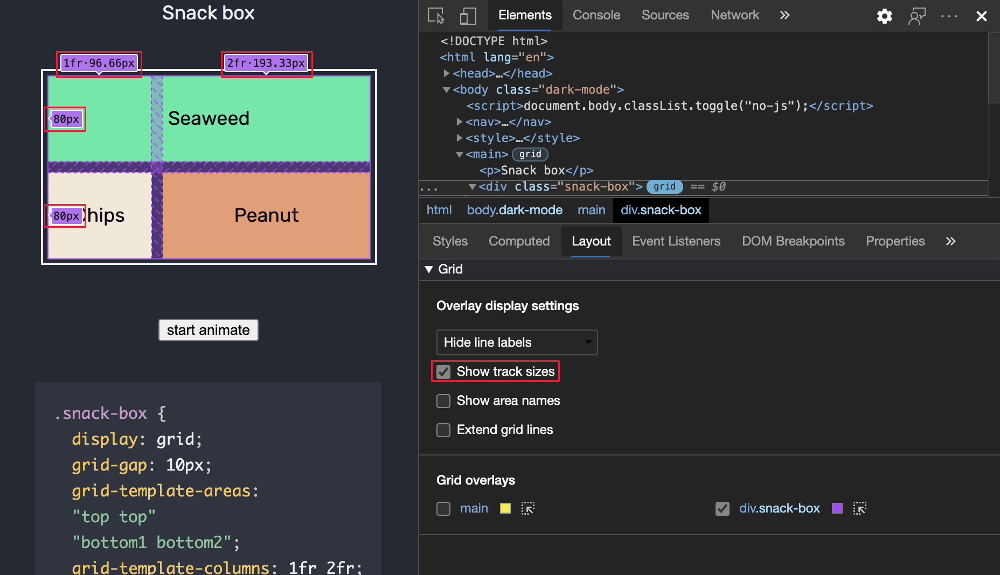
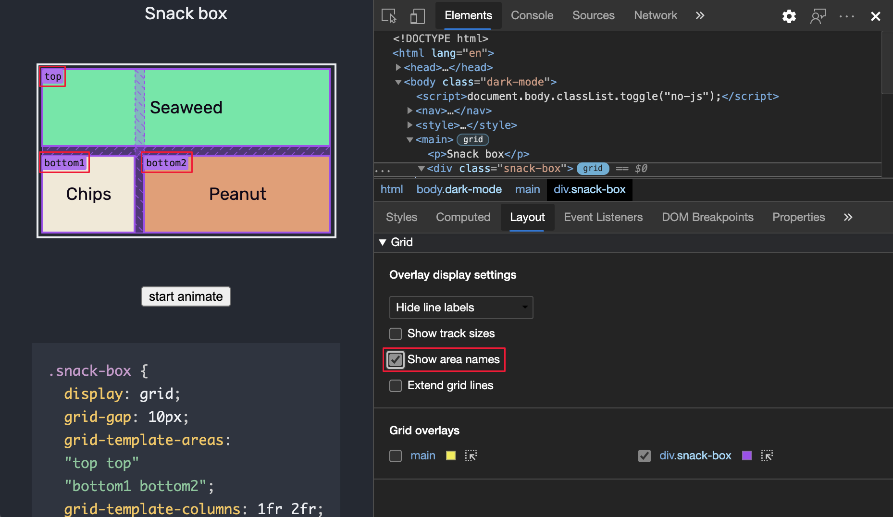
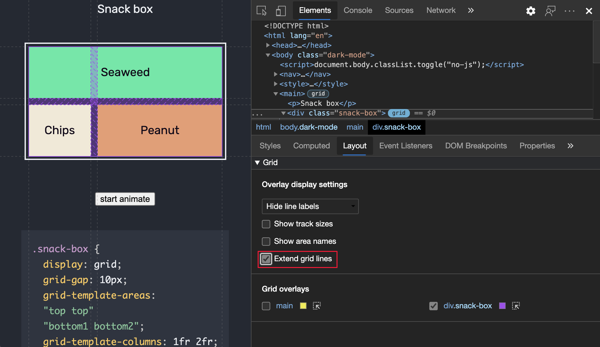
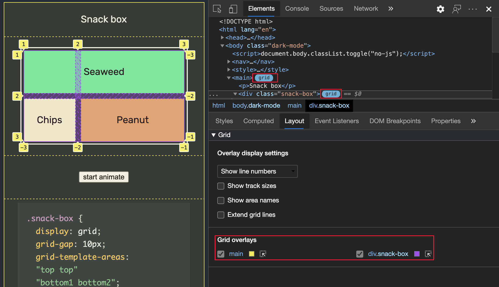
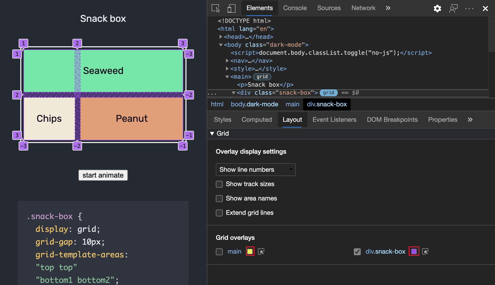
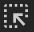
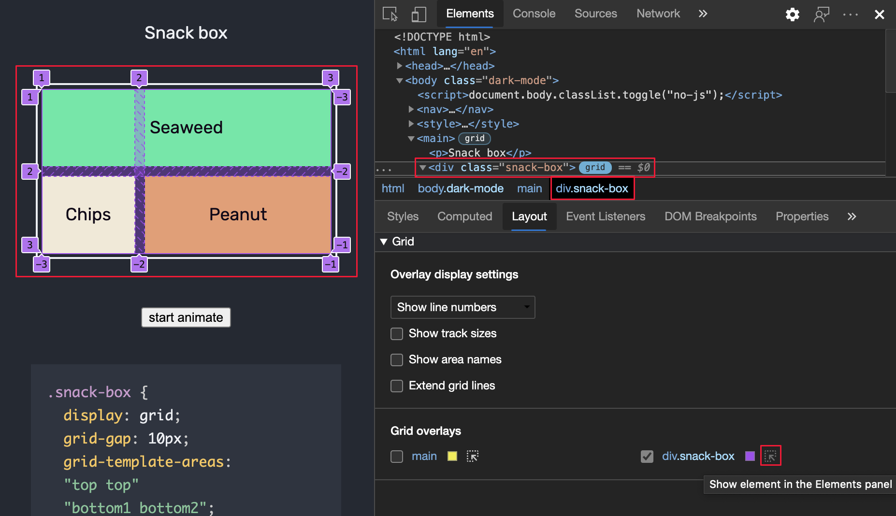

# 检查 CSS 网格

本文将引导你识别网站上的 CSS 网格并使用可自定义的网格叠加层来调试网格布局问题。

本文中的数字中使用的示例取自以下网页：
* [水果盒](https://jec.fyi/demo/css-grid-fruit)
* [小吃盒](https://jec.fyi/demo/css-grid-snack)

<!-- ====================================================================== -->
## 开始之前

CSS 网格是一种强大的 Web 布局范例。  可通过 MDN 上的 [CSS 网格布局指南](https://developer.mozilla.org/docs/Web/CSS/CSS_Grid_Layout)开始了解 CSS 网格和许多功能。

<!-- ====================================================================== -->
## 探索 CSS 网格

当页面上的 HTML 元素已`display: grid`应用或`display: inline-grid`应用到它时，**元素**工具中会在它旁边显示一个`grid`徽章：

单击锁屏提醒可切换页面上网格覆盖的显示。  叠加层显示在元素上方，布局类似于网格，可显示网格线和轨道的位置：

打开“**布局**”窗格。  当网格包含在页面上时，“**布局**”窗格将包括“**网格**”部分，其中包含许多用于查看网格的选项。

“**布局**”窗格中的“**网格**”部分包含以下 2 个子部分：

*  叠加层显示设置
*  网格叠加层

<!--todo: verify the details for each of the sub-sections -->

<!-- ====================================================================== -->
## 叠加层显示设置

在 **“布局”** 选项卡的“可展开 **网格** ”部分中，“ **覆盖显示设置”** 部分包含以下 UI。

### 下拉列表

从下拉列表中选择以下选项之一：

| 线条选项 | 详细信息 |
|:--- |:--- |
| **隐藏线条标签** | 隐藏每个网格叠加层的线条标签。 |
| **显示线条编号** | 显示默认) 选择的每个网格覆盖 (行数。 |
| **显示线条名称** | 显示每个网格叠加层的线条名称（倘若提供了名称）。 |

以下部分介绍 **覆盖显示设置** 下拉列表命令。

#### 隐藏线条标签

在下拉列表中，选择 **“隐藏线条标签** ”以隐藏每个网格覆盖的线条标签。

#### 显示线条编号

在下拉列表中，选择 **“显示行号** ”以显示默认) 选择的每个网格覆盖 (的行数。

默认情况下，网格叠加层上会显示正数和负数线条编号。

有关网格覆盖中的负数的详细信息，请参阅 [CSS 网格的基于线条的位置](https://developer.mozilla.org/docs/Web/CSS/CSS_Grid_Layout/Line-based_Placement_with_CSS_Grid)。

#### 显示线条名称

在下拉列表中，选择 **“显示行名** ”以查看行名而不是数字;这会在提供名称时显示每个网格覆盖的行的名称。  在示例中，4 条线的名称为：`left`、`middle1`、`middle2` 和 `right`。

有关网格覆盖中的行名的详细信息，请参阅 [使用命名网格线的布局](https://developer.mozilla.org/docs/Web/CSS/CSS_Grid_Layout/Layout_using_Named_Grid_Lines)。

<!--In the demo, **orange** element spans from left to right, with `grid-column: left` and `grid-column: right` CSS.  Showing line names makes it easier to visualize the start and end position of the element.  -->

### 复选框

在“ **覆盖显示设置** ”部分中选择任意复选框：

| 选项 | 详细信息 |
|:--- |:--- |
| **显示轨道大小**  | 显示 (或隐藏) 轨道的大小。 |
| **显示区域名称** | 提供名称时，显示 (或隐藏) 区域名称。 |
| **延伸网格线** | 显示 (或隐藏) 沿每个轴的网格维度的扩展。  默认情况下，网格线仅在设置了 `display: grid` 或 `display: inline-grid` CSS 的元素内显示。 |

以下部分介绍这些复选框。

#### 显示轨道大小

选中 **“显示轨道大小** ”复选框，查看网格的轨道大小。

开发人员工具在每个线条标签中显示 `[authored size]` 和 `[computed size]`。

| 大小 | 详细信息 |
|:--- |:--- |
| **创作大小** | 如果未定义) ，则在样式表中定义的大小 (省略。 |
| **计算大小** | 屏幕上的实际大小。 |

在演示中，`snack-box` 列大小在 `grid-template-columns:1fr 2fr;` CSS 中定义。  因此，列线条标签显示了创作大小和计算大小。

| 轨道大小 | 创作大小 | 计算大小 |
|:--- |:--- |:--- |
| **1fr** &#x2022; **96.66px** | 1fr | 96.66px |
| **2fr** &#x2022; **193.32px** | 2fr | 193.32px |

行线条标签仅显示计算大小，因为样式表中未定义行大小。

| 轨道大小 | 创作大小 | 计算大小 |
|:--- |:--- |:--- |
| **80px** | &nbsp;| 80px |
| **80px** | &nbsp;| 80px |

#### 显示区域名称

若要查看区域名称，请选中 **“显示区域名称** ”复选框。  在示例中，网格中有 3 个区域：**top**、**bottom1** 和 **bottom2**。

#### 延伸网格线

选中 **“扩展网格线** ”复选框，将网格线沿每个轴扩展到视区边缘。

<!-- ====================================================================== -->
## 网格叠加层

“**网格叠加层**”部分包含页面上存在的网格列表，每个网格都带有一个复选框以及各种选项。

### 启用多个网格的叠加视图

若要显示多个网格的覆盖网格，请选中网格每个名称旁边的复选框。  在本示例中，启用了 2 个网格覆盖，每个网格覆盖都以不同的颜色表示：

*  `main`
*  `div.snack-box`

### 自定义网格叠加层颜色

若要打开颜色选取器并自定义网格覆盖颜色，请单击网格覆盖名称旁边的框：

### 突出显示网格

若要突出显示 **Elements** 工具中的 HTML 元素并在网页上滚动到它，请单击 **“元素”面板中的“显示”元素** () 图标。

<!-- ====================================================================== -->
> [!NOTE]
> 此页面的某些部分是根据 [Google 创建和共享的](https://developers.google.com/terms/site-policies)作品所做的修改，并根据[ Creative Commons Attribution 4.0 International License ](https://creativecommons.org/licenses/by/4.0)中描述的条款使用。
> 原始页面位于 [此处](https://developer.chrome.com/docs/devtools/css/grid/)，并由 [Jecelyn Yeen](https://developers.google.com/web/resources/contributors#jecelyn-yeen)  \（开发人员支持者，Chrome DevTools\）制作。

本作品根据[ Creative Commons Attribution 4.0 International License ](https://creativecommons.org/licenses/by/4.0)获得许可。
