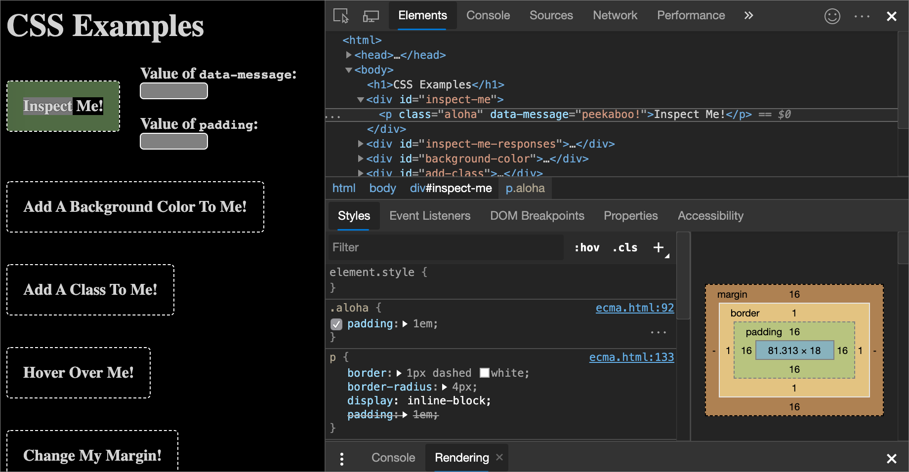
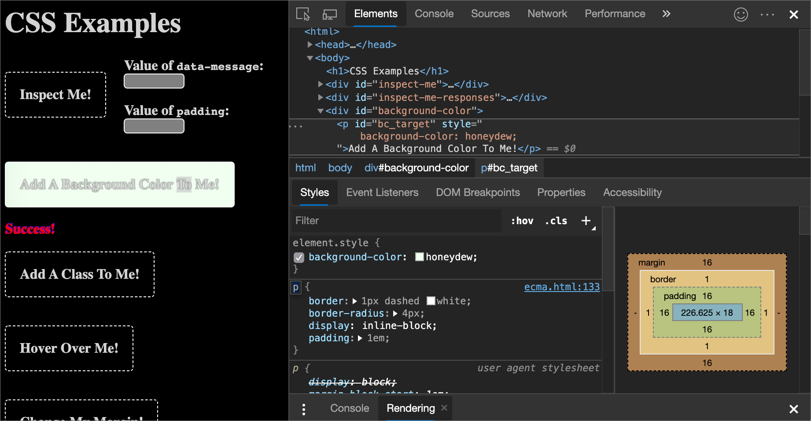
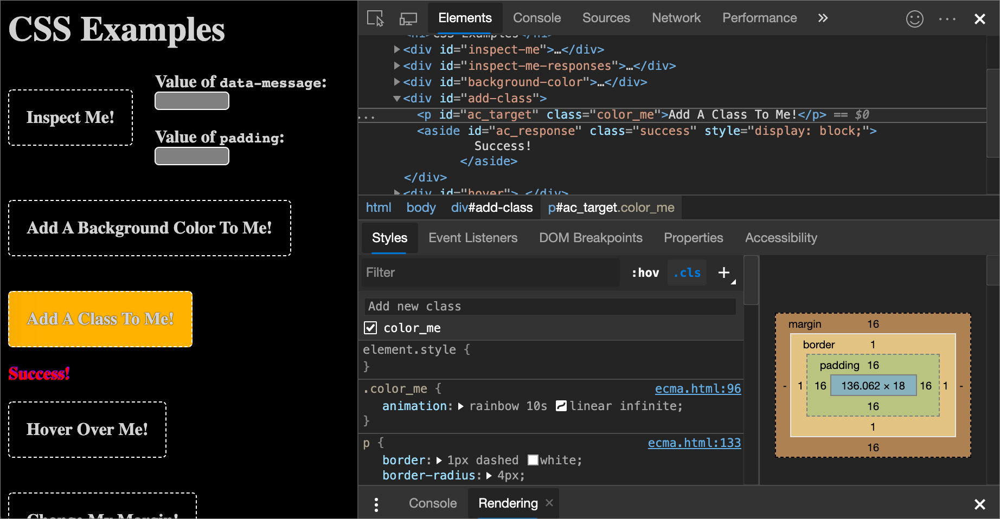
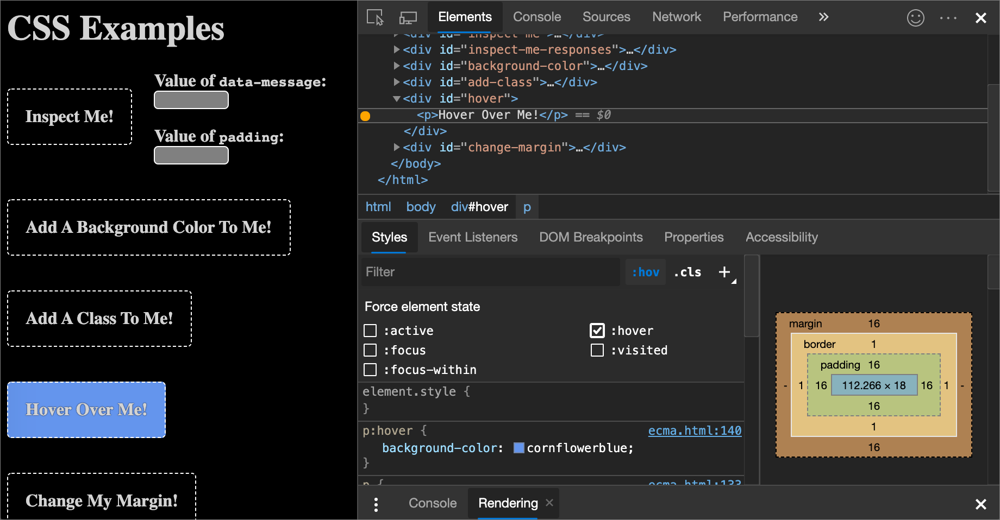
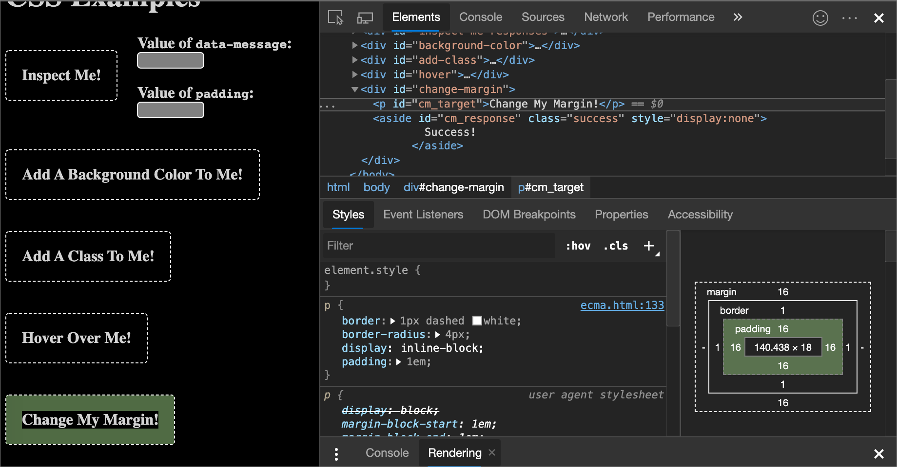
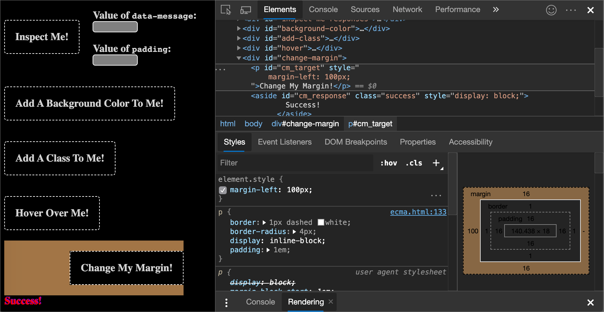
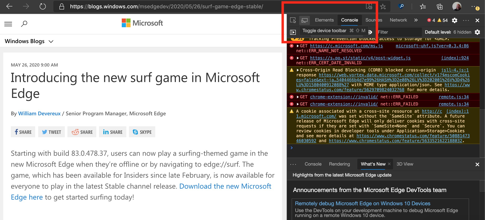
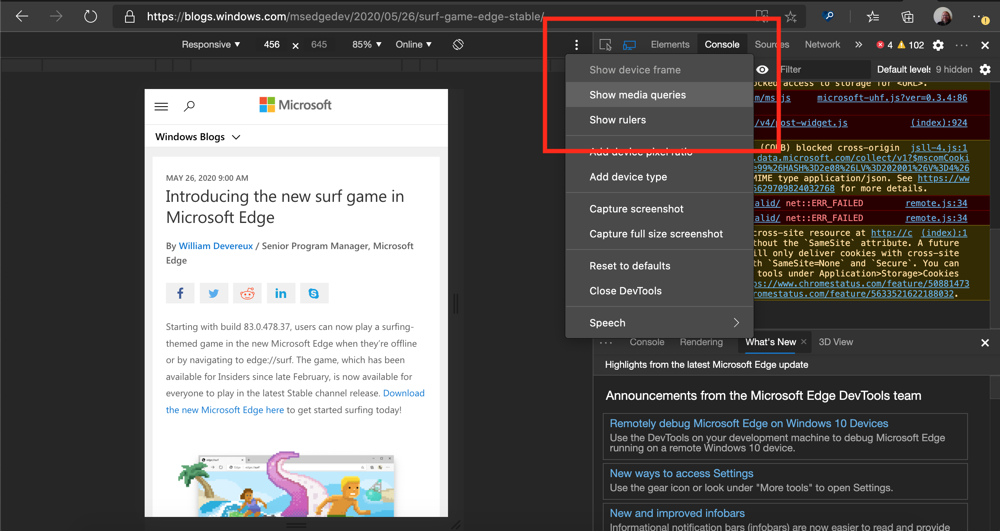
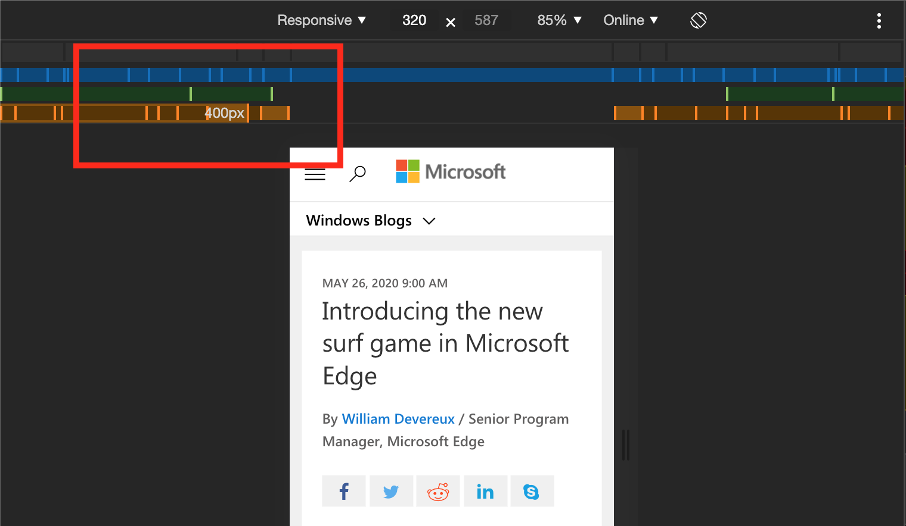
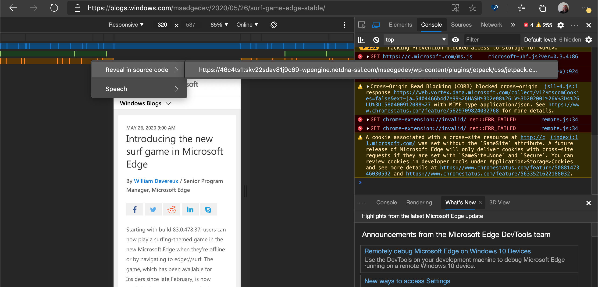

<!-- Copyright Kayce Basques

   Licensed under the Apache License, Version 2.0 (the "License");
   you may not use this file except in compliance with the License.
   You may obtain a copy of the License at

       https://www.apache.org/licenses/LICENSE-2.0

   Unless required by applicable law or agreed to in writing, software
   distributed under the License is distributed on an "AS IS" BASIS,
   WITHOUT WARRANTIES OR CONDITIONS OF ANY KIND, either express or implied.
   See the License for the specific language governing permissions and
   limitations under the License.  -->
# 查看和更改 CSS 入门

按照这些交互式教程部分了解使用 DevTools 查看和更改页面的 CSS 的基础知识。

<!-- ====================================================================== -->
## 查看元素的 CSS

1. 在新窗口或选项卡中打开 [CSS 示例](https://microsoftedge.github.io/Demos/devtools-css-get-started/)演示页。 为此，请右键单击链接，或按住`Control` (Windows、Linux) 或`Command` (macOS) ，然后单击链接。

   <!-- You can view the source files for the CSS Examples demo page at the [MicrosoftEdge/Demos > devtools-css-get-started](https://github.com/MicrosoftEdge/Demos/tree/main/devtools-css-get-started) repo folder. -->

1. 右键单击 `Inspect Me!` 文本，然后选择 **“检查**”。

   在 DevTools 中的 **“元素”** 工具的 **DOM 树** 面板中，突出显示了该 `Inspect Me!` 元素。

   

1. 在元素中 `Inspect Me!` ，找到属性的 `data-message` 值并复制它。

1. 在页面上的 **“值 `data-message`：** 文本”框中，输入值。

1. 右键单击 `Inspect Me!` 文本，然后选择 **“检查**”。

1. 在 DevTools 中的 **“元素”** 工具中，选择 **“样式”** 面板。  在“ **样式”** 面板中 `Inspect Me!` ，元素突出显示。

1. 在元素中`Inspect Me!``aloha`，找到类规则。  显示此规则，因为它正在应用于 `Inspect Me!` 元素。

1. 在类中 `aloha` ，找到样式的 `padding` 值并将其复制。

   

1. 在页面上的 **“值 `padding`：** 文本”框中，输入值。

<!-- ====================================================================== -->
## 向元素添加 CSS 声明

想要更改或将 CSS 声明添加到元素时，请使用“ **样式** ”面板。

1. 首先，建议执行上述元素教程部分 [的“查看 CSS](#view-the-css-for-an-element) ”。

1. 在新窗口或选项卡中打开 [CSS 示例](https://microsoftedge.github.io/Demos/devtools-css-get-started/) 演示页。

1. 右键单击 `Add A Background Color To Me!` 文本，然后选择 **“检查**”。

1. 单击 `element.style` “ **样式”** 面板顶部附近。

1. 键入 `background-color` ，然后按 `Enter`。

1. 键入 `honeydew` ，然后按 `Enter`。  在 **DOM 树**中，将显示应用于元素的内联样式声明。

    声明 `background-color:honeydew` 使用 `element.style` “ **样式** ”面板部分应用于元素：

   

<!-- ====================================================================== -->
## 将 CSS 类添加到元素

若要显示应用到或从元素中删除 CSS 类时元素的外观，请参阅 **“样式”** 面板。

1. 首先，建议执行上述元素教程部分 [的“查看 CSS](#view-the-css-for-an-element) ”。

1. 在新窗口或选项卡中打开 [CSS 示例](https://microsoftedge.github.io/Demos/devtools-css-get-started/) 演示页。

1. 右键单击 `Add A Class To Me!` 文本，然后选择 **“检查**”。

1. 单击 **.cls**。  DevTools 会显示一个文本框，可在其中将 CSS 类添加到要检查的页面元素。

1. 在 **“添加新类**”文本框中键`color_me`入，然后按下`Enter`。  “ **添加新类** ”文本框下方会显示一个复选框，可在其中打开和关闭类。  `Add A Class To Me!`如果该元素应用了任何其他类，你也可以从此处切换每个类。

   该`color_me`类使用 **Styles** 面板的 **.cls** 部分应用于元素：

   

<!-- ====================================================================== -->
## 将伪状态添加到类

使用 **样式** 面板将 CSS 伪状态永久应用到元素。  DevTools 支持`:active`、`:focus``:hover`和 `:visited`.

1. 首先，建议执行上述元素教程部分 [的“查看 CSS](#view-the-css-for-an-element) ”。

1. 在新窗口或选项卡中打开 [CSS 示例](https://microsoftedge.github.io/Demos/devtools-css-get-started/) 演示页。

1. 将鼠标悬停在文本上 `Hover Over Me!` 。  背景色更改。

1. 右键单击 `Hover Over Me!` 文本，然后选择 **“检查**”。

1. 在“ **样式”面板中** ，单击 **“hov**”。

1. 选择 **“悬停** ”复选框。  背景色会像以前一样变化，即使你实际上并没有将鼠标悬停在元素上。

   下面是在元素上切换 `:hover` 伪状态的结果：

   

<!-- ====================================================================== -->
## 更改元素的维度

使用样**式**面板中的 **Box Model** 交互式关系图更改元素的宽度、高度、填充、边距或边框长度。

1. 首先，建议执行上述元素教程部分 [的“查看 CSS](#view-the-css-for-an-element) ”。

1. 在新窗口或选项卡中打开 [CSS 示例](https://microsoftedge.github.io/Demos/devtools-css-get-started/) 演示页。

1. 右键单击 `Change My Margin!` 文本，然后选择 **“检查**”。

1. 在“**样式**”面板中的 **“框模型**”关系图中，将鼠标悬停在**填充**上。  视区中突出显示了元素的填充。

   根据 DevTools 窗口的大小，可能需要滚动到样 **式** 面板底部以显示 **Box 模型**。

1. 双击 **Box Model** 中的左侧边距，该边距当前具有值 `-`，这意味着该元素没有 `margin-left`值。

1. 键入“`100px`”，然后按“`Enter`”。  **Box Model** 默认为像素，但它也接受其他值，例如`25%`，或 `10vw`。

   将鼠标悬停在元素的填充上：

   

   更改元素的左边距：

   

<!-- ====================================================================== -->
## 调试媒体查询

[媒体查询](https://developer.mozilla.org/docs/Web/CSS/Media_Queries/Using_media_queries) 是使网站对每个用户的配置设置更改做出反应的一种方式。  最重要的用例是根据视区维度为产品提供不同的 CSS 布局。

如果有更多的屏幕空间可用，使用单独的布局可以为移动设备和多列布局提供一列布局。

调试或测试在 CSS 中定义的媒体查询：

1. 打开 DevTools。  为此，可以在网页中右键单击，然后选择 **“检查**”。

1. 单击“ **设备仿真** ”图标 () 按钮。  或者，当 DevTools 具有焦点时，请按`Ctrl`++`Shift``M` (`M` `Cmd`+`Shift`+macOS) 。

   <!-- todo: update to show new tooltip: -->

   

1. 打开设备工具栏后，单击 `...` 右上角的菜单，然后选择 **“显示媒体查询**”：

   

   网页上方的彩色条表示不同的媒体查询。
       
1. 将鼠标悬停在条形图中的边界上，以显示不同媒体查询的值。  单击每个媒体查询值以调整网页大小以匹配。

   

1. 若要调试媒体查询并在编辑器中 `Sources` 打开 CSS 文件，请右键单击条段，然后选择 `reveal in source code`。

   

<!-- ====================================================================== -->
> [!NOTE]
> 此页面的某些部分是根据 [Google 创建和共享的](https://developers.google.com/terms/site-policies)作品所做的修改，并根据[ Creative Commons Attribution 4.0 International License ](https://creativecommons.org/licenses/by/4.0)中描述的条款使用。
> 原始页面位于[此处](https://developer.chrome.com/docs/devtools/css/)，由 [Kayce Basques](https://developers.google.com/web/resources/contributors#kayce-basques)\（Chrome DevTools 和 Lighthouse 的技术作家）撰写。

本作品根据[ Creative Commons Attribution 4.0 International License ](https://creativecommons.org/licenses/by/4.0)获得许可。
