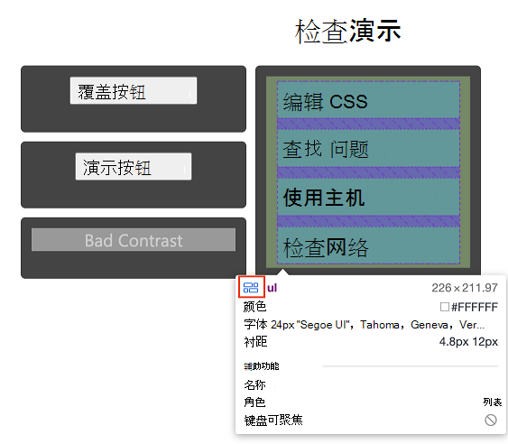

# 使用 Inspect 工具分析 HTML 页面

本文演示如何使用 **Inspect** 工具预览有关元素的信息，以及如何在当前文档中选择元素。  若要立即试用**Inspect**工具，请在阅读本文时，打开其他选项卡或窗口中的"检查演示"页。

<!-- ====================================================================== -->
## 激活 Inspect 工具

" **检查** 工具"按钮位于 DevTools 的左上角。  选择" **检查工具"** 按钮时，该按钮将变为蓝色，指示 **"检查** "工具处于活动状态。

或者， `Control` + `Shift` + `C` 按 (Windows、Linux) `Command` + `Shift` + `C` 或 (macOS) ，以激活**Inspect**工具。

<!-- ====================================================================== -->
## 从 Inspect 覆盖层获取元素信息

当 **Inspect 工具** 处于活动状态时，将鼠标悬停在呈现网页上的任何元素上将显示 **Inspect** 覆盖。  " **检查** "覆盖层显示有关该元素的常规和辅助功能信息。

当您将鼠标悬停在呈现的页面上的页面元素上时，DOM 树会自动扩展以突出显示您悬停在的元素上。

Inspect **** 覆盖层显示有关元素的以下信息：

* 元素的名称。
* 元素的维度（以像素为单位）。
* 元素的颜色，作为十六进制值和颜色样本。
* 元素的字体设置。
* 元素的边距和填充（以像素为单位）。

显示哪些信息取决于元素的类型以及应用于它的样式。  如果元素是使用 CSS 网格或 CSS 弹性框定位的，则"检查"覆盖层中元素名称旁边将显示不同的图标：

" **检查"** 覆盖 **层的** "辅助功能"部分显示有关以下信息：

* 文本颜色对比度。
* 报告给辅助技术的元素的名称和角色。
* 元素是否可聚焦键盘。

例如，在"[检查演示](https://microsoftedge.github.io/DevToolsSamples/inspector/inspector-demo.html)"页中，对于按钮，"检查"覆盖层在对比度值 `Bad Contrast` 1.77 旁边有一个警告图标。 ****  " **检查** "覆盖层还显示按钮无法通过键盘对焦。  无法通过键盘导航到该按钮，因为该按钮实现为类为 的元素，而不是作为 元素 `
` `button` `<button>` 实现。

<!-- ====================================================================== -->
## 检查不可访问的元素

CSS 属性为 的元素 `pointer-events: none` 不适用于 **Inspect** 工具。  在" [检查演示](https://microsoftedge.github.io/DevToolsSamples/inspector/inspector-demo.html) "页中，将鼠标悬停在 上，你将看到父元素 () `Overlay Button` `div.wrapper` 显示而不是 `Overlay Button` 。

若要检查 CSS 属性为 的元素， `pointer-events: none` 请将鼠标悬停在 元素上 `Shift` 时按 。  页面布局区域上还有颜色覆盖，指示你位于高级选择模式。

<!-- ====================================================================== -->
## 选择元素并终止 Inspect 模式

单击呈现页面中的元素时：

*  " **检查** "工具已停用。
*  突出显示相应的 DOM 节点。
*  样式 **工具** 显示应用于 元素的 CSS。

<!-- ====================================================================== -->
## 另请参阅

* [使用"检查"工具将鼠标悬停在网页上以检测辅助功能问题](../accessibility/test-inspect-tool.md)
* [使用 DevTools 的](../accessibility/accessibility-testing-in-devtools.md) 辅助功能测试概述 - 长文章是以上链接文章的超集。
