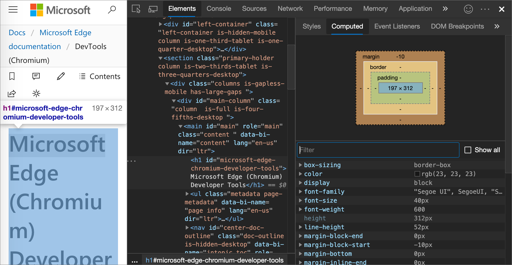
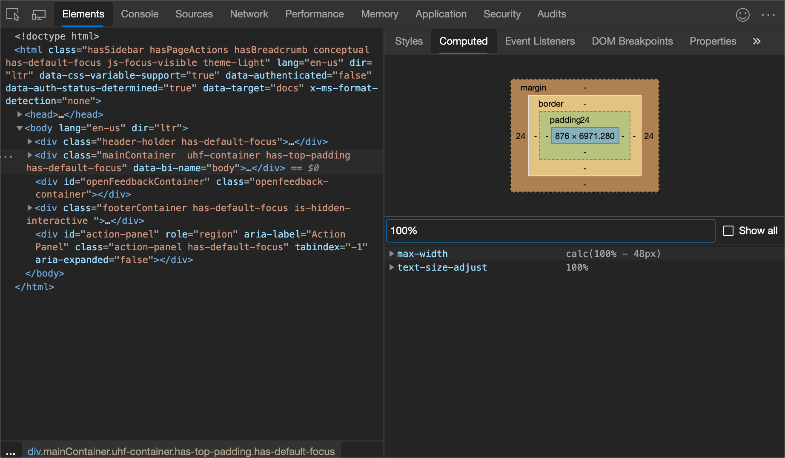
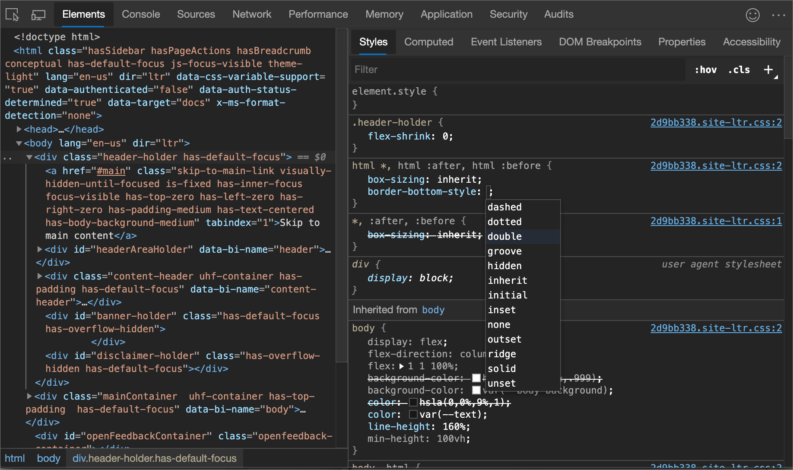

<!-- Copyright Kayce Basques

   Licensed under the Apache License, Version 2.0 (the "License");
   you may not use this file except in compliance with the License.
   You may obtain a copy of the License at

       https://www.apache.org/licenses/LICENSE-2.0

   Unless required by applicable law or agreed to in writing, software
   distributed under the License is distributed on an "AS IS" BASIS,
   WITHOUT WARRANTIES OR CONDITIONS OF ANY KIND, either express or implied.
   See the License for the specific language governing permissions and
   limitations under the License.  -->
# CSS 功能参考

在以下与查看和更改 CSS 相关的 Microsoft Edge DevTools 功能综合参考中发现新的工作流。

若要了解基础知识，请参阅 [开始查看和更改 CSS](../css/index.md)。

<!-- ====================================================================== -->
## 选择元素

DevTools 中的 **元素** 工具允许你一次查看或更改一个元素的 CSS。  所选元素在 **“DOM 树”** 上突出显示。  元素的样式显示在 **“样式”** 窗格中。  有关教程， [请参阅查看元素的 CSS](../css/index.md#view-the-css-for-an-element)。

下图中，**“DOM 树”** 中突出显示的 `h1` 元素就是所选元素。  在右侧的样式窗格中显示了元素的 **“样式”**。  在左侧，元素在视区中突出显示，但仅因为鼠标当前在 **DOM 树**中悬停在它上面：

可通过多种方式选择元素：

*  在呈现的网页中，右键单击页面元素，然后单击“ **检查**”。

*  在 DevTools 中，单击“**选择元素** () 或按`Shift``C`+`Ctrl`+ (Windows、Linux) 或`C``Command`+`Shift`+ (macOS) ，然后单击视区中的元素。

*  在 DevTools 中，单击 **DOM 树**中的元素。

*  在 DevTools 中，运行查询，例如 `document.querySelector('p')` 在 **控制台**中，右键单击结果，然后 **在“元素”面板中选择“显示**”。

<!-- ====================================================================== -->
## 查看已定义规则的外部样式表

在“ **样式** ”窗格中，单击 CSS 规则旁边的链接以打开定义规则的外部样式表。  样式表将在 **“源**”工具**的编辑**器窗格中打开。

如果对样式表进行了细化，请单击“ **格式** () 按钮，位于 **”编辑器** “窗格底部。  有关详细信息，请参阅使用非常打印 [重新设置缩小的 JavaScript 文件](../javascript/reference.md#reformat-a-minified-javascript-file-with-pretty-print)。

<!-- todo: delete /en-us ? 2x -->
在下图中，单击后
`https://docs.microsoft.com/_themes/docs.theme/master/en-us/_themes/styles/b66bc881.site-ltr.css:2`<!-- :2 at end causes not to work. --> 你将转到第 2 `https://docs.microsoft.com/_themes/docs.theme/master/en-us/_themes/styles/b66bc881.site-ltr.css`行，其中定义了 `.content h1:first-of-type` CSS 规则。<!-- master kind of works but all lines are concated.  changing master to main doesn't work -->

<!-- ====================================================================== -->
## 仅查看实际应用于元素的 CSS

**“样式”** 面板显示应用于元素的所有规则，包括已覆盖声明。  如果对重写声明不感兴趣，请使用 **计算** 面板仅查看实际应用于元素的 CSS。

1. [选择元素](#select-an-element)。

1. 转到 **“元素**”工具中的 **“计算**”面板。

   在宽的 DevTools 窗口中， **计算** 面板不存在。  **“计算”** 面板中的内容会在 **“样式”** 面板中显示。

   继承的属性不透明。

1. 若要显示所有继承的值，请选中 **“显示所有”** 复选框。

   在下图中， **计算** 面板显示应用于当前所选 `h1` 元素的 CSS 属性：

   

<!-- ====================================================================== -->
## 按字母顺序查看 CSS 属性

使用 **“计算”** 面板。  [仅查看实际应用于元素的 CSS](#view-only-the-css-that-is-actually-applied-to-an-element)。

<!-- ====================================================================== -->
## 查看继承的 CSS 属性

选中 **“计算”** 面板中的 **“显示所有”** 复选框。  [仅查看实际应用于元素的 CSS](#view-only-the-css-that-is-actually-applied-to-an-element)。

<!-- ====================================================================== -->
## 查看元素的框模型

若要查看元素 [的框模型](https://developer.mozilla.org/docs/Learn/CSS/Introduction_to_CSS/Box_model) ，请转到“ **样式”** 面板。  如果 DevTools 窗口较窄，则 **框模型** 图位于面板的底部。

若要更改值，请双击它。

下图中，**“样式”** 面板中的 **“框模型”** 图显示当前所选 `h1` 元素的框模型。

<!-- ====================================================================== -->
## 搜索和筛选元素的 CSS

使用 **“样式”** 和 **“计算”** 面板上的 **“过滤器”** 文本框来搜索特定的 CSS 属性或值。

若要在 **“计算”** 面板中同时搜索继承属性，请选中 **“全部显示”** 复选框。

下图中，筛选 **“样式”** 面板为只显示包含搜索查询的 `color` 规则。

下图中，筛选 **“计算”** 面板以仅显示包含搜索查询 `100%` 的声明。

<!-- ====================================================================== -->
## 切换伪类

切换伪类，例如`:active`，`:focus``:hover`或`:visited`：
<!-- :focus-within, :focus-visible, :target. -->

1. [选择元素](#select-an-element)。

1. 在 **“元素”** 工具上，转到“ **样式”** 选项卡。

1. 单击 **：hov**。

1. 选择要启用的伪类。

   下图显示了如何切换 `:hover` 伪类。  在视区中 `background-color: cornflowerblue` ，声明将应用到元素，即使该元素实际上并没有被悬停在上面。

   

有关交互式教程，请参阅将 [伪状态添加到类](../css/index.md#add-a-pseudostate-to-a-class)。

<!-- ====================================================================== -->
## 在打印模式下查看页面

若要在打印模式下查看页面，请执行以下操作：

1. 打开“[命令菜单](../command-menu/index.md)”。

1. 开始键入 `rendering`，然后选择 **“显示呈现**”。

1. 单击 **“模拟 CSS 媒体** ”下拉列表，然后选择 **打印**。

<!-- ====================================================================== -->
## 使用覆盖工具查看已使用和未使用的 CSS

**“覆盖”** 工具显示页面实际使用 CSS。

1. 按++`Shift``P` `Ctrl` (Windows、Linux) 或 `Command``P`++`Shift` (macOS) 打开[命令菜单](../command-menu/index.md)，而 DevTools 具有焦点。

1. 开始键入 `coverage`，然后选择 **“显示覆盖范围**”。  出现 **“覆盖”** 工具。

   从命令菜单打开“覆盖范围”选项卡：

   

   “覆盖范围”选项卡：

   

1. 单击 **“开始检测覆盖范围”，刷新页面** () 。  页面刷新和 **“覆盖范围** ”选项卡概述了浏览器加载的每个文件中使用多少 CSS (和 JavaScript) 。  绿色表示已使用的 CSS。  红色表示未使用的 CSS。

   概述使用和未使用多少 CSS (和 JavaScript) ：

   

1. 若要显示所使用的 CSS 的逐行细分，请单击 CSS 文件。

   在下图中，未使用第 145 至 147 行和 149 到 151 `b66bc881.site-ltr.css` 行，而使用第 163 至 166 行：

   

<!-- ====================================================================== -->
## 强制打印预览模式

请参阅 [强制 DevTools 进入打印预览模式](../css/print-preview.md)。

<!-- ====================================================================== -->
<!-- ## Change CSS -->
<!-- todo s/CSS declaration/declaration/ (or not) -->

<!-- ====================================================================== -->
## 向元素添加 CSS 声明的两种方法

声明的顺序会影响元素的样式。  可以通过添加内联声明或将声明添加到样式规则来添加声明。  以下部分介绍了这两种方法。

<!-- ====================================================================== -->
## 将内联 CSS 声明添加到元素

添加内联声明等效于将属性添加 `style` 到元素的 HTML。  在大多数情况下，你可能想要使用内联声明。

内联声明的特定性高于外部声明，因此使用内联声明可确保更改在特定的预期元素中生效。  有关具体性的详细信息，请参阅 [选择器类型](https://developer.mozilla.org/docs/Web/CSS/Specificity#Selector_Types)。

添加内联声明：

1. [选择元素](#select-an-element)。

1. 在“ **样式”** 窗格中，单击 **element.style** 部分的括号。  光标聚焦，以允许输入文本。

1. 输入属性名称并按下 `Enter`。

1. 输入该属性的有效值，然后按 `Enter`。  在 **DOM 树**中， `style` 属性已添加到元素中。

下图中，`margin-top` 和 `background-color` 属性已应用于所选元素。  在 **DOM 树**中，声明反映在元素的 `style` 属性中。

<!-- ====================================================================== -->
## 将 CSS 声明添加到现有样式规则

如果要调试元素的样式，并且需要专门测试在不同位置定义声明时会发生什么情况，请将声明添加到现有样式规则。

若要将声明添加到现有样式规则，请执行以下操作：

1. [选择元素](#select-an-element)。

1. 在“ **样式** ”窗格中，单击要将声明添加到的样式规则的括号之间。  光标聚焦，以允许输入文本。

1. 输入属性名称并按下 `Enter`。

1. 输入该属性的有效值，然后按 `Enter`。

<!-- ====================================================================== -->
## 更改声明名称或值

双击声明的名称或值以更改它。  有关快速递增或递减值 0.1、1、10 或 100 个单位的快捷方式，请参阅带有 [键盘快捷方式的更改声明值](#change-declaration-values-with-keyboard-shortcuts) 。

<!-- ====================================================================== -->
## 使用键盘快捷方式更改声明值

编辑声明的值时，可以使用以下键盘快捷方式将值递增到特定数量：

| 键盘快捷方式 | 递增方式 |
|---|---|
| `Alt`+`Up` (Windows、Linux) 或 `Option`+`Up` (macOS)  | 0.1 |
| `Up` | 1 (或 0.1，如果当前值介于 -1 和 1 之间)  |
| `Shift`+`Up` | 10 |
| `Shift`+`Page Up` (Windows、Linux) 或 `Shift`++`Command``Up` (macOS)  | 100 |

若要递减，请按 `Down` 键而不是 `Up` 键。

<!-- ====================================================================== -->
## 向元素添加类

若要将类添加到元素，请执行以下操作：

1. 在 ** DOM 树** 中 [选择元素](#select-an-element)。

1. 单击 **.cls**。

1. 在 **“添加新类”** 文本框中输入类的名称。

1. 按 `Enter`。

   

<!-- ====================================================================== -->
## 切换类

若要在元素上启用或禁用类，请执行以下操作：

1. 在 ** DOM 树** 中 [选择元素](#select-an-element)。

1. 打开 **“元素类”** 窗格。  请参阅 [将类添加到元素](#add-a-class-to-an-element)。  **“添加新类**”文本框下面是应用于此元素的所有类。

1. 切换要启用或禁用的类旁边的复选框。

<!-- ====================================================================== -->
## 添加样式规则

若要添加新样式规则，请执行以下操作：

1. [选择元素](#select-an-element)。

1. 单击 **新样式规则** () 。  DevTools 在 **element.style** 规则下方插入新规则。

   在下图中，DevTools 在单击 **“新建样式规则**”后添加`h1.devsite-page-title`了样式规则。

   

<!-- are we recommending continuing from the above then doing the following?  or does the following give more detail on how or where to do the above? -->

### 选择要向其添加规则的样式表

[添加新样式规则](#add-a-style-rule)时，选择要向以下内容添加规则的样式表：

*  单击并按住 **“新建样式规则** () 选择要将样式规则添加到的样式表。

<!-- is the above an alternative to the below, or sequential? clarify flow/relation -->

### 向特定位置添加样式规则

若要将样式规则添加到 **样式** 面板中的特定位置，请执行以下操作：<!--is this opposed to some above approach?-->

1. 将鼠标悬停在要添加新样式规则正上方的样式规则上。

1. [显示 **“更多操作”** 工具栏](#reveal-the-more-actions-toolbar)。

1. 在图标**下 (插入样式规则下方**) 。

<!-- ====================================================================== -->
## 显示“更多操作”工具栏

使用 **“更多操作”** 工具栏执行以下操作：

*  直接在所关注样式规则下面插入样式规则。

*  向所关注的样式规则添加`background-color`、`color`、`box-shadow` 或 `text-shadow` 声明。

若要显示 **“更多操作”** 工具栏，请执行以下操作：

1. 在 **“样式”** 面板中，将鼠标悬停在样式规则上。  **样** 式规则部分右下角会显示 () 的更多操作 `...` 。

   下图中，将鼠标悬停在 `.header-holder.has-default-focus` 样式规则上，在样式规则部分的右下方会显示出 **“更多操作”**。

   

1. 将鼠标悬停在 **“更多操作** ”上 (`...`) 显示上述操作。

   将鼠标悬停在 **“更多动作“** 上，就会显示出 **“下方插入样式规则”** 操作。

   

<!-- ====================================================================== -->
## 添加背景色声明

若要向元素添加 `background-color` 声明，请执行以下操作：

1. 将鼠标悬停在要添加 `background-color` 声明的样式规则上。

1. [显示 **“更多操作”** 工具栏](#reveal-the-more-actions-toolbar)。

1. 单击 **“添加背景色** () 。

<!-- ====================================================================== -->
## 添加颜色声明

若要向元素添加 `color` 声明，请执行以下操作：

1. 将鼠标悬停在要添加 `color` 声明的样式规则上。

1. [显示 **“更多操作”** 工具栏](#reveal-the-more-actions-toolbar)。

1. 单击 **“添加颜色** () 。

   

<!-- ====================================================================== -->
## 添加框阴影声明

若要向元素添加 `box-shadow` 声明，请执行以下操作：

1. 将鼠标悬停在要添加 `box-shadow` 声明的样式规则上。

1. [显示 **“更多操作”** 工具栏](#reveal-the-more-actions-toolbar)。

1. 单击 **“添加框阴影** () 。

   

<!-- ====================================================================== -->
## 添加文本阴影声明

若要向元素添加 `text-shadow` 声明，请执行以下操作：

1. 将鼠标悬停在要添加 `text-shadow` 声明的样式规则上。

1. [显示 **“更多操作”** 工具栏](#reveal-the-more-actions-toolbar)。

1. 单击 **“添加文本阴影** () 。

   

<!-- ====================================================================== -->
## 切换声明

若要打开或关闭单个声明，请执行以下操作：

1. [选择元素](#select-an-element)。

1. 在 **“样式”** 窗格中，将鼠标悬停在定义声明的规则上。  每个声明旁边将显示复选框。

1. 选择或清除声明旁边的复选框。  清除声明时，DevTools 会将其交叉，以指示它不再处于活动状态。

   下图中，当前选中元素的 `margin-top` 属性已关闭。

   

<!-- ====================================================================== -->
## 使用颜色选取器更改颜色

**颜色选取器** 为更改 `color` 和 `background-color` 声明提供 GUI。

若要打开 **颜色选取器**，请执行以下操作：

1. [选择元素](#select-an-element)。

1. 在 **“样式”** 面板中，找到 `color`、`background-color` 或要更改的类似声明。  在左侧`color``background-color`，或类似的值，有一个小方形，这是颜色的预览。

   下图中，`rgba(0, 0, 0, 0.7)` 左侧的小方块是该颜色的预览。

   

1. 单击预览打开 **颜色选取器**。

   

下图和列表描述了 **颜色选取器**的每个 UI 元素。

| 标注 | 组件 | 描述 |
|---|---|---|
| 1 | **色调** |  |
| 2 | **取色器** | [用“取色器“在页面上打样着色](#sample-a-color-off-the-page-with-the-eyedropper) |
| 3 | **复制到剪贴板** | 将 **“显示值”** 复制到剪贴板。 |
| 4 | **显示值** | 颜色的 RGBA、HSLA 或十六进制表示形式。 |
| 5 | **调色板** | 单击方形可更改颜色。 |
| 6 | **色调** |  |
| 7 | **不透明度** |  |
| 8 | **显示值切换器** | 在当前颜色的 RGBA、HSLA 和十六进制表示形式之间切换。 |
| 9 | **调色板切换器** | 在 [“材质设计调色板”](https://material.io/guidelines/style/color.html#color-color-palette)、“自定义调色板”或“页面颜色调色板”之间切换。  DevTools 根据在样式表中所找到的颜色来生成页面调色板。 |

### 用“取色器“在页面上打样着色

打开 **颜色选取器**时， **眼滴器** ( 默认情况下，) 处于打开状态。

若要将所选颜色更改为页面上的一些其他颜色，请执行以下操作：

1. 将鼠标悬停在视区中的目标颜色上。

1. 单击以确认。

   下图中，**“颜色选取器”** 显示接近黑色的电流 `rgba(0,0,0,0.7)` 颜色值。  特定颜色更改为当前在视区中突出显示的黑色版本（在单击后）。

   

另请参阅：
* [使用颜色选取器测试文本颜色对比度](../accessibility/color-picker.md)

<!-- ====================================================================== -->
## 使用角度时钟更改角度值

**角度时钟**提供一个 GUI，用于更改 CSS 属性值中的角度量。

打开 **角度时钟**：

1. 选择包含角度声明的元素。 <!-- For example, select the text below. -->

1. 在“ **样式”** 选项卡中 `transform` ，找到要更改的或 `background` 声明。  单击角度值旁边的 **“角度预览** ”框。

   在下图中，左侧 `100deg` 的小时钟是角度的预览。

1. 单击预览以打开 **角度时钟**：

   

1. 通过单击 **“角度时钟”** 圆来更改角度值，或滚动鼠标以增加或减少角度值 1。

有更多的键盘快捷方式来更改角度值。  在“ [样式”窗格键盘快捷方式](../shortcuts/index.md#styles-pane-keyboard-shortcuts)中了解详细信息。

<!-- ====================================================================== -->
> [!NOTE]
> 此页面的某些部分是根据 [Google 创建和共享的](https://developers.google.com/terms/site-policies)作品所做的修改，并根据[ Creative Commons Attribution 4.0 International License ](https://creativecommons.org/licenses/by/4.0)中描述的条款使用。
> 原始页面位于[此处](https://developer.chrome.com/docs/devtools/css/reference/)，由 [Kayce Basques](https://developers.google.com/web/resources/contributors#kayce-basques)\（Chrome DevTools 和 Lighthouse 的技术作家）撰写。

本作品根据[ Creative Commons Attribution 4.0 International License ](https://creativecommons.org/licenses/by/4.0)获得许可。
