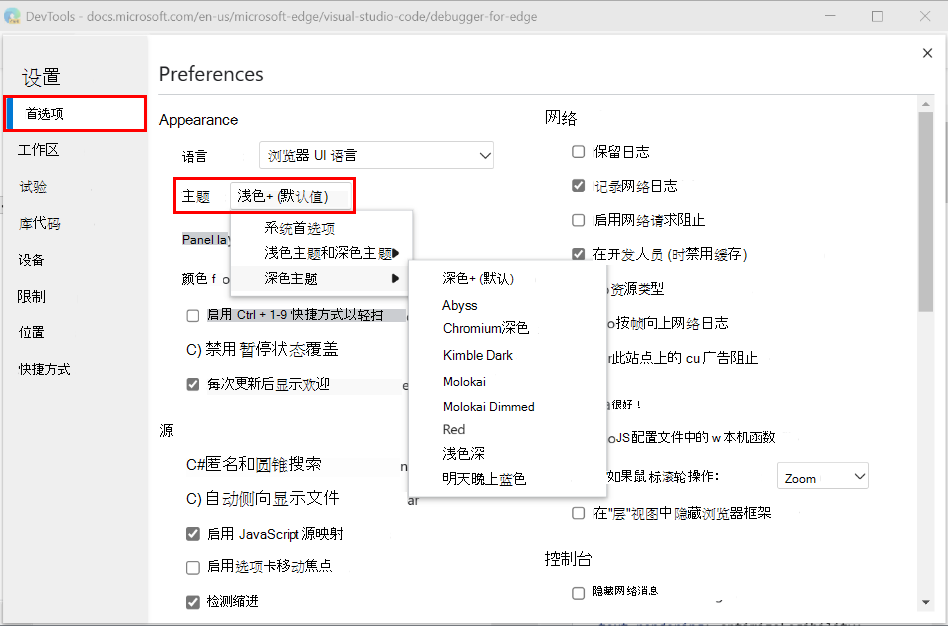

<!-- Copyright Kayce Basques

   Licensed under the Apache License, Version 2.0 (the "License");
   you may not use this file except in compliance with the License.
   You may obtain a copy of the License at

       https://www.apache.org/licenses/LICENSE-2.0

   Unless required by applicable law or agreed to in writing, software
   distributed under the License is distributed on an "AS IS" BASIS,
   WITHOUT WARRANTIES OR CONDITIONS OF ANY KIND, either express or implied.
   See the License for the specific language governing permissions and
   limitations under the License.  -->
# 自定义 DevTools

本页列出了自定义 Microsoft Edge DevTools 的方法。

<!-- ====================================================================== -->
## “设置”

**设置** > **首选项** 包含许多用于自定义 DevTools 的选项。

若要打开“设置”，请在 DevTools 中单击 **“设置”** 图标 () 。  或者，虽然 DevTools 具有焦点，但按下 `F1`。

<!-- ====================================================================== -->
## 抽屉

在 DevTools 底部的 **抽屉** 工具栏中，可以选择要显示的工具。

若要打开 (或关闭 **) 抽屉**，请按。`Escape`

可以在主面板和抽屉之间移动工具。

*  若要将工具从抽屉移动到主面板，请右键单击工具，然后选择 **“移动到顶部**”。

   

*  若要将工具从主面板移动到抽屉，请右键单击工具，然后选择 **“移到底部**”。

   

<!-- ====================================================================== -->
## 重新排序工具

单击并拖动工具以更改排序。  自定义工具顺序在 DevTools 会话中保持不变。

默认情况下， **网络** 工具通常是主工具栏上的第五个选项卡。  在下图中， **将移动网络** 工具，以成为主工具栏中的第一个选项卡。

<!-- ====================================================================== -->
## 打开和关闭工具

为了简化 DevTools 接口，默认情况下不会打开许多工具。  若要在主面板或 **抽屉**中打开工具，请单击 **“更多工具** () 选项卡右侧的按钮，然后从列表中选择一个工具。

若要关闭工具，请选择“ **关闭** () 工具选项卡中的按钮。

<!-- ====================================================================== -->
## 更改 DevTools 停靠在浏览器中的位置

请参阅[更改 DevTools 放置位置（取消停靠，停靠到底部，停靠到左侧）](placement.md)。

<!-- ====================================================================== -->
## 放大或缩小 DevTools

请参阅 _DevTools 概述_中的[缩放 DevTools](../overview.md#zoom-devtools-in-or-out)。

<!-- ====================================================================== -->
## 颜色主题

请参阅 [将颜色主题应用于 DevTools](theme.md)。

<!-- ====================================================================== -->
## 还原默认设置

若要还原默认主题、位置、工具顺序和任何其他自定义设置，请选择 **“设置** > **首选项** > **还原默认值”和“刷新**”。

<!-- ====================================================================== -->
## 自定义键盘快捷方式

请参阅 [自定义键盘快捷方式](../customize/shortcuts.md)。

<!-- ====================================================================== -->
## 有关自定义 DevTools UI 的视频

#### 自定义 Microsoft Edge 开发人员工具和快速功能访问

_发布于 2022 年 5 月 5 日。_

了解如何根据需要自定义 DevTools。

此视频介绍如何停靠或撤换 DevTools、打开新工具以及关闭不需要的工具。 它介绍如何在底部抽屉中移动工具并自定义文本大小和主题。 该视频还介绍了如何使用命令菜单键盘快捷方式快速自定义 DevTools。

#### 了解 DevTools 用户界面

_发布于 2022 年 9 月 1 日。_

了解如何组织 Microsoft Edge DevTools UI。 如果你对可用的工具以及 DevTools 接口的主要部分执行哪些操作感到困惑，则此视频将帮助你获得更舒适的功能。

在本视频中，我们将查看 UI 结构及其主工具栏和面板及其抽屉区域。 我们还介绍如何查找、打开和关闭工具、还原默认设置以及查看可用工具列表。

<!-- additional text, from Welcome panel, which includes 'customize': -->

请查看此视频，了解 DevTools UI 的主要部分、如何自定义它以满足你的需求、了解可用的不同工具以及在何处寻求帮助。

#### 另请参阅

* [有关使用 Microsoft Edge 进行 Web 开发的视频](../../dev-videos/index.md)

<!-- ====================================================================== -->
> [!NOTE]
> 此页面的某些部分是根据 [Google 创建和共享的](https://developers.google.com/terms/site-policies)作品所做的修改，并根据[ Creative Commons Attribution 4.0 International License ](https://creativecommons.org/licenses/by/4.0)中描述的条款使用。
> 原始页面位于[此处](https://developer.chrome.com/docs/devtools/customize/)，由 [Kayce Basques](https://developers.google.com/web/resources/contributors#kayce-basques)\（Chrome DevTools 和 Lighthouse 的技术作家）撰写。

本作品根据[ Creative Commons Attribution 4.0 International License ](https://creativecommons.org/licenses/by/4.0)获得许可。
