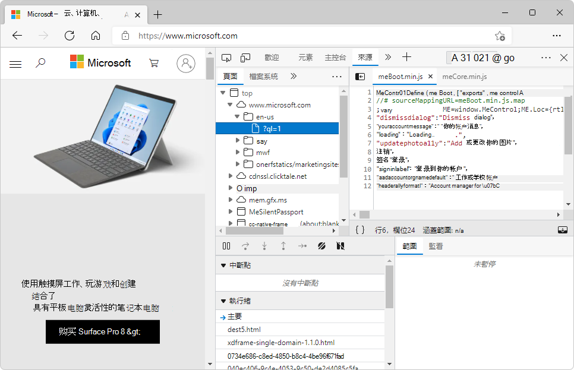
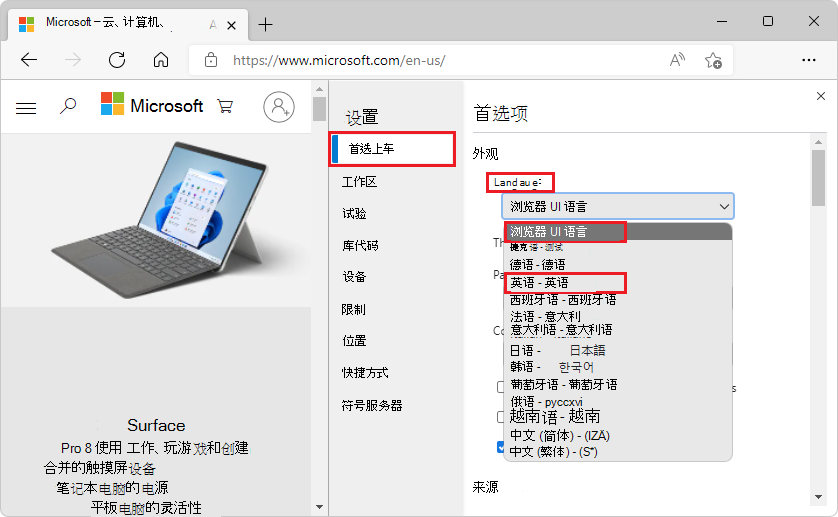

# 更改开发工具语言设置

默认情况下，如果开发人员工具是当前支持的十种语言之一，则你的开发人员工具与浏览器语言匹配 (英语语言) ：

* 简 (中文) - &#20013;&#25991;&#65288;&#31616;&#20307;&#65289;
* 繁体 (中文) - &#20013;&#25991;&#65288;&#32321;&#39636;&#65289;
* 法语 –&#231;英语
* 德语 - 德语
* 意大利语 - 意大利语
* 日语 - &#26085;&#26412;&#35486;
* 朝鲜语 - &#54620;&#44397;&#50612;
* 葡萄牙语 - 图卢&#234;语
* 俄语 – &#1088;&#1091;&#1089;&#1089;&#1082;&#1080;&#1081;
* 西班牙语 - 电子邮件&#241;ol

使用中文的 DevTools UI：

<!-- ====================================================================== -->
## 将 DevTools UI 还原为英语

若要将 DevTools 的 UI 文本还原为英语，请执行以下操作：

1. 在 DevTools 中，单击**** 设置 (设置。) 按钮，或按 。`F1`

1. 在左侧，确保 **已选中"首选项** "页。

1. 在 **"首选项"** 页的"外观****"部分，找到"**** 语言"下拉列表，该列表是页面顶部的第一项。

1. 在" **语言** "下拉列表中，选择" **浏览器 UI** 语言"，这是下拉列表中的第一个菜单项。  或者，选择 **"英语"**。

   如果 DevTools UI 当前为英语，则下拉列表的外观：

   

   如果你的 DevTools UI 当前为日语，则下拉列表的外观：

   

1. 单击 **设置** 面板右上角的"关闭 (x) "按钮，然后单击临时显示在 DevTools 顶部的"重新加载 **DevTools**"按钮。****

   将 **DevTools** UI 从日语更改为英语时，"重新加载 DevTools"按钮的外观：

   

<!-- ====================================================================== -->
## 将所有 DevTools 设置还原为默认值

警告：这将删除 DevTools 的所有自定义项。

若要将所有 DevTools 设置还原为默认设置，包括 UI 语言：

1. 在 DevTools 中，单击**** 设置 (设置。) 按钮，或按 。`F1`

1. 在左侧，确保 **已选中"首选项** "页。

1. 在"首选项" **页底部** ，单击" **还原默认值并刷新"** 按钮。

1. 重新应用要还原的 DevTools 的任何自定义设置和布局。
