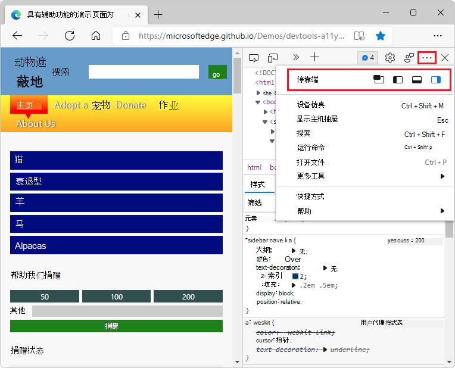
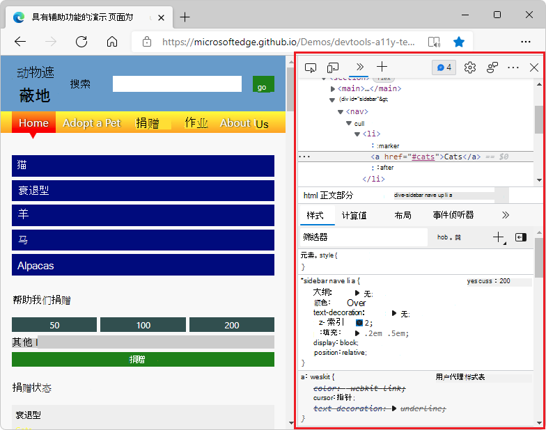

# 更改开发工具放置位置（取消停靠，停靠到底部，停靠到左侧）

你可以更改 DevTools 在浏览器中的停靠位置。  默认情况下，Microsoft Edge工具固定在浏览器窗口的右侧。  还可以将 DevTools 停靠在窗口底部或左侧，或者将 DevTools 停靠到单独的窗口。

若要更改 DevTools 放置在浏览器窗口中的位置，请执行以下操作：

*  单击"自定义**和控制 DevTools** 。) 菜单按钮，然后在"扩展坞"部分，选择布局选项：
   *  **使用"撤消** 停靠到  "图标取消停靠到单独的窗口。) 
   *  **停靠到左侧** ( 图标。) 
   *  **"扩展坞 (**"图标。) 
   *  **扩展坞向右 (**"图标。) 

**扩展坞**向左或**** 向右，使 DevTools 与网页并排显示，并且当你模拟移动设备 ([设备](../device-mode/index.md)仿真) 。  **停靠到左侧**，**停靠到右侧**选项与高分辨率显示效果最佳。

<!-- ====================================================================== -->
## 将 DevTools 撤消到单独的窗口中

当你想要使用多个监视器时，或者如果你需要在全屏应用上工作，并且需要为 DevTools UI 提供大量空间时，将 DevTools 撤消到其自己的独立窗口中。  下图显示了 DevTools 已撤消插入其自己的专用窗口：

由于 WebTools 现在具有自己的专用窗口，正在设计的 WebPage 现在占据整个浏览器窗口：

请参阅[更改 DevTools 放置位置（取消停靠，停靠到底部，停靠到左侧）](placement.md)。

<!-- ====================================================================== -->
## 浏览器左侧的扩展坞 DevTools

下图显示了停靠在浏览器窗口左侧的 DevTools：

<!-- ====================================================================== -->
## 浏览器底部的扩展坞 DevTools

**当你没有足够的** 水平显示空间，或者你想要在 DOM 或控制台中调试长文本时，停靠到底部会 **有所帮助**。  下图显示了浏览器窗口底部的 DevTools：

<!-- ====================================================================== -->
## 浏览器右侧扩展坞 DevTools

下图显示了浏览器窗口右侧是默认位置的 DevTools：

<!-- ====================================================================== -->
## 使用命令菜单更改 DevTools 的停靠位置

1. 打开命令菜单。  为此，请单击"自定义和控制 **DevTools**  "图标。单击") "菜单按钮，然后单击"运行 **命令"**。  或者，按 `Shift`++`Ctrl``P` Windows/Linux 或`P` `Command`+`Shift`+macOS。

1. 键入 **dock**，然后选择扩展坞命令：

    *  **扩展坞到底部**
    *  **扩展坞向左**
    *  **扩展坞向右**
    *  **还原最后一个扩展坞位置**
    *  **撤消停靠到单独的窗口中**
