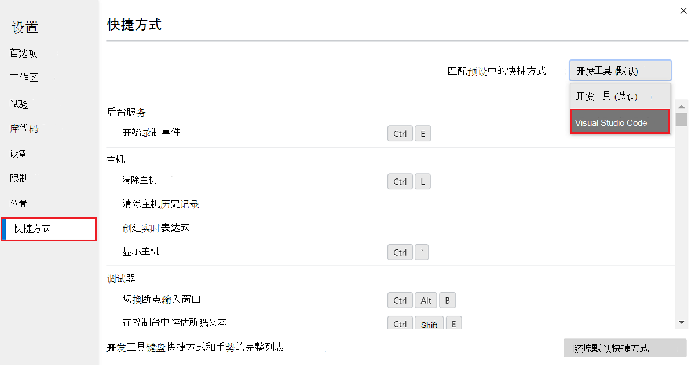
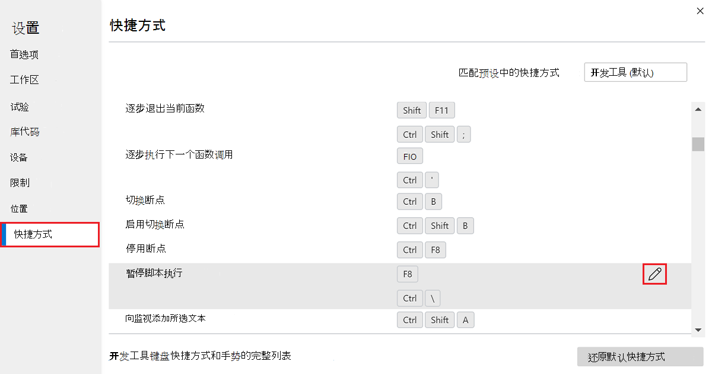
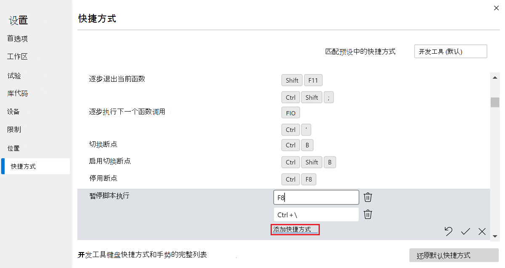

# 自定义键盘快捷方式

在**设置****的快捷**方式页中，可以查看 Microsoft Edge DevTools 的定义快捷方式、为特定操作定义自己的快捷方式，或使用预设来匹配 Microsoft Visual Studio Code 中的默认快捷方式。

有关默认键盘快捷方式，请参阅 [键盘快捷方式](../shortcuts/index.md)。

<!-- ====================================================================== -->
## 匹配Visual Studio Code中的键盘快捷方式

若要匹配 Microsoft Edge DevTools 中的键盘快捷方式，Visual Studio Code中的等效操作：

1. 要打开 DevTools，请右击网页，然后选择“**检查**”。  或者，按“`Ctrl`+`Shift`+`I`”(Windows、Linux)或“`Command`+`Option`+`I`”(macOS)。  DevTools 随即打开。

1. 在 DevTools 的主工具栏上，单击**设置 (** 设置) 按钮。  或者，按 。`Shift`+`?`

1. 在**设置**面板中，选择 **“快捷方式”** 页。

1. 在右上角，在预设下拉列表**的“匹配”快捷方式**中，选择 **“Visual Studio Code**”而不是 **“DevTools” (默认) **。

   

例如，若要在Visual Studio Code中暂停或继续运行脚本，请选择`F5`。  但是，使用 **DevTools (默认) ** 预设，若要暂停或继续运行脚本，请按下 `F8`。  将预设更改**为Visual Studio Code**时，现在也按 `F5` DevTools，就像在Visual Studio Code中一样。

### 另请参阅

* [Microsoft Visual Studio代码](https://code.visualstudio.com)
* [Visual Studio Code PDF 文件Windows (键盘快捷方式](https://code.visualstudio.com/shortcuts/keyboard-shortcuts-windows.pdf)) 

<!-- ====================================================================== -->
## 编辑 DevTools 操作的键盘快捷方式

1. 要打开 DevTools，请右击网页，然后选择“**检查**”。  或者，按“`Ctrl`+`Shift`+`I`”(Windows、Linux)或“`Command`+`Option`+`I`”(macOS)。  DevTools 随即打开。

1. 在 DevTools 的主工具栏上，单击**设置 (** 设置) 按钮。  或者，按 。`Shift`+`?`

1. 在**设置**面板中，选择 **“快捷方式”** 页。

1. 选择要自定义的操作。  例如，在 **“调试器** ”部分中，选择 **“暂停脚本执行** ”操作。

1. 单击 **“编辑** () 图标。

   

1. 若要将快捷键绑定到操作，请确保操作旁边的文本框具有焦点，然后使用键盘选择快捷键。

1. 若要将多个快捷方式组合绑定到操作，请选择 **“添加快捷方式**”，确保操作旁边的文本框具有焦点，然后使用键盘选择快捷键。

   

1. 若要保存新键盘快捷方式，请选择复选标记 () 图标。

   :::image type="content" source="../media/experiments-custom-keyboard-shortcuts-save-shortcut.msft.png" alt-text="选择复选标记图标以保存新键盘快捷方式。" lightbox="../media/experiments-custom-keyboard-shortcuts-enter-key.msft.png":::

1. 选择新的键盘快捷方式以触发 DevTools 中的操作。

### 图标和按钮

<!-- keep in same order as screenshot: -->

*  如果自 **定义键盘快捷方式** () 复选框旁边显示的图标，则表示已自定义键盘快捷方式。

*  若要在编辑操作的键盘快捷方式时删除操作的键盘快捷方式，请单击 **“删除”快捷方式** () 图标。

*  若要在编辑操作的键盘快捷方式时为操作添加其他键盘快捷方式，请单击 **“添加快捷方式**”链接，或单击 CustomKeyboardShortcut () 图标。

*  若要在编辑操作的键盘快捷方式时保存已修改或添加的键盘快捷方式，请单击复选标记 () 图标。

*  若要在编辑操作的键盘快捷方式时放弃更改，请单击 X () 图标。

*  若要重置所有快捷方式，请单击“ **还原默认快捷方式** ”按钮。

如果键盘快捷方式当前分配给一个操作，则无法将其分配给另一个操作。  而是从上一个操作中删除键盘快捷方式，然后将键盘快捷方式添加到新操作。

<!-- ====================================================================== -->
## 另请参阅

* [键盘快捷方式](../shortcuts/index.md)
* [使用辅助技术导航开发工具](../accessibility/navigation.md)
* [在“命令”菜单中运行命令](../command-menu/index.md)
* [自定义 DevTools](index.md#settings)
