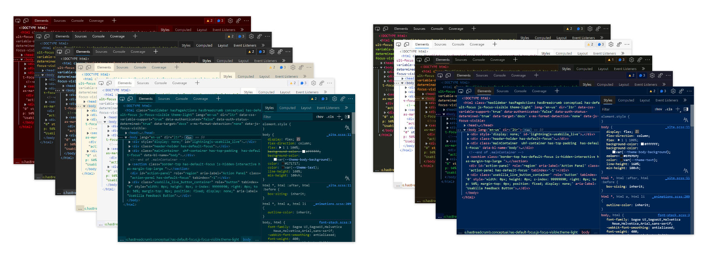
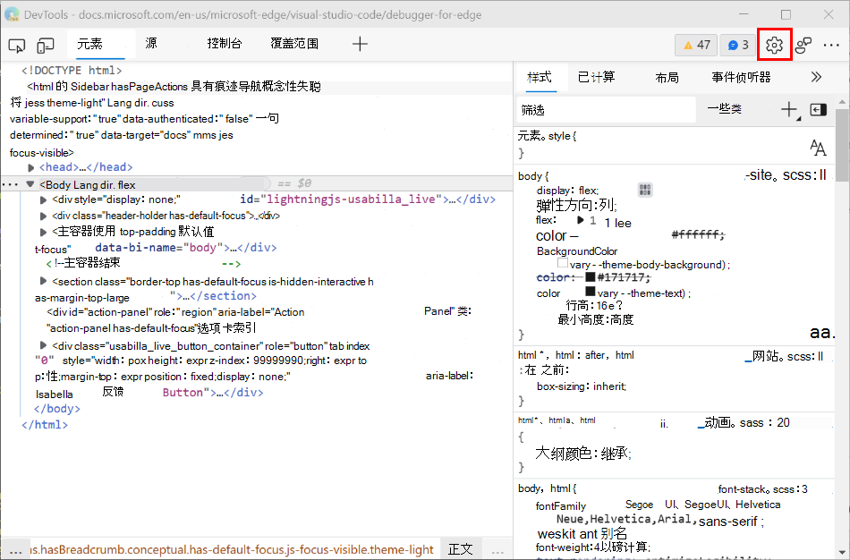
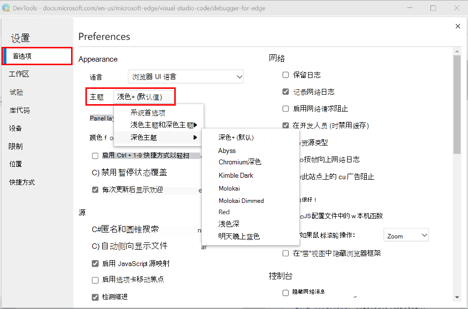
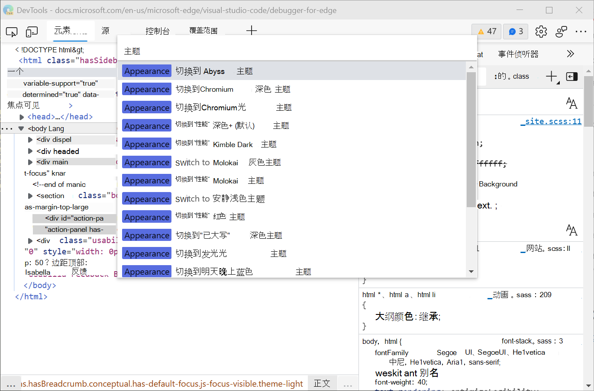

<!-- Copyright Kayce Basques
   Licensed under the Apache License, Version 2.0 (the "License");
   you may not use this file except in compliance with the License.
   You may obtain a copy of the License at
       https://www.apache.org/licenses/LICENSE-2.0
   Unless required by applicable law or agreed to in writing, software
   distributed under the License is distributed on an "AS IS" BASIS,
   WITHOUT WARRANTIES OR CONDITIONS OF ANY KIND, either express or implied.
   See the License for the specific language governing permissions and
   limitations under the License.  -->
# 将颜色主题应用于开发工具

你可以将各种颜色主题应用于Microsoft Edge DevTools，包括[来自Visual Studio Code](https://code.visualstudio.com)的多个主题，如 Monokai 和 Solarized Dark。  主题会影响窗格、按钮和代码语法突出显示的颜色。

本文介绍如何更改 DevTools 的外观。  若要更改正在开发的网页的显示方式，请参阅 [呈现的页面中的模拟深色或浅色方案](../accessibility/preferred-color-scheme-simulation.md)。

<!-- ====================================================================== -->
## 可用主题

默认情况下，DevTools 主题设置为 **系统首选** (也称为 **系统首选颜色主题**) 。  如果操作系统设置为 Light 主题，DevTools 将使用 **Light+** 主题。  如果操作系统设置为深色主题，DevTools 将使用 **Dark+** 主题。  但是，可以将 DevTools 更改为其他任一主题，以便在将操作系统设置为“浅色”或“深色”主题时，DevTools 不会受到影响。

浅色主题：
- Light+ (默认) 
- Chromium光
- 安静光
- 太阳能化光

深色主题：
- Dark+ (默认) 
- 深渊
- Chromium深色
- 金月深色
- Monokai
- Mono kai Dimmed
- 红色
- 太阳能化深色
- 明晚蓝色

<!-- ====================================================================== -->
## 从设置更改颜色主题

1. 打开 DevTools，然后选择**设置** (齿轮图标) 。

   

1. 选择 **“首选项”**，然后在 **“外观** ”部分中，从 **“主题** ”下拉列表中选择一个主题。

<!-- ====================================================================== -->
## 从命令菜单更改颜色主题

若要使用命令菜单更改应用于 DevTools 的颜色主题，请执行以下操作：

1. [打开“命令”菜单](../command-menu/index.md)。

1. 键 `theme`入，然后选择 **一个外观** 命令，例如 **“外观：切换到 Abyss 主题** ”或 **“外观：切换到浅 (默认) 主题**。

1. 按 `Enter`。

<!-- ====================================================================== -->
> [!NOTE]
> 此页面的某些部分是根据 [Google 创建和共享的](https://developers.google.com/terms/site-policies)作品所做的修改，并根据[ Creative Commons Attribution 4.0 International License ](https://creativecommons.org/licenses/by/4.0)中描述的条款使用。
> 原始页面位于[此处](https://developers.google.com/web/tools/chrome-devtools/customize/dark-theme)，由 [Kayce Basques](https://developers.google.com/web/resources/contributors#kayce-basques)\（Chrome DevTools 和 Lighthouse 的技术作家）撰写。

本作品根据[ Creative Commons Attribution 4.0 International License ](https://creativecommons.org/licenses/by/4.0)获得许可。
