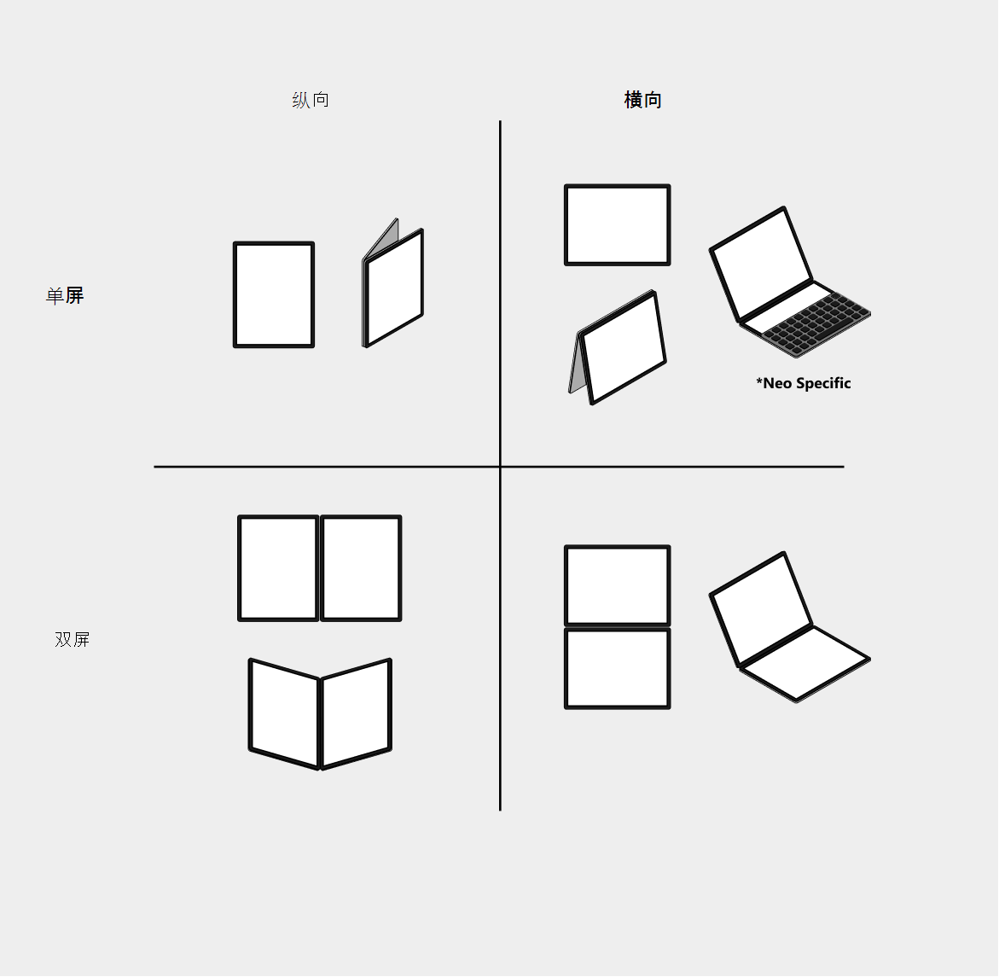

# 模拟双屏幕和可折叠设备

可以在 Microsoft Edge DevTools 中模拟以下双屏和可折叠设备。

* [Surface Duo](https://www.microsoft.com/surface/devices/surface-duo)
* [Samsung Galaxy Fold](https://www.samsung.com/global/galaxy/galaxy-fold)

模拟设备并在以下姿势之间切换。

*  单屏或折叠的姿势
*  双屏或展开的姿势

API 在 Microsoft Edge 97 及更高版本中可用。 如果不使用 Microsoft Edge 97 或更高版本，则需要启用实验性 Web 平台功能来使用 API。

[打开实验性的 Web 平台 API](#turn-on-experimental-apis) ，并使用 [CSS 视区段媒体功能](/dual-screen/web/css-viewport-segments) 和 [JavaScript 视区段](/dual-screen/web/javascript-viewport-segments) 来增强双屏和可折叠设备的网站 (或应用) 。

<!-- ====================================================================== -->
## 启用实验性 API

若要使用 [CSS 视区段媒体功能](/dual-screen/web/css-viewport-segments)和 [JavaScript 视区段](/dual-screen/web/javascript-viewport-segments)，请在Microsoft Edge中打开`Experimental Web Platform features`标志，如下所示：

1. 转到 `edge://flags`。

1. 在 **“搜索标志** ”文本框中，输入 `Experimental Web Platform features`并选择 **“实验 Web 平台功能** ”标志，并将 **“禁用** ”更改为 **“已启用**”。

1. 重启 Microsoft Edge。

:::image type="content" source="../media/experiments-dual-screen-emulation-edge-flags.msft.png" alt-text="打开实验性 Web 平台功能标志。" lightbox="../media/experiments-dual-screen-emulation.msft.png":::

### Surface Duo

如果使用 [CSS 视区段媒体功能](/dual-screen/web/css-viewport-segments)或 [JavaScript 视区段](/dual-screen/web/javascript-viewport-segments)来增强 [Surface Duo](https://www.microsoft.com/surface/devices/surface-duo) 的网站或应用，则还必须在 [Surface Duo](https://www.microsoft.com/surface/devices/surface-duo) 设备上的[Android Microsoft Edge应用](https://play.google.com/store/apps/details?id=com.microsoft.emmx)中打开**实验性 Web 平台功能**标志。

#### 在Android和桌面Microsoft Edge中匹配标志

如果**实验性 Web 平台功能**标志在[桌面Microsoft Edge](https://www.microsoft.com/edge)中打开，并在[Android Microsoft Edge应用](https://play.google.com/store/apps/details?id=com.microsoft.emmx)中关闭，则桌面Microsoft Edge Surface Duo 模拟器中的网站或应用的行为与[AndroidSurface](https://play.google.com/store/apps/details?id=com.microsoft.emmx) [Duo](https://www.microsoft.com/surface/devices/surface-duo) 上的Microsoft Edge应用。  

确保标志在Android和桌面Microsoft Edge之间匹配，以便在[桌面Microsoft Edge](https://www.microsoft.com/edge)中成功使用 Surface Duo 模拟器。

<!-- ====================================================================== -->
## 在可折叠设备和双屏设备上进行测试

在Microsoft Edge中以双屏姿势模拟 [Surface Duo](https://www.microsoft.com/surface/devices/surface-duo) 时， (两个屏幕之间的空间的接缝) 通过网站或应用绘制。

模拟的显示与网站 (或应用) 在 [Surface Duo](https://www.microsoft.com/surface/devices/surface-duo) 上运行时在[Microsoft Edge Android应用](https://play.google.com/store/apps/details?id=com.microsoft.emmx)中呈现的方式相匹配。  可能需要更新网站 (或应用) 才能在接缝上更好地显示。  有关将网站 (或应用) 适应接缝的详细信息，请参阅 [如何使用接缝](/dual-screen/introduction#how-to-work-with-the-seam)。

[设备工具栏](../device-mode/index.md#simulate-a-mobile-viewport)具有其他功能，可帮助你以多种姿势和方向测试网站或应用。  单击 **“旋转** () 将视区旋转为横向。 将该功能与 **Span** (Span 组合在一 ) 在单屏、折叠和双屏或展开的姿势之间切换。  通过这些功能，你可以以所有四种可能的姿势和方向测试网站或应用。

**实验 Web 平台功能** () 图标显示**实验 Web 平台功能**标志的状态。  如果打开标志，则突出显示该图标。  如果标志已关闭，则不会突出显示该图标。  若要打开 (或关闭) 标志，请单击图标或转到 `edge://flags` 并切换标志。

### 已知问题

#### 指针摇晃或口吃

使用[Microsoft 远程桌面客户](/windows-server/remote/remote-desktop-services/clients/remote-desktop-clients)端连接到远程电脑并模拟 [Surface Duo](https://www.microsoft.com/surface/devices/surface-duo) 或 [Samsung Galaxy Fold](https://www.samsung.com/global/galaxy/galaxy-fold) 时，指针可能会摇动或口吃。  如果遇到此问题，请联系 Microsoft Edge DevTools 团队。

<!-- ====================================================================== -->
## 其他资源

下面是可帮助你增强双屏设备的网站 (或应用) 的其他资源。

*  有关双屏设备上的 Web 开发的详细信息，请参阅 [双屏 Web 体验](/dual-screen/web/index)。

*  安装 [Surface Duo 仿真器](/dual-screen/android/use-emulator)。  Surface Duo 模拟器不同于Microsoft Edge中的模拟器、运行Android以及与[Android Studio](https://developer.android.com/studio/)集成。  请参阅 [“获取 Surface Duo SDK](/dual-screen/android/get-duo-sdk)”。
