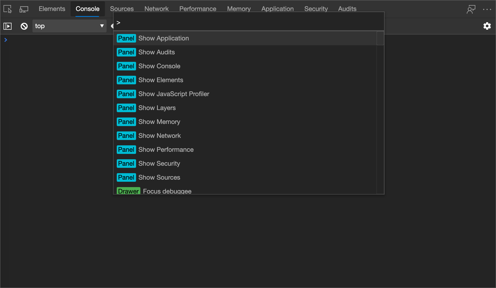

<!-- Copyright Kayce Basques

   Licensed under the Apache License, Version 2.0 (the "License");
   you may not use this file except in compliance with the License.
   You may obtain a copy of the License at

       https://www.apache.org/licenses/LICENSE-2.0

   Unless required by applicable law or agreed to in writing, software
   distributed under the License is distributed on an "AS IS" BASIS,
   WITHOUT WARRANTIES OR CONDITIONS OF ANY KIND, either express or implied.
   See the License for the specific language governing permissions and
   limitations under the License.  -->
# 使用传感器工具替代地理位置

许多网站利用用户位置，为用户提供更相关的体验。  例如，在用户授予网站访问当前用户位置的权限后，天气网站可能会在用户区域中显示本地预测。

<!--todo: add link to user location section when available -->

如果要生成根据用户所在位置而更改的 UI，可能需要确保站点在世界各地的不同位置正常运行。  若要在 Microsoft Edge DevTools 中替代地理位置，

1. 按“`Ctrl`+`Shift`+`P`”(Windows、Linux)或“`Command`+`Shift`+`P`”(macOS)以打开“**命令菜单**”。

   

1. 键 `sensors`入，选择 **“抽屉：显示传感器**”，然后按下 `Enter`。  **传感器**工具在 DevTools 窗口底部打开。

1. 单击 **“位置”** 下拉列表，然后：
   *  选择一个城市，例如 `Tokyo`。
   *  单击 **“其他** ”以输入自定义经度和纬度坐标。
   *  单击 **“位置不可用** ”以查看当用户位置不可用时网站的行为。

   

<!-- /web/fundamentals/native-hardware/user-location/index -->

<!-- ====================================================================== -->
> [!NOTE]
> 此页面的某些部分是根据 [Google 创建和共享的](https://developers.google.com/terms/site-policies)作品所做的修改，并根据[ Creative Commons Attribution 4.0 International License ](https://creativecommons.org/licenses/by/4.0)中描述的条款使用。
> 原始页面位于[此处](https://developer.chrome.com/docs/devtools/device-mode/geolocation/)，由 [Kayce Basques](https://developers.google.com/web/resources/contributors#kayce-basques)\（Chrome DevTools 和 Lighthouse 的技术作家）撰写。

本作品根据[ Creative Commons Attribution 4.0 International License ](https://creativecommons.org/licenses/by/4.0)获得许可。
