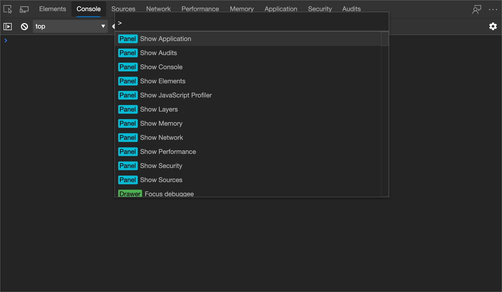
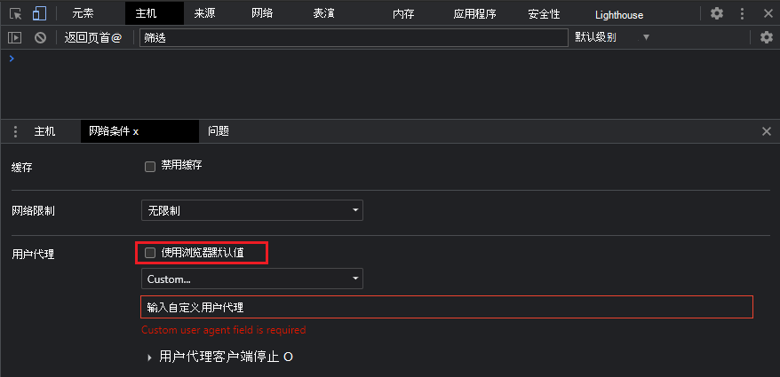

<!-- Copyright Kayce Basques

   Licensed under the Apache License, Version 2.0 (the "License");
   you may not use this file except in compliance with the License.
   You may obtain a copy of the License at

       https://www.apache.org/licenses/LICENSE-2.0

   Unless required by applicable law or agreed to in writing, software
   distributed under the License is distributed on an "AS IS" BASIS,
   WITHOUT WARRANTIES OR CONDITIONS OF ANY KIND, either express or implied.
   See the License for the specific language governing permissions and
   limitations under the License.  -->
# 替代用户代理字符串

若要从 Microsoft Edge DevTools 重写[用户代理](https://developer.mozilla.org/docs/Glossary/User_agent)字符串：

1. 按“`Ctrl`+`Shift`+`P`”(Windows、Linux)或“`Command`+`Shift`+`P`”(macOS)以打开“**命令菜单**”。

   
    
1. 键入 `network conditions`，选择 **“显示网络条件**”，然后按 `Enter` 下以打开 **“网络条件”** 工具。

1. 在 **“用户代理** ”部分中，清除 **“使用浏览器”默认** 复选框。

   

1. 从下拉列表中选择用户代理，或输入自定义用户代理。

1. 单击 **“用户代理客户端提示** ”以查看和更改这些值，如 [网络功能参考](../network/reference.md)中所述。

<!-- ====================================================================== -->
## 另请参阅

* 在_模拟移动设备 (设备仿真) _中[设置用户代理字符串](index.md#set-the-user-agent-string)

<!-- ====================================================================== -->
> [!NOTE]
> 此页面的某些部分是根据 [Google 创建和共享的](https://developers.google.com/terms/site-policies)作品所做的修改，并根据[ Creative Commons Attribution 4.0 International License ](https://creativecommons.org/licenses/by/4.0)中描述的条款使用。
> 原始页面位于[此处](https://developer.chrome.com/docs/devtools/device-mode/override-user-agent/)，由 [Kayce Basques](https://developers.google.com/web/resources/contributors#kayce-basques)\（Chrome DevTools 和 Lighthouse 的技术作家）撰写。

本作品根据[ Creative Commons Attribution 4.0 International License ](https://creativecommons.org/licenses/by/4.0)获得许可。
