<!-- Copyright Kayce Basques

   Licensed under the Apache License, Version 2.0 (the "License");
   you may not use this file except in compliance with the License.
   You may obtain a copy of the License at

       https://www.apache.org/licenses/LICENSE-2.0

   Unless required by applicable law or agreed to in writing, software
   distributed under the License is distributed on an "AS IS" BASIS,
   WITHOUT WARRANTIES OR CONDITIONS OF ANY KIND, either express or implied.
   See the License for the specific language governing permissions and
   limitations under the License.  -->
# <a name="get-started-viewing-and-changing-the-dom"></a>开始查看和更改 DOM

按照这些交互式教程部分了解使用 Microsoft Edge DevTools 查看和更改页面的文[档对象模型](https://developer.mozilla.org/docs/Web/API/Document_Object_Model) (DOM) 的基础知识。

若要了解 DOM 和 HTML 之间的区别，请参 [阅以下附录：HTML 与 DOM](#appendix-html-versus-the-dom)。


<!-- ====================================================================== -->
## <a name="view-dom-nodes"></a>查看 DOM 节点

在“元素”面板的 DOM 树中，你可以在开发人员工具中执行所有 DOM 相关活动。


### <a name="inspect-a-node"></a>检查节点

当你对特定 DOM 节点感兴趣时，可通过“**检查**”快速打开开发人员工具并调查该节点。

1. 在新窗口或选项卡中打开[“DOM 示例](https://microsoftedge.github.io/Demos/devtools-dom-get-started/)”演示页。 为此，请右键单击链接，或按住`Control` (Windows、Linux) 或`Command` (macOS) ，然后单击链接。

<!-- You can view the source files for the DOM Examples demo in the [MicrosoftEdge/Demos > devtools-dom-get-started](https://github.com/MicrosoftEdge/Demos/tree/main/devtools-dom-get-started) repo folder. -->

1. 在 **“检查节点**”下，右键单击 **米开朗基罗** ，然后选择 **“检查**”。

   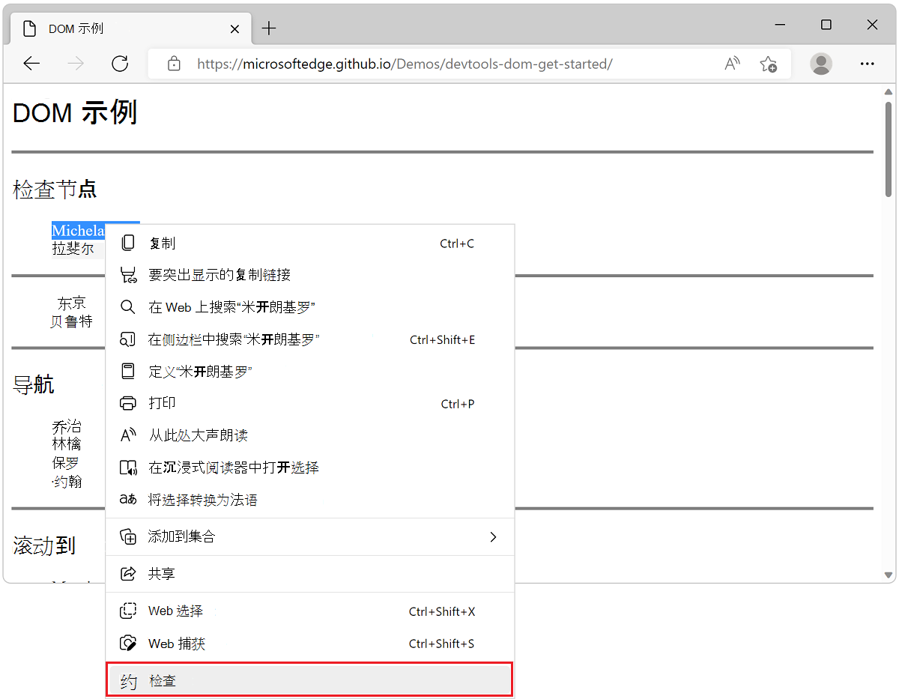

   此时将打开开发人员工具的“**元素**”工具。  `<li>Michelangelo</li>` 将在“**DOM 树**”中突出显示。

   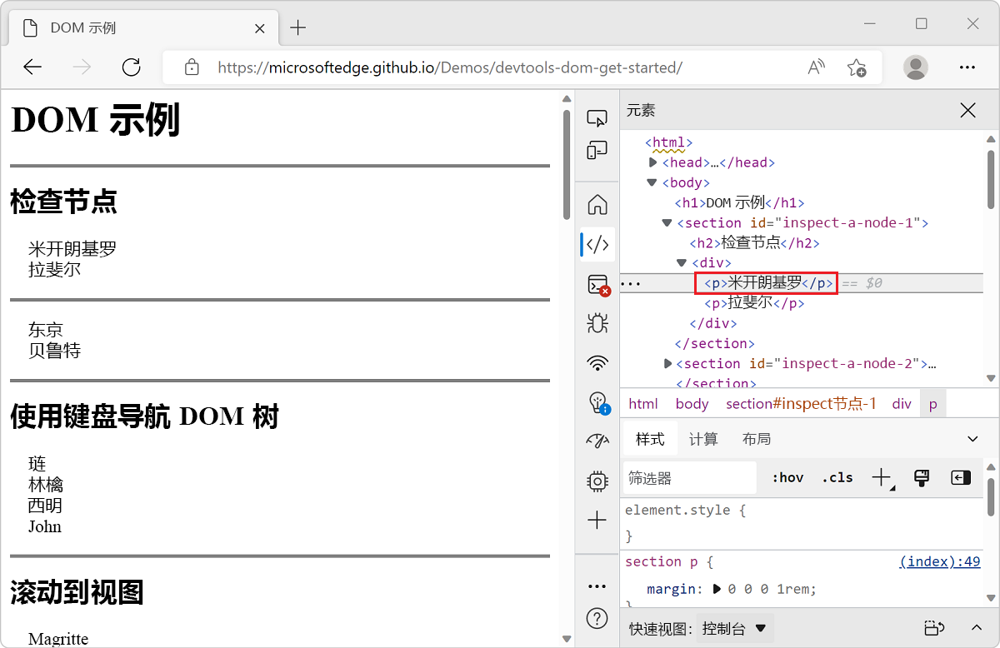

1. 单击“ **检查** ( 在 DevTools 的左上角) 图标。

   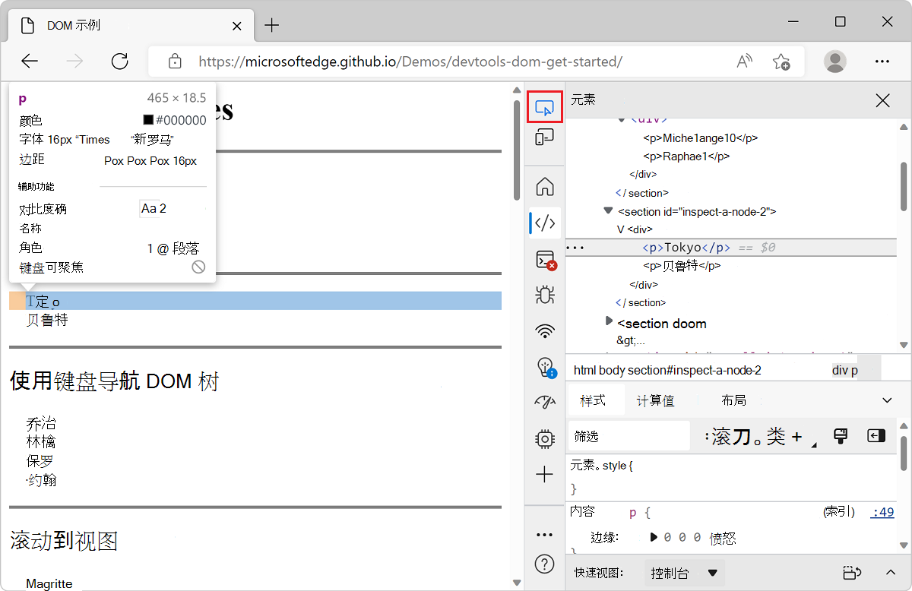

1. 在 **“检查节点**”下，单击 **“东京** 文本”。  现在，`<li>Tokyo</li>` 在 DOM 树中突出显示。

检查节点也是查看和更改节点样式的第一步。  请参阅[开始查看和更改 CSS](../css/index.md)。


### <a name="navigate-the-dom-tree-with-a-keyboard"></a>使用键盘浏览 DOM 树

在 DOM 树中选择节点后，可以使用键盘导航 DOM 树。

1. 在新窗口或选项卡中打开 [“DOM 示例](https://microsoftedge.github.io/Demos/devtools-dom-get-started/) ”演示页。

1. 在 **使用键盘导航 DOM 树**下，右键单击 **Ringo** ，然后选择 **“检查**”。  `<li>Ringo</li>` 在 DOM 树中已选中。

   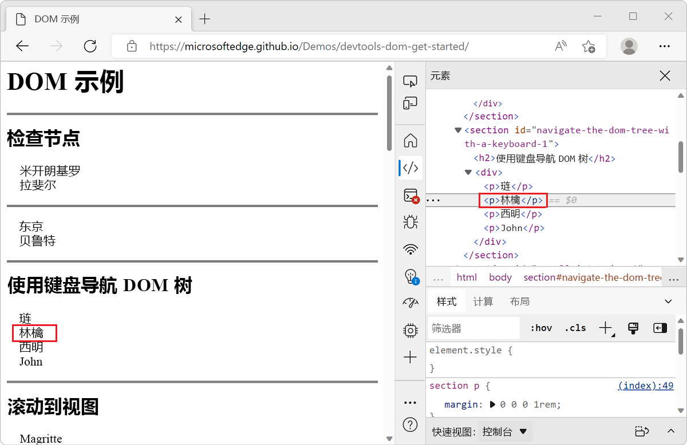

1. `Up`按箭头键 2 次。  `<ul>` 已选中。

   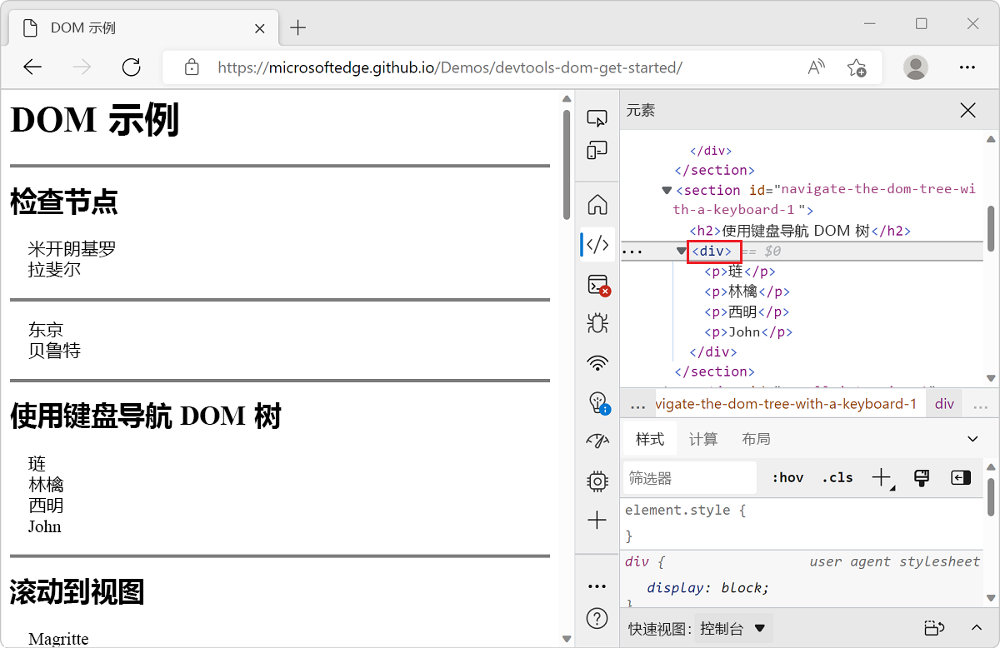

1. `Left`按箭头键。  `<ul>` 列表会折叠。

1. `Left`再次按箭头键。  `<ul>` 节点的父节点已被选中。  在这种情况下，它是 ID 为 `navigate-the-dom-tree-with-a-keyboard-1` 的 `<div>`。

1. `Down`按箭头键 2 次，以便重新选择刚刚折叠的`<ul>`列表。  应如下所示： `<ul>... </ul>`

1. `Right`按箭头键。  列表将展开。


### <a name="scroll-into-view"></a>滚动到视图

查看 DOM 树时，你可能会发现自己对当前不在视区中的 DOM 节点感兴趣。  例如，假设你滚动到页面底部，并且你对页面顶部的 `<h1>` 节点感兴趣。  **滚动到视图** 后，可以快速重新定位视区，以便查看节点。

1. 在新窗口或选项卡中打开 [“DOM 示例](https://microsoftedge.github.io/Demos/devtools-dom-get-started/) ”演示页。

1. 在 **“滚动到视图**”下，右键单击 **“Magritte** ”，然后选择 **“检查**”。

1. 滚动到“DOM 示例”页面的底部。

1. 仍应在 DOM 树中选择 `<li>Magritte</li>` 节点。  如果没有，请返回到“[滚动到视图](#scroll-into-view)”，然后重新开始。

1. 右键单击 `<li>Magritte</li>` 节点，然后单击 **“滚动到视图**”。  视区向上滚动以显示 **Magritte** 节点。  如果未显示 **“滚动到视图**”选项，请参阅[附录：缺少选项](#appendix-missing-options)。

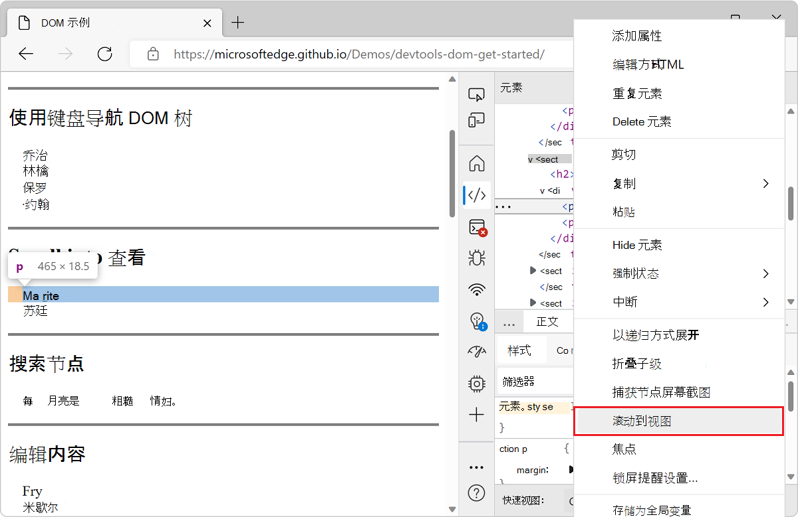

### <a name="search-for-nodes"></a>搜索节点

可以按字符串、CSS 选择器或 XPath 选择器搜索 DOM 树。

1. 将光标焦点放在“**元素**”工具上。

1. 按`Ctrl`+`F` (Windows、Linux) 或`Command`+`F` (macOS) 。  搜索栏在 DOM 树的底部打开。

1. 键入 `The Moon is a Harsh Mistress`。  最后一句在 DOM 树中突出显示。

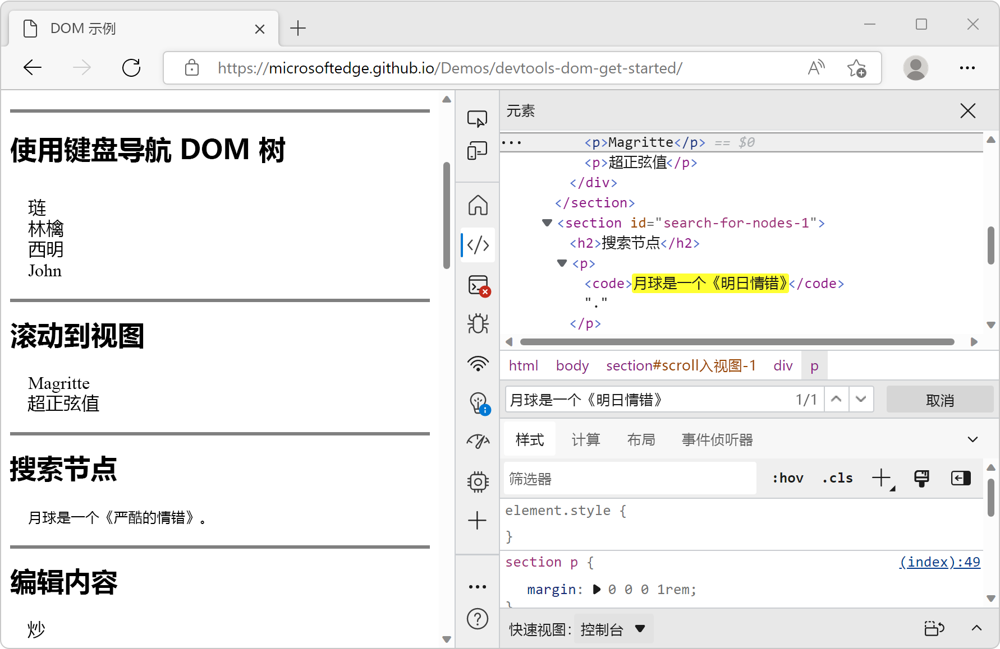

搜索栏还支持 CSS 和 XPath 选择器。


<!-- ====================================================================== -->
## <a name="edit-the-dom"></a>编辑 DOM

可以即时编辑 DOM，并查看更改对页面的影响。

### <a name="edit-content"></a>编辑内容

若要编辑节点的内容，请双击 DOM 树中的内容。

1. 在新窗口或选项卡中打开 [“DOM 示例](https://microsoftedge.github.io/Demos/devtools-dom-get-started/) ”演示页。

1. 在 **“编辑内容**”下，右键单击 **“米歇尔** ”，然后选择 **“检查**”。

1. 在 DOM 树中，双击 `Michelle`。  换言之，双击 `<li>` 和 `</li>` 之间的文本。  此时将突出显示文本，表明该文本已被选中。

   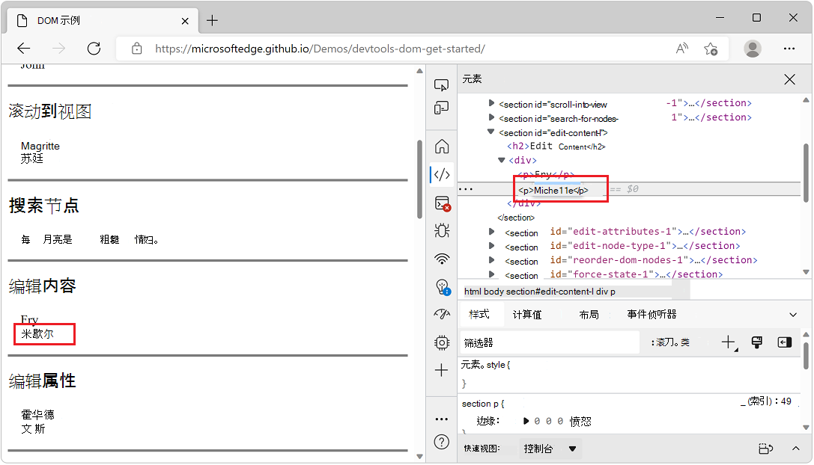

1. 删除 `Michelle`，键入 `Leela`，然后按 `Enter` 以确认更改。  DOM 中的文本从 **Michelle** 更改为 **Leela**。

### <a name="edit-attributes"></a>编辑属性

若要编辑属性，请双击属性名称或值。  按照说明了解如何向节点添加属性。

1. 在新窗口或选项卡中打开 [“DOM 示例](https://microsoftedge.github.io/Demos/devtools-dom-get-started/) ”演示页。

1. 在 **“编辑属性**”下，右键单击 **Howard** ，然后选择 **“检查**”。

1. 双击 `<li>`。  此时将突出显示文本，表示节点已被选中。

   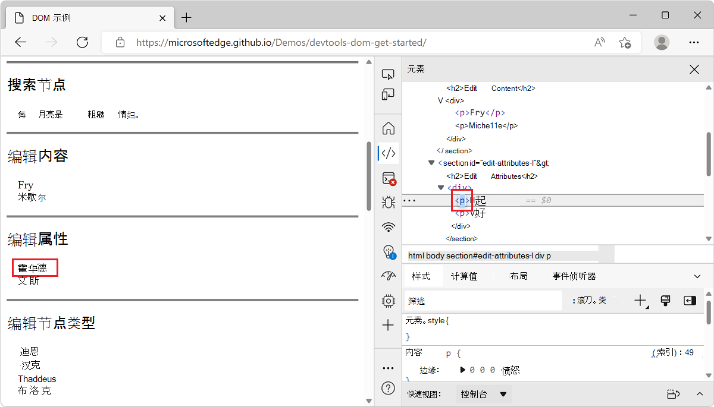

1. `Right`选择箭头键，添加空格，键入`style="background-color:gold"`，然后按`Enter`。  节点的背景色将更改为金色。

   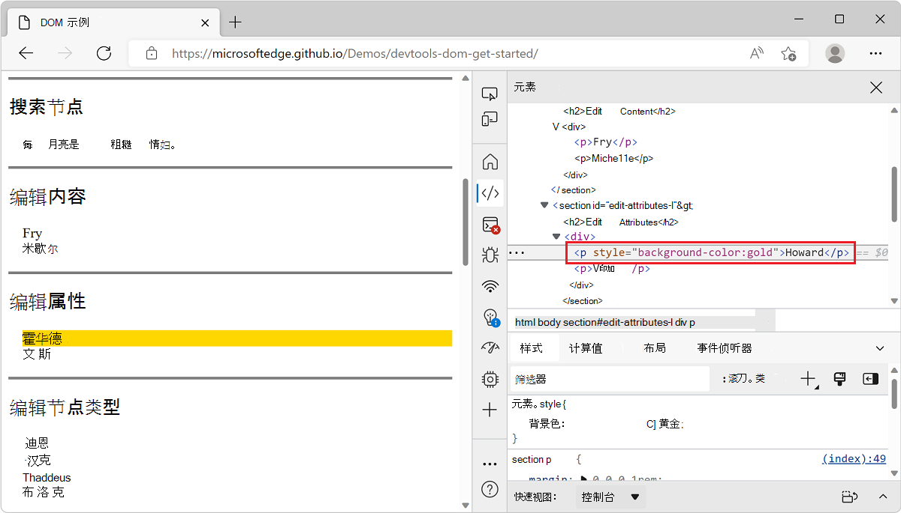

### <a name="edit-node-type"></a>编辑节点类型

若要编辑节点的类型，请双击该类型，然后键入新类型。<!--do the following steps do that?-->

1. 在新窗口或选项卡中打开 [“DOM 示例](https://microsoftedge.github.io/Demos/devtools-dom-get-started/) ”演示页。

1. 在 **“编辑节点类型**”下，右键单击 **“汉克** ”，然后选择 **“检查**”。

1. 双击 `<li>`。  文本 `li` 将突出显示。

1. 删除 `li`，键入 `button`，然后按 `Enter`。  节点 `<li>` 将更改为 `<button>` 节点。

   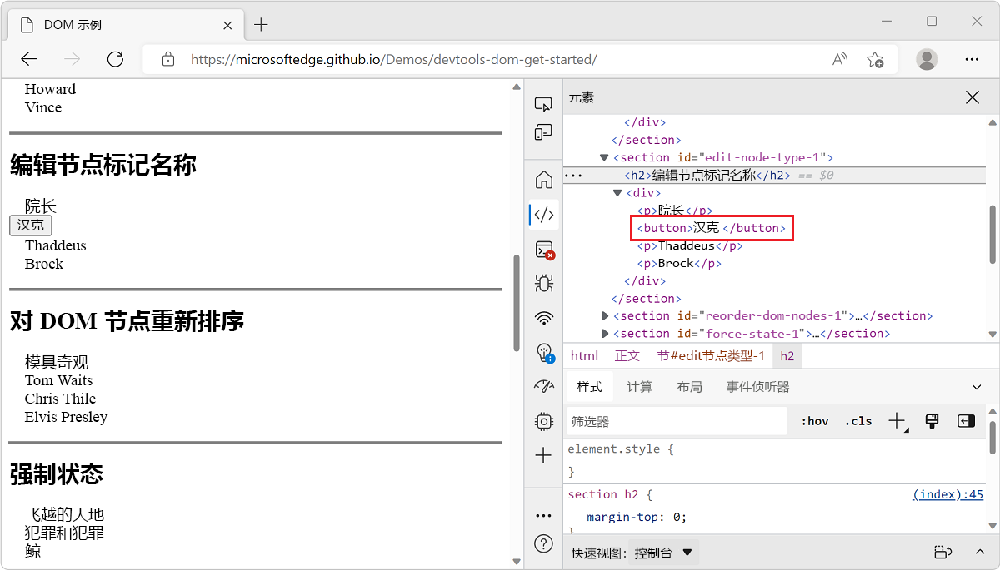

### <a name="reorder-dom-nodes"></a>对 DOM 节点重新排序

拖动节点以重新排序。

1. 在新窗口或选项卡中打开 [“DOM 示例](https://microsoftedge.github.io/Demos/devtools-dom-get-started/) ”演示页。

1. 在 **“重新排序 DOM 节点**”下，右键单击 **“猫王”** ，然后选择 **“检查**”。

1. 在 DOM 树中，将 `<li>Elvis Presley</li>` 拖动到列表顶部。

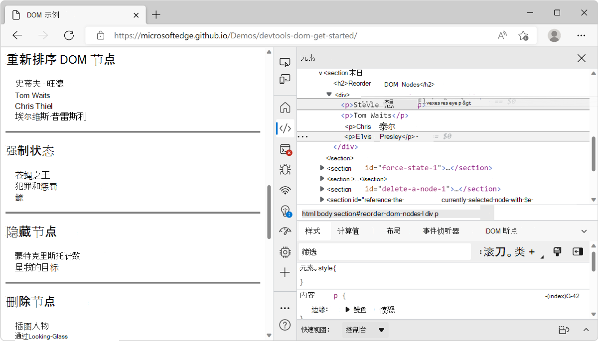

### <a name="force-state"></a>强制状态

可以强制节点保留在状态中，包括`:active`： `:hover``:focus``:visited``:focus-within`

1. 在新窗口或选项卡中打开 [“DOM 示例](https://microsoftedge.github.io/Demos/devtools-dom-get-started/) ”演示页。

1. 在“**强制状态**”下，将鼠标悬停在“**The Lord of the Flies**”上。  背景色变为橙色。

1. 右键单击 **“苍蝇之主**”，然后选择 **“检查**”。

1. 右键单击 `<li class="demo--hover">The Lord of the Flies</li>`，然后选择 **“强制状态** > **：悬停**”。  请参阅 [附录：](#appendix-missing-options) 如果未显示该选项，则缺少选项。  尽管实际上并没有将鼠标悬停在节点上，但背景色仍保持橙色。

### <a name="hide-a-node"></a>隐藏节点

按 `H` 下以隐藏节点，如下所示：

1. 在新窗口或选项卡中打开 [“DOM 示例](https://microsoftedge.github.io/Demos/devtools-dom-get-started/) ”演示页。

1. 在 **“隐藏节点**”下，右键单击 **“明星我的目标** ”，然后选择 **“检查**”。

1. 按键 `H` 。  节点处于隐藏状态。

   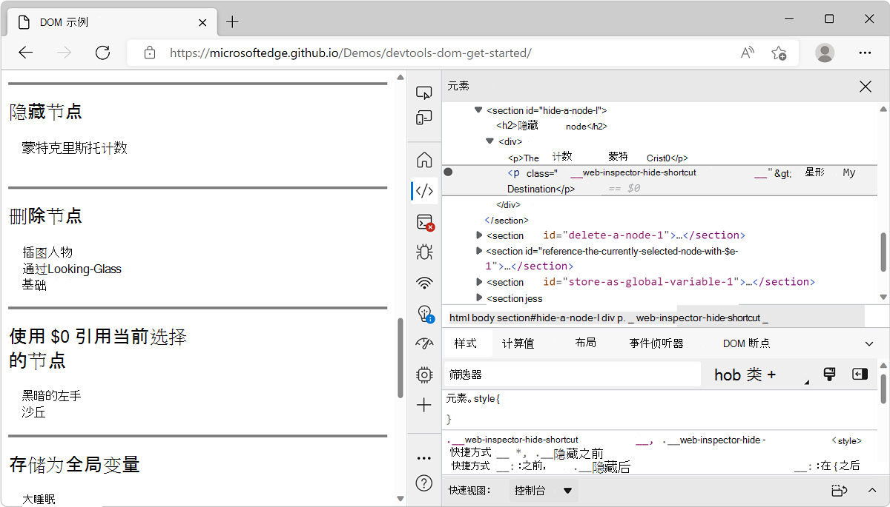

1. 再次按键 `H` 。  节点将再次显示。

### <a name="delete-a-node"></a>删除节点

按 `Delete` 下以删除节点，如下所示：

1. 在新窗口或选项卡中打开 [“DOM 示例](https://microsoftedge.github.io/Demos/devtools-dom-get-started/) ”演示页。

1. 在 **“删除节点**”下，右键单击 **“基础** ”，然后选择 **“检查**”。  检查以下节点：
    * 插图人物
    * 通过Looking-Glass
    * Foundation

1. 选择 `Delete` 键。  节点将被删除。

1. 按`Ctrl`+`Z` (Windows、Linux) 或`Command`+`Z` (macOS) 。  最后一个操作将被撤消，节点将重新出现。


<!-- ====================================================================== -->
## <a name="access-nodes-in-the-console"></a>访问控制台中的节点

开发人员工具提供了从控制台访问 DOM 节点或获取每个节点的 JavaScript 引用的一些快捷方式。

### <a name="reference-the-currently-selected-node-with-0"></a>使用 $0 引用当前选定的节点

检查节点时， `== $0` 节点旁边的文本表示可以使用变量 `$0`在控制台中引用此节点。

1. 在新窗口或选项卡中打开 [“DOM 示例](https://microsoftedge.github.io/Demos/devtools-dom-get-started/) ”演示页。

1. 在 **“引用”当前选定的 0 美元节点**下，右键单击 **“黑暗的左手”** ，然后选择“ **检查**”。

1. 选择 `Escape` 键以打开控制台抽屉。

1. 键入 `$0` 并选择 `Enter` 键。  表达式的结果显示 `$0` 计算结果为 `<li>The Left Hand of Darkness</li>`：

   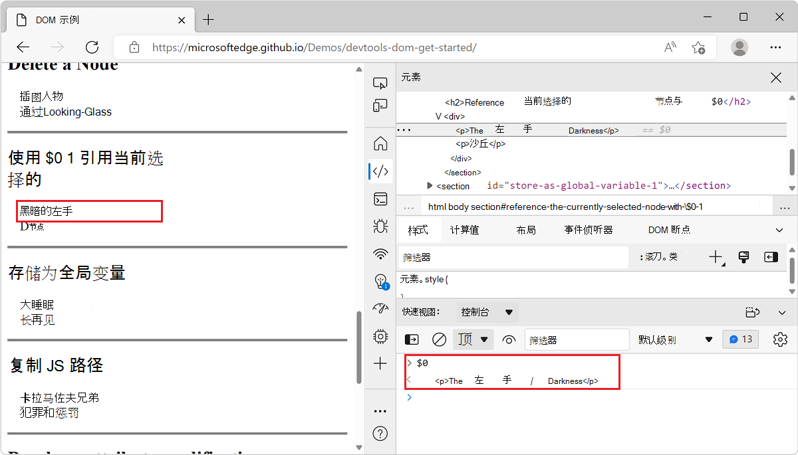

1. 将鼠标悬停在结果上。  节点在视区中突出显示。

1. 在 DOM 树中单击 `<li>Dune</li>` ，再次键 `$0` 入控制台，然后再次按 `Enter` 下。  现在， `$0` 计算结果为 `<li>Dune</li>`：

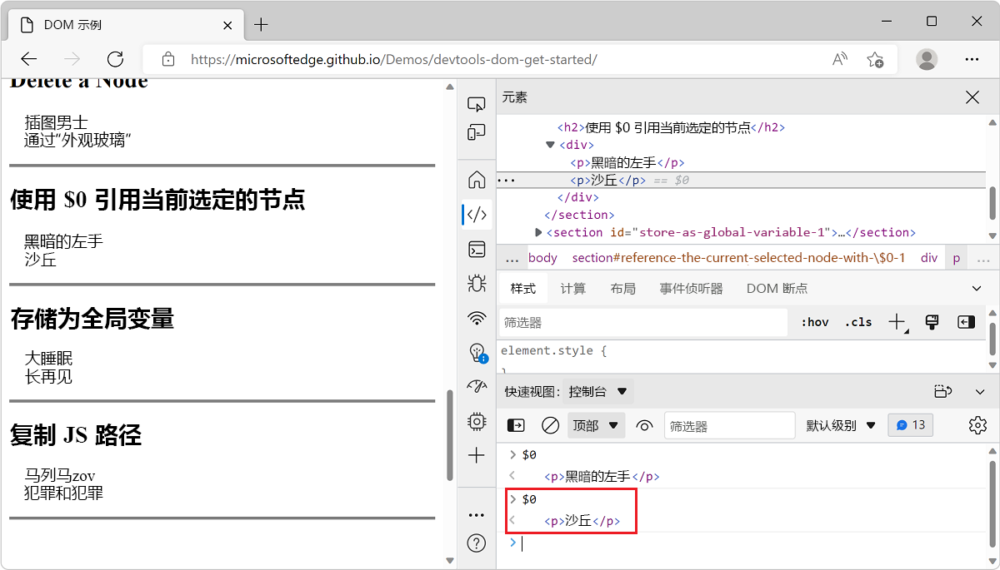

### <a name="store-as-global-variable"></a>存储为全局变量

如果需要多次引用某节点，请将其存储为全局变量。

1. 在新窗口或选项卡中打开 [“DOM 示例](https://microsoftedge.github.io/Demos/devtools-dom-get-started/) ”演示页。

1. 在**作为全局变量的Microsoft Store**下，右键单击 **“大睡眠**”，然后选择 **“检查**”。

1. 在 DOM 树中右键单击`<li>The Big Sleep</li>`，然后选择**Microsoft Store作为全局变量**。  请参阅 [附录：](#appendix-missing-options) 如果未显示该选项，则缺少选项。

1. 键 `temp1` 入控制台，然后按 `Enter`。  表达式的结果显示变量的计算结果为节点。

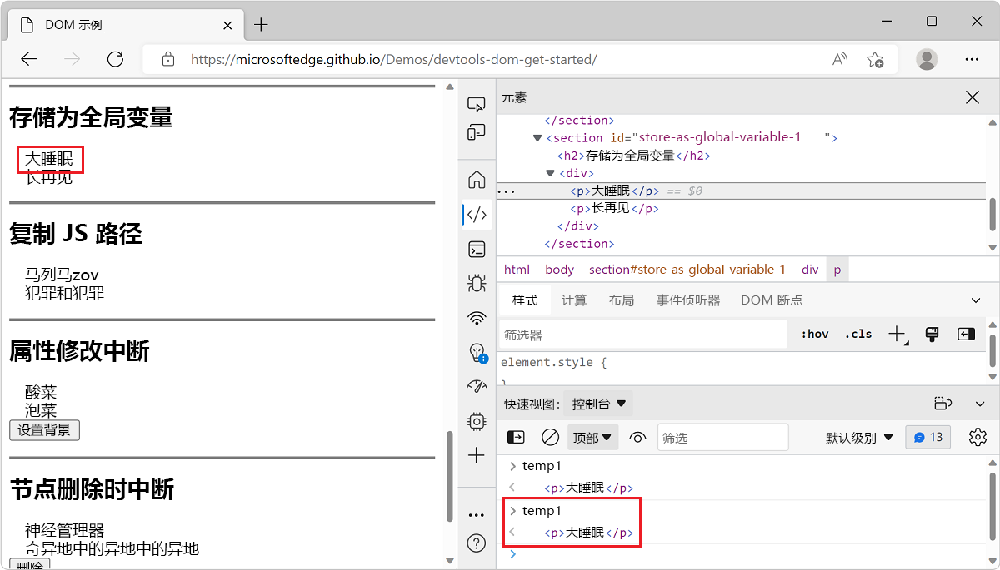

### <a name="copy-js-path"></a>复制 JS 路径

当你需要在自动测试中引用 JavaScript 路径时，请将其复制到节点。

1. 在新窗口或选项卡中打开 [“DOM 示例](https://microsoftedge.github.io/Demos/devtools-dom-get-started/) ”演示页。

1. 在 **“复制 JS”路径**下，右键单击 **“兄弟卡拉马佐夫**”，然后选择“ **检查**”。

1. 在 DOM 树中右键单击 `<li>The Brothers Karamazov</li>` ，然后选择 **“复制** > **JS 路径**”。  解析为节点的 `document.querySelector()` 表达式已复制到剪贴板。

1. 按`Ctrl`+`V` (Windows、Linux) 或`Command`+`V` (macOS) 将表达式粘贴到控制台中。

1. 按 `Enter` 下以评估表达式。

**复制 JS 路径**表达式的结果：

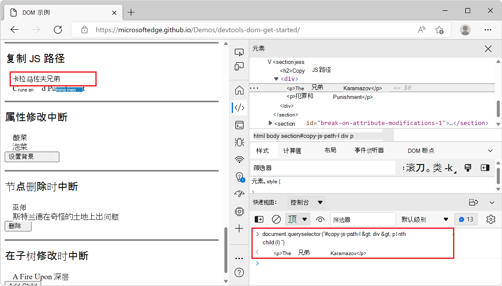


<!-- ====================================================================== -->
## <a name="break-on-dom-changes"></a>中断 DOM 更改

开发人员工具使你可以在 JavaScript 修改 DOM 时暂停页面的 JavaScript。

### <a name="break-on-attribute-modifications"></a>中断属性修改

如果要暂停导致节点任何属性发生更改的 JavaScript，请使用属性修改断点。

1. 在新窗口或选项卡中打开 [“DOM 示例](https://microsoftedge.github.io/Demos/devtools-dom-get-started/) ”演示页。

1. **在“断开属性修改**”下，右键单击 **“Sauerkraut**”，然后选择 **“检查**”。

1. 在 DOM 树中，右键单击 `<li id="target">Sauerkraut</li>`，然后选择 **“断开** > **属性修改**”。  请参阅 [附录：](#appendix-missing-options) 如果未显示该选项，则缺少选项。

   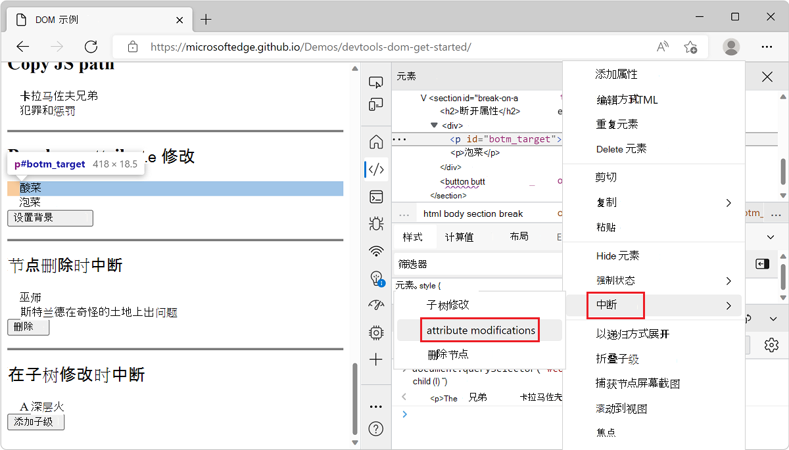

1. 在下一步中，系统将指示你单击暂停页面代码的按钮。  在页面暂停后，无法再滚动页面。  若要使页面再次可滚动，请选择“ **恢复脚本** () 。

   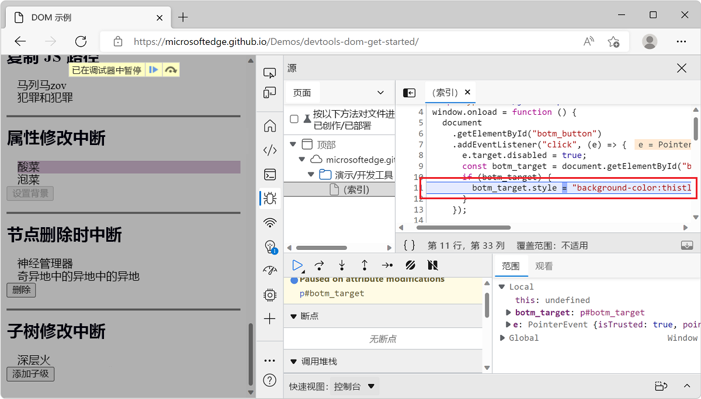

1. 单击上面的 **“设置背景”** 按钮。  这会将节点的 `style` 属性设置为 `background-color:thistle`。  开发人员工具将暂停页面并突出显示导致属性发生更改的代码。

1. 选择 **“恢复脚本** ( 如前所述，) 。

### <a name="break-on-node-removal"></a>中断节点删除

如果要在删除特定节点时暂停，请使用节点删除断点。

1. 在新窗口或选项卡中打开 [“DOM 示例](https://microsoftedge.github.io/Demos/devtools-dom-get-started/) ”演示页。

1. 在 **“断开节点删除**”下，右键单击 **“神经人”** ，然后选择 **“检查**”。

1. 在 DOM 树中，右键单击 `<li id="target">Neuromancer</li>`，然后选择 **“断开** > **节点删除**”。  请参阅 [附录：](#appendix-missing-options) 如果未显示该选项，则缺少选项。

1. 单击上面 **的“删除”** 按钮。  开发人员工具将暂停页面并突出显示导致节点被删除的代码。

1. 选择 **“恢复脚本** () 。

### <a name="break-on-subtree-modifications"></a>中断子树修改

在节点上放置子树修改断点后，在添加或删除节点的任何后代时，开发人员工具将暂停页面。

1. 在新窗口或选项卡中打开 [“DOM 示例](https://microsoftedge.github.io/Demos/devtools-dom-get-started/) ”演示页。

1. **在“子树修改的中断**”下，右键单击 **“深层上的火”**，然后选择 **“检查**”。

1. 在 DOM 树中，右键单击 `<ul id="target">`上面 `<li>A Fire Upon the Deep</li>`的节点，然后选择 **“断开** > **子树修改**”。  如果 **子树修改** 命令未显示，请参阅 [附录：缺少选项](#appendix-missing-options)。

1. 单击 **“添加子级**”。  由于向列表中添加了 `<li>` 节点，因此代码将暂停。

1. 选择 **“恢复脚本** () 。


<!-- ====================================================================== -->
## <a name="next-steps"></a>后续步骤

它涵盖了开发人员工具中与 DOM 相关的大部分功能。  可以通过右键单击 DOM 树中的节点，并尝试本教程中未涵盖的其他选项来发现其余功能。  请参阅 [“元素”面板键盘快捷方式](../shortcuts/index.md#elements-tool-keyboard-shortcuts)。

查看 [DevTools 概述](../../devtools-guide-chromium/overview.md) ，了解可以使用 DevTools 执行的一切操作。

<!--See [Community](../index#community) if you want to contact the DevTools team or get help from the DevTools community.  -->


<!-- ====================================================================== -->
## <a name="appendix-html-versus-the-dom"></a>附录：HTML 与 DOM

本部分介绍 HTML 与 DOM 之间的差异。

使用 Web 浏览器请求页面时，服务器将返回如下所示的 HTML：

```html
<!doctype html>
<html>
    <head>
        <title>Hello, world!</title>
    </head>
    <body>
        <h1>Hello, world!</h1>
        <p>This is a hypertext document on the World Wide Web.</p>
        <script src="/script.js" async></script>
    </body>
</html>
```

浏览器分析 HTML 并创建如下所示的对象树：

```DOM
html
    head
        title
    body
        h1
        p
        script
```

表示页面内容的对象或节点树称为 _DOM_)  (_文档对象模型_。  现在，DOM 树的外观与 HTML 相同，但假设 HTML 底部引用的脚本运行以下代码：

```javascript
const h1 = document.querySelector('h1');
h1.parentElement.removeChild(h1);
const p = document.createElement('p');
p.textContent = 'Wildcard!';
document.body.appendChild(p);
```

该代码删除了 `h1` 节点，并将另一个 `p` 节点添加到 DOM。  完整的 DOM 现在如下所示：

```DOM
html
    head
        title
    body
        p
        script
        p
```

页面的 HTML 现在不同于其 DOM。  换句话说，HTML 表示初始页面内容，而 DOM 表示当前页面内容。  当 JavaScript 添加、删除或编辑节点时，DOM 将与 HTML 不同。

有关详细信息，请参阅 [DOM 简介](https://developer.mozilla.org/docs/Web/API/Document_Object_Model/Introduction) 。


<!-- ====================================================================== -->
## <a name="appendix-scroll-into-view"></a>附录：滚动到视图

这是 [“滚动到视图](#scroll-into-view) ”部分的延续。  按照以下说明完成该部分。

1. 仍应在 DOM 树中选择 `<li>Magritte</li>` 节点。  如果没有，请返回到“[滚动到视图](#scroll-into-view)”，然后重新开始。

1. 右键单击 `<li>Magritte</li>` 节点，然后选择 **“滚动到视图**”。  视区向上滚动，以便显示 **Magritte** 节点。  如果未显示 **“滚动到视图** ”选项，请参阅 [附录：缺少选项](#appendix-missing-options)。


<!-- ====================================================================== -->
## <a name="appendix-missing-options"></a>附录：缺少选项

本教程中的许多说明指示你右键单击 DOM 树中的节点，然后从弹出的上下文菜单中选择一个选项。  如果在上下文菜单中看不到指定的选项，请尝试右键单击节点文本。

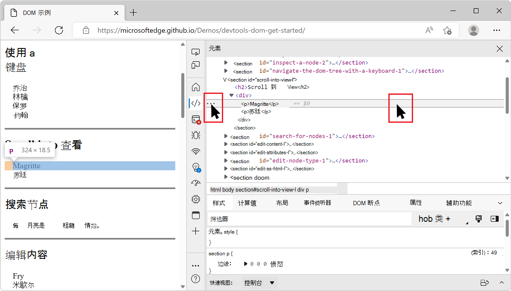


<!-- ====================================================================== -->
> [!NOTE]
> 此页面的某些部分是根据 [Google 创建和共享的](https://developers.google.com/terms/site-policies)作品所做的修改，并根据[ Creative Commons Attribution 4.0 International License ](https://creativecommons.org/licenses/by/4.0)中描述的条款使用。
> 原始页面位于[此处](https://developer.chrome.com/docs/devtools/dom/)，由 [Kayce Basques](https://developers.google.com/web/resources/contributors#kayce-basques)\（Chrome DevTools 和 Lighthouse 的技术作家）撰写。

[](https://creativecommons.org/licenses/by/4.0)
本作品根据[ Creative Commons Attribution 4.0 International License ](https://creativecommons.org/licenses/by/4.0)获得许可。
