<!-- Copyright Kayce Basques

   Licensed under the Apache License, Version 2.0 (the "License");
   you may not use this file except in compliance with the License.
   You may obtain a copy of the License at

       https://www.apache.org/licenses/LICENSE-2.0

   Unless required by applicable law or agreed to in writing, software
   distributed under the License is distributed on an "AS IS" BASIS,
   WITHOUT WARRANTIES OR CONDITIONS OF ANY KIND, either express or implied.
   See the License for the specific language governing permissions and
   limitations under the License.  -->
# 性能功能参考

本页全面介绍了与分析性能相关的 DevTools 功能。

有关如何使用 **性能** 工具分析页面性能的分步教程，请 [参阅开始分析运行时性能](index.md)。

<!-- ====================================================================== -->
## 记录性能

### 记录运行时性能

当你想在页面运行时 (而非加载时) 分析其性能时，将记录运行时性能。

1. 转到要分析的页面。

1. 在 DevTools 中单击 **“性能** ”工具。

1. 单击 **“记录** () 按钮。

   

1. 与页面交互。  DevTools 将记录由于交互而发生的所有页面活动。

1. 再次单击 **“录制** ”或单击 **“停止** ”停止录制。

### 记录加载性能

当你想在页面加载时 (而非运行时) 分析其性能时，将记录加载时性能。

1. 转到要分析的页面。

1. 在 DevTools 中，打开 **“性能** ”工具。

1. 单击 **“刷新”页** () 按钮。  DevTools 在页面刷新时记录性能指标，然后在加载完成后几秒钟自动停止记录。

DevTools 会自动放大大部分活动发生的记录部分。

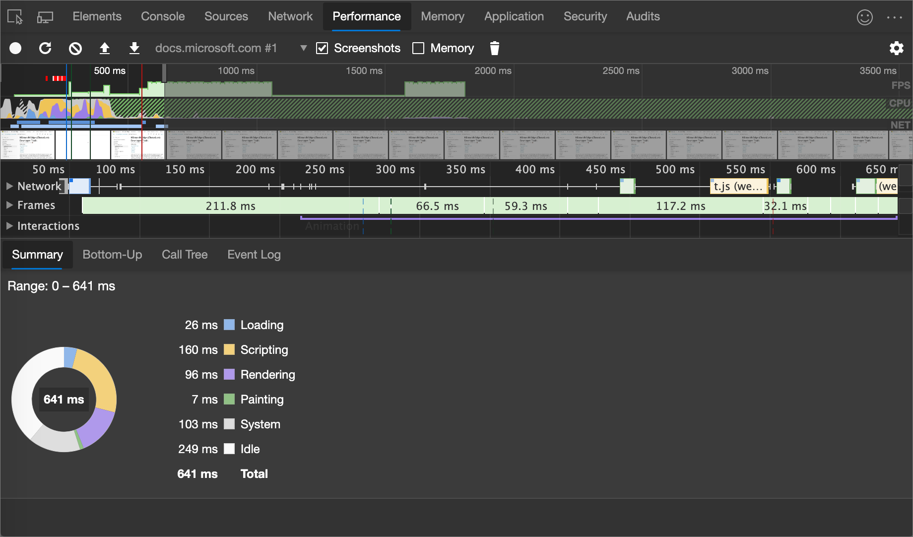

### 录制时捕获屏幕截图

若要在录制时捕获每个帧的屏幕截图，请选中 **“屏幕截图”** 复选框。

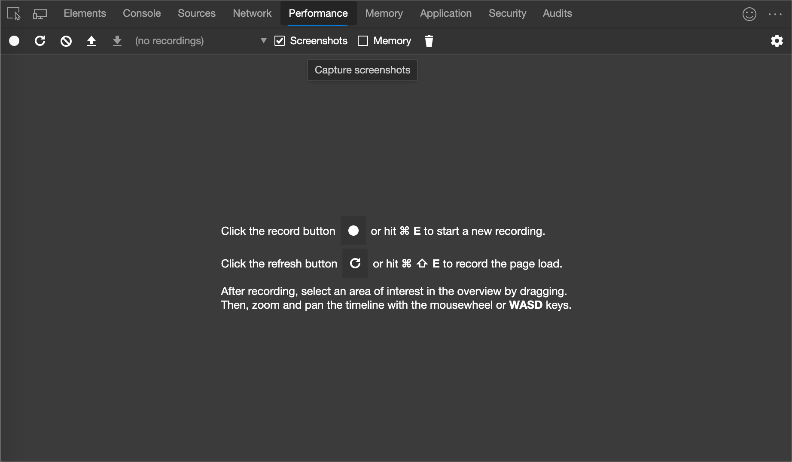

若要了解如何与屏幕截图交互，请 [参阅“查看”屏幕截图](#view-a-screenshot)。

### 录制时强制收集垃圾

录制页面时，单击“ **回收垃圾** () 强制垃圾回收。

### 显示录制设置

单击 **捕获设置** () 公开更多与 DevTools 如何捕获性能录制相关的设置。

### 禁用 JavaScript 示例

默认情况下，录制的 **主** 部分会显示录音期间调用的 JavaScript 函数的详细调用栈。  禁用以下调用堆栈:

1. 打开 **“捕获设置”** 菜单。  请参阅 [“显示录制设置](#show-recording-settings)”。

1. 打开 **“禁用 JavaScript 示例”** 复选框。

1. 记录页面。

以下两个数字显示了禁用和启用 JavaScript 示例之间的区别。  当禁用取样时，录音的**主**部分要短得多，因为它省略了所有的 JavaScript 调用堆栈。

禁用 JS 示例时的录制示例：

打开 JS 示例时录制的示例：

### 在录制时限制网络

若要在录制时限制网络:

1. 打开 **“捕获设置”** 菜单。  请参阅 [“显示录制设置](#show-recording-settings)”。

1. 将 **“网络”** 设置为所需的限制级别。

### 录制时限制 CPU

若要在录制时限制 CPU:

1. 打开 **“捕获设置”** 菜单。  请参阅 [“显示录制设置](#show-recording-settings)”。

1. 将 **“CPU”** 设置为所需的限制级别。

限制是相对于计算机的功能而言的。  例如，**两倍减速** 选项使 CPU 运行速度比正常情况下慢两倍。  DevTools 并不真正模拟移动设备的 CPU，因为移动设备的体系结构与桌面和笔记本电脑的体系结构大不相同。

### 启用高级画图检测工具

查看详细画图检测工具:

1. 打开 **“捕获设置”** 菜单。  请参阅 [“显示录制设置](#show-recording-settings)”。

1. 选中 **“启用画图检测工具 (慢速)”** 复选框。

若要了解如何与油漆信息交互，请 [参阅视图层](#view-layers-information) 和 [视图画探查器](#view-paint-profiler)。

<!-- ====================================================================== -->
## 保存录制内容

若要保存录制，请右键单击录制，然后选择 **“保存配置文件**”。

<!-- ====================================================================== -->
## 加载录制

若要加载录制，请右键单击录制，然后选择 **“加载配置文件**”。

<!-- ====================================================================== -->
## 清除上一记录

录制后，单击 **“清除录制** () 从 **”性能** “工具清除该录制。

<!-- ====================================================================== -->
## 分析性能录制

在 [录制运行性能](#record-runtime-performance) 或 [录制加载性能](#record-load-performance) 之后， **性能** 面板将提供许多数据以分析刚发生的操作的性能。

### 选择录制的一部分

在 **“概述”** 上向左或向右拖动鼠标，以选择一段录音的一部分。  **概述** 是包含 **FPS**、**CPU** 和 **NET** 图表的部分。

若要使用键盘选择一部分:

1. 选择 **Main** 部分的背景或旁边的任何部分，例如 **交互**、 **网络**或 **GPU**。  此键盘工作流仅在其中一个分区为焦点时有效。

1. 使用 `W`、`A`、`S`、`D` 键分别进行放大、向左移动、缩小和向右移动。

若要使用触控板选择部分，

1. 将鼠标悬停在 **“概述”** 部分或 **“详细信息”** 上。  **概述** 部分是包含 **FPS**、**CPU** 和 **NET** 图表的区域。  **详细信息** 部分是包含 **主** 部分、**交互** 部分等的区域。

1. 使用两根手指，向上轻扫进行缩小，向左轻扫向左移动，向下轻扫进行放大，向右轻扫向右移动。

若要在 **Main** 部分或任何邻居中滚动长火焰图，请在向上和向下拖动时单击并按住。  向左和向右拖动以移动所选录制的部分。

### 搜索活动

按 `Ctrl`+`F` (Windows、Linux) 或+`Command``F` (macOS) 打开 **“性能**”面板底部的搜索框。

导航与查询匹配的活动:

1. 单击 **上** 一 () 和 **下** 一 () 按钮。

1. 若要选择下一个活动，请按 `Enter`。  若要选择上一个活动，请按 `Shift`+`Enter`。

修改查询设置:

*  若要使查询区分大小写，请单击 **区分大小写** () 按钮。

*  若要在查询中使用正则表达式，请单击 **Regex** () 按钮。

若要隐藏搜索框，请单击 **“取消**”。

### 查看主线程活动

使用 **主** 部分查看出现在页面主线程上的活动。

选择一个事件，在 **“摘要** ”面板中查看有关它的详细信息。  DevTools 概括了所选事件。

DevTools 使用火焰图表示主线程活动。  x 轴表示一段时间内的记录。  Y 轴表示调用堆叠。  顶部事件将导致其下方事件。

在上一图中，`click` 事件在 53 行的 `activitytabs.js` 中造成了 `Function Call`。  在 `Function Call` 下面，查看匿名函数运行。  匿名函数请求 `Minor GC`的请求 `wait`的请求 `a`。

DevTools 为脚本随机分配颜色。  在上图中，请求来自脚本的函数请求染成为浅绿色。  来自另一个脚本的请求以米色表示。  深黄色代表脚本活动，紫色事件代表渲染活动。  这些深黄色和紫色事件在所有记录中都是一致的。

如果要隐藏 JavaScript 请求的详细火焰图，请参阅上面 [的禁用 JavaScript 示例](#disable-javascript-samples)。
禁用 JS 示例时，只有高级事件（如 `Event: click` 上图）和 `Function Call` 上图中 <!--`str` (?)--> 显示。
<!--When JS samples are disabled, you only see high-level events such as `Event (click)` and `Function Call` (script_foot_closure.js:53) from Figure 16.-->

### 查看表格中的活动

录制页面后，无需仅依赖 **Main** 部分来分析活动。  DevTools 还提供了三种用于分析活动的表格视图。  每个视图提供对待活动的不同视角:

*  若要查看导致工作量最大的根活动，请使用 [“呼叫树](#the-call-tree-tab) ”选项卡。

*  若要查看直接花费时间最多的活动，请使用“ [自下而上”](#the-bottom-up-panel) 选项卡。

*  若要按记录过程中发生的顺序查看活动，请使用 [“事件日志](#the-event-log-panel) ”选项卡。

#### 根活动

在新窗口或选项卡中打开 [“活动选项卡演示](https://microsoftedge.github.io/Demos/devtools-performance-activitytabs/) ”网页。

<!-- You can view the source files for the Activity Tabs Demo in the [MicrosoftEdge/Demos > devtools-performance-activitytabs](https://github.com/MicrosoftEdge/Demos/tree/main/devtools-performance-activitytabs) repo folder. -->

下面是**通话树**面板、**自下而上**面板和**事件日志**面板中提到的**根活动**概念的说明。

_根活动_ 是导致浏览器执行某些工作的活动。  例如，单击网页时，浏览器会将活动作为根活动运行 `Event` 。  `Event` 可能会导致处理程序运行等。

在 **主** 部分的火焰图中，根活动位于图表顶部。  在 **“调用树”** 和 **“活动日志”** 面板中，根活动是顶级项目。

有关根活动的示例，请参阅下一节“呼叫树”选项卡。

#### “呼叫树”选项卡

在新窗口或选项卡中打开 [“活动选项卡演示](https://microsoftedge.github.io/Demos/devtools-performance-activitytabs/) ”网页。

使用 **“调用树** ”选项卡查看哪些 [根活动](#root-activities) 最起作用。

**“呼叫树**”选项卡仅在录制的选定部分中显示活动。  请参阅 [“选择录制的一部分](#select-a-portion-of-a-recording) ”，了解如何选择部分。

在上图中，**“活动”** 列中的顶级项目，如 `Evaluate Script` 和 `Parse HTML` 是根活动。  嵌套表示调用堆栈。  例如，在上图中，导致 `Compile Script` 和 `(anonymous)` 的 `Evaluate Script` 的 `Parse HTML`。

**“自我时间”** 表示直接用于该活动的时间。  **“总时间”** 表示花在该活动或任何子项上的时间。

单击 **“自我时间**”、“ **总时间**”或 **“活动** ”按该列对表进行排序。

使用 **“筛选器”** 文本框按活动名称筛选事件。

默认情况下，**“分组”** 菜单设置为 **“无分组”**。  使用 **“分组”** 菜单，根据各种条件对活动表进行排序。

单击 **“显示最重堆栈** () 显示 **活动** 表右侧的另一个表。  单击活动以填充 **最重堆栈** 表。  **“最重堆栈”** 表显示所选活动的子项需要最长的运行时间。

#### 自下而上面板

在新窗口或选项卡中打开 [“活动选项卡演示](https://microsoftedge.github.io/Demos/devtools-performance-activitytabs/) ”网页。

使用 **“自下而上”** 面板查看直接采用聚合时间的活动。

**“自下向上”** 面板仅在录制的选定部分期间显示活动。  请参阅 [“选择录制的一部分](#select-a-portion-of-a-recording) ”，了解如何选择部分。

在上图的 **“主** ”部分火焰图中，可以看到几乎所有的时间都花在了运行 `Parse HTML`上。  前图中 **“自下而上”** 面板中最上面的活动是 `Parse HTML`。  <!-- in orig article: In the flame chart of the previous figure, the yellow below the calls to `wait` are actually thousands of `Minor GC` calls.  -->  在“ **自下而上** ”选项卡中，下一个最昂贵的活动是 `Layout`。

**“自我时间”** 列表示跨越发生的所有直接用于该活动的聚合时间。

**“总时间”** 列表示花在该活动或任何子项上的聚合时间。

#### 事件日志面板

使用 **“事件日志”** 面板按记录期间发生的顺序查看活动。

**“事件日志”** 面板仅显示录制的选定部分期间的活动。  请参阅 [“选择录制的一部分](#select-a-portion-of-a-recording) ”，了解如何选择部分。

**“开始时间”** 列表示活动开始时与录制开始相对的点。  例如，上图中所选项目 `175.7 ms` 的开始时间意味着录制开始 175.7 毫秒后活动开始。

**“自我时间”** 列表示直接用于该活动的时间。

**“总时间”** 列表示直接用于该活动或任何子项中的时间。

单击 **“开始时间**”、“ **自定义时间**”或 **“总时间** ”按该列对表进行排序。

使用 **“筛选”** 文本框按名称筛选活动。

使用 **“持续时间”** 菜单筛选出所有耗时少于 1 毫秒或 15 毫秒的活动。  默认情况下，**“持续时间”** 菜单设置为 **“全部”**，这意味着会显示所有活动。

禁用 **加载**、 **脚本**、 **渲染**或 **绘制** 复选框以筛选这些类别中的所有活动。

### 查看 GPU 活动

在 **GPU** 部分查看 GPU 活动。

### 查看光栅活动

在**光栅** 部分中查看光栅活动。

### 查看交互

使用 **“交互”** 部分查找和分析在录制期间发生的用户交互。

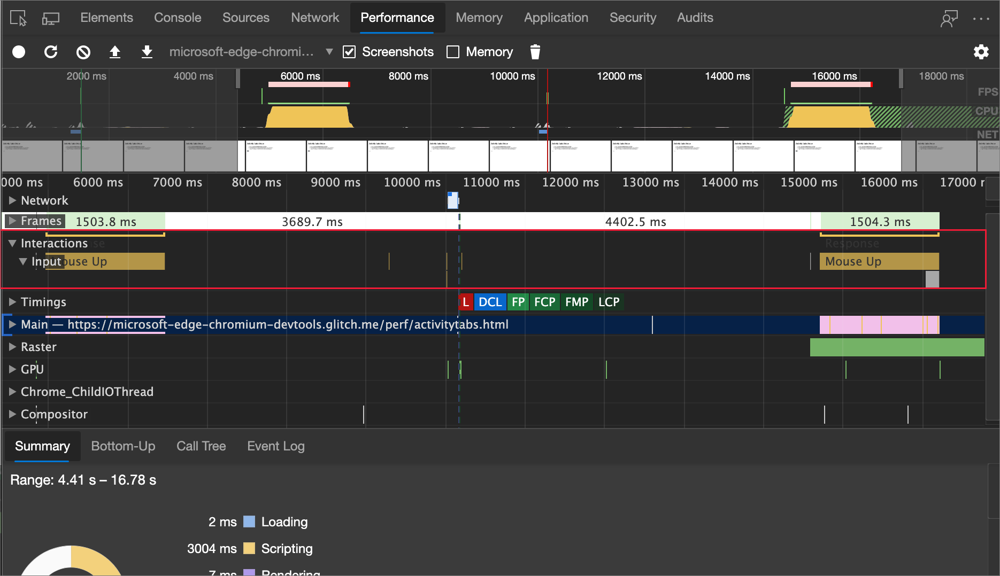

交互底部的红线表示等待主线程所花费的时间。

单击交互可在 **“摘要** ”面板中查看有关它的详细信息。

### 分析每秒帧数 (FPS)

DevTools 提供了许多方法，以分析每秒帧数:

*  使用 [FPS 图](#the-fps-chart) 在录制期间获取 FPS 的概述。
*  使用 [帧部分](#the-frames-section) 查看特定帧所需的时间。
*  在页面运行时，使用 **FPS 计数** 来实时估计 FPS。  使用 [FPS 计量实时查看每秒的视图帧](#view-frames-per-second-in-realtime-with-the-fps-meter)数。

#### FPS 图表

**FPS** 图表提供整个录制期间的帧率概况。  一般来说，绿条越高，帧率越好。

**FPS** 图上方的红色条形是警告，说明帧率降得太低，很可能会损害用户的体验。

#### ”帧“ 部分

**“帧”** 部分会准确告知特定帧所需的时间。

将鼠标悬停在框架上以查看包含有关它的详细信息的工具提示。

选择一个帧以查看有关 **摘要** 面板中框架的详细信息。  DevTools 用蓝色勾勒出所选框架的轮廓。

### 查看网络请求

展开 **“网络”** 部分，以查看录制期间发生的网络请求瀑布图。

请求的颜色编码如下:
*  HTML: 蓝色
*  CSS: 紫色
*  JS: 黄色
*  图像: 绿色

单击请求可在“ **摘要** ”选项卡中查看有关该请求的详细信息。 例如，在上图中，“ **摘要** ”选项卡显示有关“ **网络** ”部分中选择的蓝色请求的详细信息。

请求左上角的深蓝色方形意味着它是一个优先级较高的请求。  浅蓝色的方块表示优先级较低。  比如上图中，蓝色所选的请求是优先级较高的，而下方绿色的请求为优先级较低的。

在下面的第一个图中，请求 `www.bing.com` 由左侧的一行、中间有深色部分和浅色部分的条和右侧的一行表示。  下图显示了**网络**工具的 **“计时”** 选项卡中同一请求的相应表示形式。

下面是这两种表示形式相互映射方式：

*  左行是到事件的 `Connection Start` 组的所有内容 (包括)。  换句话说，这是之前 `Request Sent`的一切，独占。

*  条形图的浅部分为 `Request Sent` 和 `Waiting (TTFB)`。

*  条形图的深色部分为 `Content Download`。

*  右行基本上是等待主线程所花的时间。  “ **计时”** 选项卡中未显示此值。

请求的 `www.bing.com` 行栏表示形式：

**网络**工具：

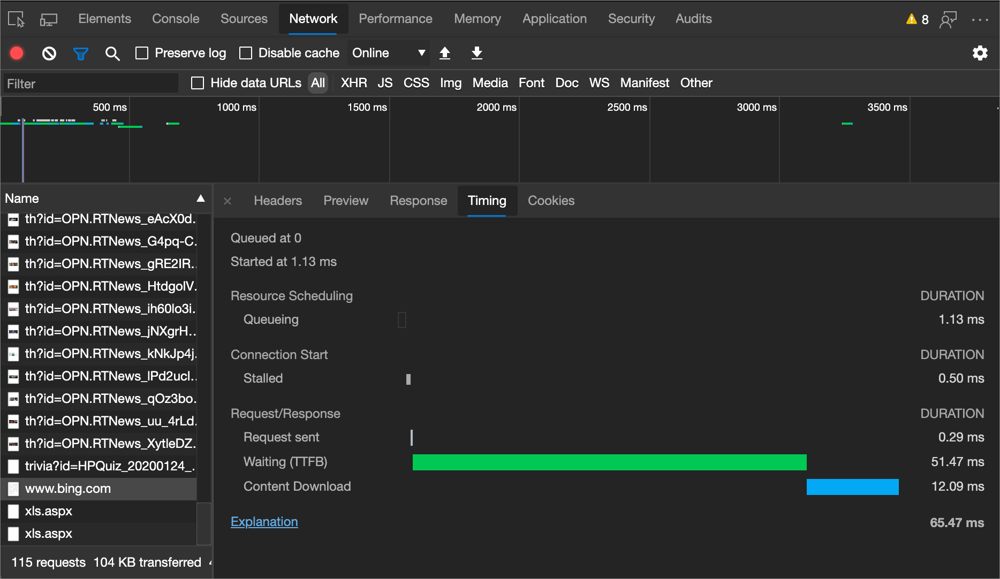

### 查看内存指标

打开 **“内存”** 复选框以查看上次记录中的内存指标。

DevTools 在 **“摘要”** 面板上方显示新的 **“内存”** 图表。  **NET** 图表下方还有一个新的图表，称为 **“HEAP”**。  **“HEAP”** 图表提供的信息与 **“内存”** 表中的 **“JS Heap”** 行相同。

图表上的彩色线条会映射到图表上方的彩色复选框上。  清除复选框以从图表中隐藏该类别。

图表只显示当前选择的记录区域。  例如，在上一个图中， **内存** 图表仅显示从 400 毫秒标记上下到 1750 毫秒标记左右的内存使用情况。

### 查看部分录制的持续时间

当分析像 **网络** 或者 **主** 这样的部分时，有时你需要更精确地估计某些事件花了多长时间。  按住 `Shift`、单击并按住，然后向左或向右拖动以选择录制的一部分。  在所选内容底部，DevTools 显示该部分所话费的时间。

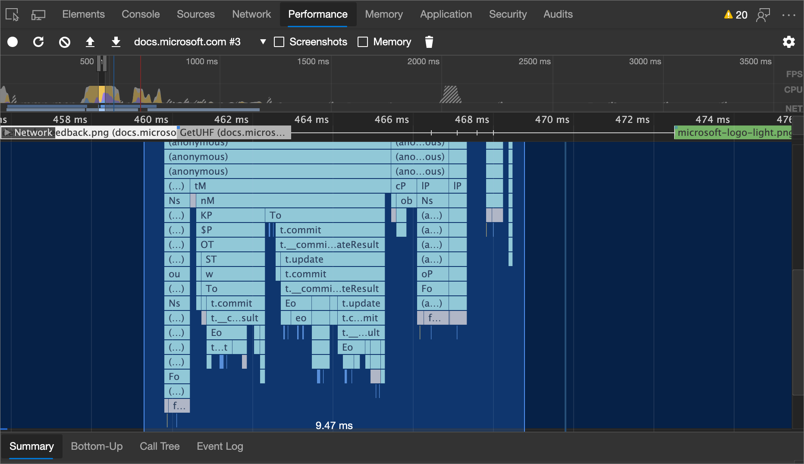

### 查看屏幕截图

[在录制时查看“捕获”屏幕截图](#capture-screenshots-while-recording)，了解如何打开屏幕截图。

将鼠标悬停在 **“概述** ”上，以查看页面在录制的那一刻的显示方式的屏幕截图。  **“概述”** 是包含 **CPU**、**FPS** 和 **NET** 图表的部分。

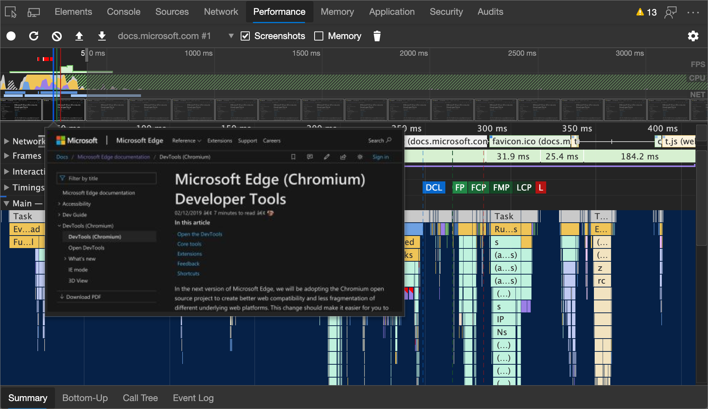

还可以通过在 **“框架** ”部分中选择一个帧来查看屏幕截图。  DevTools 在 **“摘要”** 面板中显示小版本的截图。

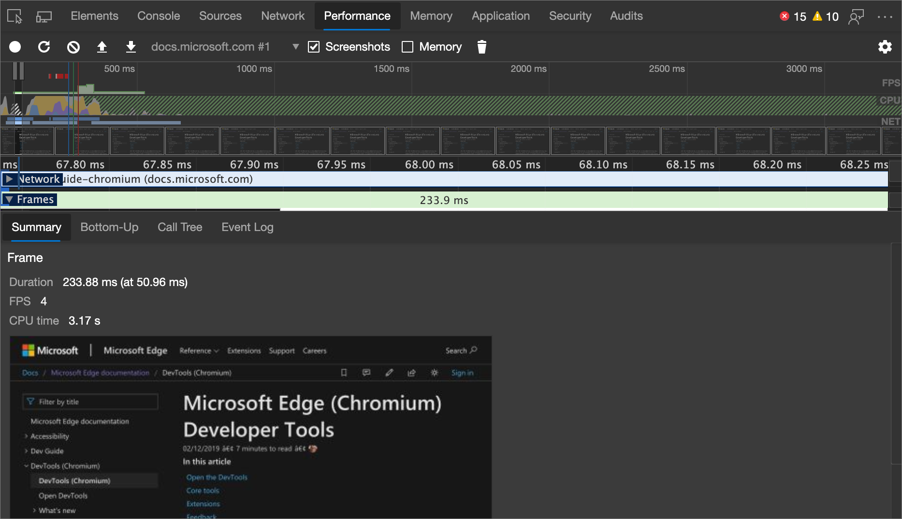

单击 **“摘要** ”面板中的缩略图以放大屏幕截图。

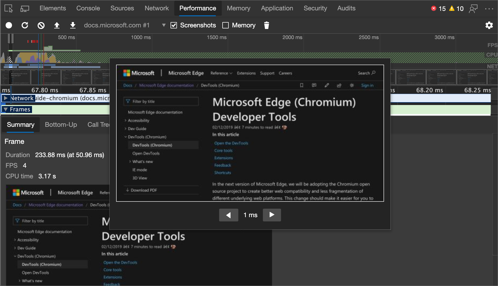

### 查看图层信息

查看框架的高级图层信息:

1. [启用高级画图检测工具](#turn-on-advanced-paint-instrumentation)。

1. 在 **“框架** ”部分中选择一个帧。  DevTools 在新“ **图层** ”选项卡的“ **事件日志** ”选项卡旁边显示有关层的信息。

将鼠标悬停在一层上以在关系图中突出显示它。

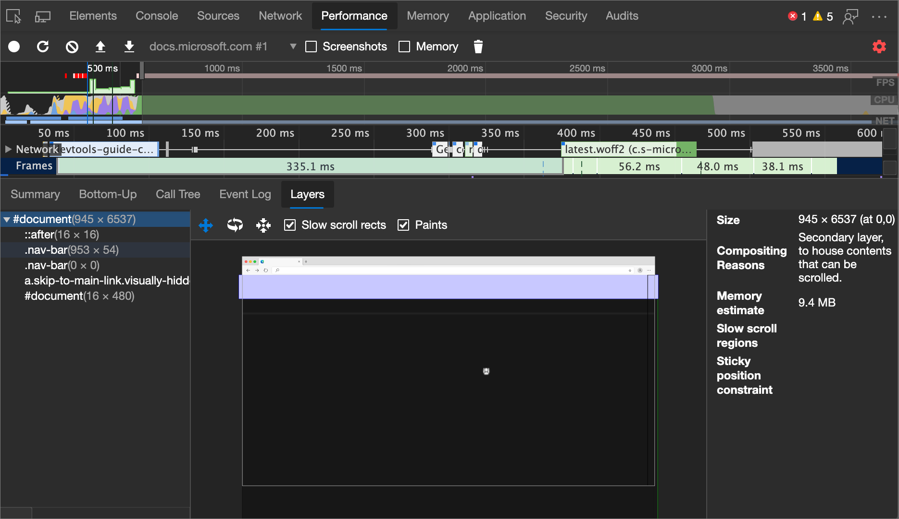

若要移动图表:

*  选择 **平移模式** () 沿 X 轴和 Y 轴移动。

*  选择 **旋转模式** () 沿 Z 轴旋转。

*  选择 **“重置转换** () 将图表重置为原始位置。

### 查看绘图探查器

查看有关绘图事件的高级信息:

1. [打开](#turn-on-advanced-paint-instrumentation)。

1. 在 **Main** 部分中选择 **“画图**”事件。

**画图探查器**面板：

<!-- ====================================================================== -->
## 使用 "渲染" 工具分析渲染性能

使用 **“渲染”** 面板的功能来帮助可视化页面的渲染性能。

若要打开 **“渲染”** 工具:

1. [打开“命令”菜单](../command-menu/index.md#open-the-command-menu)。

1. 开始键入 `Rendering` 并选择 `Show Rendering`。  DevTools 会在 DevTools 窗口的底部显示**渲染**工具。

### 使用 FPS 计数实时查看每秒帧数。

**FPS 计数** 是出现在视区右上角的叠加。  它提供了页面运行时 FPS 的实时估计。  若要打开 **FPS 计数**:

1. 打开 **渲染** 工具。  [使用 “渲染” 工具分析渲染性能](#analyze-rendering-performance-with-the-rendering-tool)。

1. 选中 **FPS 计量** 复选框。

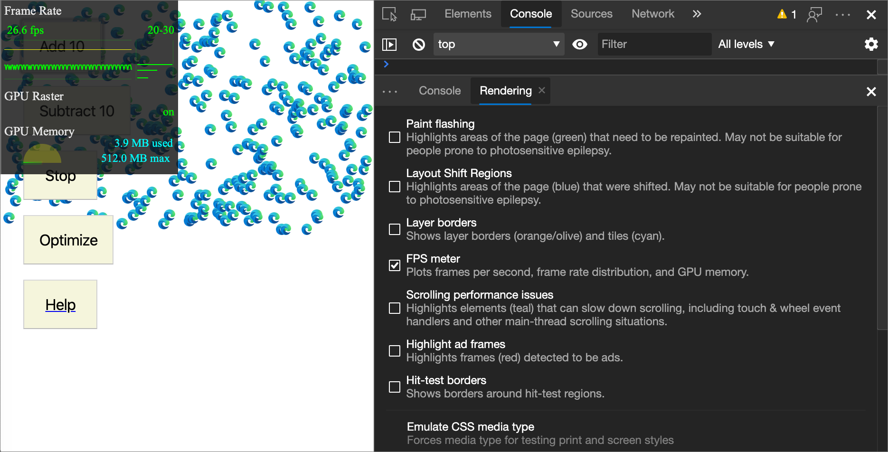

### 使用“画图闪烁”实时查看画图事件

使用“画图闪烁”可实时查看页面上的所有画图事件。  每当重新绘制页面的一部分时，DevTools 就会用绿色勾勒出该部分的轮廓。

打开画图闪烁：

1. 打开 **渲染** 工具。  请参阅使用 [呈现工具分析呈现性能](#analyze-rendering-performance-with-the-rendering-tool)。

1. 选中 **“画图闪烁”** 复选框。

   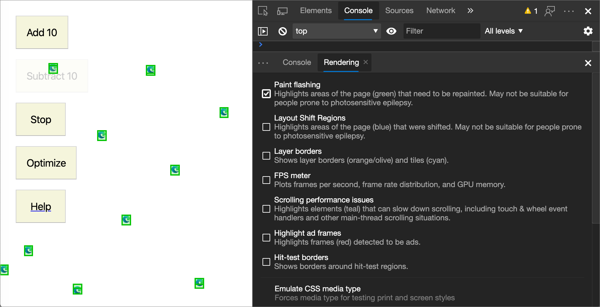

### 使用 “图层边框” 查看图层的叠加

使用 **“图层边框”** 可查看页面顶部的图层边框和图块的叠加。

若要启用层边框，请：

1. 打开 **渲染** 工具。  请参阅使用 [呈现工具分析呈现性能](#analyze-rendering-performance-with-the-rendering-tool)。

1. 选中 **“层边框** ”复选框。

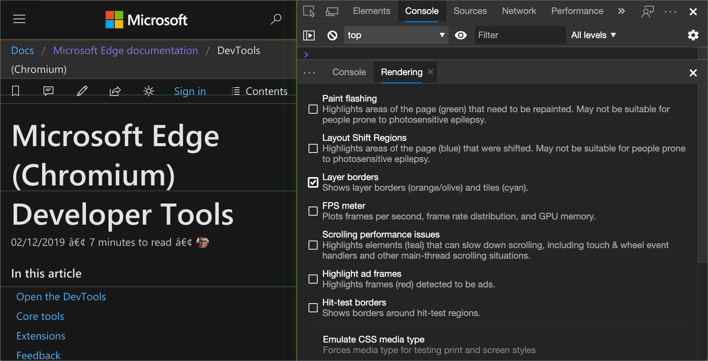

有关颜色编码的说明，请参阅 [debug_colors.cc](https://cs.chromium.org/chromium/src/cc/debug/debug_colors.cc) 中的注释。

### 实时查找滚动性能问题

使用滚动性能问题来识别页面中具有与滚动相关的事件监听器的元素，这些元素可能会损害页面的性能。  DevTools 概述了青色中潜在的问题元素。

若要查看滚动性能问题，请执行以下操作：

1. 打开 **渲染** 工具。  请参阅使用 [呈现工具分析呈现性能](#analyze-rendering-performance-with-the-rendering-tool)。

1. 选中 **“滚动性能问题** ”复选框。

另请参阅：
* _使用 3D 视图工具在 Navigate 网页层、z 索引和 DOM_ 中 (复[选框) 缓慢滚动矩形](../3d-view/index.md#slow-scroll-rects-checkbox)。

<!-- ====================================================================== -->
## 禁用本地字体

在 **呈现** 工具中，使用 **“禁用本地字体** ”复选框模拟规则中缺少 `local()` 的 `@font-face` 源。

例如，当 `Rubik` 设备上安装了字体并且 `@font-face src` 规则将其用作 `local()` 字体时，Microsoft Edge 使用设备中的本地字体文件。

选择 **禁用本地字体** 时，DevTools 会忽略 `local()` 字体并从网络中提取每个字体：

<!-- copied from edge-developer\microsoft-edge\devtools-guide-chromium\whats-new\2020\08\devtools.md   ../../media/2020/08/disable-font.msft.png -->

如果在开发过程中使用同一字体的两个不同副本，则此功能非常有用，例如：
*  设计工具的本地字体。
*  代码的 Web 字体。

使用 **禁用本地字体** 可以更轻松地执行以下操作：
*  调试和测量 Web 字体的加载性能和优化。
*  验证 CSS `@font-face` 规则的准确性。
*  发现设备上安装的本地版本与 Web 字体之间的差异。

<!-- ====================================================================== -->
> [!NOTE]
> 此页面的某些部分是根据 [Google 创建和共享的](https://developers.google.com/terms/site-policies)作品所做的修改，并根据[ Creative Commons Attribution 4.0 International License ](https://creativecommons.org/licenses/by/4.0)中描述的条款使用。
> 原始页面位于[此处](https://developer.chrome.com/docs/devtools/evaluate-performance/reference/)，由 [Kayce Basques](https://developers.google.com/web/resources/contributors#kayce-basques)\（Chrome DevTools 和 Lighthouse 的技术作家）撰写。

本作品根据[ Creative Commons Attribution 4.0 International License ](https://creativecommons.org/licenses/by/4.0)获得许可。
