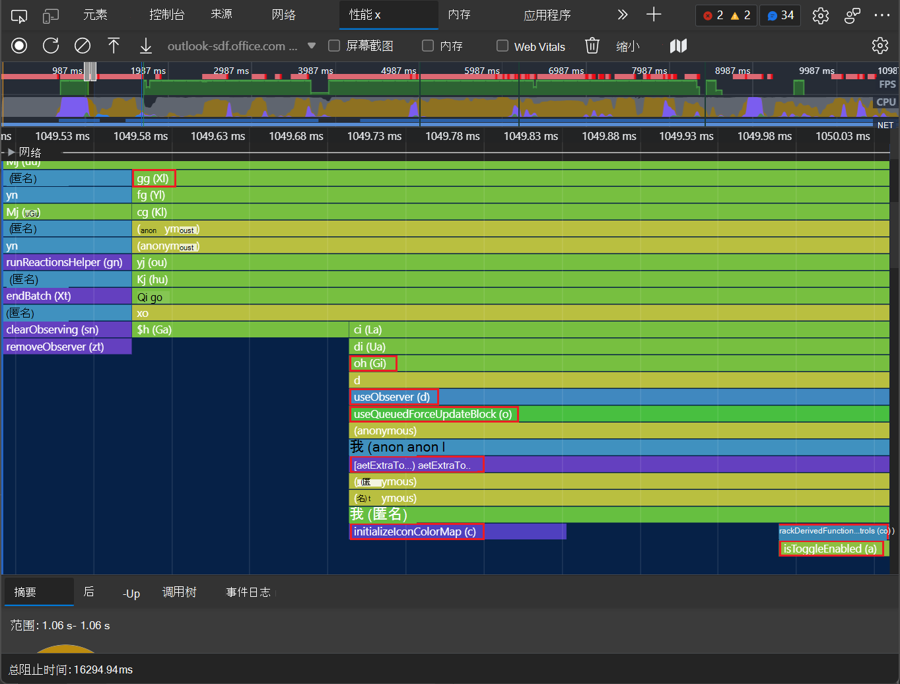

# 在性能配置文件中显示原始函数名称

如果你的生成过程编译代码并对其进行小型化处理，并合并到单个文件中，则性能配置文件中显示的函数的名称可能很难理解。  源映射将编译的缩小代码映射到原始源代码文件。  执行 **工具** 可以使用源映射在录制后将缩小函数名称映射回原始代码中找到的原始名称。
   
若要详细了解 DevTools 如何使用源地图，请参阅将处理的代码映射到原始源代码 [，以便进行调试](../javascript/source-maps.md)。
   
To see your original function names in the performance tool， use **** the **Unminify** () button.

源映射在 DevTools 中用于使客户端代码可读和可调试。  通过单击 **"性能"** 工具中的"取消缩小"按钮，您可以使用源映射创建所记录性能配置文件的未缩小版本。

具有硬读取函数名称的性能配置文件分析图表的示例：

性能配置文件配置文件图表的示例，其中还原了一些更有意义的函数名称：

在"性能"工具中记录**** 性能配置文件时，配置文件的 **"主**"部分会显示在录制过程中调用的 JavaScript 函数的详细饼图。  

理想情况下，在此饼图视图中，您希望看到原始源代码中显示的有意义的函数名称。  但是，如果编译、缩小或捆绑生产代码，则 **Performance** 工具最初会显示从转换的生产代码 _中提取的函数名称_ 。  这些生产函数名称可能遮盖，并且可能无法轻松地映射到原始源代码中的函数名称。

若要取消缩小性能配置文件，以便除了缩小标识符之外，还显示一些更有意义的函数名称，请按照以下步骤操作。

<!-- ====================================================================== -->
## 步骤 1 - 设置源地图

托管源地图与生产代码并排。 在取消缩小时， **性能** 工具需要查找源地图和生产代码。

有关详细信息，请参阅 [将处理的代码映射到原始源代码，以便进行调试](/microsoft-edge/devtools-guide-chromium/javascript/source-maps)。

<!-- ====================================================================== -->
## 步骤 2 - 记录性能配置文件

1. 在 **"性能**"工具中，**** 单击"记录"按钮，以记录要分析的页面的性能配置文件。  有关详细信息，请参阅 [记录运行时性能](/microsoft-edge/devtools-guide-chromium/evaluate-performance/reference)。

   

   性能配置文件记录在性能 **工具** 中。

1. 在 **"性能** "工具中，单击显示 (图表) 区域，然后使用鼠标滚轮放大。  单击并向左和向右拖动。  查看饼图的函数名称。

   性能工具中的图表显示**** 缩小函数名称，如 **XI**、**Gi**、**d**、**o**、**an**、**c**、**co** 和**来自**生产代码的 ：

   

<!-- ====================================================================== -->
## 步骤 3 - 取消代码

1. 单击"**取消 (**。单击) 按钮：

   

   在 DevTools 中，短暂出现一个弹出窗口，内容为： **Status： creating unminfied file**。  然后， **将打开"另存为** "对话框。  默认文件名是一种从 `yymmddThhmmss`日期和时间开始的模式，例如： `Profile-20220307T164948-unminified.json`。  默认目录是 **"下载"** 目录。

1. 选择文件名和目录，然后单击"保存 **"** 按钮。

   Performance **工具** 会创建记录的性能配置文件的新版本，使用源映射将来自图表的一些函数名称替换为更有意义的函数名称。  某些缩小的生产名称可能仍显示，因为源映射并不总是为 **性能** 工具提供映射所有函数名称的必要信息。

<!-- ====================================================================== -->
## 步骤 4 - 加载未缩小的配置文件

1. 在"**性能**"工具中，****"工具中的"加载配置文件"图标按钮。) 图标按钮。  或者，右键单击"性能" **工具的空白** 区域，然后选择" **加载配置文件"**。

   

1. 在 **"打开** "对话框中，选择 `.json` 刚下载的未缩小性能配置文件。  有关详细信息，请参阅性能功能参考中的加载录制，然后__ 继续下方。

   某些函数名称现在未缩小。  "性能"工具中未缩小的**** 饼图现在显示那些使用从源地图中取自的更有意义的名称标记的函数， 例如 **useObserver (d) **、**useQueuedForceUpdateBlock (o) **、**trackDerivedFunction (an) **、**initializeIconColorMap (c) **、**getExtraToolControls (co) **和 **isToggleEnabled (a) **。

   

<!-- ====================================================================== -->
## 另请参阅

* [开始分析运行时性能](index.md) - 在 DevTools 中分析运行时性能简介。
* [性能功能](reference.md)参考 - 性能工具中提供的许多功能的参考。
