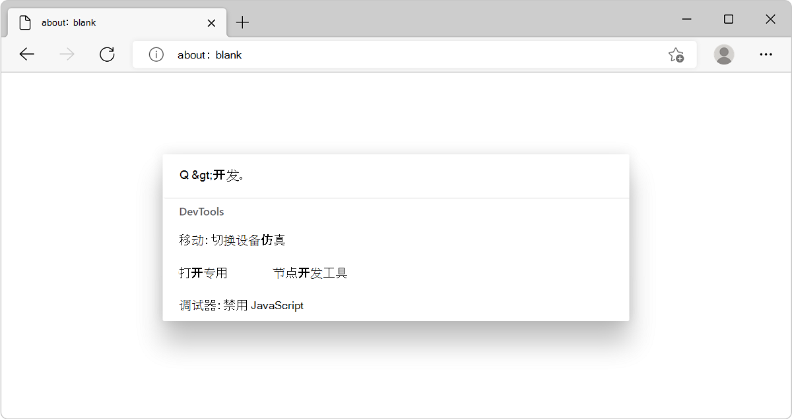

# 使用命令面板通过键盘运行命令

使用命令面板从键盘快速访问各种 Microsoft Edge 浏览器命令和 DevTools 命令。

使用命令面板，可以直接访问通常需要单击多个菜单或使用一系列键盘快捷方式的生产力和开发人员功能。

<!-- ====================================================================== -->
## 启用命令面板

默认情况下，未启用命令面板。 若要启用命令面板试验，请执行以下操作：

1. 转到 `edge://flags`。

1. 在 **“搜索标志** ”文本字段中，键入 **“命令面板**”。

1. 在 **“命令面板** ”下拉菜单中，选择“ **已启用**”。

1. 单击右下角显示的 **“重启** ”按钮：

   

Microsoft Edge 107 或更高版本的标志页显示快捷方式 `Ctrl+Q`。

<!-- ====================================================================== -->
## 打开命令面板

命令面板提供对 Microsoft Edge 命令的访问，包括各种 DevTools 命令。 这意味着，无需先打开 DevTools 即可使用 DevTools 功能。

打开命令面板：

1. 按 `Ctrl`+`Q`。  命令面板随即打开。

1. 开始在输入框中键入内容。 例如：
   * 键入 **选项卡** 以显示有关选项卡管理的命令。
   * 键入 **bookmark** 以显示有关书签的命令 (如下所示) 。
   * 按 列出 `>` 可用的 DevTools 命令。

   

1. 按 `Down Arrow` 或 `Up Arrow` 选择命令，或使用鼠标滚轮，然后按 `Enter`。

下面显示了几个有用的命令的示例。

<!-- ====================================================================== -->
## 打开设备仿真工具

使用 DevTools [**设备仿真**](../device-mode/index.md) 工具大致了解页面在移动设备上的外观和响应方式。

若要使用命令面板打开 DevTools 设备仿真工具，请执行以下操作：

1. 按 `Ctrl`+`Q`。 命令面板随即打开。

1. 按 `>`。

1. 键入 **“设备**”，按 `Down Arrow` 选择“ **移动：切换设备仿真**”，然后按 `Enter`。

<!-- ====================================================================== -->
## 创建和访问代码片段

DevTools [**代码片段**](../javascript/snippets.md) 工具允许保存 JavaScript 代码并在任何网页上执行。 如果在网页上重复运行相同的代码，请为该代码创建一个代码片段，然后使用命令面板快速访问代码片段。

使用命令面板打开“DevTools **代码片段** ”选项卡：

1. 按 `Ctrl`+`Q`。 命令面板随即打开。

1. 按 `>`。

1. 键入 **代码段**，按 `Down Arrow` 以选择“ **源：显示代码段**”，然后按 `Enter`。

<!-- ====================================================================== -->
## 管理浏览器选项卡

命令面板中提供了许多与选项卡相关的有用命令，例如：
*  **为所有选项卡添加书签**
*  **向前移动选项卡**
*  **打开最近关闭的选项卡**
*  **搜索选项卡**

1. 按 `Ctrl`+`Q`。 命令面板随即打开。

1. 键入单词 **选项卡**，按 `Down Arrow` 或 `Up Arrow` 选择命令，然后按 `Enter`。

<!-- ====================================================================== -->
## 提供反馈

Microsoft Edge DevTools 团队欢迎你提供有关此功能的反馈。  如果你注意到命令面板存在 bug 或有改进它的想法，请在以下位置添加注释： [命令面板试验的反馈](https://github.com/MicrosoftEdge/DevTools/issues/73)。
